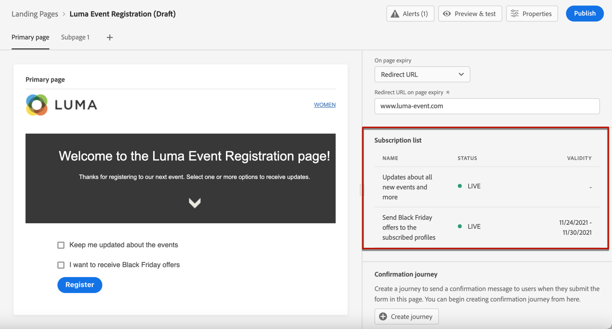
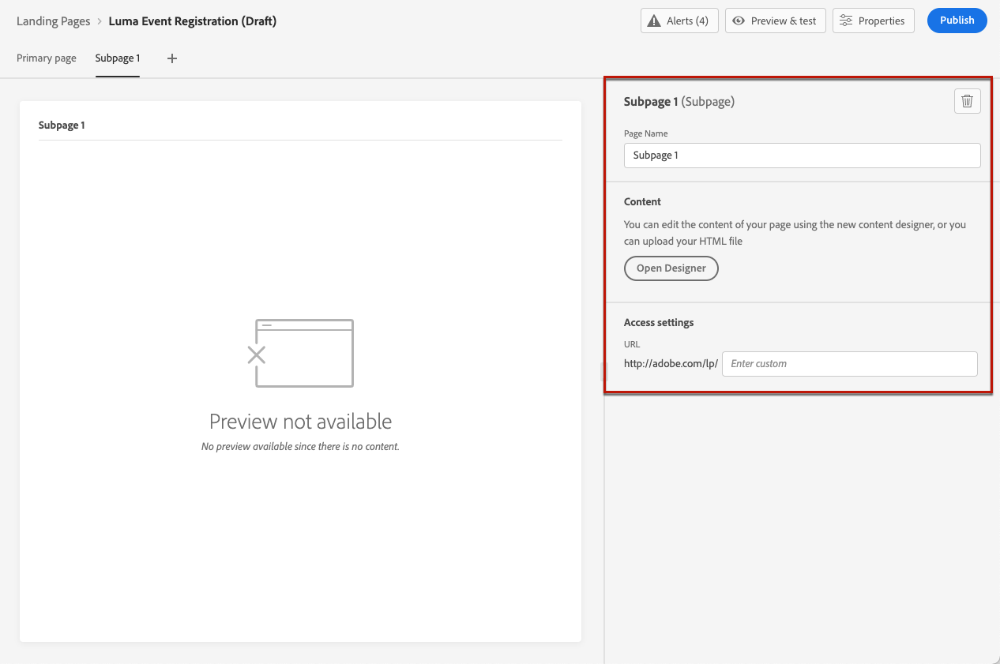
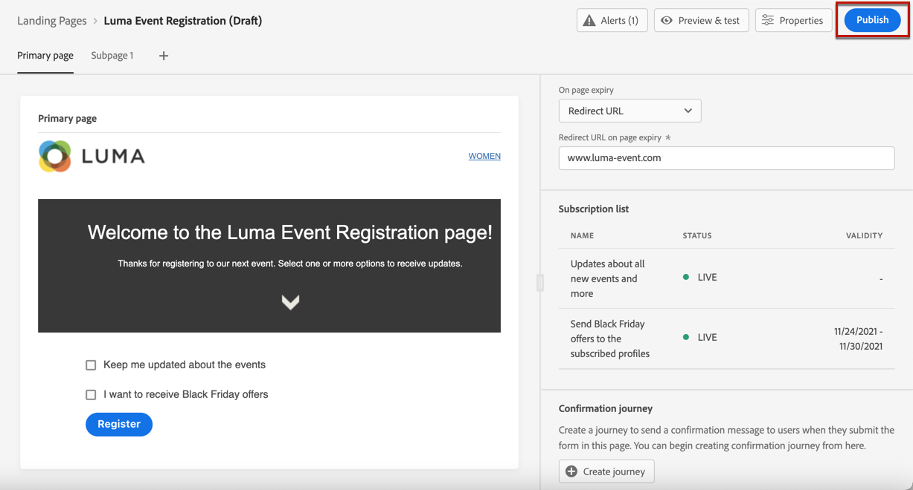

# Criar e publicar landing pages {#create-lp}

>[!CAUTION]
>
>O uso de landing pages está disponível no momento somente para usuários selecionados. Se quiser aproveitar esse recurso, entre em contato com o executivo da sua conta Adobe.

## Acessar landing pages

Para acessar a lista de landing pages, selecione **[!UICONTROL Journey Management]** > **[!UICONTROL Landing pages]** no menu esquerdo.

O **[!UICONTROL Landing Pages]** exibe todos os itens criados. Você pode filtrá-los com base em seu status ou data de modificação.

## Criar uma página de aterrissagem

As etapas para criar uma landing page são as seguintes.

1. Na lista de landing page, clique em **[!UICONTROL Create landing page]**.

   

1. Adicione um título. Você pode adicionar uma descrição, se necessário.

   

1. Clique em **[!UICONTROL Create]**.

1. A página primária e suas propriedades são exibidas. Saiba como definir as configurações da página [here](#configure-primary-page).

   

1. Clique no ícone + para adicionar uma subpágina. Saiba como definir suas configurações [here](#configure-subpages).

   

Depois de configurar e projetar o [página primária](#configure-primary-page) e [subpáginas](#configure-subpages) se houver, você poderá [teste](#test) e [publicar](#publish) sua landing page.

## Configurar a página primária {#configure-primary-page}

A página primária é a página que é imediatamente exibida aos usuários quando eles clicam no link de sua página inicial, como de um email ou de um site.

Para definir as configurações da página primária, siga as etapas abaixo.

1. Você pode alterar o nome da página, que é **[!UICONTROL Primary page]** por padrão.

1. Edite o conteúdo da sua página usando o designer de conteúdo. Saiba como criar conteúdo de página de aterrissagem [here](design-lp.md).

   

1. Defina o URL da página de aterrissagem.

   >[!CAUTION]
   >
   >O URL da página de aterrissagem deve ser exclusivo.

   

   A primeira parte do URL é pré-preenchida e não pode ser editada por meio da interface do usuário. Para configurá-lo, entre em contato com seu representante de conta do Adobe ou com o [Equipe de suporte ao Atendimento ao cliente do Adobe](https://helpx.adobe.com/br/enterprise/admin-guide.html/enterprise/using/support-for-experience-cloud.ug.html){target=&quot;_blank&quot;}.

1. Você pode definir uma data de expiração para sua página. Nesse caso, você deve selecionar uma ação ao expirar a página:

   * **[!UICONTROL Redirect URL]**: Insira o URL da página para a qual os usuários serão redirecionados quando a página expirar.
   * **[!UICONTROL Custom page]**: [Configurar uma subpágina](#configure-subpages) e selecione-o na lista suspensa que é exibida.
   * **[!UICONTROL Browser error]**: Digite o texto do erro que será exibido em vez da página.

   

   <!--1. In the **[!UICONTROL Additional data]** section, define a **[!UICONTROL Key]** and the corresponding **[!UICONTROL Parameter value]**. // you can define how the data entered in the landing page is managed once it has been submitted by a user??-->

1. Se você selecionou uma ou mais listas de subscrição para a página principal, elas serão exibidas na **[!UICONTROL Subscription list]** seção.

   

1. Na landing page, é possível criar diretamente uma jornada que enviará uma mensagem de confirmação para os usuários quando enviarem o formulário.

   

   Clique em **[!UICONTROL Create journey]** para começar [configuração dessa jornada](../building-journeys/journey-gs.md#jo-build). Você será redirecionado para a função **[!UICONTROL Journey Management]** > **[!UICONTROL Journeys]** lista.

## Configurar subpáginas {#configure-subpages}

Você pode adicionar quantas subpáginas forem necessárias. Por exemplo, você pode criar uma página de agradecimento que será exibida depois que os usuários enviarem o formulário. Você também pode definir uma página de erro que será chamada quando ocorrer um erro com a landing page.

Para definir configurações de subpágina, siga as etapas abaixo.

1. Você pode alterar o nome da página, que é **[!UICONTROL Subpage 1]** por padrão.

1. Edite o conteúdo da sua página usando o designer de conteúdo. Saiba como criar conteúdo de página de aterrissagem [here](design-lp.md).

1. Defina o URL da página de aterrissagem.

   A primeira parte do URL é pré-preenchida e não pode ser editada por meio da interface do usuário. Para configurá-lo, entre em contato com seu representante de conta do Adobe ou com o [Equipe de suporte ao Atendimento ao cliente do Adobe](https://helpx.adobe.com/enterprise/admin-guide.html/enterprise/using/support-for-experience-cloud.ug.html){target=&quot;_blank&quot;}.

   >[!CAUTION]
   >
   >O URL da página de aterrissagem deve ser exclusivo.

## Testar a landing page {#test}

Depois que as configurações e o conteúdo da landing page forem definidos, você poderá usar perfis de teste para visualizá-los. Se você inseriu [conteúdo personalizado](../personalization/personalize.md), você poderá verificar como esse conteúdo é exibido na landing page, aproveitando os dados do perfil de teste.

>[!CAUTION]
>
>Você precisa ter perfis de teste disponíveis para pré-visualizar suas mensagens e enviar provas. Saiba como criar perfis de teste [nesta página](../building-journeys/creating-test-profiles.md).

1. Na interface da landing page ou no designer de conteúdo, clique no link **[!UICONTROL Preview & test]** para acessar a seleção de perfil de teste.

   

1. Selecione um ou mais perfis de teste.

   

   As etapas para selecionar perfis de teste são as mesmas que ao testar uma mensagem. Eles são detalhados [nesta seção](../preview.md#select-test-profiles).

1. Clique no botão **[!UICONTROL Preview]** para testar sua landing page.

   <!---->

1. Os elementos personalizados são substituídos pelos dados de perfil de teste selecionados. Selecione outros perfis de teste para visualizar a renderização de cada variante da landing page.

## Verificar alertas {#alerts}

Ao criar a landing page, os alertas avisam quando você precisa tomar ações importantes antes de publicar.

Os alertas são exibidos na parte superior direita da tela, conforme mostrado abaixo:

>[!NOTE]
>
>Se você não vir este botão, nenhum alerta foi detectado.

Dois tipos de alertas podem acontecer:

* **Avisos** consulte recomendações e práticas recomendadas. <!--For example, a message will display if -->

* **Erros** impedir a publicação da mensagem, desde que não sejam resolvidas. Por exemplo, uma mensagem avisará que o URL da página primária está ausente.

<!--All possible warnings and errors are detailed [below](#alerts-and-warnings).-->

>[!CAUTION]
>
> Você precisa resolver tudo **erro** alertas antes da publicação.

<!--The settings and elements checked by the system are listed below. You will also find information on how to adapt your configuration to resolve the corresponding issues.

**Warnings**:

* 

**Errors**:

* 

>[!CAUTION]
>
> To be able to publish your message, you need to resolve all **error** alerts.
-->

## Publicar a landing page {#publish}

Quando a landing page estiver pronta, você poderá publicá-la para disponibilizá-la para uso em uma mensagem ou em um site.

>[!CAUTION]
>
>Antes de publicar, verifique e resolva os alertas. [Saiba mais](#alerts)

Depois que a landing page é publicada, ela é adicionada à lista de landing page com a variável **[!UICONTROL Published]** status.

Agora ele está ativo e o link para ele está pronto para ser usado em um [message](../create-message.md) e enviadas por um [jornada](../building-journeys/journey.md).
