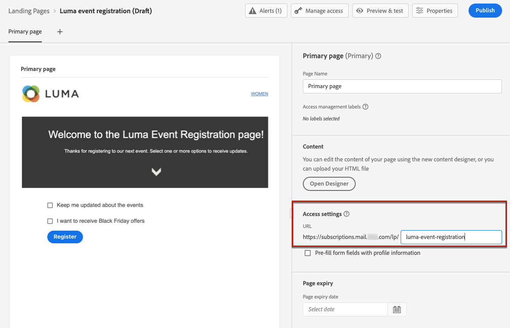

# Criar e publicar landing pages {#create-lp}

## Acessar landing pages {#access-landing-pages}

Para acessar a lista de landing pages, selecione **[!UICONTROL Gerenciamento de jornadas]** > **[!UICONTROL Landing pages]** no menu esquerdo.

O **[!UICONTROL Páginas de aterrissagem]** exibe todos os itens criados. Você pode filtrá-los com base em seu status ou data de modificação.

Nessa lista, é possível acessar o [relatório ao vivo da página de aterrissagem](../reports/lp-report-live.md) ou [relatório Global de página de aterrissagem](../reports/lp-report-global.md) para itens publicados.

Também é possível excluir, duplicar e desfazer a publicação de uma landing page.

>[!CAUTION]
>
>Se você cancelar a publicação de uma landing page referenciada em uma mensagem, o link para a landing page será quebrado e uma página de erro será exibida.

Clique nos três pontos ao lado de uma página de aterrissagem para selecionar a ação desejada.

>[!NOTE]
>
>Não é possível excluir um [publicado](#publish-landing-page) página de aterrissagem. Para excluí-lo, é necessário cancelar a publicação primeiro.

## Criar uma página de destino {#create-landing-page}

>[!CONTEXTUALHELP]
>id="ajo_lp_create"
>title="Definir e configurar a landing page"
>abstract="Para criar uma landing page, você precisa selecionar uma predefinição, configurar a página primária e as subpáginas e, finalmente, testar sua página antes de publicá-la."
>additional-url="https://experienceleague.adobe.com/docs/journey-optimizer/using/configuration/lp-configuration/lp-presets.html#lp-create-preset" text="Criar predefinições de página de aterrissagem"
>additional-url="https://experienceleague.adobe.com/docs/journey-optimizer/using/landing-pages/create-lp.html#publish-landing-page" text="Publicar a landing page"

As etapas para criar uma landing page são as seguintes.

1. Na lista de landing page, clique em **[!UICONTROL Criar página de aterrissagem]**.

   

1. Adicione um título. Você pode adicionar uma descrição, se necessário.

   

1. Para atribuir rótulos de uso de dados personalizados ou principais à página inicial, selecione **[!UICONTROL Gerenciar acesso]**. [Saiba mais sobre o Controle de Acesso no Nível do Objeto (OLAC)](../administration/object-based-access.md)

   <!--You can add a tag. See AEP documentation?-->

1. Selecione uma predefinição. Saiba como criar predefinições de página de aterrissagem em [esta seção](../configuration/lp-presets.md#lp-create-preset).

   

1. Clique em **[!UICONTROL Criar]**.

1. A página primária e suas propriedades são exibidas. Saiba como definir as configurações da página primária [here](#configure-primary-page).

   

1. Clique no ícone + para adicionar uma subpágina. Saiba como definir as configurações de subpágina [here](#configure-subpages).

   

Depois de configurar e projetar o [página primária](#configure-primary-page)e o [subpáginas](#configure-subpages) se houver, você poderá [teste](#test-landing-page) e [publicar](#publish-landing-page) sua landing page.

## Configurar a página primária {#configure-primary-page}

>[!CONTEXTUALHELP]
>id="ajo_lp_primary_page"
>title="Definir as configurações da página primária"
>abstract="A página primária é exibida imediatamente aos usuários depois que eles clicam no link de sua página inicial, como de um email ou de um site."
>additional-url="https://experienceleague.adobe.com/docs/journey-optimizer/using/landing-pages/landing-pages-design/design-lp.html" text="Criar o conteúdo da página de aterrissagem"

>[!CONTEXTUALHELP]
>id="ajo_lp_access_settings"
>title="Definir o URL da página de aterrissagem"
>abstract="Nesta seção, defina um URL de página de aterrissagem exclusivo. A primeira parte do URL requer a configuração prévia de um subdomínio de página de aterrissagem como parte da predefinição selecionada."
>additional-url="https://experienceleague.adobe.com/docs/journey-optimizer/using/configuration/lp-configuration/lp-subdomains.html" text="Configurar subdomínios de página de destino"
>additional-url="https://experienceleague.adobe.com/docs/journey-optimizer/using/configuration/lp-configuration/lp-presets.html#lp-create-preset" text="Criar predefinições de página de aterrissagem"

A página primária é a página que é imediatamente exibida aos usuários depois que eles clicam no link de sua página inicial, como de um email ou de um site.

Para definir as configurações da página primária, siga as etapas abaixo.

1. Você pode alterar o nome da página, que é **[!UICONTROL Página principal]** por padrão.

1. Edite o conteúdo da sua página usando o designer de conteúdo. Saiba como definir o conteúdo da página de aterrissagem [here](design-lp.md).

   

1. Defina o URL da página de aterrissagem. A primeira parte do URL requer a configuração prévia de um subdomínio de página de aterrissagem como parte do [predefinição](../configuration/lp-presets.md#lp-create-preset) você selecionou. [Saiba mais](../configuration/lp-subdomains.md)

   >[!CAUTION]
   >
   >O URL da página de aterrissagem deve ser exclusivo.

   

   >[!NOTE]
   >
   >Não é possível acessar a landing page simplesmente copiando e colando esse URL em um navegador da Web, mesmo se publicado. Em vez disso, você pode testá-lo usando a função de visualização, como descrito em [esta seção](#test-landing-page).

1. Se desejar que a landing page pré-carregue os dados do formulário que já estão disponíveis, selecione a variável **[!UICONTROL Preencher previamente campos de formulário com informações de perfil]**.

   

   Quando essa opção está ativada, se um perfil já tiver optado por entrar/sair ou já tiver sido adicionado a uma lista de assinaturas, suas opções serão refletidas ao exibir a landing page.

   Por exemplo, se um perfil tiver optado por receber comunicações sobre eventos futuros, a caixa de seleção correspondente já estará selecionada na próxima vez que a landing page for exibida nesse perfil.

   

1. Você pode definir uma data de expiração para sua página. Nesse caso, você deve selecionar uma ação ao expirar a página:

   * **[!UICONTROL Redirecionar URL]**: Insira o URL da página para a qual os usuários serão redirecionados quando a página expirar.
   * **[!UICONTROL Página personalizada]**: [Configurar uma subpágina](#configure-subpages) e selecione-o na lista suspensa que é exibida.
   * **[!UICONTROL Erro do navegador]**: Digite o texto do erro que será exibido em vez da página.

   

1. No **[!UICONTROL Dados adicionais]** , defina uma ou mais chaves e seus valores de parâmetro correspondentes. Você poderá aproveitar essas chaves no conteúdo da página primária e das subpáginas usando o [Editor de expressão](../personalization/personalization-build-expressions.md). Saiba mais [nesta seção](lp-content.md#use-form-component#use-additional-data).

   

1. Se você selecionou uma ou mais listas de assinaturas ao [criação da página primária](design-lp.md), são exibidos na variável **[!UICONTROL Lista de assinaturas]** seção.

   

1. Na página de aterrissagem, é possível diretamente [criar uma jornada](../building-journeys/journey-gs.md#jo-build) que enviará uma mensagem de confirmação para os usuários quando enviarem o formulário. Saiba como criar uma jornada desse tipo no final [caso de uso](lp-use-cases.md#subscription-to-a-service).

   

   Clique em **[!UICONTROL Criar jornada]** para ser redirecionado para o **[!UICONTROL Gerenciamento de jornadas]** > **[!UICONTROL Jornada]** lista.

## Configurar subpáginas {#configure-subpages}

>[!CONTEXTUALHELP]
>id="ajo_lp_subpage"
>title="Definir as configurações de subpágina"
>abstract="É possível adicionar até 2 subpáginas. Por exemplo, você pode criar uma página de &#39;agradecimento&#39; que será exibida depois que os usuários enviarem o formulário e você pode definir uma página de erro que será chamada se ocorrer um problema com a landing page."
>additional-url="https://experienceleague.adobe.com/docs/journey-optimizer/using/landing-pages/landing-pages-design/design-lp.html" text="Criar o conteúdo da página de aterrissagem"

>[!CONTEXTUALHELP]
>id="ajo_lp_access_settings-subpage"
>title="Definir o URL da página de aterrissagem"
>abstract="Nesta seção, defina um URL de página de aterrissagem exclusivo. A primeira parte do URL requer a configuração prévia de um subdomínio de página de aterrissagem como parte da predefinição selecionada."
>additional-url="https://experienceleague.adobe.com/docs/journey-optimizer/using/configuration/lp-configuration/lp-subdomains.html" text="Configurar subdomínios de página de destino"
>additional-url="https://experienceleague.adobe.com/docs/journey-optimizer/using/configuration/lp-configuration/lp-presets.html#lp-create-preset" text="Criar predefinições de página de aterrissagem"

É possível adicionar até 2 subpáginas. Por exemplo, você pode criar uma página de &#39;agradecimento&#39; que será exibida depois que os usuários enviarem o formulário e você pode definir uma página de erro que será chamada se ocorrer um problema com a landing page.

Para definir as configurações de subpágina, siga as etapas abaixo.

1. Você pode alterar o nome da página, que é **[!UICONTROL Subpágina 1]** por padrão.

1. Edite o conteúdo da sua página usando o designer de conteúdo. Saiba como definir o conteúdo da página de aterrissagem [here](design-lp.md).

   >[!NOTE]
   >
   >Você pode inserir um link para a página primária de qualquer subpágina da mesma landing page. Por exemplo, para redirecionar usuários que cometeram um erro e desejam se inscrever novamente, é possível adicionar um link da subpágina de confirmação à página principal da assinatura. Saiba como inserir links em [esta seção](../design/message-tracking.md#insert-links).

1. Defina o URL da página de aterrissagem. A primeira parte do URL requer a configuração prévia de um subdomínio de página de aterrissagem. [Saiba mais](../configuration/lp-subdomains.md)

   >[!CAUTION]
   >
   >O URL da página de aterrissagem deve ser exclusivo.

## Testar a landing page {#test-landing-page}

Depois que as configurações e o conteúdo da landing page forem definidos, você poderá usar perfis de teste para visualizá-los. Se você inseriu [conteúdo personalizado](../personalization/personalize.md), você poderá verificar como esse conteúdo é exibido na landing page, aproveitando os dados do perfil de teste.

>[!CAUTION]
>
>Você deve ter perfis de teste disponíveis para visualizar suas mensagens e enviar provas. Saiba como [criar perfis de teste](../segment/creating-test-profiles.md).

1. Na interface da landing page, clique no link **[!UICONTROL Visualizar e testar]** para acessar a seleção de perfil de teste.

   

   >[!NOTE]
   >
   >O **[!UICONTROL Visualizar]** também é acessível no designer de conteúdo.

1. No **[!UICONTROL Visualizar e testar]** selecione um ou mais perfis de teste.

   

   As etapas para selecionar perfis de teste são as mesmas que ao testar uma mensagem. Eles são detalhados [nesta seção](../design/preview.md#select-test-profiles).

1. Selecione o **[!UICONTROL Visualizar]** e clique em **[!UICONTROL Abrir visualização]** para testar sua landing page.

   

1. A visualização da landing page é aberta em uma nova guia. Os elementos personalizados são substituídos pelos dados de perfil de teste selecionados.

   

1. Selecione outros perfis de teste para visualizar a renderização de cada variante da landing page.

## Verificar alertas {#check-alerts}

Ao criar a landing page, os alertas avisam quando você deve tomar ações importantes antes da publicação.

Os alertas são exibidos na parte superior direita da tela, conforme mostrado abaixo:

>[!NOTE]
>
>Se você não vir este botão, nenhum alerta foi detectado.

Dois tipos de alertas podem acontecer:

* **Avisos** consulte recomendações e práticas recomendadas. <!--For example, a message will display if -->

* **Erros** impedir a publicação da landing page, desde que elas não sejam resolvidas. Por exemplo, você receberá um aviso se o URL da página primária estiver ausente.

<!--All possible warnings and errors are detailed [below](#alerts-and-warnings).-->

>[!CAUTION]
>
> Você deve resolver tudo **erro** alertas antes da publicação.

<!--The settings and elements checked by the system are listed below. You will also find information on how to adapt your configuration to resolve the corresponding issues.

**Warnings**:

* 

**Errors**:

* 

>[!CAUTION]
>
> To be able to publish your message, you must resolve all **error** alerts.
-->

## Publicar a landing page {#publish-landing-page}

Quando a landing page estiver pronta, você poderá publicá-la para disponibilizá-la para uso em uma mensagem.

>[!CAUTION]
>
>Antes de publicar, verifique e resolva os alertas. [Saiba mais](#check-alerts)

Depois que a landing page é publicada, ela é adicionada à lista de landing page com a variável **[!UICONTROL Publicado]** status.

Agora ele está ativo e pronto para ser usado em um [!DNL Journey Optimizer] [message](../messages/get-started-content.md) que será enviado por meio de um [jornada](../building-journeys/journey.md).

>[!NOTE]
>
>Você pode monitorar os impactos de sua landing page por meio de relatórios específicos. [Saiba mais](../reports/lp-report-live.md)

