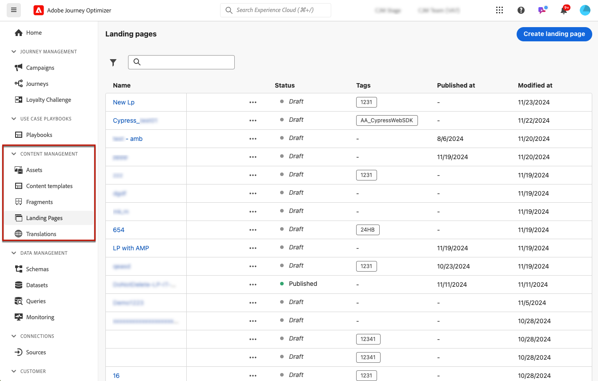

# Criar e publicar páginas de destino {#create-lp}

>[!CAUTION]
>
>Para testar e publicar páginas de aterrissagem, é necessário ter o **[!UICONTROL Publicar mensagens]** permissão.

## Acessar páginas de destino {#access-landing-pages}

Para acessar a lista de landing pages, selecione **[!UICONTROL Gerenciamento de jornadas]** > **[!UICONTROL Landing pages]** no menu esquerdo.

A variável **[!UICONTROL Landing Pages]** exibe todos os itens criados. Você pode filtrá-los com base no status ou data de modificação.

Nessa lista, você pode acessar a variável [relatório ao vivo da página de aterrissagem](../reports/lp-report-live.md) ou [relatório global da landing page](../reports/lp-report-global.md) para itens publicados.

Também é possível excluir, duplicar e desfazer a publicação de uma landing page.

>[!CAUTION]
>
>Se você cancelar a publicação de uma landing page referenciada em uma mensagem, o link para a landing page será quebrado e uma página de erro será exibida.

Clique nos três pontos ao lado de uma landing page para selecionar a ação desejada.

>[!NOTE]
>
>Não é possível excluir um [publicado](#publish-landing-page) página de aterrissagem. Para excluí-lo, primeiro você deve desfazer a publicação.

## Criar uma página de destino {#create-landing-page}

>[!CONTEXTUALHELP]
>id="ajo_lp_create"
>title="Definir e configurar a página de destino"
>abstract="Para criar uma página de destino, você precisa selecionar uma predefinição, configurar a página principal e as subpáginas e, por fim, testar a página antes de publicá-la."
>additional-url="https://experienceleague.adobe.com/docs/journey-optimizer/using/landing-pages/lp-configuration/lp-presets.html#lp-create-preset" text="Criar predefinições de página de destino"
>additional-url="https://experienceleague.adobe.com/docs/journey-optimizer/using/landing-pages/create-lp.html#publish-landing-page" text="Publicar a página de destino"

>[!CONTEXTUALHELP]
>id="ajo_lp_access_management_labels"
>title="Atribuir rótulos à página de destino"
>abstract="Para proteger ativos digitais confidenciais, você pode definir autorizações para gerenciar o acesso aos dados da página de destino usando rótulos."
>additional-url="https://experienceleague.adobe.com/docs/journey-optimizer/using/access-control/object-based-access.html" text="Controle de acesso no nível do objeto"

As principais etapas para criar landing pages são as seguintes:

1. Na lista da landing page, clique em **[!UICONTROL Criar página de destino]**.

   

1. Adicione um título. Você pode adicionar uma descrição, se necessário.

   

1. Para atribuir rótulos de uso de dados personalizados ou principais à página de aterrissagem, selecione **[!UICONTROL Gerenciar acesso]**. [Saiba mais sobre o OLAC (Object Level Access Control)](../administration/object-based-access.md)

   <!--You can add a tag. See AEP documentation?-->

1. Selecione uma predefinição. Saiba como criar predefinições de página de aterrissagem no [nesta seção](../landing-pages/lp-presets.md#lp-create-preset).

   

1. Clique em **[!UICONTROL Criar]**.

1. A página principal e suas propriedades são exibidas. Saiba como definir as configurações da página principal [aqui](#configure-primary-page).

   

1. Clique no ícone + para adicionar uma subpágina. Saiba como definir as configurações de subpágina [aqui](#configure-subpages).

   

Depois de configurar e projetar o [página principal](#configure-primary-page), e o [subpáginas](#configure-subpages) se houver, é possível [test](#test-landing-page) e [publicar](#publish-landing-page) sua landing page.

## Configurar a página principal {#configure-primary-page}

>[!CONTEXTUALHELP]
>id="ajo_lp_primary_page"
>title="Definir as configurações da página principal"
>abstract="A página principal é exibida imediatamente depois que as pessoas clicam no link de página de destino que consta em um email ou site."
>additional-url="https://experienceleague.adobe.com/docs/journey-optimizer/using/landing-pages/landing-pages-design/design-lp.html" text="Criar o conteúdo da página de destino"

>[!CONTEXTUALHELP]
>id="ajo_lp_access_settings"
>title="Definir o URL da página de destino"
>abstract="Nesta seção, defina um URL de página de destino exclusivo. A primeira parte do URL requer a configuração prévia de um subdomínio de página de destino como parte da predefinição selecionada."
>additional-url="https://experienceleague.adobe.com/docs/journey-optimizer/using/landing-pages/lp-configuration/lp-subdomains.html" text="Configurar subdomínios de página de destino"
>additional-url="https://experienceleague.adobe.com/docs/journey-optimizer/using/landing-pages/lp-configuration/lp-presets.html#lp-create-preset" text="Criar predefinições de página de destino"

A página principal é a página imediatamente exibida aos usuários depois que eles clicam no link para a página de aterrissagem, como a partir de um email ou site.

Para definir as configurações de página principal, siga as etapas abaixo.

1. É possível alterar o nome da página, que é **[!UICONTROL Página principal]** por padrão.

1. Edite o conteúdo da página usando o designer de conteúdo. Saiba como definir conteúdo de página de aterrissagem [aqui](design-lp.md).

   

1. Definir o URL da página de destino. A primeira parte do URL exige que você configure anteriormente um subdomínio de página de destino como parte do [predefinição](../landing-pages/lp-presets.md#lp-create-preset) selecionado. [Saiba mais](../landing-pages/lp-subdomains.md)

   >[!CAUTION]
   >
   >O URL da landing page deve ser exclusivo.

   

   >[!NOTE]
   >
   >Você não pode acessar sua landing page simplesmente copiando esse URL em um navegador da Web, mesmo que publicado. Em vez disso, você pode testá-lo usando a função de visualização, como descrito em [nesta seção](#test-landing-page).

1. Se desejar que a landing page pré-carregue os dados de formulário que já estão disponíveis, selecione a **[!UICONTROL Preencher previamente os campos de formulário com informações de perfil]**.

   

   Quando essa opção estiver ativada, se um perfil já tiver aceitado/recusado ou já tiver sido adicionado a uma lista de assinaturas, suas opções serão refletidas na exibição da landing page.

   Por exemplo, se um perfil tiver optado por receber comunicações sobre eventos futuros, a caixa de seleção correspondente já estará marcada na próxima vez que a landing page for exibida para esse perfil.

   

1. É possível definir uma data de expiração para a página. Nesse caso, você deve selecionar uma ação ao expirar a página:

   * **[!UICONTROL URL de redirecionamento]**: digite o URL da página para a qual os usuários serão redirecionados quando a página expirar.
   * **[!UICONTROL Página personalizada]**: [Configurar uma subpágina](#configure-subpages) e selecione-o na lista suspensa que é exibida.
   * **[!UICONTROL Erro do navegador]**: digite o texto do erro que será exibido em vez da página.

   

1. No **[!UICONTROL Dados adicionais]** defina uma ou mais chaves e seus valores de parâmetro correspondentes. Você poderá aproveitar essas chaves no conteúdo da página principal e das subpáginas usando o [Editor de expressão](../personalization/personalization-build-expressions.md). Saiba mais [nesta seção](lp-content.md#use-form-component#use-additional-data).

   

1. Se você selecionou uma ou mais listas de assinaturas ao [criação da página principal](design-lp.md), elas são exibidas na **[!UICONTROL Lista de assinaturas]** seção.

   

1. Na landing page, você pode [criar uma jornada](../building-journeys/journey-gs.md#jo-build) que enviará uma mensagem de confirmação aos usuários quando eles enviarem o formulário. Saiba como criar essa jornada no final deste [caso de uso](lp-use-cases.md#subscription-to-a-service).

   

   Clique em **[!UICONTROL Criar jornada]** a ser redirecionado para a **[!UICONTROL Gerenciamento de jornadas]** > **[!UICONTROL Jornadas]** lista.

## Configurar subpáginas {#configure-subpages}

>[!CONTEXTUALHELP]
>id="ajo_lp_subpage"
>title="Definir as configurações de subpágina"
>abstract="Você pode adicionar até 2 subpáginas. Por exemplo, você pode criar uma página de “agradecimento” que será exibida depois que as pessoas enviarem o formulário e você pode definir uma página de erro que será chamada se ocorrer um problema com a página de destino."
>additional-url="https://experienceleague.adobe.com/docs/journey-optimizer/using/landing-pages/landing-pages-design/design-lp.html" text="Criar o conteúdo da página de destino"

>[!CONTEXTUALHELP]
>id="ajo_lp_access_settings-subpage"
>title="Definir o URL da página de destino"
>abstract="Nesta seção, defina um URL de página de destino exclusivo. A primeira parte do URL requer a configuração prévia de um subdomínio de página de destino como parte da predefinição selecionada."
>additional-url="https://experienceleague.adobe.com/docs/journey-optimizer/using/landing-pages/lp-configuration/lp-subdomains.html" text="Configurar subdomínios de página de destino"
>additional-url="https://experienceleague.adobe.com/docs/journey-optimizer/using/landing-pages/lp-configuration/lp-presets.html#lp-create-preset" text="Criar predefinições de página de destino"

Você pode adicionar até 2 subpáginas. Por exemplo, você pode criar uma página de “agradecimento” que será exibida depois que as pessoas enviarem o formulário e você pode definir uma página de erro que será chamada se ocorrer um problema com a página de destino.

Para definir as configurações de subpágina, siga as etapas abaixo.

1. É possível alterar o nome da página, que é **[!UICONTROL Subpágina 1]** por padrão.

1. Edite o conteúdo da página usando o designer de conteúdo. Saiba como definir conteúdo de página de aterrissagem [aqui](design-lp.md).

   >[!NOTE]
   >
   >É possível inserir um link para a página principal de qualquer subpágina da mesma página de destino. Por exemplo, para redirecionar os usuários que cometeram um erro e desejam assinar novamente, é possível adicionar um link da subpágina de confirmação para a página principal da assinatura. Saiba como inserir links no [nesta seção](../email/message-tracking.md#insert-links).

1. Definir o URL da página de destino. A primeira parte do URL exige a configuração prévia de um subdomínio de página de destino. [Saiba mais](../landing-pages/lp-subdomains.md)

   >[!CAUTION]
   >
   >O URL da landing page deve ser exclusivo.

## Testar a landing page {#test-landing-page}

>[!CONTEXTUALHELP]
>id="ac_preview_lp_profiles"
>title="Visualizar e testar a página de destino"
>abstract="Depois de definir as configurações e o conteúdo da página de destino, você pode usar perfis de teste para visualizar."
>additional-url="https://experienceleague.adobe.com/docs/journey-optimizer/using/segment/profiles/creating-test-profiles.html" text="Selecionar perfis de teste"

Depois que as configurações e o conteúdo da landing page forem definidos, você poderá usar perfis de teste para pré-visualizá-la. Se você inseriu [conteúdo personalizado](../personalization/personalize.md), você poderá verificar como esse conteúdo é exibido na página de aterrissagem, usando os dados do perfil de teste.

>[!CAUTION]
>
>Para testar landing pages, você deve ter a **[!UICONTROL Publicar mensagens]** permissão.
>
>Você deve ter perfis de teste disponíveis para poder visualizar suas mensagens e enviar provas. Saiba como [criar perfis de teste](../segment/creating-test-profiles.md).

1. Na interface da landing page, clique na guia **[!UICONTROL Simular conteúdo]** botão para acessar a seleção de perfil de teste.

   

   >[!NOTE]
   >
   >A variável **[!UICONTROL Simular conteúdo]** também é acessível pelo designer de conteúdo.

1. No **[!UICONTROL Simular]** selecione um ou mais perfis de teste.

   

   As etapas para selecionar perfis de teste são as mesmas que ao testar uma mensagem. Eles são detalhados [nesta seção](../email/preview.md#select-test-profiles).

1. Selecionar **[!UICONTROL Abrir pré-visualização]** para testar sua landing page.

   

1. A visualização da landing page é aberta em uma nova guia. Os elementos personalizados são substituídos pelos dados do perfil de teste selecionado.

   <!---->

1. Selecione outros perfis de teste para visualizar a renderização de cada variante da página de aterrissagem.

## Verificar alertas {#check-alerts}

Ao criar uma landing page, os alertas avisam quando você deve realizar ações importantes antes de publicar.

Os alertas são exibidos na parte superior direita da tela, conforme mostrado abaixo:

>[!NOTE]
>
>Se você não vir esse botão, nenhum alerta foi detectado.

Dois tipos de alertas podem ocorrer:

* **Avisos** consulte recomendações e práticas recomendadas. <!--For example, a message will display if -->

* **Erros** impedir a publicação da landing page, desde que não sejam resolvidas. Por exemplo, você receberá um aviso se o URL da página principal estiver ausente.

<!--All possible warnings and errors are detailed [below](#alerts-and-warnings).-->

>[!CAUTION]
>
> Você deve resolver todos **erro** alertas antes da publicação.

<!--The settings and elements checked by the system are listed below. You will also find information on how to adapt your configuration to resolve the corresponding issues.

**Warnings**:

* 

**Errors**:

* 

>[!CAUTION]
>
> To be able to publish your message, you must resolve all **error** alerts.
-->

## Publicar a página de destino {#publish-landing-page}

>[!CAUTION]
>
>Para publicar páginas de aterrissagem, é necessário ter o **[!UICONTROL Publicar mensagens]** permissão.

Quando a landing page estiver pronta, você poderá publicá-la para disponibilizá-la para uso em uma mensagem.

>[!CAUTION]
>
>Antes de publicar, verifique e resolva os alertas. [Saiba mais](#check-alerts)

Quando a landing page for publicada, ela será adicionada à lista de landing pages com a **[!UICONTROL Publicado]** status.

Agora ele está ativo e pronto para ser usado em uma [!DNL Journey Optimizer] mensagem que será enviada por meio de um [jornada](../building-journeys/journey.md).

>[!NOTE]
>
>Você pode monitorar os impactos da landing page por meio de relatórios específicos. [Saiba mais](../reports/lp-report-live.md)

