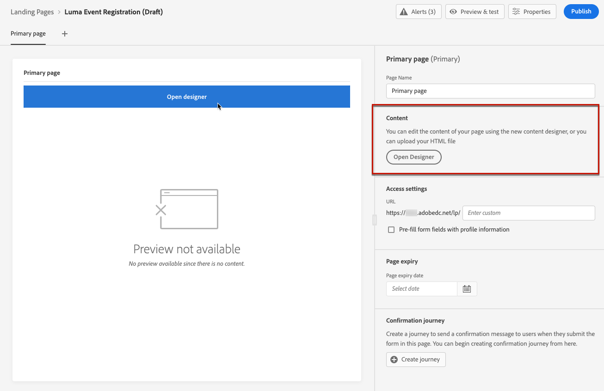

# Criar o conteúdo da página de destino {#design-lp}

Para começar a criar conteúdo para sua [página principal](create-lp.md#configure-primary-page) ou [subpágina](create-lp.md#configure-subpages) de aterrissagem, passe o mouse sobre o conteúdo da sua página e clique em **[!UICONTROL Abrir o Designer]**. Você também pode clicar no botão correspondente na paleta direita.

Nela, você pode:

* **Crie sua página de aterrissagem do zero** por meio da interface do designer de conteúdo e utilize imagens do [Adobe Experience Manager Assets](../integrations/assets.md). Saiba como criar seu conteúdo <!--or use built-in templates--> [nesta seção](../email/content-from-scratch.md).

* **Gere conteúdo com o Assistente de IA** para acelerar a criação de páginas de aterrissagem com texto e imagens gerados por IA. [Saiba mais sobre o Assistente de IA](../content-management/generative-full-content.md).

* **Codifique ou cole o HTML bruto** diretamente no designer de conteúdo. Saiba como codificar seu próprio conteúdo [nesta seção](../email/code-content.md).

* **Importar conteúdo HTML existente** de um arquivo ou uma pasta .zip. Saiba como importar conteúdo [nesta seção](../email/existing-content.md).

* **Usar um modelo de página de aterrissagem salvo** criado em [!DNL Journey Optimizer]. [Saiba mais](lp-templates.md)

Uma vez no designer de conteúdo da página de aterrissagem, você pode usar os mesmos componentes de um email e definir o conteúdo específico da página de aterrissagem usando o componente de formulário. [Saiba como](lp-content.md)

>[!NOTE]
>
>O designer de conteúdo da página de aterrissagem é semelhante ao Designer de email. Saiba mais sobre [como criar conteúdo com [!DNL Journey Optimizer]](../email/get-started-email-design.md).
>
>A [Lei Europeia de Acessibilidade](https://eur-lex.europa.eu/legal-content/EN/TXT/?uri=CELEX%3A32019L0882){target="_blank"} declara que todas as comunicações digitais devem ser acessíveis. Siga as diretrizes específicas listadas em [esta página](../email/accessible-content.md) ao criar o conteúdo em [!DNL Journey Optimizer].
