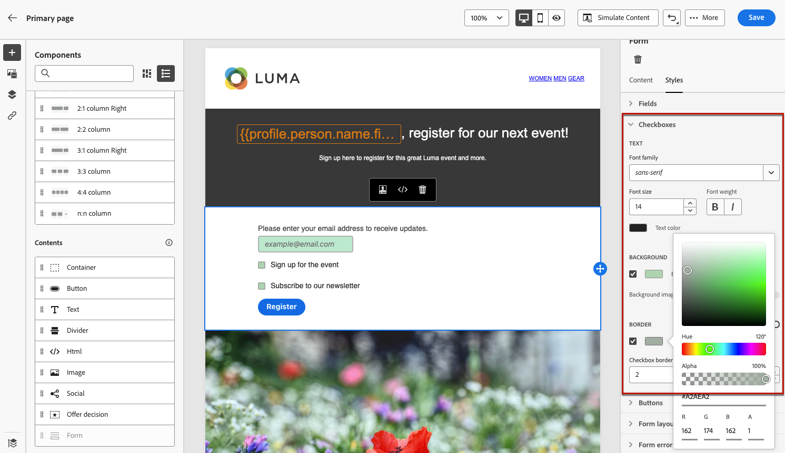

# Criar o conteúdo da página de aterrissagem {#design-lp-content}

Para começar a criar conteúdo para sua página inicial [página primária](create-lp.md#configure-primary-page) ou [subpágina](create-lp.md#configure-subpages), passe o mouse sobre o conteúdo da página primária e clique em **[!UICONTROL Open Designer]**. Você também pode clicar no botão correspondente da paleta direita.

A partir daí, é possível:

* **Projetar a landing page do zero** por meio da interface do designer de conteúdo e aproveite imagens de [Adobe Experience Manager Assets Essentials](../messages/assets-essentials.md). Saiba como criar conteúdo ou usar modelos integrados [nesta seção](../messages/create-email-content.md).

* **Código ou cole HTML bruto** diretamente no designer de conteúdo. Saiba como codificar seu próprio conteúdo [nesta seção](../messages/existing-content.md#import-raw-html-code).

* **Importar conteúdo HTML existente** de um arquivo ou uma pasta .zip. Saiba como importar conteúdo [nesta seção](../messages/existing-content.md#import-html-content-from-file).

>[!NOTE]
>
>O designer de conteúdo da página de aterrissagem é semelhante ao designer de email. Saiba mais sobre [criar conteúdo com [!DNL Journey Optimizer]](../messages/design-emails.md).

## Definir o conteúdo específico da página de aterrissagem {#define-lp-specific-content}

Para definir um conteúdo específico que permitirá aos usuários selecionar e enviar suas opções a partir de sua página de aterrissagem, siga as etapas abaixo.

1. Arraste e solte a página de aterrissagem específica **[!UICONTROL Form]** componente da paleta esquerda para o espaço de trabalho principal.

   

   >[!NOTE]
   >
   >O **[!UICONTROL Form]** só pode ser usado uma vez na mesma página.

1. Selecione-o. O **[!UICONTROL Form content]** é exibida na paleta direita para permitir a edição dos diferentes campos do formulário.

   

   >[!NOTE]
   >
   >Alterne para **[!UICONTROL Form style]** a qualquer momento para editar os estilos do conteúdo do componente de formulário. [Saiba mais](#define-lp-styles)

1. No **[!UICONTROL Checkbox 1]** , você pode editar o rótulo correspondente a essa caixa de seleção.

1. Defina se essa caixa de seleção deve ser de opt in ou out de usuários: concordam em receber comunicações ou pedem que não sejam mais contactadas?

   

1. Escolha o que será atualizado entre as três opções a seguir:

   

   * **[!UICONTROL Subscription list]**: Você deve selecionar a lista de subscrição que será atualizada se o perfil marcar essa caixa de seleção. Saiba mais sobre [listas de assinaturas](subscription-list.md).

      

   * **[!UICONTROL Channel (email)]**: A aceitação ou recusa se aplica a todo o canal. Por exemplo, se um perfil que recusa tiver dois endereços de email, ambos os endereços serão excluídos de todas as suas comunicações.

   * **[!UICONTROL Email identity]**: A aceitação ou recusa se aplica somente ao endereço de email usado para acessar a landing page. Por exemplo, se um perfil tiver dois endereços de email, somente aquele usado para aceitar receberá comunicações da sua marca.

1. Clique em **[!UICONTROL Add field]** > **[!UICONTROL Checkbox]** para adicionar outra caixa de seleção. Repita as etapas acima para definir suas propriedades.

   

1. Depois de adicionar todas as caixas de seleção desejadas, clique em **[!UICONTROL Call to action]** para expandir a seção correspondente. Ela permite definir o comportamento do botão na variável **[!UICONTROL Form]** componente.

   

1. Defina o que acontecerá ao clicar no botão :

   * **[!UICONTROL Redirect URL]**: Insira o URL da página para a qual os usuários serão redirecionados.
   * **[!UICONTROL Confirmation text]**: Digite o texto de confirmação que será exibido.
   * **[!UICONTROL Link to a subpage]**: Configure um [subpágina](create-lp.md#configure-subpages) e selecione-o na lista suspensa que é exibida.

   

1. Defina o que acontecerá ao clicar no botão em caso de erro:

   * **[!UICONTROL Redirect URL]**: Insira o URL da página para a qual os usuários serão redirecionados.
   * **[!UICONTROL Error text]**: Digite o texto do erro que será exibido. Você pode visualizar o texto de erro ao definir a variável [estilos de formulário](#define-lp-styles).

   * **[!UICONTROL Link to a subpage]**: Configure um [subpágina](create-lp.md#configure-subpages) e selecione-o na lista suspensa que é exibida.

   

1. Se desejar fazer atualizações adicionais ao enviar o formulário, selecione **[!UICONTROL Opt in]** ou **[!UICONTROL Opt out]** e defina se deseja atualizar uma lista de subscrição, o canal ou apenas o endereço de email usado.

   

1. Salve o conteúdo e clique na seta ao lado do nome da página para retornar ao [propriedades da página de aterrissagem](create-lp.md#configure-primary-page).

   

<!--Will the name Email Designer be kept if you can also design LP with the same tool? > To modify in Messages section > content designer or Designer-->

## Definir estilos de formulário de landing page {#define-lp-styles}

1. Para modificar os estilos do conteúdo do componente de formulário, alterne a qualquer momento para a função **[!UICONTROL Form style]** guia .

   

1. Expanda o **[!UICONTROL Checkboxes]** para definir a aparência das caixas de seleção e do texto correspondente. Por exemplo, você pode ajustar a família ou o tamanho da fonte e a cor da borda da caixa de seleção.

   

1. Expanda o **[!UICONTROL Buttons]** para modificar a aparência do botão no formulário componente. Por exemplo, você pode adicionar uma borda, editar a cor do rótulo ao passar o mouse ou ajustar o alinhamento do botão.

   

   Você pode visualizar algumas de suas configurações, como a cor do rótulo do botão ao passar o mouse **[!UICONTROL Preview]** botão. Saiba mais sobre como testar landing pages [here](create-lp.md#test-landing-page).

   

1. Expanda o **[!UICONTROL Form layout]** seção para editar as configurações de layout, como cor do plano de fundo, preenchimento ou margem.

   

1. Expanda o **[!UICONTROL Form error]** para ajustar a exibição da mensagem de erro que é exibida caso ocorra um problema. Marque a opção correspondente para visualizar o texto do erro no formulário.

   

