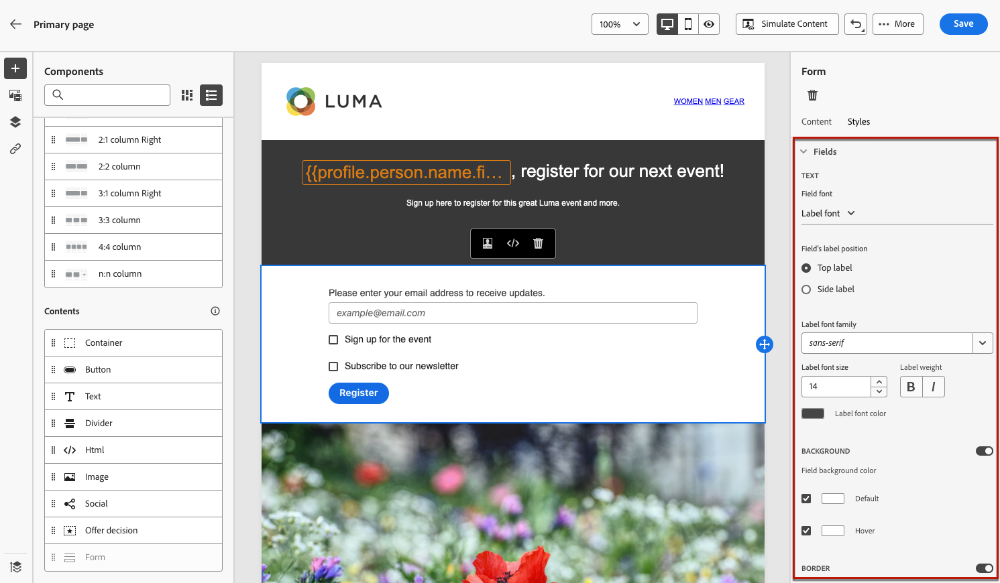

# Definir conteúdo específico da página de destino {#lp-content}

>[!CONTEXTUALHELP]
>id="ac_lp_components"
>title="Usar componentes de conteúdo"
>abstract="Os componentes de conteúdo são espaços reservados de conteúdo vazios que você pode usar para criar o layout de uma página de destino. Para definir um conteúdo específico que permitirá aos usuários selecionar e enviar suas opções, use o componente de formulário."
>additional-url="https://experienceleague.adobe.com/en/docs/journey-optimizer/using/communication-channels/email/design-email/add-content/content-components#add-content-components" text="Adicionar componentes de conteúdo"

Para projetar o conteúdo da página de aterrissagem, é possível usar os mesmos componentes de um email. [Saiba mais](../email/content-components.md#add-content-components)

Para criar conteúdo específico que permita aos usuários selecionar e enviar suas escolhas, [use o componente de formulário](#use-form-component) e defina seus [estilos específicos de página de aterrissagem](#lp-form-styles).

>[!NOTE]
>
>Você também pode criar uma página de aterrissagem de click-through sem um componente de **[!UICONTROL Formulário]**. Nesse caso, a landing page será exibida para os usuários, mas eles não precisarão enviar nenhum formulário. Isso pode ser útil se você quiser apenas mostrar uma landing page sem exigir qualquer ação de seus recipients, como aceitação ou recusa, ou se quiser fornecer informações que não exijam entrada do usuário.

Com o designer de conteúdo da página de aterrissagem, você também pode aproveitar os dados contextuais provenientes da página principal em uma subpágina. [Saiba mais](#use-primary-page-context)

## Usar o componente de formulário {#use-form-component}

>[!CONTEXTUALHELP]
>id="ac_lp_formfield"
>title="Definir os campos do componente de formulário"
>abstract="Defina como os recipients verão a página de destino e enviarão suas opções."
>additional-url="https://experienceleague.adobe.com/pt-br/docs/journey-optimizer/using/landing-pages/landing-pages-design/lp-content#lp-form-styles" text="Definir estilos de formulário de página de destino"

>[!CONTEXTUALHELP]
>id="ac_lp_submission"
>title="O que acontece ao clicar no botão"
>abstract="Defina o que acontecerá depois que as pessoas enviarem o formulário da página de destino."

Para definir um conteúdo específico que permita aos usuários selecionar e enviar suas opções a partir da página de aterrissagem, use o componente **[!UICONTROL Formulário]**. Para isso, siga as etapas abaixo.

1. Arraste e solte o componente **[!UICONTROL Formulário]** específico da página de aterrissagem da paleta esquerda no espaço de trabalho principal.

   

   >[!NOTE]
   >
   >O componente **[!UICONTROL Formulário]** só pode ser usado uma vez na mesma página.

1. Selecione-o. A guia **[!UICONTROL Conteúdo do formulário]** é exibida na paleta direita para permitir que você edite os diferentes campos do formulário.

   

   >[!NOTE]
   >
   >Alterne para a guia **[!UICONTROL Estilos]** a qualquer momento para editar os estilos do conteúdo do componente de formulário. [Saiba mais](#define-lp-styles)

1. Na seção **[!UICONTROL Caixa de seleção 1]**, você pode editar o rótulo correspondente a essa caixa de seleção.

1. Defina se essa caixa de seleção é para aceitar ou recusar os usuários: eles concordam em receber comunicações ou pedem para não serem mais contatados?

   

   Selecione entre as três opções abaixo:

   * **[!UICONTROL Aceitar se estiver marcado]**: os usuários precisam marcar a caixa para consentir (aceitar).
   * **[!UICONTROL Recusar se marcado]**: os usuários precisam marcar a caixa para remover seu consentimento (recusar).
   * **[!UICONTROL Aceitar se estiver marcado, recusar se estiver desmarcado]**: essa opção permite inserir uma única caixa de seleção para aceitação/recusa. Os usuários precisam marcar a caixa para consentir (aceitar) e desmarcá-la para remover seu consentimento (recusar).

1. Escolha o que será atualizado entre as três opções a seguir:

   

   * **[!UICONTROL Lista de assinaturas]**: você deve selecionar a lista de assinaturas que será atualizada se o perfil marcar esta caixa de seleção. Saiba mais em [listas de assinaturas](subscription-list.md).

     <!---->

   * **[!UICONTROL Canal (email)]**: a aceitação ou recusa se aplica a todo o canal. Por exemplo, se um perfil que recusar tiver dois endereços de email, ambos os endereços serão excluídos de todas as suas comunicações.

   * **[!UICONTROL Identidade de email]**: a aceitação ou recusa se aplica somente ao endereço de email usado para acessar a página de aterrissagem. Por exemplo, se um perfil tiver dois endereços de email, somente aquele que foi usado para opt in receberá comunicações da sua marca.

1. Clique em **[!UICONTROL Adicionar campo]** > **[!UICONTROL Caixa de seleção]** para adicionar outra caixa de seleção. Repita as etapas acima para definir suas propriedades.

   

1. Você também pode adicionar um **[!UICONTROL Campo de texto]**.

   

   * Insira o **[!UICONTROL Rótulo]** que será exibido na parte superior do campo no formulário.

   * Insira um texto de **[!UICONTROL Espaço reservado]**. Ele será exibido dentro do campo antes que o usuário preencha o campo.

   * Marque a opção **[!UICONTROL Tornar campo de formulário obrigatório]**, se necessário. Nesse caso, a landing page só poderá ser enviada se o usuário tiver preenchido esse campo. Se um campo obrigatório não estiver preenchido, uma mensagem de erro será exibida quando o usuário enviar a página.

   

1. Depois de adicionar todas as caixas de seleção e/ou campos de texto desejados, clique em **[!UICONTROL Chamada para ação]** para expandir a seção correspondente. Ela permite definir o comportamento do botão no componente **[!UICONTROL Formulário]**.

   

1. Defina o que acontecerá ao clicar no botão:

   * **[!UICONTROL URL de redirecionamento]**: digite a URL da página para a qual os usuários serão redirecionados.
   * **[!UICONTROL Texto de confirmação]**: digite o texto de confirmação que será exibido.
   * **[!UICONTROL Link para uma subpágina]**: configure uma [subpágina](create-lp.md#configure-subpages) e selecione-a na lista suspensa que é exibida.

   

1. Defina o que acontecerá ao clicar no botão caso ocorra um erro:

   * **[!UICONTROL URL de redirecionamento]**: digite a URL da página para a qual os usuários serão redirecionados.
   * **[!UICONTROL Texto do erro]**: digite o texto do erro que será exibido. Você pode visualizar o texto do erro ao definir os [estilos de formulário](#define-lp-styles).

   * **[!UICONTROL Link para uma subpágina]**: configure uma [subpágina](create-lp.md#configure-subpages) e selecione-a na lista suspensa que é exibida.

   

1. Para fazer atualizações adicionais ao enviar o formulário, selecione **[!UICONTROL Aceitar]** ou **[!UICONTROL Recusar]** e defina se deseja atualizar uma lista de assinaturas, o canal ou apenas o endereço de email usado.

   

1. Salve o conteúdo e clique na seta ao lado do nome da página para voltar às [propriedades da página de aterrissagem](create-lp.md#configure-primary-page).

   

## Definir estilos de formulário de página de destino {#lp-form-styles}

1. Para modificar os estilos do conteúdo do componente de formulário, alterne a qualquer momento para a guia **[!UICONTROL Style]**.

   

1. A seção **[!UICONTROL Campos]** é expandida por padrão e permite editar a aparência do campo de texto, como o rótulo e a fonte do espaço reservado, a posição do rótulo, a cor de fundo do campo ou a borda do campo.

   

1. Expanda a seção **[!UICONTROL Caixas de seleção]** para definir a aparência das caixas de seleção e o texto correspondente. Por exemplo, é possível ajustar a família ou o tamanho da fonte, ou a cor da borda da caixa de seleção.

   

1. Expanda a seção **[!UICONTROL Botões]** para modificar a aparência do botão no formulário do componente. Por exemplo, você pode alterar a fonte, adicionar uma borda, editar a cor do rótulo ao passar o mouse ou ajustar o alinhamento do botão.

   

   Você pode visualizar algumas de suas configurações, como a cor do rótulo do botão ao passar o mouse, usando o botão **[!UICONTROL Simular conteúdo]**. Saiba mais sobre como testar páginas de aterrissagem [aqui](create-lp.md#test-landing-page).

   <!---->

1. Expanda a seção **[!UICONTROL Layout do formulário]** para editar as configurações do layout, como cor do plano de fundo, preenchimento ou margem.

   

1. Expanda a seção **[!UICONTROL Erro de formulário]** para ajustar a exibição da mensagem de erro exibida em caso de problema. Marque a opção correspondente para visualizar o texto do erro no formulário.

   

## Usar contexto da página principal {#use-primary-page-context}

Você pode usar dados contextuais provenientes de outra página dentro da mesma página de aterrissagem.

Por exemplo, se você vincular uma caixa de seleção <!-- or the submission of the page--> a uma [lista de assinaturas](subscription-list.md) na página de aterrissagem principal, poderá usar essa lista de assinaturas na subpágina de agradecimento.

Digamos que você vincule duas caixas de seleção na página principal a duas listas de assinaturas diferentes. Se um usuário assinar uma dessas opções, você deseja exibir uma mensagem específica ao enviar o formulário, dependendo da caixa de seleção selecionada.

Para isso, siga as etapas abaixo:

1. Na página principal, vincule cada caixa de seleção do componente **[!UICONTROL Formulário]** à lista de assinaturas relevante. [Saiba mais](#use-form-component).

   

1. Na subpágina, coloque o ponteiro do mouse onde deseja inserir o texto e selecione **[!UICONTROL Adicionar personalização]** na barra de ferramentas contextual.

   

1. Na janela **[!UICONTROL Editar personalização]**, selecione **[!UICONTROL Atributos contextuais]** > **[!UICONTROL Páginas de Aterrissagem]** > **[!UICONTROL Contexto da Página Principal]** > **[!UICONTROL Assinatura]**.

1. Todas as listas de assinaturas selecionadas na página principal são listadas. Selecione os itens relevantes usando o ícone +.

   

1. Adicione as condições relevantes usando as funções auxiliares do editor de personalização. [Saiba mais](../personalization/functions/functions.md)

   

   >[!CAUTION]
   >
   >Se houver um caractere especial, como um hífen na expressão, você deverá omitir o texto, incluindo o hífen.

1. Salve as alterações.

Agora, quando os usuários marcam uma das caixas de seleção,

a mensagem correspondente à caixa de seleção selecionada é exibida ao enviar o formulário.

<!---->

>[!NOTE]
>
>Se um usuário marcar as duas caixas de seleção, ambos os textos serão exibidos.

<!--
## Use landing page additional data {#use-additional-data}

When [configuring the primary page](create-lp.md#configure-primary-page), you can create additional data to enable storing information when the landing page is being submitted.

>[!NOTE]
>
>This data may not be visible to users who visit the page.

If you defined one or more keys with their corresponding values when [configuring the primary page](create-lp.md#configure-primary-page), you can leverage these keys in the content of your primary page and subpages using the [personalization editor](../personalization/personalization-build-expressions.md).

///When you reuse the same text on a page, this enables you to dynamically change that text if needed, without going through each occurrence.

For example, if you define the company name as a key, you can quickly update it everywhere (on all the pages of a given landing page) by changing it only once in the [primary page settings](create-lp.md#configure-primary-page).///

To leverage these keys in a landing page, follow the steps below:

1. When configuring the primary page, define a key and its corresponding value in the **[!UICONTROL Additional data]** section. [Learn more](create-lp.md#configure-primary-page)

    

1. When editing your primary page with the designer, place the pointer of your mouse where you want to insert your key and select **[!UICONTROL Add personalization]** from the contextual toolbar.

    

1. In the **[!UICONTROL Edit Personalization]** window, select **[!UICONTROL Contextual attributes]** > **[!UICONTROL Landing Pages]** > **[!UICONTROL Additional Context]**.

    

1. All the keys that you created when configuring the primary page are listed. Select the key of your choice using the + icon.

    

1. Save your changes and repeat the steps above as many times as needed.

    

    You can see that the personalization item corresponding to your key is now displayed everywhere you inserted it.
-->