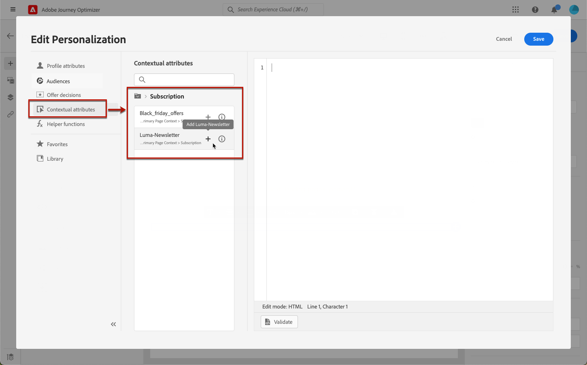

# Definir o conteúdo específico da página de aterrissagem {#lp-content}

Para definir um conteúdo específico que permitirá que os usuários selecionem e enviem suas opções a partir da página de aterrissagem, use o **[!UICONTROL Formulário]** componente. Para isso, siga as etapas abaixo.

>[!NOTE]
>
>Você também pode criar uma página de aterrissagem de cliques sem uma **[!UICONTROL Formulário]** componente. Nesse caso, a landing page será exibida para os usuários, mas eles não precisarão enviar nenhum formulário. Isso pode ser útil se você quiser apenas mostrar uma landing page sem exigir qualquer ação dos recipients, como aceitar ou rejeitar, ou se desejar fornecer informações que não exigem entrada do usuário.

## Usar o componente de formulário {#use-form-component}

1. Arraste e solte a página de aterrissagem específica **[!UICONTROL Formulário]** componente da paleta esquerda para o espaço de trabalho principal.

   

   >[!NOTE]
   >
   >O **[!UICONTROL Formulário]** só pode ser usado uma vez na mesma página.

1. Selecione-o. O **[!UICONTROL Conteúdo do formulário]** é exibida na paleta direita para permitir a edição dos diferentes campos do formulário.

   

   >[!NOTE]
   >
   >Alterne para **[!UICONTROL Estilo do formulário]** a qualquer momento para editar os estilos do conteúdo do componente de formulário. [Saiba mais](#define-lp-styles)

1. No **[!UICONTROL Caixa de seleção 1]** , você pode editar o rótulo correspondente a essa caixa de seleção.

1. Defina se essa caixa de seleção deve ser de opt in ou out de usuários: eles concordam em receber comunicações ou pedem para não mais ser contatados?

   

   Selecione entre as três opções abaixo:

   * **[!UICONTROL Aceitar se estiver marcado]**: os usuários precisam marcar a caixa para consentir (aceitar).
   * **[!UICONTROL Rejeitar se marcado]**: os usuários precisam marcar a caixa para remover seu consentimento (opt out).
   * **[!UICONTROL Aceitar se marcado, recusar se desmarcado]**: essa opção permite inserir uma única caixa de seleção para participação/não participação. Os usuários precisam marcar a caixa para consentir (aceitar) e desmarcá-la para remover seu consentimento (recusar).

1. Escolha o que será atualizado entre as três opções a seguir:

   

   * **[!UICONTROL Lista de assinaturas]**: Você deve selecionar a lista de subscrição que será atualizada se o perfil marcar essa caixa de seleção. Saiba mais sobre [listas de assinaturas](subscription-list.md).

      

   * **[!UICONTROL Canal (email)]**: A aceitação ou recusa se aplica a todo o canal. Por exemplo, se um perfil que recusa tiver dois endereços de email, ambos os endereços serão excluídos de todas as suas comunicações.

   * **[!UICONTROL Identidade de email]**: A aceitação ou recusa se aplica somente ao endereço de email usado para acessar a landing page. Por exemplo, se um perfil tiver dois endereços de email, somente aquele usado para aceitar receberá comunicações da sua marca.

1. Clique em **[!UICONTROL Adicionar campo]** > **[!UICONTROL Caixa de seleção]** para adicionar outra caixa de seleção. Repita as etapas acima para definir suas propriedades.

   

1. Depois de adicionar todas as caixas de seleção desejadas, clique em **[!UICONTROL Chamada à ação]** para expandir a seção correspondente. Ela permite definir o comportamento do botão na variável **[!UICONTROL Formulário]** componente.

   

1. Defina o que acontecerá ao clicar no botão :

   * **[!UICONTROL Redirecionar URL]**: Insira o URL da página para a qual os usuários serão redirecionados.
   * **[!UICONTROL Texto de confirmação]**: Digite o texto de confirmação que será exibido.
   * **[!UICONTROL Vincular a uma subpágina]**: Configure um [subpágina](create-lp.md#configure-subpages) e selecione-o na lista suspensa que é exibida.

   

1. Defina o que acontecerá ao clicar no botão em caso de erro:

   * **[!UICONTROL Redirecionar URL]**: Insira o URL da página para a qual os usuários serão redirecionados.
   * **[!UICONTROL Texto de erro]**: Digite o texto do erro que será exibido. Você pode visualizar o texto de erro ao definir a variável [estilos de formulário](#define-lp-styles).

   * **[!UICONTROL Vincular a uma subpágina]**: Configure um [subpágina](create-lp.md#configure-subpages) e selecione-o na lista suspensa que é exibida.

   

1. Se desejar fazer atualizações adicionais ao enviar o formulário, selecione **[!UICONTROL Aceitar]** ou **[!UICONTROL Recusar]** e defina se deseja atualizar uma lista de subscrição, o canal ou apenas o endereço de email usado.

   

1. Salve o conteúdo e clique na seta ao lado do nome da página para retornar ao [propriedades da página de aterrissagem](create-lp.md#configure-primary-page).

   

## Definir estilos de formulário de landing page {#lp-form-styles}

1. Para modificar os estilos do conteúdo do componente de formulário, alterne a qualquer momento para a função **[!UICONTROL Estilo do formulário]** guia .

   

1. Expanda o **[!UICONTROL Caixas de seleção]** para definir a aparência das caixas de seleção e do texto correspondente. Por exemplo, você pode ajustar a família ou o tamanho da fonte e a cor da borda da caixa de seleção.

   

1. Expanda o **[!UICONTROL Botões]** para modificar a aparência do botão no formulário componente. Por exemplo, você pode adicionar uma borda, editar a cor do rótulo ao passar o mouse ou ajustar o alinhamento do botão.

   

   Você pode visualizar algumas de suas configurações, como a cor do rótulo do botão ao passar o mouse **[!UICONTROL Visualizar]** botão. Saiba mais sobre como testar landing pages [here](create-lp.md#test-landing-page).

   

1. Expanda o **[!UICONTROL Layout do formulário]** seção para editar as configurações de layout, como cor do plano de fundo, preenchimento ou margem.

   

1. Expanda o **[!UICONTROL Erro de formulário]** para ajustar a exibição da mensagem de erro que é exibida caso ocorra um problema. Marque a opção correspondente para visualizar o texto do erro no formulário.

   

## Usar contexto da página primária {#use-primary-page-context}

Você pode usar dados contextuais provenientes de outra página dentro da mesma landing page.

Por exemplo, se você vincular uma caixa de seleção<!-- or the submission of the page--> para [lista de assinaturas](subscription-list.md) na página de aterrissagem primária, você pode usar essa lista de subscrição na subpágina &quot;thank you&quot;.

Digamos que você vincule duas caixas de seleção na página principal a duas listas de assinatura diferentes. Se um usuário assinar um desses itens, você deseja exibir uma mensagem específica ao enviar o formulário, dependendo da caixa de seleção selecionada.

Para isso, siga as etapas abaixo:

1. Na página principal, vincule cada caixa de seleção à lista de subscrição relevante. [Saiba mais](#use-form-component).

   

1. Na subpágina, coloque o ponteiro do mouse onde deseja inserir o texto e selecione **[!UICONTROL Adicionar personalização]** na barra de ferramentas contextual.

   

1. No **[!UICONTROL Editar personalização]** janela , selecione **[!UICONTROL Atributos contextuais]** > **[!UICONTROL Páginas de aterrissagem]** > **[!UICONTROL Contexto da página primária]** > **[!UICONTROL Assinatura]**.

1. Todas as listas de assinaturas selecionadas na página principal são listadas. Selecione os itens relevantes usando o ícone + .

   

1. Adicione as condições relevantes usando as funções auxiliares do Editor de expressão. [Saiba mais](../personalization/functions/functions.md)

   

   >[!CAUTION]
   >
   >Se houver um caractere especial, como um hífen na expressão, você deverá escapar do texto incluindo o hífen.

1. Salve as alterações.

Agora, quando os usuários selecionam uma das caixas de seleção, a mensagem correspondente à caixa de seleção selecionada é exibida ao enviar o formulário.

>[!NOTE]
>
>Se um usuário marcar as duas caixas de seleção, ambos os textos serão exibidos.

## Usar dados adicionais da página de aterrissagem {#use-additional-data}

When [configuração da página primária](create-lp.md#configure-primary-page), é possível criar dados adicionais para permitir o armazenamento de informações quando a landing page estiver sendo enviada.

>[!NOTE]
>
>Esses dados podem não estar visíveis para os usuários que visitam a página.

Se você definiu uma ou mais chaves com seus valores correspondentes ao [configuração da página primária](create-lp.md#configure-primary-page), você pode aproveitar essas chaves no conteúdo da página primária e das subpáginas usando o [Editor de expressão](../personalization/personalization-build-expressions.md).

<!--When you reuse the same text on a page, this enables you to dynamically change that text if needed, without going through each occurrence.

For example, if you define the company name as a key, you can quickly update it everywhere (on all the pages of a given landing page) by changing it only once in the [primary page settings](create-lp.md#configure-primary-page).-->

Para aproveitar essas chaves em uma página de aterrissagem, siga as etapas abaixo:

1. Ao configurar a página primária, defina uma chave e seu valor correspondente no **[!UICONTROL Dados adicionais]** seção. [Saiba mais](create-lp.md#configure-primary-page)

   

1. Ao editar a página principal com o designer, coloque o ponteiro do mouse onde deseja inserir a chave e selecione **[!UICONTROL Adicionar personalização]** na barra de ferramentas contextual.

   

1. No **[!UICONTROL Editar personalização]** janela , selecione **[!UICONTROL Atributos contextuais]** > **[!UICONTROL Páginas de aterrissagem]** > **[!UICONTROL Contexto adicional]**.

   

1. Todas as chaves que você criou ao configurar a página primária são listadas. Selecione a chave de sua escolha usando o ícone + .

   

1. Salve as alterações e repita as etapas acima quantas vezes forem necessárias.

   

   Você pode ver que o item de personalização correspondente à sua chave agora é exibido em todos os locais que você inseriu.
