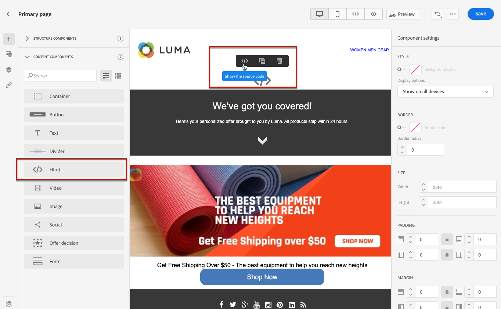

# Usar o JavaScript personalizado em uma página de aterrissagem {#lp-custom-js}

Você pode definir o conteúdo da sua página de aterrissagem usando JavaScript personalizado. Por exemplo, se você precisar executar estilos avançados ou se quiser adicionar comportamentos personalizados às páginas de aterrissagem, poderá criar seus próprios controles e executá-los em [!DNL Journey Optimizer].

## Inserir o código JavaScript em uma página de aterrissagem

Para inserir JavaScript personalizado no conteúdo da página de aterrissagem, você pode fazer o seguinte:

* Importe o conteúdo HTML existente ao começar a criar o conteúdo e selecione o arquivo que inclui o código JavaScript personalizado. Saiba como importar conteúdo [nesta seção](../design/existing-content.md).

* Projete a landing page do zero ou de um template salvo. Arraste e solte a **[!UICONTROL HTML]** componente de conteúdo na tela e mostra o código-fonte para adicionar seu JavaScript ao componente. Saiba como usar o componente HTML em [esta seção](../design/content-components.md#HTML). <!--You can also simply switch the whole landing page content to code view and enter or paste your JavaScript code.-->

   

* Insira ou cole o código JavaScript diretamente no designer de conteúdo. Saiba como codificar seu próprio conteúdo [nesta seção](../design/code-content.md).

>[!NOTE]
>
>Atualmente, não é possível exibir o JavaScript em ação quando [visualização da landing page](create-lp.md#test-landing-page).

Para que a landing page seja exibida corretamente, use a sintaxe a seguir, conforme descrito nas seções abaixo.

## Inicialização do código

Para inicializar seu código JavaScript, você deve usar o `lpRuntimeReady` evento. Esse evento será acionado após a inicialização bem-sucedida da biblioteca . O retorno de chamada será executado com a variável `lpRuntime` objeto para expor o método e os ganchos da biblioteca.

`LpRuntime` significa &quot;Landing page Runtime&quot;. Esse objeto é o identificador da biblioteca principal. Ele exporá ganchos, métodos de envio de formulário e outros métodos de utilitário que podem ser usados no JavaScript personalizado.

**Exemplo:**

```
if(window.lpRuntime){
    init(window.lpRuntime);
}else{
    window.addEventListener('lpRuntimeReady',function(e){
        init(e.detail);
    });
}
 
function init(lpRuntime){
    // Enter custom JavaScript here using methods from lpRuntime.
}
```

## Ganchos 

Usando ganchos, você pode anexar um método durante o ciclo de vida do envio do formulário. Por exemplo, é possível usar ganchos para executar a validação do formulário antes que ele seja realmente enviado.

Estes são os ganchos que você pode usar:

| Nome | Descrição |
|--- |--- |
| addBeforeSubmitHook | Gancho personalizado a ser chamado antes do envio do formulário. Retorna true para continuar o envio; caso contrário, retorna false para bloquear o envio. |
| addOnFailureHook | O gancho personalizado a ser chamado no envio do formulário com falha. |
| addOnSuccessHook | Gancho personalizado a ser chamado no envio bem-sucedido do formulário. |

**Exemplo:**

```
//LpRuntime hooks
lpRuntime.hooks.addBeforeSubmitHook(function(){
    // Add your validation logic here.
});
```

## Envio de formulário personalizado

Os métodos listados abaixo são usados para executar envios de formulários personalizados.

>[!NOTE]
>
>Como o envio do formulário é feito por JavaScript personalizado, o envio padrão precisa ser desativado explicitamente, definindo uma variável global `disableDefaultFormSubmission` para `true`.

| Nome | Descrição |
|--- |--- |
| submitForm | Esse método enviará o formulário e manipulará o fluxo de envio posterior. |
| submitFormPartial | Esse método também enviará o formulário, mas ignorará o fluxo de envio da publicação. Por exemplo, se você tiver configurado o redirecionamento para a página de sucesso após o envio bem-sucedido, esse redirecionamento não ocorrerá no caso de envio de formulário parcial. |

**Exemplos:**

```
//LpRuntime methods
window.disableDefaultFormSubmission = true        // Flag to disable the default submission flow.
 
lpRuntime.submitForm(formSubmissionData);         // This will trigger the default form submission handling like redirecting to error or success page.
  
lpRuntime.submitFormPartial(formSubmissionData,{   // This will not trigger the default submission handling.
    beforeSubmit : callback,
    onFailure : failureCallback,                   // Custom onFailureCallback - will be used in partial submission of form.
    onSuccess : successCallback                    // Custom onSuccessCallback - will be used in partial submission of form.
})
```

## Função do utilitário

| Nome | Descrição |
|--- |--- |
| getFormData | Esse método pode ser usado para obter a variável `formData` na forma de um objeto JSON. Esse objeto pode ser passado para `submitForm` para envio de formulário. |

**Exemplo:**

```
let formData = lpRuntime.getFormData();                           // Method to generate formdata
 
lpRuntime.submitForm(formData);
```

## Casos de uso

### Caso de uso 1: Adicionar validação antes do envio do formulário

```
<html>
<body>
// Enter HTML body here.
  
<script>
        if(window.lpRuntime){
          console.log('got runtime',lpRuntime);
          init(window.lpRuntime);
        }else{
          window.addEventListener('lpRuntimeReady',function(e){
            init(window.lpRuntime);
          });
        }
        
  
      // Here validate the function is checking if the checkbox is selected. This method should return true if you want form submission.
      function validateForm(){
        return document.querySelector('.spectrum-Checkbox-input').checked;
      }    
  
      function init(lpRuntime){
          lpRuntime.hooks.addBeforeSubmitHook(function(){
              return validateForm(); // This method should return true if you want to proceed with submission.
          })
      }
  
</script>  
  
</body>
</html>
```

### Caso de uso 2: Envio parcial de formulário

Por exemplo, você tem um formulário com várias caixas de seleção na página. Ao marcar qualquer caixa de seleção, você deseja que esses dados sejam salvos no backend sem esperar que o usuário clique no botão Enviar .

```
<html>
<body>
    <form>
        <input type='checkbox' value="1" name="name1"/>
        <input type='checkbox' value="2" name="name2"/>
        <input type='checkbox' value="3" name="name3"/>
        <input type='checkbox' value="4" name="name4"/>
    </form>
  
<script>
      window.disableDefaultFormSubmission=true;
 
      window.addEventListener('lpRuntimeReady',function(e){        
        init(e.detail)
      }
 
     function init(lpRuntime){
        window.getElementByTagName('input').addEventListener('change',function(e){
            let formData = lpRuntime.getFormData();
            lpRuntime.submitFormPartial(formData);
        })
      }
    </script>
  
</body>
</html>
```

### Caso de uso 3: Tags de análise personalizadas

Usando o JavaScript, você pode adicionar ouvintes de campos de entrada e anexar um acionador de chamada de análise personalizado.

```
<html>
<body>
    <form>
        <input type='checkbox' value="1" name="name1"/>
        <input type='checkbox' value="2" name="name2"/>
        <input type='checkbox' value="3" name="name3"/>
        <input type='checkbox' value="4" name="name4"/>
    </form>
  
<script>
      window.disableDefaultFormSubmission=false;  
 
      window.addEventListener('lpRuntimeReady',function(e){        
        init(e.detail)
      }
 
     function init(lpRuntime){
         window.getElementByTagName('input').addEventListener('change',function(e){
            //trigger analytics events
        })
      }
        
    </script>
  
</body>
</html>
```

### Caso de uso 4: Formulário dinâmico

```
<html>
<body>
    <form>
        <input type='checkbox' value="1" name="name1"/>
        <div class="hiddenInput hidden">
            <input type='text' name="name2"/>
        </div>
    </form>
  
<script>
      window.disableDefaultFormSubmission=false;     
 
      window.addEventListener('lpRuntimeReady',function(e){        
        init(e.detail)
      }
 
      function init(lpRuntime){
        window.getElementByTagName('input').addEventListener('change',function(e){
            document.querySelector('.hiddenInput').toggleClass('hidden');
        })
      }
        
    </script>
  
</body>
</html>
```
