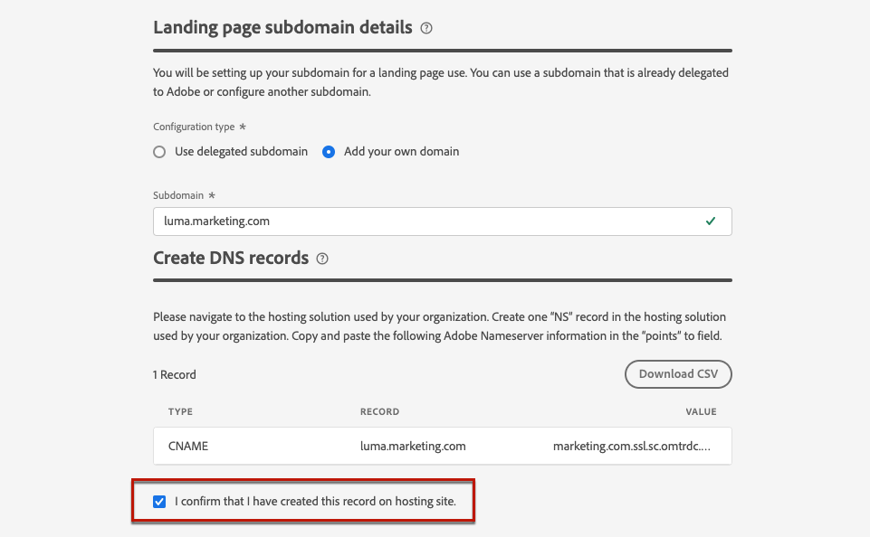

# Configurar subdomínios de página de destino {#lp-subdomains}

>[!CONTEXTUALHELP]
>id="ajo_admin_subdomain_lp_header"
>title="Delegar um subdomínio de página de destino"
>abstract="Você vai configurar o subdomínio que será usado pela página de destino. Você pode usar um subdomínio que já tenha sido delegado à Adobe ou configurar outro subdomínio."

>[!CONTEXTUALHELP]
>id="ajo_admin_subdomain_lp"
>title="Delegar um subdomínio de página de destino"
>abstract="Você deve configurar um subdomínio para usar nas páginas de destino, pois ele é necessário para criar uma predefinição de página de destino. Você pode usar um subdomínio já delegado à Adobe ou configurar um novo subdomínio."
>additional-url="https://experienceleague.adobe.com/docs/journey-optimizer/using/landing-pages/lp-configuration/lp-presets.html?lang=pt-BR#lp-create-preset" text="Criar predefinições de página de destino"

>[!CONTEXTUALHELP]
>id="ajo_admin_config_lp_subdomain"
>title="Criar uma predefinição de página de destino"
>abstract="Para criar uma predefinição de página de destino, verifique se você configurou anteriormente pelo menos um subdomínio de página de destino para escolher na lista Nome de subdomínio ."
>additional-url="https://experienceleague.adobe.com/docs/journey-optimizer/using/landing-pages/lp-configuration/lp-presets.html?lang=pt-BR#lp-create-preset" text="Criar predefinições de página de destino"

Para [criar predefinições de página de aterrissagem](lp-presets.md), é necessário configurar os subdomínios que serão usados nas páginas de aterrissagem.

Você pode usar um subdomínio que já foi delegado ao Adobe ou configurar outro subdomínio. Saiba mais sobre como delegar subdomínios ao Adobe em [esta seção](../configuration/delegate-subdomain.md).

>[!CAUTION]
>
>A configuração de subdomínio da página de aterrissagem é comum a todos os ambientes. Portanto:
>
>* Para acessar e editar subdomínios de páginas de aterrissagem, você deve ter a permissão **[!UICONTROL Gerenciar subdomínios de páginas de aterrissagem]** na sandbox de produção.
>
> * Qualquer modificação em um subdomínio de página de aterrissagem também afetará as sandboxes de produção.

## Usar um subdomínio existente {#lp-use-existing-subdomain}

Para usar um subdomínio que já está delegado ao Adobe, siga as etapas abaixo.

1. Acesse o menu **[!UICONTROL Administração]** > **[!UICONTROL Canais]** e selecione **[!UICONTROL Configurações da página de aterrissagem]** > **[!UICONTROL Subdomínios da página de aterrissagem]**.

1. Clique em **[!UICONTROL Configurar subdomínio]**.

   

1. Selecione **[!UICONTROL Usar domínio delegado]** na seção **[!UICONTROL Tipo de configuração]**.

   

1. Insira o prefixo que será exibido no URL da sua página de aterrissagem.

   >[!NOTE]
   >
   >Somente caracteres alfanuméricos e hifens são permitidos.

1. Selecione um subdomínio delegado na lista.

   >[!NOTE]
   >
   >Não é possível selecionar um subdomínio que já esteja sendo usado como subdomínio da página de aterrissagem.

   <!--Capital letters are not allowed in subdomains. TBC by PM-->

   

   Observe que não é possível usar vários subdomínios delegados do mesmo domínio principal. Por exemplo, se &quot;marketing1.yourcompany.com&quot; já estiver delegado ao Adobe nas páginas de aterrissagem, não será possível usar &quot;marketing2.yourcompany.com&quot;. No entanto, como os subdomínios de vários níveis são compatíveis com páginas de aterrissagem, você pode continuar usando um subdomínio de &quot;marketing1.yourcompany.com&quot; (como &quot;email.marketing1.yourcompany.com&quot;) ou um domínio principal diferente.

   >[!CAUTION]
   >
   >Se você selecionar um domínio que foi delegado ao Adobe usando o [método CNAME](../configuration/delegate-subdomain.md#cname-subdomain-delegation), deverá criar o registro DNS na sua plataforma de hospedagem. Para gerar o registro DNS, o processo é o mesmo de quando você configura um novo subdomínio de página de destino. Saiba mais em [esta seção](#lp-configure-new-subdomain).

1. Clique em **[!UICONTROL Enviar]**.

1. Depois de enviado, o subdomínio é exibido na lista com o status **[!UICONTROL Processando]**. Para obter mais informações sobre os status dos subdomínios, consulte [esta seção](../configuration/about-subdomain-delegation.md#access-delegated-subdomains).<!--Same statuses?-->

   

   >[!NOTE]
   >
   >Antes de poder usar esse subdomínio para enviar mensagens, você deve aguardar até que o Adobe execute as verificações necessárias, o que pode levar até 4 horas.<!--Learn more in [this section](delegate-subdomain.md#subdomain-validation).-->

1. Depois que as verificações forem bem-sucedidas, o subdomínio obterá o status **[!UICONTROL Success]**. Ele está pronto para ser usado para criar predefinições de página de destino.

## Configurar um novo subdomínio {#lp-configure-new-subdomain}

>[!CONTEXTUALHELP]
>id="ajo_admin_lp_subdomain_dns"
>title="Gerar o registro DNS correspondente"
>abstract="Para configurar um novo subdomínio de página de destino, você precisa copiar as informações do servidor de nomes da Adobe exibidas na interface do Journey Optimizer e colá-las em sua solução de hospedagem de domínio para gerar o registro DNS correspondente. Depois que as verificações forem bem-sucedidas, o subdomínio estará pronto para ser usado para criar predefinições de página de destino."

Para configurar um novo subdomínio, siga as etapas abaixo.

1. Acesse o menu **[!UICONTROL Administração]** > **[!UICONTROL Canais]** e selecione **[!UICONTROL Configurações da página de aterrissagem]** > **[!UICONTROL Subdomínios da página de aterrissagem]**.

1. Clique em **[!UICONTROL Configurar subdomínio]**.

1. Selecione **[!UICONTROL Adicionar seu próprio domínio]** na seção **[!UICONTROL Tipo de configuração]**.

   

1. Especifique o subdomínio que será delegado.

   >[!CAUTION]
   >
   >Não é possível usar um subdomínio de página de aterrissagem existente.
   >
   >Letras maiúsculas não são permitidas em subdomínios.

   Não é permitido delegar um subdomínio inválido a Adobe. Insira um subdomínio válido de propriedade de sua organização, como marketing.yourcompany.com.

   >[!NOTE]
   >
   >Para páginas de aterrissagem, os subdomínios de vários níveis são compatíveis. Por exemplo, você pode usar &quot;email.marketing.yourcompany.com&quot;.

1. O registro a ser colocado em seus servidores DNS é exibido. Copie esse registro ou baixe um arquivo CSV e navegue até a solução de hospedagem de domínio para gerar o registro DNS correspondente.

1. Verifique se o registro DNS foi gerado na solução de hospedagem de domínio. Se tudo estiver configurado corretamente, marque a caixa &quot;Eu confirmo...&quot; e clique em **[!UICONTROL Enviar]**.

   

   >[!NOTE]
   >
   >Ao configurar um novo subdomínio de página de destino, ele sempre apontará para um registro CNAME.

1. Depois que a delegação de subdomínio for enviada, o subdomínio será exibido na lista com o status **[!UICONTROL Processando]**. Para obter mais informações sobre os status dos subdomínios, consulte [esta seção](../configuration/about-subdomain-delegation.md#access-delegated-subdomains).<!--Same statuses?-->

   >[!NOTE]
   >
   >Antes de poder usar esse subdomínio para suas páginas de aterrissagem, você deve aguardar até que o Adobe execute as verificações necessárias, o que pode levar até 4 horas.<!--Learn more in [this section](#subdomain-validation).-->

1. Depois que as verificações forem bem-sucedidas, o subdomínio obterá o status **[!UICONTROL Success]**. Ele está pronto para ser usado para criar predefinições de página de destino.

   Observe que o subdomínio será marcado como **[!UICONTROL Falha]** se você não criar o registro de validação na solução de hospedagem.
