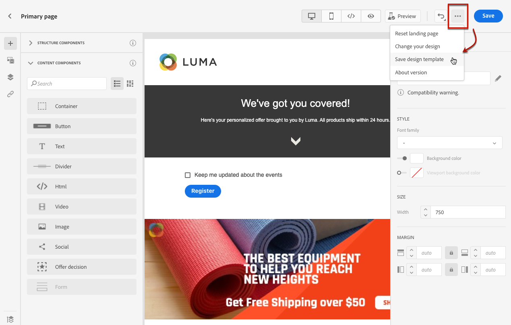

# Trabalhar com templates de landing page {#work-with-templates}

## Salvar uma página como modelo {#save-as-template}

Depois de criar o [conteúdo da página de aterrissagem](lp-content.md), você pode salvá-lo para futura reutilização. Para fazer isso, siga as etapas abaixo.

1. Clique nas reticências no canto superior direito da tela.

1. Selecionar **[!UICONTROL Salvar modelo de design]** no menu suspenso.

   

1. Adicione um nome para este modelo.

   

1. Clique em **[!UICONTROL Salvar]**.

Na próxima vez que você criar uma landing page, poderá usar esse template para criar o conteúdo. Saiba como na [seção](#use-saved-template) abaixo.

## Usar um modelo salvo {#use-saved-template}

1. Abra o [designer de conteúdo de página de aterrissagem](design-lp.md). A lista de todos os modelos salvos anteriormente é exibida.

1. Você pode classificá-las **[!UICONTROL Por nome]**, **[!UICONTROL Última modificação]** e **[!UICONTROL Última criação]**.

   

1. Selecione o template de sua escolha na lista.

1. Depois de selecionado, você pode navegar entre todos os modelos salvos usando as setas para a direita e para a esquerda.

   

1. Clique em **[!UICONTROL Usar esta landing page]**.

1. Edite seu conteúdo conforme desejado usando o designer de página de aterrissagem.

>[!NOTE]
>
>Os modelos de página primária e de subpágina são gerenciados separadamente, o que significa que não é possível usar um modelo de página primária para criar uma subpágina, e vice-versa.
