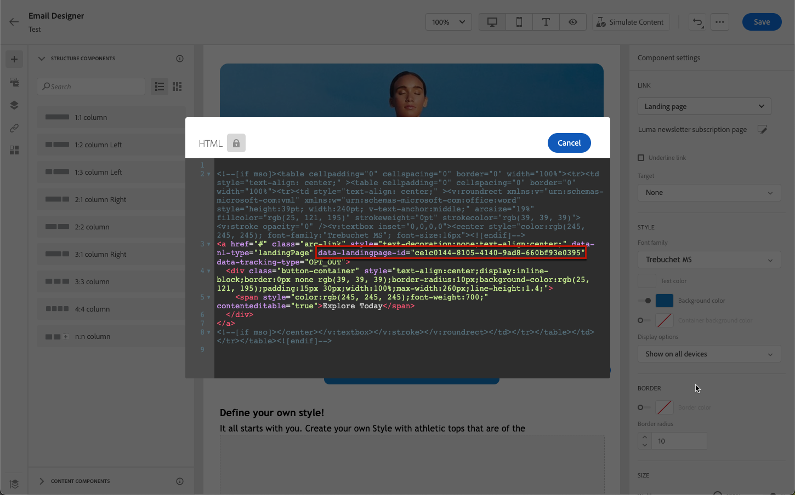

# Casos de uso da página de aterrissagem {#lp-use-cases}

Abaixo estão alguns exemplos de como você pode usar [!DNL Journey Optimizer] páginas de aterrissagem para que seus clientes optem por receber algumas ou todas as suas comunicações.

## Assinatura de um serviço {#subscription-to-a-service}

Um dos casos de uso mais comuns consiste em convidar seus clientes para [assinar um serviço](subscription-list.md) (como um boletim informativo ou um evento) por meio de uma página de aterrissagem. As principais etapas são apresentadas no gráfico abaixo:

Por exemplo, digamos que você organize um evento no próximo mês e deseje iniciar uma campanha de registro de evento<!--to keep your customers that are interested updated on that event-->. Para fazer isso, você enviará um email incluindo um link para uma landing page que permitirá que seus recipients se registrem neste evento. Os usuários que se registrarem serão adicionados à lista de assinaturas criada para essa finalidade.

### Configurar uma landing page {#set-up-lp}

1. Crie a lista de subscrição do registro de eventos, que armazenará os usuários registrados. Saiba como criar uma lista de assinaturas [here](subscription-list.md#define-subscription-list).

   

1. [Criar uma landing page](create-lp.md) para permitir que seus recipients se registrem no seu evento.

   

1. Configurar o registro [página de aterrissagem primária](create-lp.md#configure-primary-page).

1. Ao projetar o [conteúdo da página de aterrissagem](design-lp.md), selecione a lista de assinaturas criada para atualizá-la com os perfis que marcam a caixa de seleção de registro.

   

1. Crie uma página de &#39;agradecimento&#39; que será exibida aos recipients depois de enviarem o formulário de registro. Saiba como configurar landing subpages [here](create-lp.md#configure-subpages).

   

1. [Publicar](create-lp.md#publish) a landing page.

1. Em um [jornada](../building-journeys/journey.md), adicione um **Email** atividade para direcionar o tráfego para a landing page de registro.

   

1. [Criar o email](../messages/get-started-content.md) para anunciar que o registro agora está aberto para o seu evento.

1. [Inserir um link](../design/message-tracking.md#insert-links) no conteúdo da mensagem. Selecionar **[!UICONTROL Página de aterrissagem]** como **[!UICONTROL Tipo de link]** e escolha a [página de aterrissagem](create-lp.md#configure-primary-page) que você criou para registro.

   

   >[!NOTE]
   >
   >Para enviar a mensagem, verifique se a landing page selecionada ainda não expirou. Saiba como atualizar o prazo de validade [nesta seção](create-lp.md#configure-primary-page).

   Depois que receberem o email, se seus recipients clicarem no link para a landing page, eles serão direcionados para a página &quot;obrigado&quot; e serão adicionados à lista de assinaturas.

### Enviar um email de confirmação {#send-confirmation-email}

Além disso, você pode enviar um email de confirmação para os recipients que se registraram para o seu evento. Para isso, siga as etapas abaixo.

1. Criar outro [jornada](../building-journeys/journey.md). Você pode fazer isso diretamente da landing page clicando no link **[!UICONTROL Criar jornada]** botão. Saiba mais [aqui](create-lp.md#configure-primary-page)

   

1. Expanda a **[!UICONTROL Eventos]** categoria e solte uma **[!UICONTROL Qualificação do segmento]** atividade na tela. Saiba mais [aqui](../building-journeys/segment-qualification-events.md)

1. Clique no botão **[!UICONTROL Segmento]** e selecione a lista de subscrição criada.

   

1. Adicione um email de confirmação de sua escolha e envie-o por meio da jornada.

   

Todos os usuários que se registraram para o seu evento receberão o email de confirmação.

<!--The event registration's subscription list tracks the profiles who registered and you can send them targeted event updates.-->

## Recusar {#opt-out}

Para permitir que seus recipients cancelem a assinatura de suas comunicações, você pode incluir um link para uma landing page de opt out em seus emails.

Saiba mais sobre como gerenciar o consentimento dos recipients e por que isso é importante em [esta seção](../privacy/opt-out.md).

### Gerenciamento de recusa {#opt-out-management}

Oferecer aos recipients a capacidade de cancelar a inscrição para receber comunicações de uma marca é um requisito legal. Saiba mais sobre a legislação aplicável na [documentação da Experience Platform](https://experienceleague.adobe.com/docs/experience-platform/privacy/regulations/overview.html?lang=pt-BR#regulations){target=&quot;_blank&quot;}.

Portanto, você sempre deve incluir um **link para cancelar a inscrição** em cada email enviado aos recipients:

* Ao clicar nesse link, os recipients serão direcionados a uma página de aterrissagem que inclui um botão para confirmar a recusa.
* Ao clicar no botão recusar, os dados do perfil serão atualizados com essas informações.

### Configurar recusa {#configure-opt-out}

Para permitir que os recipients de um email cancelem a assinatura de suas comunicações por meio de uma landing page, siga as etapas abaixo.

1. Crie a landing page. [Saiba mais](create-lp.md)

1. Defina a página primária. [Saiba mais](create-lp.md#configure-primary-page)

1. [Design](design-lp.md) o conteúdo principal da página: usar a página de aterrissagem específica **[!UICONTROL Formulário]** , defina um **[!UICONTROL Recusar]** e escolha atualizar **[!UICONTROL Canal (email)]**: o perfil que marcar a caixa de opção de não participação na página de aterrissagem será rejeitado em todas as suas comunicações.

   

   <!--You can also build your own landing page and host it on the third-party system of your choice.-->

1. Adicionar uma confirmação [subpágina](create-lp.md#configure-subpages) que será exibido para os usuários que enviam o formulário.

   

   >[!NOTE]
   >
   >Certifique-se de fazer referência à subpágina no **[!UICONTROL Chamada à ação]** da seção **[!UICONTROL Formulário]** componente. [Saiba mais](design-lp.md)

1. Após configurar e definir o conteúdo de suas páginas, [publicar](create-lp.md#publish) a landing page.

   

1. [Criar uma mensagem de email](../messages/get-started-content.md) em uma jornada.

1. Selecione o texto no seu conteúdo e [insira um link](../design/message-tracking.md#insert-links) usando a barra de ferramentas contextual. Você também pode usar um link em um botão.

   

1. Selecionar **[!UICONTROL Página de aterrissagem]** do **[!UICONTROL Tipo de link]** e selecione a [página de aterrissagem](create-lp.md#configure-primary-page) que você criou para rejeitar.

   

   >[!NOTE]
   >
   >Para enviar a mensagem, verifique se a landing page selecionada ainda não expirou. Saiba como atualizar o prazo de validade [nesta seção](create-lp.md#configure-primary-page).

1. Publique e execute a jornada. [Saiba mais](../building-journeys/journey.md).

1. Depois que a mensagem é recebida, se um recipient clicar no link de cancelamento de subscrição no email, sua landing page será exibida.

   

   Se o recipient marcar a caixa e enviar o formulário:

   * O recipient que recusou a inscrição é redirecionado para a tela de mensagem de confirmação.

   * Os dados do perfil são atualizados e não receberão comunicações da sua marca, a menos que sejam subscritos novamente.

Para verificar se a escolha do perfil correspondente foi atualizada, acesse a Experience Platform e o perfil selecionando um namespace de identidade e um valor de identidade correspondente. Saiba mais na [documentação da Adobe Experience Platform](https://experienceleague.adobe.com/docs/experience-platform/profile/ui/user-guide.html?lang=pt-BR#getting-started){target=&quot;_blank&quot;}.

No **[!UICONTROL Atributos]** , você pode ver que o valor de **[!UICONTROL choice]** mudou para **[!UICONTROL não]**.

<!--

### Other ways to opt out

You can also enable your recipients to unsubscribe whithout using landing pages.

* **One-click opt-out**

    You can add a one-click opt-out link into your email content. This will enable your recipients to quickly unsubscribe from your communications, without being redirected to a landing page where they need to confirm opting out. [Learn more](../privacy/opt-out.md#one-click-opt-out-link)

* **Unsubscribe link in header**

    If the recipients' email client supports displaying an unsubscribe link in the email header, emails sent with [!DNL Journey Optimizer] automatically include this link. [Learn more](../privacy/opt-out.md#unsubscribe-header)

////////

## Leverage landing page submission event {#leverage-lp-event}

You can use information that was submitted on a landing page to send communications to your customers. For example, if a user subscribes to a given subscription list, you can leverage that information to send an email recommending other subscription lists to that user.

To do this, you need to create an event containing the landing page submission information and use it in a journey. Follow the steps below.

1. Go to **[!UICONTROL Administration]** > **[!UICONTROL Configurations]**, and in the **[!UICONTROL Events]** section, select **[!UICONTROL Manage]**.

    

1. The list of events displays. Select **[!UICONTROL Create Event]**.

    

1. The event configuration pane opens on the right side of the screen. Configure a rule-based unitary event. [Learn more](../event/about-creating.md)

1. Define the schema: select **[!UICONTROL AJO Email Tracking Experience Event Schema v.1]** (available by default in [!DNL Journey Optimizer]).

    

1. In the **[!UICONTROL Fields]** section, select the following elements:

    * **[!UICONTROL _experience]** > **[!UICONTROL customerJourneyManagement]** > **[!UICONTROL messageInteraction]** > **[!UICONTROL Interaction Type]**
    
    * **[!UICONTROL _experience]** > **[!UICONTROL customerJourneyManagement]** > **[!UICONTROL messageInteraction]** > **[!UICONTROL Landing Page Details]** > **[!UICONTROL Landing Page ID]**

    

1. Click inside the **[!UICONTROL Event ID condition]** field. Using the simple expression editor, define the condition for the **[!UICONTROL Interaction Type]** and **[!UICONTROL Landing Page ID]** fields. This will be used by the system to identify the events that will trigger your journey.

    

    >[!NOTE]
    >
    >To find the landing page ID, you can insert the landing page as a link into an email and select the source code from the contextual toolbar to display the landing page information.
    >
    >

1. Save your changes.

1. Create a [journey](../building-journeys/journey.md). You can do it directly from the landing page by clicking the **[!UICONTROL Create journey]** button. Learn more [here](create-lp.md#configure-primary-page)

    

1. In the journey, unfold the **[!UICONTROL Events]** category and drop the event that you created into the canvas. Learn more [here](../building-journeys/segment-qualification-events.md)

    

1. Unfold the **[!UICONTROL Actions]** category and drop an email action into the canvas.

    

///How do you use the information from the event to send an email to the users? -->
