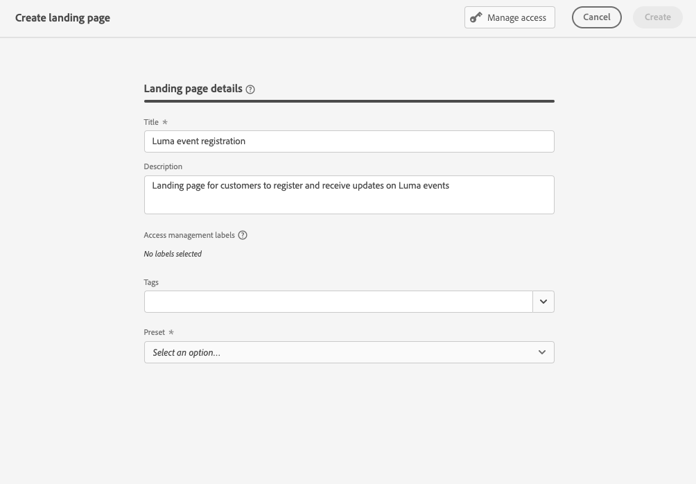
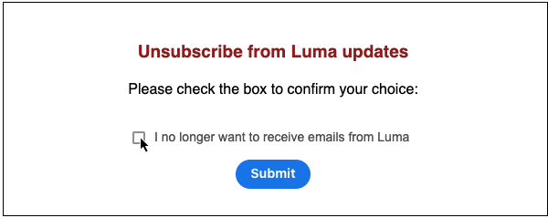

# Casos de uso da landing page {#lp-use-cases}

Abaixo estão alguns exemplos de como você pode usar as páginas de aterrissagem do [!DNL Journey Optimizer] para que seus clientes optem por receber algumas ou todas as suas comunicações.

## Assinar um serviço {#subscription-to-a-service}

Um dos casos de uso mais comuns consiste em convidar seus clientes a [assinar um serviço](subscription-list.md) (como um boletim informativo ou um evento) por meio de uma página de aterrissagem. As principais etapas são apresentadas no gráfico abaixo:

Por exemplo, digamos que você organize um evento no próximo mês e deseje iniciar uma campanha de registro de evento<!--to keep your customers that are interested updated on that event-->. Para fazer isso, você enviará um email incluindo um link para uma página de aterrissagem que permitirá que seus destinatários se registrem neste evento. Os usuários que se registrarem serão adicionados à lista de assinaturas criada para essa finalidade.

### Configurar uma landing page {#set-up-lp}

1. Crie a lista de assinaturas do registro do evento, que armazenará os usuários registrados. Saiba como criar uma lista de assinaturas [aqui](subscription-list.md#define-subscription-list).

   

1. [Crie uma página de aterrissagem](create-lp.md) para permitir que seus destinatários se registrem no evento.

   

1. Configure a [página de aterrissagem primária](create-lp.md#configure-primary-page) do registro.

1. Ao criar o [conteúdo da página de aterrissagem](design-lp.md), selecione a lista de assinaturas criada para atualizá-la com os perfis que marcam a caixa de seleção de registro.

   

1. Crie uma página de agradecimento que será exibida aos seus destinatários assim que eles enviarem o formulário de registro. Saiba como configurar as subpáginas de aterrissagem [aqui](create-lp.md#configure-subpages).

   

1. [Publish](create-lp.md#publish) a página inicial.

1. Em uma [jornada](../building-journeys/journey.md), adicione uma atividade **Email** para direcionar tráfego para a página de aterrissagem de registro.

   

1. [Crie o email](../email/get-started-email-design.md) para anunciar que as inscrições para o seu evento estão abertas.

1. [Insira um link](../email/message-tracking.md#insert-links) no conteúdo da mensagem. Selecione **[!UICONTROL Página de aterrissagem]** como o **[!UICONTROL Tipo de link]** e escolha a [página de aterrissagem](create-lp.md#configure-primary-page) criada para registro.

   

   >[!NOTE]
   >
   >Para enviar a mensagem, verifique se a landing page selecionada ainda não expirou. Saiba como atualizar a data de expiração [nesta seção](create-lp.md#configure-primary-page).

   Depois que eles receberem o email, se seus destinatários clicarem no link para a página de aterrissagem, serão direcionados para a página de agradecimento e adicionados à lista de assinaturas.

### Enviar um email de confirmação {#send-confirmation-email}

Além disso, você pode enviar um email de confirmação para os recipients que se registraram no evento. Para isso, siga as etapas abaixo.

1. Crie outra [jornada](../building-journeys/journey.md). Você pode fazer isso diretamente na página de aterrissagem clicando no botão **[!UICONTROL Criar jornada]**. [Saiba mais](create-lp.md#configure-primary-page)

   

1. Expanda a categoria **[!UICONTROL Eventos]** e solte uma atividade **[!UICONTROL Qualificação de público-alvo]** na tela. [Saiba mais](../building-journeys/audience-qualification-events.md)

1. Clique no campo **[!UICONTROL Público-alvo]** e selecione a lista de assinaturas criada.

   

1. Adicione um email de confirmação de sua escolha e envie-o por meio da jornada.

   

Todos os usuários que se registraram no evento receberão o email de confirmação.

<!--The event registration's subscription list tracks the profiles who registered and you can send them targeted event updates.-->

## Página de aterrissagem de recusa {#opt-out}

Para permitir que seus destinatários cancelem a inscrição de suas comunicações, você pode incluir um link para uma página de aterrissagem de recusa em seus emails.

>[!NOTE]
>
>Saiba mais sobre como gerenciar o consentimento dos destinatários e por que isso é importante nesta [seção](../privacy/opt-out.md).

### Gerenciamento de recusa {#opt-out-management}

Oferecer aos destinatários a capacidade de cancelar a inscrição de recebimento de comunicações de uma marca é um requisito legal. Saiba mais sobre a legislação aplicável na [documentação da Experience Platform](https://experienceleague.adobe.com/docs/experience-platform/privacy/regulations/overview.html?lang=pt-BR#regulations){target="_blank"}.

Portanto, você sempre deve incluir um **link para cancelar a inscrição** em cada email enviado aos destinatários:

* Ao clicar nesse link, os destinatários serão direcionados a uma página de destino que inclui um botão para confirmar a recusa.
* Ao clicar no botão de recusa, os dados do perfil serão atualizados com essas informações.

### Configurar opção de não participação de email {#configure-opt-out}

Para permitir que os recipients de um email cancelem a inscrição de suas comunicações por meio de uma landing page, siga as etapas abaixo:

1. Crie sua landing page. [Saiba mais](create-lp.md)

1. Defina a página principal. [Saiba mais](create-lp.md#configure-primary-page)

1. [Criar](design-lp.md) o conteúdo da página principal: use o componente **[!UICONTROL Formulário]** específico da página de aterrissagem, defina uma caixa de seleção **[!UICONTROL Recusar]** e opte por atualizar o **[!UICONTROL Canal (email)]**: o perfil que marca a caixa de opção de não participação na página de aterrissagem será recusado em todas as suas comunicações.

   

   <!--You can also build your own landing page and host it on the third-party system of your choice.-->

1. Adicione uma [subpágina](create-lp.md#configure-subpages) de confirmação que será exibida para os usuários que enviarem o formulário.

   

   >[!NOTE]
   >
   >Referencie a subpágina na seção **[!UICONTROL Chamada para ação]** da página principal do componente **[!UICONTROL Formulário]**. [Saiba mais](design-lp.md)

1. Depois de configurar e definir o conteúdo das suas páginas, [publique](create-lp.md#publish) a página de aterrissagem.

1. [Criar uma mensagem de email](../email/get-started-email-design.md) em uma jornada.

1. Selecione o texto no seu conteúdo e [insira um link](../email/message-tracking.md#insert-links) usando a barra de ferramentas contextual. Também é possível usar um link em um botão.

1. Selecione **[!UICONTROL Página de aterrissagem]** na lista suspensa **[!UICONTROL Tipo de link]** e selecione a [página de aterrissagem](create-lp.md#configure-primary-page) criada para opção de não participação.

   

   >[!NOTE]
   >
   >Para enviar a mensagem, verifique se a landing page selecionada ainda não expirou. Saiba como atualizar a data de expiração [nesta seção](create-lp.md#configure-primary-page).

1. Publish e execute a jornada. [Saiba mais](../building-journeys/journey.md).

1. Depois que a mensagem for recebida, se um recipient clicar no link de cancelamento de inscrição no email, a página de aterrissagem será exibida.

   

   Se o recipient marcar a caixa e enviar o formulário:

   * O recipient que recusou a inscrição é redirecionado para a tela de mensagem de confirmação.

   * Os dados do perfil são atualizados e não receberão comunicações de sua marca, a menos que você faça a assinatura novamente.

Para verificar se a escolha do perfil correspondente foi atualizada, acesse a Experience Platform e o perfil selecionando um namespace de identidade e um valor de identidade correspondente. Saiba mais na [documentação do Experience Platform](https://experienceleague.adobe.com/docs/experience-platform/profile/ui/user-guide.html?lang=pt-BR#getting-started){target="_blank"}.

Na guia **[!UICONTROL Atributos]**, você pode ver que o valor de **[!UICONTROL opção]** foi alterado para **[!UICONTROL não]**.

As informações de recusa são armazenadas no **Conjunto de dados de serviço de consentimento**. [Saiba mais sobre conjuntos de dados](../data/get-started-datasets.md)

>[!NOTE]
>
>Se o método de mesclagem para sua política de mesclagem padrão do [Adobe Experience Platform](https://experienceleague.adobe.com/docs/experience-platform/profile/home.html?lang=pt-BR){target="_blank"} **[!UICONTROL Perfis]** for a **[!UICONTROL Precedência do Conjunto de Dados]**, habilite o **[!UICONTROL Conjunto de Dados de Serviço de Consentimento da AJO]** e priorize-o na política de mesclagem. [Saiba mais](https://experienceleague.adobe.com/docs/experience-platform/profile/merge-policies/ui-guide.html#dataset-precedence-profile){target="_blank"}
>
>Mesmo se nenhum lote tiver sido adicionado a esse conjunto de dados, ele ainda conterá as informações de aceitação/recusa.

**Consulte também:**

* [Recusar com um clique](../email/email-opt-out.md#one-click-opt-out-link)
* [Link para opção de não participação no cabeçalho do email](../email/email-opt-out.md#unsubscribe-header)

<!--

### Other ways to opt out

You can also enable your recipients to unsubscribe whithout using landing pages.

* **One-click opt-out**

    You can add a one-click opt-out link into your email content. This will enable your recipients to quickly unsubscribe from your communications, without being redirected to a landing page where they need to confirm opting out. [Learn more](../privacy/opt-out.md#one-click-opt-out-link)

* **Unsubscribe link in header**

    If the recipients' email client supports displaying an unsubscribe link in the email header, emails sent with [!DNL Journey Optimizer] automatically include this link. [Learn more](../privacy/opt-out.md#unsubscribe-header)

////////

## Leverage landing page submission event {#leverage-lp-event}

You can use information that was submitted on a landing page to send communications to your customers. For example, if a user subscribes to a given subscription list, you can leverage that information to send an email recommending other subscription lists to that user.

To do this, you need to create an event containing the landing page submission information and use it in a journey. Follow the steps below.

1. Go to **[!UICONTROL Administration]** > **[!UICONTROL Configurations]**, and in the **[!UICONTROL Events]** section, select **[!UICONTROL Manage]**.

    

1. The list of events displays. Select **[!UICONTROL Create Event]**.

    

1. The event configuration pane opens on the right side of the screen. Configure a rule-based unitary event. [Learn more](../event/about-creating.md)

1. Define the schema: select **[!UICONTROL AJO Email Tracking Experience Event Schema v.1]** (available by default in [!DNL Journey Optimizer]).

    

1. In the **[!UICONTROL Fields]** section, select the following elements:

    * **[!UICONTROL _experience]** > **[!UICONTROL customerJourneyManagement]** > **[!UICONTROL messageInteraction]** > **[!UICONTROL Interaction Type]**
    
    * **[!UICONTROL _experience]** > **[!UICONTROL customerJourneyManagement]** > **[!UICONTROL messageInteraction]** > **[!UICONTROL Landing Page Details]** > **[!UICONTROL Landing Page ID]**

    

1. Click inside the **[!UICONTROL Event ID condition]** field. Using the simple personalization editor, define the condition for the **[!UICONTROL Interaction Type]** and **[!UICONTROL Landing Page ID]** fields. This will be used by the system to identify the events that will trigger your journey.

    

    >[!NOTE]
    >
    >To find the landing page ID, you can insert the landing page as a link into an email and select the source code from the contextual toolbar to display the landing page information.
    >
    >

1. Save your changes.

1. Create a [journey](../building-journeys/journey.md). You can do it directly from the landing page by clicking the **[!UICONTROL Create journey]** button. Learn more [here](create-lp.md#configure-primary-page)

    

1. In the journey, unfold the **[!UICONTROL Events]** category and drop the event that you created into the canvas. Learn more [here](../building-journeys/audience-qualification-events.md)

    

1. Unfold the **[!UICONTROL Actions]** category and drop an email action into the canvas.

    

///How do you use the information from the event to send an email to the users? -->
