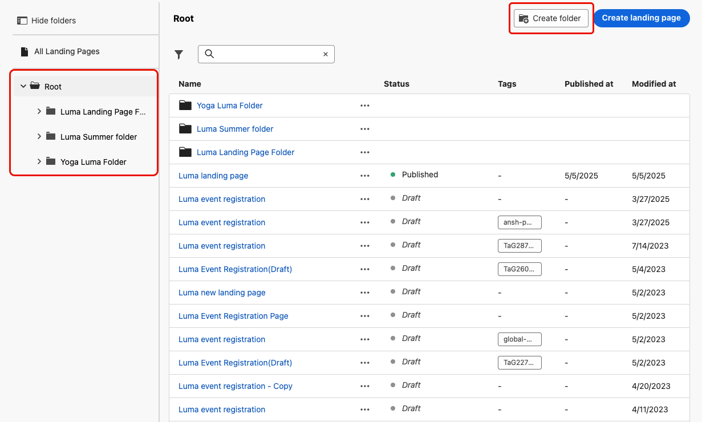

# Gerenciar suas páginas de aterrissagem {#manage-lp}

## Acessar páginas de destino {#access-landing-pages}

Para acessar a lista de páginas de aterrissagem, selecione **[!UICONTROL Gestão de Conteúdo]** > **[!UICONTROL Páginas de aterrissagem]** no menu esquerdo.

Todas as páginas de aterrissagem existentes são exibidas.

O painel à esquerda permite organizar landing pages em pastas. Por padrão, todos os itens são exibidos. Ao selecionar uma pasta, somente as páginas de aterrissagem e pastas incluídas na pasta selecionada são exibidas. [Saiba mais](#folders)

Para localizar um item específico, comece digitando um nome no campo de pesquisa. Quando uma [pasta](#folders) é selecionada, a pesquisa se aplica a todas as páginas ou pastas de aterrissagem no primeiro nível de hierarquia dessa pasta<!--(not nested items)-->.

Você pode filtrar páginas de aterrissagem com base em seu status, data de modificação ou tags.

Nessa lista, você pode clicar nos três pontos ao lado de uma landing page e selecionar a ação desejada:

* Para páginas de aterrissagem [publicadas](create-lp.md#publish-landing-page), acesse o [relatório de página de aterrissagem](../reports/lp-report-global-cja.md) e o [relatório de últimas 24 horas](../reports/lp-report-live.md).

* **Excluir** e **Cancelar publicação** uma página de aterrissagem. Você não pode excluir uma página de aterrissagem [publicada](create-lp.md#publish-landing-page). Para excluí-lo, primeiro você deve desfazer a publicação.

  >[!CAUTION]
  >
  >Se você cancelar a publicação de uma landing page referenciada em uma mensagem, o link para a landing page será corrompido e os usuários receberão uma página de erro se tentarem acessá-la.

* **Duplicar** qualquer página de aterrissagem.

* Edite as [marcas](../start/search-filter-categorize.md#tags) associadas a uma página de aterrissagem.

* Mover a landing page para uma pasta. [Saiba mais](#folders)

## Usar pastas para gerenciar páginas de destino {#folders}

>[!CONTEXTUALHELP]
>id="ajo_lp_folders"
>title="Organizar suas páginas de aterrissagem em pastas"
>abstract="Use pastas para categorizar e gerenciar suas landing pages de acordo com as necessidades da organização."

Para navegar facilmente pelas landing pages, você pode usar pastas para organizá-las com mais eficiência em uma hierarquia estruturada. Isso permite categorizar e gerenciar os itens de acordo com as necessidades da organização.

1. Clique no botão **[!UICONTROL Todas as páginas iniciais]** para exibir todos os itens criados anteriormente sem o agrupamento de pastas.

   

1. Clique na pasta **[!UICONTROL Raiz]** para exibir todas as pastas criadas.

   >[!NOTE]
   >
   >Se você ainda não tiver criado pastas, todas as landing pages serão exibidas.

1. Clique em qualquer pasta dentro da pasta **[!UICONTROL Raiz]** para exibir seu conteúdo.

1. Ao clicar na pasta **[!UICONTROL Raiz]** ou em qualquer outra pasta, o botão **[!DNL Create folder]** é exibido. Selecione-o.

   

1. Digite um nome para a nova pasta e clique em **[!UICONTROL Salvar]**. A nova pasta é exibida dentro da pasta **[!UICONTROL Raiz]** ou dentro da pasta selecionada no momento.

1. Clique no botão **[!UICONTROL Mais ações]** para renomear ou excluir a pasta.

   

1. Usando o botão **[!UICONTROL Mais ações]**, você também pode mover páginas de aterrissagem para outra pasta existente.

1. Agora é possível navegar até a pasta que acabou de criar. Cada nova página de aterrissagem que você [cria](create-lp.md#create-landing-page.md) daqui é salva na pasta atual.

   
