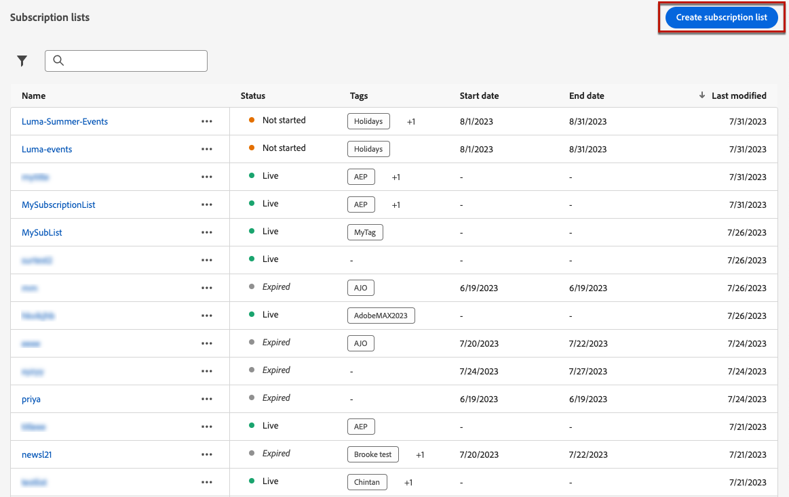

# Listas de assinaturas {#create-subscription-list}

## O que é uma lista de assinaturas? {#subscription-list-definition}

>[!CONTEXTUALHELP]
>id="ajo_subscription_list"
>title="Configurar uma lista de assinaturas"
>abstract="Crie uma lista de assinaturas para coletar perfis que aceitaram receber comunicações sobre um assunto ou evento específico. "
>additional-url="https://experienceleague.adobe.com/docs/journey-optimizer/using/landing-pages/subscription-list.html#define-subscription-list" text="Criar uma lista de assinaturas"

Um serviço de assinatura refere-se aos bens e serviços de marketing fornecidos aos clientes que optaram por receber comunicações sobre um assunto/evento/interesse/etc. específico. numa base contínua. Em [!DNL Journey Optimizer], esses clientes que optaram por participar são coletados em uma lista de assinaturas.

Um serviço de assinatura pode ser:

* um informativo, por exemplo: &quot;Série em execução&quot;
* um evento, por exemplo: &quot;Summit 2021&quot;
* um webinar, por exemplo: &quot;Saiba mais sobre o crypto&quot;
* um interesse em um produto/esporte/serviço/etc., por exemplo: &quot;Interessado em comprar uma casa nos próximos 12 meses&quot;
* uma preferência sobre como ser notificado, por exemplo: &quot;Receba novas notificações de música por email&quot;

Os perfis podem ser adicionados a uma lista de assinaturas por meio de uma [página de aterrissagem](create-lp.md). Um exemplo é apresentado em [esta seção](lp-use-cases.md#subscription-to-a-service).

## Criar uma lista de assinaturas {#define-subscription-list}

Para criar uma lista de subscrição, siga as etapas abaixo.

1. Para acessar as listas de subscrição, selecione **[!UICONTROL Cliente]** > **[!UICONTROL Lista de assinaturas]**.

   

1. Selecione o **[!UICONTROL Criar lista de assinaturas]** botão.

   

1. Adicione um título e uma descrição. Esses campos são obrigatórios.

   

   >[!CAUTION]
   >
   >Atualmente, não é possível usar o espaçamento ou inserir um nome que já existe para outra lista de assinaturas no **[!UICONTROL Título]** campo.

1. Você pode definir uma data de início e uma data de término.

   

1. Clique em **[!UICONTROL Salvar]**.

A lista exibe todas as listas de assinaturas criadas. Você pode filtrá-los com base na data de criação ou na data de modificação e em seu status.

Os status possíveis são os seguintes:

* **[!UICONTROL Não iniciado]**: Você definiu uma data de início posterior ao dia atual. Os perfis subscritos ainda não receberão comunicações relacionadas a esta lista de subscrição.
* **[!UICONTROL Ao vivo]**: O dia atual é composto pela data de início e de término da lista de assinaturas ou por datas de término/início não definidas, o que significa que a lista de assinaturas está sempre ativa.
* **[!UICONTROL Expirado]**: A data de término é passada, portanto, a lista de assinaturas não é mais válida. Qualquer perfil inscrito não receberá mais comunicações relacionadas a esta lista de assinaturas.

Depois que a lista de assinaturas for criada, você poderá usá-la em uma landing page. Os perfis que optarem pelo formulário de landing page serão adicionados à lista. [Saiba mais](design-lp.md)

Também é possível usar as listas de assinatura como segmentos quando [jornadas de construção](../building-journeys/journey-gs.md#jo-build) e adicionar personalização.

>[!NOTE]
>
>Você pode monitorar os impactos da sua lista de assinaturas por meio de relatórios específicos. [Saiba mais](../reports/subscription-report-live.md)
