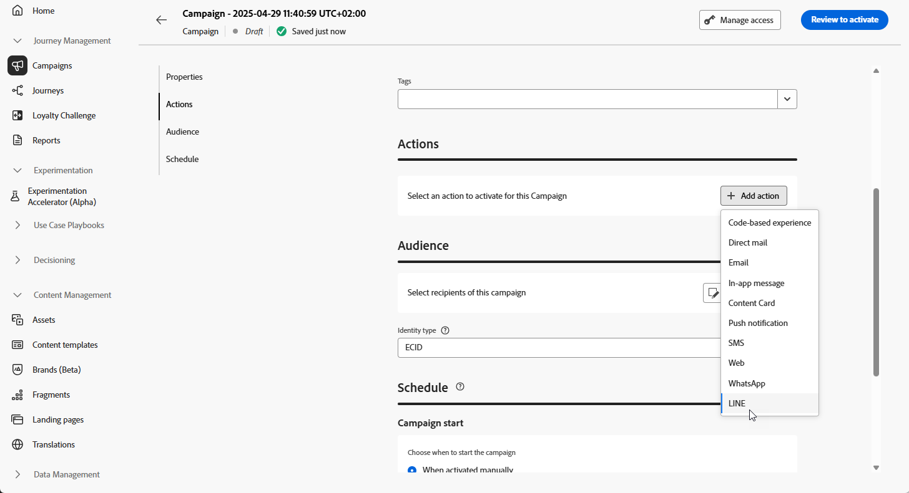

# Criar uma mensagem LINE {#create-line}

## Adicionar uma mensagem LINE {#create-line-journey-campaign}

>[!CONTEXTUALHELP]
>id="ajo_journey_action_line"
>title="Ação LINE"
>abstract="Uma ação de canal LINE envia uma mensagem LINE aos perfis quando eles atingem essa etapa da jornada. O rótulo identifica a atividade na tela de jornada e a ação faz referência a uma configuração LINE que define o conteúdo entregue. A seção **Otimização** pode incluir experimentos de conteúdo ou regras de direcionamento, a seção **Multilíngue** pode fornecer conteúdo em vários idiomas e a seção **Tempo limite ou erro** pode definir um caminho alternativo se a ação falhar."
>additional-url="https://experienceleague.adobe.com/pt-br/docs/journey-optimizer/using/orchestrate-journeys/about-journey-building/journey-action#add-action" text="Introdução às ações do canal"

Navegue pelas guias abaixo para saber como adicionar uma mensagem LINE em uma campanha ou jornada.

>[!BEGINTABS]

>[!TAB Adicionar uma mensagem LINE a uma Jornada]

1. Abra a jornada e arraste e solte uma atividade **LINE** da seção **Actions** da paleta.

   

1. Forneça informações básicas sobre a mensagem (rótulo, descrição, categoria) e escolha a configuração de mensagem a ser usada.

   Para obter mais informações sobre como configurar uma jornada, consulte [esta página](../building-journeys/journey-gs.md)

   O campo **[!UICONTROL configuração]** é preenchido previamente, por padrão, com a última configuração usada para esse canal pelo usuário.

Agora você pode começar a projetar o conteúdo da sua mensagem LINE a partir do botão **[!UICONTROL Editar conteúdo]**, conforme detalhado abaixo.

>[!TAB Adicionar uma mensagem LINE a uma campanha]

1. Acesse o menu **[!UICONTROL Campanhas]** e clique em **[!UICONTROL Criar campanha]**.

1. Selecione o tipo de campanha que deseja executar

   * **Agendado - Marketing**: execute a campanha imediatamente ou em uma data especificada. As campanhas programadas são destinadas ao envio de mensagens de marketing. Eles são configurados e executados na interface do usuário do.

   * **Acionado por API - Marketing/Transacional**: execute a campanha usando uma chamada de API. As campanhas acionadas por API destinam-se ao envio de mensagens de marketing ou transacionais, ou seja, mensagens enviadas após uma ação executada por um indivíduo: redefinição de senha, compra de carrinho etc.

1. Na seção **[!UICONTROL Propriedades]**, edite o **[!UICONTROL Título]** e a **[!UICONTROL Descrição]** da sua campanha.

1. Clique no botão **[!UICONTROL Selecionar público-alvo]** para definir o público-alvo a ser direcionado na lista de públicos-alvo disponíveis do Adobe Experience Platform. [Saiba mais](../audience/about-audiences.md).

1. No campo **[!UICONTROL Namespace de identidade]**, escolha o namespace a ser usado para identificar os indivíduos do público selecionado. [Saiba mais](../event/about-creating.md#select-the-namespace).

1. Na seção **[!UICONTROL Actions]**, escolha a **[!UICONTROL LINE]** e selecione ou crie uma nova configuração.

   Saiba mais sobre a configuração LINE em [esta página](line-configuration.md).

   

1. Clique em **[!UICONTROL Criar experimento]** para começar a configurar seu experimento de conteúdo e criar tratamentos para medir seu desempenho e identificar a melhor opção para seu público-alvo. [Saiba mais](../content-management/content-experiment.md)

1. Na seção **[!UICONTROL Rastreamento de ações]**, especifique se deseja rastrear cliques nos links da mensagem SMS.

1. As campanhas são projetadas para serem executadas em uma data específica ou em uma frequência recorrente. Saiba como configurar o **[!UICONTROL Cronograma]** da sua campanha no [nesta seção](../campaigns/create-campaign.md#schedule).

1. No menu **[!UICONTROL Acionadores de ação]**, escolha a **[!UICONTROL Frequência]** da sua mensagem SMS:

   * Uma vez
   * Diariamente
   * Semanal
   * Month

Agora você pode começar a projetar o conteúdo da sua mensagem de texto a partir do botão **[!UICONTROL Editar conteúdo]**, conforme detalhado abaixo.

>[!ENDTABS]

## Definir o conteúdo do LINE{#line-content}

O Adobe Journey Optimizer oferece suporte aos seguintes tipos de mensagem para LINE:

* **Texto**: envia mensagens de texto simples ou formatadas.
* **Adesivos**: incorpore os adesivos nativos do LINE para adicionar caractere e expressividade.
* **Imagens**: anexe imagens para aprimorar o apelo visual.
* **Vídeos**: compartilhe conteúdo de vídeo para comunicação dinâmica.
* **Locais**: envia informações de localização com mapas.
* **Modelos**: utilize modelos predefinidos para mensagens consistentes.
* **Mensagens do Flex**: crie layouts complexos com conteúdo avançado usando as Mensagens do Flex baseadas em JSON.

Esses tipos de mensagens podem ser configurados ao editar o conteúdo JSON diretamente, permitindo estratégias de mensagens dinâmicas e personalizadas.

Para configurar o conteúdo LINE, siga as etapas abaixo.

1. Na tela de configuração do jornada ou da campanha, clique no botão **[!UICONTROL Editar conteúdo]** para configurar o conteúdo da mensagem de texto.

1. Clique em **[!UICONTROL Editar código]** para editar conteúdo JSON.

1. Use o editor de personalização para definir o conteúdo, adicionar personalização e conteúdo dinâmico. Você pode usar qualquer atributo, como o nome do perfil ou a cidade, por exemplo. Você também pode definir regras condicionais. Navegue até as seguintes páginas para saber mais sobre [personalização](../personalization/personalize.md) e [conteúdo dinâmico](../personalization/get-started-dynamic-content.md) no editor de personalização.

1. Clique em **[!UICONTROL Salvar]** e verifique sua mensagem na visualização.

1. Use **[!UICONTROL Simular conteúdo]** para visualizar o conteúdo da mensagem LINE e o conteúdo personalizado. [Saiba mais](send-line.md)

Depois de executar os testes e validar o conteúdo, você pode enviar a mensagem LINE para o público-alvo. Estas etapas estão detalhadas em [esta página](send-line.md)

Depois de enviado, você pode medir o impacto do LINE nos relatórios do Campaign ou do Jornada. Para obter mais informações sobre relatórios, consulte [esta seção](../reports/campaign-global-report-cja.md).
