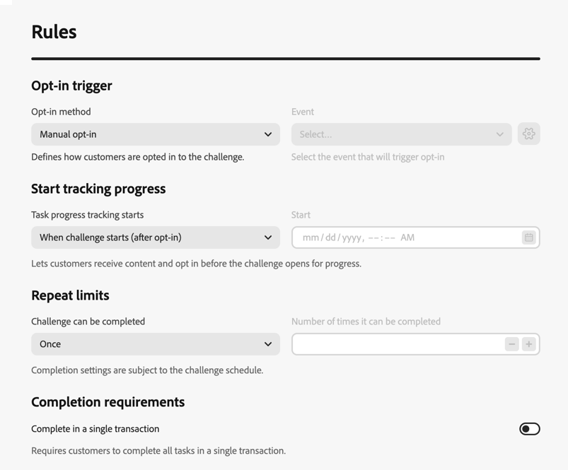
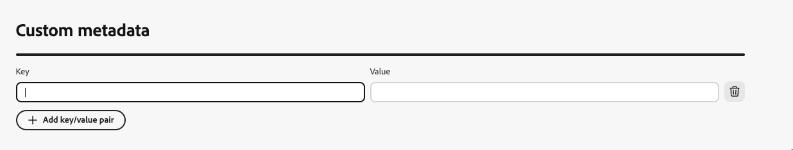
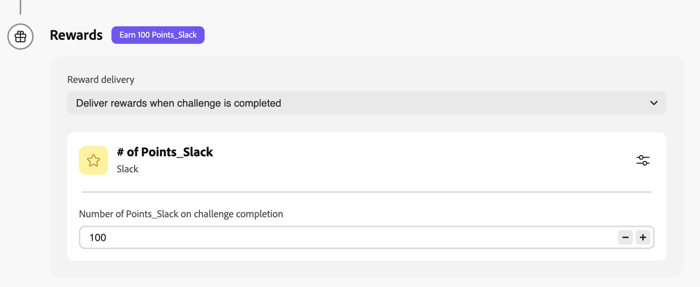
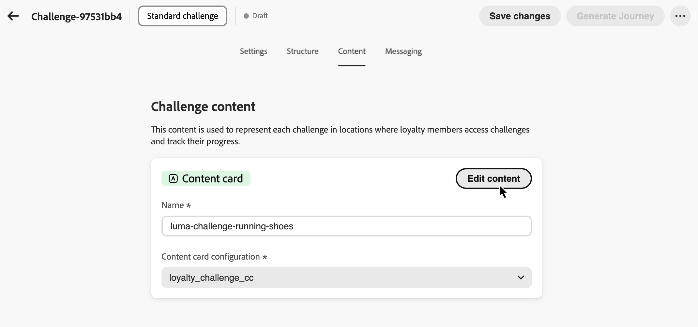

# Criar desafios {#create-challenges}

>[!BEGINSHADEBOX]

**Sumário**

[Introdução aos desafios de fidelidade](get-started.md)

<table style="table-layout:fixed">
<tr style="border: 0;">
<td style="vertical-align:top;">

**Criar e gerenciar desafios**

* [Acessar e gerenciar desafios e tarefas](access-loyalty-challenges.md)
* **Criar desafios** ◀︎ **Você está aqui**
* [Criar tarefas](create-tasks.md)
* [Monitorar o desempenho de desafio de fidelidade](loyalty-reporting.md)

</td>
<td style="vertical-align:top;">

**Configurar e integrar**

* [Configurar desafios de fidelidade](loyalty-admin.md)
* [Guia de definição de recompensa](reward-definition-guide.md)
* [Guia do Transformador de eventos](event-transformer-guide.md)
* [Dados e conjuntos de dados de fidelidade](loyalty-data-and-datasets.md)
* [Referência da API de desafios de fidelidade](https://developer.adobe.com/journey-optimizer-apis/references/loyalty-challenges){target="_blank"}

</td>
</tr>
</table>

>[!ENDSHADEBOX]

>[!AVAILABILITY]
>
>Este recurso está atualmente em **beta privado**. Para obter detalhes completos sobre o ciclo de lançamento e as fases de disponibilidade, consulte o [ciclo de lançamento do Journey Optimizer](../rn/releases.md).

Esta página aborda o processo completo de criação de um desafio de fidelidade, desde selecionar o tipo de desafio e definir as configurações, a estrutura, o conteúdo e as mensagens até gerar e publicar a jornada que oferece o desafio aos clientes.

## Criar o desafio {#create-the-challenge}

1. Navegue até **[!UICONTROL Desafios de Fidelidade (Beta)]** no Journey Optimizer.

1. Selecione a guia **[!UICONTROL Desafios]** e selecione **[!UICONTROL Criar desafio]**.

   

1. Escolha o tipo de desafio:

   * **[!UICONTROL Padrão]**: os clientes concluem qualquer número especificado de tarefas em qualquer ordem\
     *Exemplo: Concluir 3 de 5 tarefas disponíveis*

   * **[!UICONTROL Série]**: os clientes concluem a mesma tarefa várias vezes consecutivamente\
     *Exemplo: faça uma compra em 7 dias consecutivos*

   * **[!UICONTROL Sequencial]**: os clientes concluem as tarefas em uma ordem definida\
     *Exemplo: Compra → Revisão → Compartilhar (deve ser concluído nesta sequência)*

   * **[!UICONTROL Traga seus próprios dados]**: selecione **[!UICONTROL Trazer seus próprios dados]** quando quiser que a estrutura de desafios, como tarefas e recompensas, seja montada a partir da integração de dados de Desafios de Fidelidade. Quando este tipo é selecionado, a guia **[!UICONTROL Estrutura]** é somente leitura. Configurar **[!UICONTROL Configurações]**, **[!UICONTROL Conteúdo]** e **[!UICONTROL Mensagens]** da mesma forma que outros tipos de desafio.

     >[!AVAILABILITY]
     >
     >O tipo de desafio **[!UICONTROL Traga seus próprios dados]** está disponível no momento para um conjunto restrito de organizações e será disponibilizado de forma mais ampla em uma versão futura.

   Após selecionar um tipo de desafio, o editor de desafio abre com estas guias: **[!UICONTROL Configurações]**, **[!UICONTROL Estrutura]**, **[!UICONTROL Conteúdo]** e **[!UICONTROL Mensagens]**. Comece com **[!UICONTROL Configurações]** para definir detalhes do desafio, público-alvo, programação e regras. Em seguida, configure a **[!UICONTROL Estrutura]** (tarefas e recompensas) para todos os tipos, exceto **[!UICONTROL Traga seus próprios dados]**.

## Definir configurações de desafio {#settings}

Na guia **[!UICONTROL Configurações]**, configure as propriedades no nível do desafio: quem pode participar, quando o desafio for executado, como os membros aceitam e ganham progresso e metadados opcionais.

### Detalhes do desafio {#challenge-details}

>[!CONTEXTUALHELP]
>id="ajo_loyalty_challenge_properties"
>title="Detalhes do desafio"
>abstract="Defina o nome e a descrição do desafio. A ID do desafio é atribuída automaticamente quando o desafio é criado e pode ser copiada para uso da API ou da integração."

1. Na seção **[!UICONTROL Detalhes do desafio]**, defina o seguinte:

   * **[!UICONTROL Nome]**: insira um nome descritivo para o desafio. Este nome aparece no inventário de desafios.
   * **[!UICONTROL ID do desafio]**: um identificador exclusivo atribuído quando o desafio é criado. Use o controle de cópia para fazer referência a essa ID em APIs ou sistemas externos.
   * **[!UICONTROL Descrição]**: insira uma descrição que explique a finalidade e as metas do desafio.

   

### Público-alvo {#audience}

>[!CONTEXTUALHELP]
>id="ajo_loyalty_challenge_audience"
>title="Público-alvo"
>abstract="Escolha quem pode participar do desafio. Adicione um público-alvo do Adobe Experience Platform ou deixe o público-alvo em branco para que todos os membros do programa de fidelidade sejam qualificados. Como opção, exija a conclusão de outros desafios como pré-requisitos."

Defina quem pode participar do seu desafio de fidelidade.

1. Na seção **[!UICONTROL Público-alvo]**, selecione **[!UICONTROL Adicionar público-alvo]** para limitar o desafio a um público-alvo específico do Adobe Experience Platform. [Saiba como trabalhar com públicos](../audience/about-audiences.md).

   

1. Em **[!UICONTROL Pré-requisitos de desafio]**, selecione **[!UICONTROL Exigir conclusão de desafio]** para restringir a qualificação a membros que já tenham concluído um ou mais desafios selecionados.

### Programação {#schedule}

>[!CONTEXTUALHELP]
>id="ajo_loyalty_challenge_schedule"
>title="Programação de desafio"
>abstract="Defina quando o desafio está ativo usando data e hora de início e término e um fuso horário. Na janela de conclusão da tarefa, escolha quando os clientes podem concluir tarefas durante o período de desafio."

Configure quando seu desafio é executado:

1. Na seção **[!UICONTROL Agendamento]**, defina:

   * **[!UICONTROL Data e hora de início]**: quando o desafio se torna disponível para os clientes.
   * **[!UICONTROL Data e hora de término]**: quando o desafio expira e não aceita mais novas conclusões.
   * **[!UICONTROL Fuso horário]**: o fuso horário usado para o agendamento de desafio.

   

1. Em **[!UICONTROL Janela de conclusão da tarefa]**, escolha quando os clientes poderão concluir as tarefas:

   * **[!UICONTROL A qualquer momento durante o desafio]**: os clientes podem concluir tarefas a qualquer momento entre as datas de início e término do desafio.
   * **[!UICONTROL Durante horas específicas do dia]**: Restrinja a conclusão da tarefa a horas diárias específicas definindo **[!UICONTROL Hora de Início]** e **[!UICONTROL Hora de Término]**.

### Regras {#rules}

Configure como os membros aceitam, quando o progresso da tarefa conta para o desafio e quantas vezes o desafio pode ser concluído.

* **[!UICONTROL Acionador de aceitação]**:

  * **[!UICONTROL Método de aceitação]**: escolha se os clientes ingressarão no desafio manualmente ou por meio de um disparador de evento.
  * **[!UICONTROL Evento]**: para aceitação baseada em eventos, selecione o evento que aciona a aceitação. Os administradores podem clicar no botão  para criar uma definição de evento. [Saiba como configurar definições de evento](loyalty-admin.md#event-definitions)

* **[!UICONTROL Iniciar acompanhamento do progresso]**:

  * **[!UICONTROL O rastreamento do progresso da tarefa começa]**: escolha quando as conclusões da tarefa contam para o progresso do desafio. Por exemplo, selecione **[!UICONTROL Quando o desafio começar (após a aceitação)]** para que o progresso comece após a aceitação do membro e o desafio esteja ativo.

    É possível dissociar quando um desafio está visível para os membros de quando o progresso é rastreado. Por exemplo, um cartão de desafio pode aparecer e aceitar aceitações antes que as conclusões de tarefas comecem a contar para o progresso em uma data posterior.

  * **[!UICONTROL Início]**: ao escolher uma opção de início personalizada, defina a data e a hora de início do rastreamento do progresso.

* **[!UICONTROL Limites de repetição]**:

  * **[!UICONTROL O desafio pode ser concluído]**: escolha se o desafio pode ser concluído uma ou várias vezes. Por exemplo, **[!UICONTROL Uma vez]** ou um número definido de conclusões.

  * **[!UICONTROL Número de vezes que pode ser concluído]**: Quando a repetição estiver habilitada, especifique quantas vezes um membro pode concluir o desafio.

* **[!UICONTROL Requisitos de conclusão]** *(Somente desafios padrão)*:

  * **[!UICONTROL Concluir em uma única transação]**: quando habilitado, os clientes devem concluir todas as tarefas em uma única transação. Quando desativadas, as tarefas podem ser concluídas em transações separadas.

### Metadados personalizados {#custom-metadata}

Na seção **[!UICONTROL Metadados personalizados]**, selecione **[!UICONTROL Adicionar par de chave/valor]** para adicionar metadados personalizados. Use metadados para rastreamento ou integração com sistemas externos.

## Configurar a estrutura de desafio {#structure}

Na guia **[!UICONTROL Estrutura]**, defina as tarefas que os clientes devem concluir e as recompensas que eles ganham. Esta guia não é usada para **[!UICONTROL Traga seus próprios desafios]** de dados.

### Adicionar tarefas {#add-tasks}

>[!CONTEXTUALHELP]
>id="ajo_loyalty_challenge_tasks"
>title="Tarefas"
>abstract="Selecione as tarefas que serão executadas para concluir o desafio. Em seguida, configure como o desafio é concluído. As opções disponíveis dependem do tipo de desafio (Padrão, Sequência ou Sequencial)."

As tarefas definem as ações específicas que os clientes devem concluir para ganhar recompensas. Você pode configurar tipos de tarefa (compra, gasto ou evento personalizado), quantidades, filtros de produto e outros atributos.

Para adicionar tarefas ao seu desafio, siga estas etapas:

1. Na seção **[!UICONTROL Tarefas]**, selecione **[!UICONTROL Adicionar tarefa]**.

   

1. O **[!UICONTROL Inventário de tarefas]** é aberto. Selecione uma ou mais tarefas na lista e selecione **[!UICONTROL Adicionar]**. Para criar uma nova tarefa, selecione **[!UICONTROL Nova]**. [Saiba como criar e configurar tarefas](create-tasks.md).

1. Especificar quando o desafio é considerado concluído. As configurações disponíveis dependem do tipo de desafio:

   +++Desafios padrão

   No menu suspenso **[!UICONTROL Requisito de conclusão da tarefa]**, escolha entre:

   * **[!UICONTROL O cliente escolhe 1 tarefa para ser concluída]** - *Os clientes podem selecionar e concluir qualquer tarefa individual para receber recompensas*
   * **[!UICONTROL O cliente conclui um número específico de tarefas]** - *Os clientes devem concluir um número definido de tarefas. Especifique o número necessário de tarefas a serem concluídas.*

   +++

   +++Desafios do Streak

   No menu suspenso **[!UICONTROL Tipo de Streak]**, escolha entre:

   * **Consecutivo**: os clientes devem concluir a tarefa em dias consecutivos sem interrupções. *Exemplo: Compra na segunda, terça, quarta-feira — falta um dia quebra a sequência.*

   * **Não consecutivo**: os clientes podem concluir a tarefa com intervalos entre as conclusões. *Exemplo: Conclua 7 compras em 30 dias, com interrupções permitidas.*

   No campo **[!UICONTROL Comprimento da sequência]**, especifique quantas vezes a tarefa deve ser concluída. *Exemplo: Defina como 7 para uma &quot;sequência de compras de 7 dias.&quot;*

   +++

   +++Desafios sequenciais

   No menu suspenso **[!UICONTROL Requisito de conclusão da tarefa]**, escolha entre:

   * **[!UICONTROL O cliente escolhe 1 tarefa para ser concluída]** - *Os clientes podem selecionar e concluir qualquer tarefa individual para receber recompensas*
   * **[!UICONTROL O cliente conclui um número específico de tarefas]** - *Os clientes devem concluir um número definido de tarefas na ordem exata que você definir. Faltando ou ignorando uma tarefa interrompe a sequência. Especifique o número necessário de tarefas para concluir*

   +++

1. Por padrão, os desafios padrão e sequenciais permitem que os clientes concluam tarefas em várias transações. Para exigir que todas as tarefas sejam concluídas em uma única transação, abra o menu de opções de tarefa e alterne a opção de transação única.

   

Depois de adicionar tarefas ao seu desafio, configure as recompensas que os clientes ganharão ao concluí-las.

### Configurar recompensas {#rewards}

>[!CONTEXTUALHELP]
>id="ajo_loyalty_challenge_rewards"
>title="Recompensas"
>abstract="Escolha quando os clientes ganham pontos: quando eles concluem todo o desafio ou nos marcos da tarefa à medida que avançam. Selecione o provedor de premiação (a solução de fidelidade que gerencia pontos e recompensas) e defina valores: um único total para conclusão total ou valores por tarefa para determinar marcos, ativando as recompensas somente para as tarefas que deseja."

As recompensas são os pontos de fidelidade ou os benefícios que os clientes recebem por concluir os desafios.

Para configurar quando e como as recompensas serão entregues:

1. No menu suspenso **[!UICONTROL Entrega de recompensa]**, escolha quando entregar as recompensas:

   * **[!UICONTROL Fornecer recompensas quando o desafio for concluído]**: premiar recompensas quando os clientes concluírem todo o desafio\
     *Exemplo: premiar 100 pontos após concluir todas as 5 tarefas*

   * **[!UICONTROL Fornecer recompensas nos marcos de conclusão da tarefa conforme o progresso do desafio é realizado]**: premiar de forma incremental à medida que os clientes concluem tarefas individuais (disponível somente para desafios que exigem mais de uma tarefa)\
     *Exemplo: Premiar 10 pontos após a tarefa 1, 20 pontos após a tarefa 2 e 50 pontos após a tarefa 3*

1. Selecione seu provedor de premiação. Esta é a sua solução de fidelidade que gerencia pontos e recompensas do cliente. Os provedores de recompensa são criados no menu **[!UICONTROL Admin de fidelidade]** antes de você criar desafios. [Saiba como configurar provedores de premiação](loyalty-admin.md#reward-providers)

   

1. Configure os valores de premiação com base no método de delivery selecionado:

   +++Fornecer recompensas quando o desafio for concluído

   Especifique o valor total de premiação a ser dado quando os clientes concluírem todo o desafio.

   *No exemplo abaixo, os clientes recebem 100 pontos ao concluírem o desafio.*

   

   +++

   +++Fornecer recompensas nos marcos de conclusão da tarefa

   Especificar valores de recompensa para marcos de conclusão de tarefas. Essa opção permite criar recompensas progressivas que aumentam a motivação do cliente à medida que avançam pelo desafio.

   Para qualquer tarefa em que você quiser oferecer uma recompensa, alterne para a opção de recompensa e especifique quantos pontos serão concedidos quando os clientes concluírem essa tarefa específica. Você pode optar por recompensar apenas determinadas conclusões de tarefa, por exemplo, se você tiver 10 tarefas, poderá recompensar apenas as tarefas 1, 5 e 10.

   *No exemplo abaixo, os clientes recebem 10 pontos ao concluírem a primeira tarefa e 50 pontos adicionais após concluírem a segunda tarefa.*

   

   +++

Depois de configurar a estrutura de desafio com tarefas e recompensas, você pode, opcionalmente, configurar como o desafio é representado aos clientes. Se você não precisa de conteúdo de desafio, ignore esta etapa e prossiga diretamente para [Configurar mensagens](#configure-messaging).

## Configurar conteúdo de desafio (opcional) {#configure-content-cards}

>[!CONTEXTUALHELP]
>id="ajo_loyalty_challenge_content"
>title="Conteúdo"
>abstract="Configure como seu desafio é representado em locais onde os membros do programa de fidelidade acessam desafios e rastreiam seu progresso. Use a ação Adicionar para escolher o Cartão de conteúdo para exibir uma experiência no estilo do cartão ou a experiência Baseada em código para fornecer conteúdo por meio de sua própria implementação personalizada."

A guia **[!UICONTROL Conteúdo]** controla como o desafio é representado em locais onde os membros do programa de fidelidade acessam desafios e controlam seu progresso.

Para configurar o conteúdo do desafio:

1. Navegue até a guia **[!UICONTROL Conteúdo]** e clique em **[!UICONTROL Adicionar ação]**.

1. Escolha o tipo de ação:

   * **[!UICONTROL Cartão de conteúdo]**: exibe o desafio como uma experiência no estilo de cartão em dispositivos de clientes. Selecione uma **[!UICONTROL Configuração de canal]** e clique em **[!UICONTROL Editar conteúdo]** para criar e personalizar o cartão. [Saiba mais sobre cartões de conteúdo](../content-card/create-content-card.md).
   * **[!UICONTROL Experiência baseada em código]**: fornece conteúdo de desafio por meio de sua própria implementação personalizada usando o canal baseado em código da Journey Optimizer. Selecione uma **[!UICONTROL Configuração de canal]** e clique em **[!UICONTROL Editar conteúdo]** para definir o conteúdo. [Saiba mais sobre experiências baseadas em código](../code-based/create-code-based.md).

   

   É possível adicionar várias ações para representar o desafio em diferentes superfícies.

Após configurar o conteúdo, configure as mensagens para envolver os clientes durante todo o ciclo de vida do desafio.

### Configurar mensagens {#configure-messaging}

>[!CONTEXTUALHELP]
>id="ajo_loyalty_challenge_messaging"
>title="Mensagens"
>abstract="As mensagens ajudam a engajar durante todo o ciclo de vida do desafio. Na guia Mensagens, adicione mensagens para cada estágio: Lançamento (quando o desafio começa), Em andamento (lembretes e atualizações de progresso) e Conclusão (comemore o sucesso e confirme as recompensas). Para cada estágio, adicione uma mensagem, escolha o canal, selecione uma configuração de canal e selecione Editar para criar o conteúdo da mensagem."

Configurar mensagens multicanais para envolver os clientes em estágios fundamentais do ciclo de vida de desafio. As mensagens são opcionais, mas são recomendadas para maximizar o engajamento do cliente.

1. Navegue até a guia **[!UICONTROL Mensagens]** e configure as mensagens para cada estágio do ciclo de vida:

   * Mensagem de **Inicialização**: notificar os clientes quando o desafio começar
   * Mensagem **Em andamento**: mantenha os clientes envolvidos com lembretes e atualizações de progresso
   * Mensagem de **Conclusão**: comemorar o sucesso e confirmar a alocação da premiação

1. Para cada estágio, clique no botão adicionar mensagem para criar uma mensagem para esse estágio.

1. Escolha o canal desejado: **[!UICONTROL No aplicativo]**, **[!UICONTROL Email]** ou **[!UICONTROL Notificação por push]** e selecione a configuração de canal associada.

1. Selecione o ícone  e escolha **[!UICONTROL Editar]** para criar o conteúdo da sua mensagem.

   

Saiba como criar mensagens para canais específicos nestas seções: [Mensagens no aplicativo](../in-app/get-started-in-app.md) - [Mensagens de email](../email/get-started-email.md) - [Notificações por push](../push/get-started-push.md)

Seu desafio agora está totalmente configurado com suas configurações, estrutura, conteúdo e mensagens. Para iniciá-lo, você deve publicar o desafio e sua jornada associada.

## Lançando o desafio {#launch}

Para iniciar um desafio, são necessárias **três etapas**: (1) publicar o desafio, (2) gerar a jornada, (3) publicar a jornada. Todos os três devem ser preenchidos para que o desafio seja entregue aos clientes.

1. Revise sua configuração de desafio para garantir que todos os campos obrigatórios sejam preenchidos.

1. Clique no ícone  e selecione **[!UICONTROL Publicar]**.

   

1. Selecione **[!UICONTROL Gerar Jornada]** para criar a jornada que orquestrará a entrega de desafio.

   

1. O Journey Optimizer cria automaticamente uma jornada no status &quot;Rascunho&quot;. A jornada aparece no inventário de jornadas com o formato de nome *&quot;Jornada: [Nome do desafio]&quot;*. [Saiba mais sobre o inventário de jornadas](../building-journeys/journey-ui.md).

   

1. Abra a jornada e publique-a. A jornada será iniciada automaticamente na data de início do desafio especificada e entregará conteúdo e mensagens de acordo com sua configuração. [Saiba como publicar uma jornada](../building-journeys/publish-journey.md).

1. Quando seu desafio estiver ativo, monitore os KPIs do programa, os resultados do desafio e as métricas no nível da tarefa nos [relatórios de desafio de fidelidade](loyalty-reporting.md). Você também pode monitorar a entrega de mensagens no [relatório de jornadas](../reports/journey-global-report-cja.md).

>[!NOTE]
>
>A jornada gerada automaticamente pode ser personalizada para adicionar lógica ou mensagens adicionais. No entanto, as alterações feitas diretamente na jornada não são sincronizadas com a configuração de desafio. Se você editar o desafio mais tarde, qualquer personalização de jornada será perdida quando a jornada for gerada novamente.
