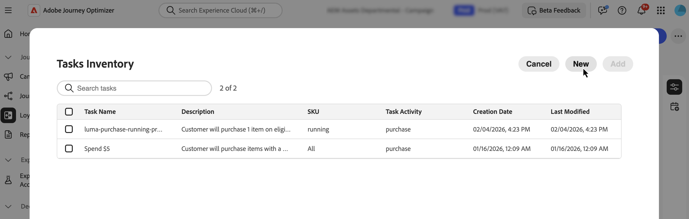

# Criar tarefas {#create-tasks}

>[!BEGINSHADEBOX]

**Sumário**

[Introdução aos desafios de fidelidade](get-started.md)

<table style="table-layout:fixed">
<tr style="border: 0;">
<td style="vertical-align:top;">

**Criar e gerenciar desafios**

* [Acessar e gerenciar desafios e tarefas](access-loyalty-challenges.md)
* [Criar desafios](create-challenges.md)
* **Criar tarefas** ◀︎ **Você está aqui**
* [Monitorar o desempenho de desafio de fidelidade](loyalty-reporting.md)

</td>
<td style="vertical-align:top;">

**Configurar e integrar**

<!-- * [Configure loyalty challenges](loyalty-admin.md) -->
* [Dados e conjuntos de dados de fidelidade](loyalty-data-and-datasets.md)
* [Referência da API de desafios de fidelidade](https://developer.adobe.com/journey-optimizer-apis/references/loyalty-challenges){target="_blank"}

</td>
</tr>
</table>

>[!ENDSHADEBOX]

>[!AVAILABILITY]
>
>Este recurso está atualmente em **beta privado**. Para obter detalhes completos sobre o ciclo de lançamento e as fases de disponibilidade, consulte o [ciclo de lançamento do Journey Optimizer](../rn/releases.md).

As tarefas definem as ações ou marcos específicos que os clientes devem concluir para ganhar recompensas em um desafio de fidelidade. Você pode configurar tipos de tarefa, quantidades e requisitos de produto para criar experiências de fidelidade envolventes e personalizadas.

Cada tarefa representa uma ação mensurável que contribui para a conclusão do desafio. As tarefas são componentes reutilizáveis que podem ser criados de forma independente e depois adicionados a um ou mais desafios, ou criados diretamente dentro de um desafio.

## Criar uma tarefa {#create-task}

>[!CONTEXTUALHELP]
>id="ajo_loyalty_task_create"
>title="Criar uma tarefa"
>abstract="Selecione uma atividade do cliente (Compra ou Gasto) e configure atributos específicos da atividade: quantidades ou valores, itens elegíveis e exclusões, e limites opcionais, como máximo de transações ou gasto mínimo. No painel Propriedades, defina o nome e a descrição da tarefa."

É possível criar tarefas a partir de dois pontos de entrada. O processo de configuração é o mesmo, independentemente de onde você começa.

>[!BEGINTABS]

>[!TAB Do inventário de tarefas]

Selecione a guia **[!UICONTROL Tarefas]** e selecione **[!UICONTROL Criar tarefa]**. As tarefas criadas no inventário são salvas e disponibilizadas para reutilização em vários desafios.

>[!TAB De dentro de um desafio]

Abrir um desafio existente ou criar um novo. Selecione **[!UICONTROL Adicionar tarefa]** e clique no botão **[!UICONTROL Novo]**. Tarefas criadas dessa maneira são automaticamente adicionadas ao seu desafio e também salvas no inventário de Tarefas para reutilização em outros desafios.

>[!ENDTABS]

## Escolher atividade do cliente {#choose-activity}

Selecione o tipo de atividade que os clientes devem executar para concluir esta tarefa:

* **[!UICONTROL Compra]**: os clientes devem comprar um ou mais itens para concluir esta tarefa
* **[!UICONTROL Gastos]**: os clientes devem gastar um valor especificado para concluir esta tarefa
<!-- * **[!UICONTROL Custom event]**: Customers must perform an activity tracked as an Adobe Experience Platform event. The event must be defined in **[!UICONTROL Loyalty Admin]** before you can select it here. [Learn how to create event definitions](loyalty-admin.md#event-definitions) -->

Para selecionar uma atividade, clique no ícone **+** e selecione a atividade de cliente que melhor se alinha às suas metas de resultado. Cada tipo de atividade tem atributos configuráveis específicos para definir e moldar ainda mais os requisitos da tarefa.

## Definir os atributos da tarefa {#define-attributes}

Configure os atributos da tarefa com base no tipo de atividade selecionado. Navegue pelas guias abaixo para ver os atributos disponíveis para cada tipo de atividade:

>[!BEGINTABS]

>[!TAB Atividade de compra]

Atributos disponíveis para atividades de **Compra**:

* **[!UICONTROL Quantidade]**: insira o número de itens que devem ser comprados para concluir esta tarefa.
* **[!UICONTROL Itens qualificados e exclusões]**: defina itens ou grupos de itens que contam para a conclusão da tarefa e aqueles que não são qualificados, ou escolha **[!UICONTROL Trazer seus próprios dados]** para impulsionar a qualificação de seus dados externos. [Saiba mais](#eligible-items-exclusions)
* **[!UICONTROL Valor mínimo de gasto]**: defina um requisito de valor mínimo de compra.
* **[!UICONTROL Número máximo de transações]**: limite quantas transações podem ser usadas para concluir a tarefa.

>[!TAB Gastar atividade]

Atributos disponíveis para atividades de **Gasto**:

* **[!UICONTROL Valor]**: insira o valor total de gastos necessário para concluir a tarefa.
* **[!UICONTROL Itens qualificados e exclusões]**: defina itens ou grupos de itens que contam para a conclusão da tarefa e os que não contam. [Saiba mais sobre itens qualificados e exclusões](#eligible-items-exclusions)
* **[!UICONTROL Número máximo de transações]**: especifique quantas transações podem atender ao requisito de gastos. Você pode ativar esse atributo no ícone de parâmetros.

>[!ENDTABS]

## Defina itens elegíveis e exclusões {#eligible-items-exclusions}

>[!CONTEXTUALHELP]
>id="ajo_loyalty_task_eligible_items_exclusion"
>title="Itens elegíveis e exclusões"
>abstract="Para as atividades de **Compra** e **Gasto**, é possível usar o atributo **[!UICONTROL Itens elegíveis e exclusões]** para definir quais itens e grupos estão qualificados e quais foram excluídos. Isso permite direcionar produtos, categorias ou locais específicos para alinhar às metas do desafio. Por exemplo, é possível limitar uma tarefa de gastos a categorias de produtos específicas ou excluir vales-presente ou itens promocionais da contagem até a conclusão da tarefa."

<!-- SCREENSHOT: Eligible items & exclusions popup showing the two sections: "Eligible task purchases are limited to the following" and "The following are excluded from this task" with text input fields -->

Para as atividades de **Compra** e **Gasto**, é possível usar o atributo **[!UICONTROL Itens elegíveis e exclusões]** para definir quais itens e grupos estão qualificados e quais foram excluídos. Isso permite direcionar produtos, categorias ou locais específicos para alinhar às metas do desafio.

Por exemplo, é possível limitar uma tarefa a categorias de produto específicas ou excluir cartões-presente ou itens promocionais da contagem até a conclusão da tarefa.

### Definir itens qualificados para a tarefa

Para definir itens qualificados, insira IDs de item específicas, categorias ou IDs de destino, separadas por vírgulas no campo **[!UICONTROL As compras de tarefas qualificadas são limitadas ao seguinte]**. Se deixar esse campo vazio, todas as compras serão qualificadas por padrão. Você também pode inserir `*` para qualificar explicitamente todas as compras.

Exemplo: `SKU001, SKU002, CategoryA`

### Excluir itens da tarefa

Para excluir itens da tarefa, insira IDs de item específicas, categorias ou IDs de destino no **[!UICONTROL Os itens a seguir são excluídos do campo desta tarefa]**.

Exemplo: `CLEARANCE01, GIFTCARD, SALE_CATEGORY`

### Traga seus próprios dados para elegibilidade e exclusões {#byod-personalization}

>[!AVAILABILITY]
>
>A opção **[!UICONTROL Trazer seus próprios dados]** está disponível atualmente para um conjunto restrito de organizações e será disponibilizada de forma mais ampla em uma versão futura.

Além de inserir IDs de item para torná-las qualificadas ou excluídas, você também pode direcionar a qualificação de seus dados externos de Desafios de Fidelidade no tempo de execução usando a opção **[!UICONTROL Trazer seus próprios dados]**.

Quando **[!UICONTROL Trazer seus próprios dados]** é selecionado, a qualificação por participante é resolvida no tempo de execução a partir dos dados sincronizados com seu ambiente de Desafios de Fidelidade, em vez de uma lista de IDs de item.

Para usar essa opção, selecione o ícone de personalização em **[!UICONTROL Itens qualificados e exclusões]** e escolha **[!UICONTROL Trazer seus próprios dados]**.

>[!IMPORTANT]
>
>Ao atribuir esta tarefa a um desafio, selecione **[!UICONTROL Padrão]** como o tipo de desafio. Não selecione **[!UICONTROL Trazer seus próprios dados]** no nível do desafio, pois essa opção é reservada para desafios totalmente orientados por dados, em que toda a estrutura, incluindo tarefas e recompensas, é fornecida externamente.

## Definir propriedades da tarefa {#define-task-properties}

No painel de tarefas **[!UICONTROL Propriedades]**, configure as informações básicas da tarefa:

* **[!UICONTROL Nome da tarefa]**: digite um nome descritivo para a tarefa.
* **[!UICONTROL Descrição da tarefa]**: a descrição é gerada automaticamente com base na atividade e nos atributos configurados. Para inserir uma descrição personalizada, desative a opção de geração automática e insira sua descrição no campo de texto.

Após configurar todos os atributos e propriedades, selecione **[!UICONTROL Criar]** para salvar a tarefa. A tarefa é salva no inventário de tarefas e, se criada a partir de um desafio, é automaticamente adicionada a esse desafio.
