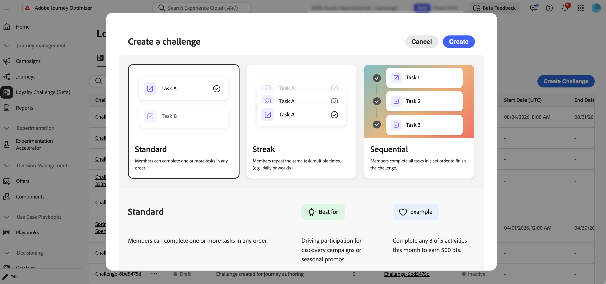

# Introdução aos desafios de fidelidade {#get-started-loyalty-challenges}

>[!BEGINSHADEBOX]

**Sumário**

**[Introdução aos desafios de fidelidade](get-started.md)** ◀︎ **Você está aqui**

<table style="table-layout:fixed">
<tr style="border: 0;">
<td style="vertical-align:top;">

**Criar e gerenciar desafios**

* [Acessar e gerenciar desafios e tarefas](access-loyalty-challenges.md)
* [Criar desafios](create-challenges.md)
* [Criar tarefas](create-tasks.md)
* [Monitorar o desempenho de desafio de fidelidade](loyalty-reporting.md)

</td>
<td style="vertical-align:top;">

**Configurar e integrar**

* [Configurar desafios de fidelidade](loyalty-admin.md)
* [Guia de definição de recompensa](reward-definition-guide.md)
* [Guia do Transformador de eventos](event-transformer-guide.md)
* [Dados e conjuntos de dados de fidelidade](loyalty-data-and-datasets.md)
* [Referência da API de desafios de fidelidade](https://developer.adobe.com/journey-optimizer-apis/references/loyalty-challenges){target="_blank"}

</td>
</tr>
</table>

>[!ENDSHADEBOX]

>[!AVAILABILITY]
>
>Este recurso está atualmente em **beta privado**. Para obter detalhes completos sobre o ciclo de lançamento e as fases de disponibilidade, consulte o [ciclo de lançamento do Journey Optimizer](../rn/releases.md).

## Visão geral {#overview}

>[!CONTEXTUALHELP]
>id="ajo_loyalty_inventory"
>title="Desafios de fidelidade"
>abstract="Os Desafios de Fidelidade permitem criar programas de fidelidade envolventes e gamificados que impulsionam o comportamento do cliente e aprofundam os relacionamentos com a marca. Crie desafios que recompensem os clientes por ações específicas, desde fazer compras e escrever avaliações até se envolver com redes sociais e indicar a amigos."

Os Desafios de Fidelidade permitem criar programas de fidelidade envolventes e gamificados que impulsionam o comportamento do cliente e aprofundam os relacionamentos com a marca. Crie desafios que recompensem os clientes por ações específicas, desde fazer compras e escrever avaliações até se envolver com redes sociais e indicar a amigos.

Com os desafios de fidelidade, você pode:

* **Crie tipos de desafios flexíveis**: Crie desafios Padrão, Streak ou Sequenciais para atender às suas metas comerciais
* **Configurar as recompensas estrategicamente**: entregar pontos nos marcos da tarefa ou após a conclusão completa para manter o engajamento
* **Personalizar a experiência**: use cartões de conteúdo e mensagens multicanais para criar experiências imersivas e de marca
* **Integre-se perfeitamente**: conecte-se com seus provedores de fidelidade existentes e aproveite os dados do Experience Platform
* **Rastrear automaticamente**: monitore o progresso do cliente através de jornadas geradas automaticamente sem desenvolvimento personalizado
* **Meça o desempenho**: use painéis de relatório internos para rastrear KPIs de programa, resultados de desafio e métricas no nível da tarefa

Você pode criar estes tipos de experiências de desafio:

* **Desafios padrão**: os clientes concluem qualquer número especificado de tarefas em qualquer ordem. Use esse tipo quando quiser flexibilidade e vários caminhos para conclusão.\
  *Exemplo: &quot;Desafio de Bem-Estar de Verão&quot; - Conclua 3 de 5 tarefas: compre produtos de saúde, compartilhe em redes sociais, indique um amigo, escreva uma avaliação ou participe de um evento virtual*

* **Desafios em série**: os clientes concluem a mesma tarefa várias vezes consecutivamente. Use esse tipo para incentivar um comportamento consistente e repetido ao longo do tempo.\
  *Exemplo: &quot;Semana do Amante do Café&quot; - Compre produtos de café por 7 dias consecutivos para desbloquear uma recompensa para bebida gratuita*

* **Desafios sequenciais**: os clientes concluem as tarefas em uma ordem definida. Use esse tipo para orientar os clientes por meio de uma jornada específica ou processo de integração.\
  *Exemplo: &quot;Nova Jornada de Membro&quot; - Inscreva-se para receber emails → Faça sua primeira compra → Escreva uma análise do produto → Indique um amigo (complete nesta ordem exata)*

* **Traga seus próprios desafios de dados** (disponibilidade restrita): a estrutura de desafios (tarefas e recompensas) é montada a partir da integração de dados dos Desafios de Fidelidade. Defina Configurações, Conteúdo e Mensagens da mesma maneira que faria para qualquer outro tipo de desafio.

## Como funciona {#how-it-works}

A criação e o lançamento de um desafio de fidelidade seguem este fluxo de trabalho:

1. **Criar um desafio** - Escolha o tipo de desafio (Padrão, Streak, Sequencial ou Trazer seus próprios dados quando disponíveis). [Saiba como escolher um tipo de desafio](create-challenges.md#create-the-challenge).

1. **Definir configurações** - Na guia Configurações, defina detalhes do desafio, público-alvo, agendamento, regras (aceitação, rastreamento de progresso, limites de repetição) e metadados opcionais. [Saiba mais sobre as configurações de desafio](create-challenges.md#settings).

1. **Adicionar tarefas e recompensas** - Na guia Estrutura, defina tarefas e recompensas (não é necessário para Traga seus próprios desafios de dados).

1. **Criar cartões de conteúdo** - Crie a representação visual do seu desafio usando cartões de conteúdo do Journey Optimizer exibidos em dispositivos do cliente.

1. **Configurar mensagens** (opcional) - Configure mensagens multicanais (no aplicativo, email, push) para os principais estágios do ciclo de vida: inicialização, em andamento e conclusão.

1. **Iniciar o desafio** - Publique o desafio e gere uma jornada. O Journey Optimizer cria automaticamente a jornada para o seu desafio. Publique a jornada gerada automaticamente para disponibilizar o desafio aos clientes.

Para obter instruções detalhadas, consulte [Criar desafios](create-challenges.md).

## Pré-requisitos {#prerequisites}

Antes de usar os desafios de fidelidade, verifique se você tem:

+++Permissões necessárias

Para usar os Desafios de fidelidade, você precisa das permissões apropriadas no Journey Optimizer e no Adobe Experience Platform.

**Journey Optimizer:**

* `journeys.read`
* `journeys.write`
* `journeys.delete`
* `journeys.publish`
* `journeys_events.read`
* `journeys_events.write`
* `journeys_events.delete`
* `journeys_report.read`
* `messages.read`
* `messages_report.read`

**Adobe Experience Platform:**

* `segments.read`
* `profiles.read`
* `identity_namespace.read`

Entre em contato com o administrador se não conseguir acessar o recurso ou precisar de permissões adicionais.

+++

+++Configurar o programa de fidelidade (administradores)

Os administradores configuram provedores de premiação, definições de eventos, inventário de produtos, exclusões e configurações globais no menu **[!UICONTROL Admin. de fidelidade]**. Os profissionais de marketing que apenas criam desafios não precisam acessar esse menu. [Saiba como configurar desafios de fidelidade](loyalty-admin.md)

Entre em contato com o administrador se o menu de **[!UICONTROL Administrador de fidelidade]** não estiver visível na navegação à esquerda.

+++

+++Público-alvo

Verifique se o público-alvo necessário existe no Adobe Experience Platform antes de criar seu desafio. Durante a configuração do desafio, você selecionará o público-alvo que define quais clientes estão qualificados para participar. [Saiba como trabalhar com públicos](../audience/about-audiences.md).

+++

## Vamos nos aprofundar um pouco mais {#lets-dive-deeper}

Agora que você sabe o que são desafios de fidelidade e como eles funcionam, é hora de mergulhar nos detalhes. Explore os tópicos a seguir para acessar a interface, criar o primeiro desafio e definir as tarefas que os clientes concluirão.

<table style="table-layout:fixed">
<tr style="border: 0;">
  <td>
    
    

    <a href="access-loyalty-challenges.md"><strong>Acessar e gerenciar desafios e tarefas</strong></a>
    

    

    <em>Saiba como acessar o inventário e gerenciar desafios e tarefas</em>
    

  </td>
  <td>
    
    

    <a href="create-challenges.md"><strong>Criar desafios</strong></a>
    

    

    <em>Saiba como criar e configurar seu primeiro desafio de fidelidade</em>
    

  </td>
  <td>
    
    

    <a href="create-tasks.md"><strong>Criar tarefas</strong></a>
    

    

    <em>Saiba como definir tarefas que os clientes concluem para desafios</em>
    

  </td>
  <td>
    
    

    <a href="loyalty-reporting.md"><strong>Monitorar desempenho</strong></a>
    

    

    <em>Rastreie KPIs de programa, resultados de desafio e métricas de tarefa com painéis integrados</em>
    

  </td>
  <!--
    <a href="loyalty-admin.md"><strong>Configure the loyalty program</strong></a>
  <td>
    <a href="loyalty-admin.md">
    <em>Set up reward providers, event definitions, and org settings for fulfillment</em>
    </a>
    

-->
    <a href="loyalty-admin.md"><strong>Configurar desafios de fidelidade</strong></a>
    

    

    <em>Configurar provedores de premiação, definições de eventos e configurações da organização</em>
    

  </td>
</tr>
</table>

## Referência da API {#api-reference}

Para gerenciar desafios de fidelidade de forma programática, use a [API de Desafios de Fidelidade](https://developer.adobe.com/journey-optimizer-apis/references/loyalty-challenges){target="_blank"}. A API permite criar, atualizar e gerenciar desafios e tarefas por meio de endpoints REST.
