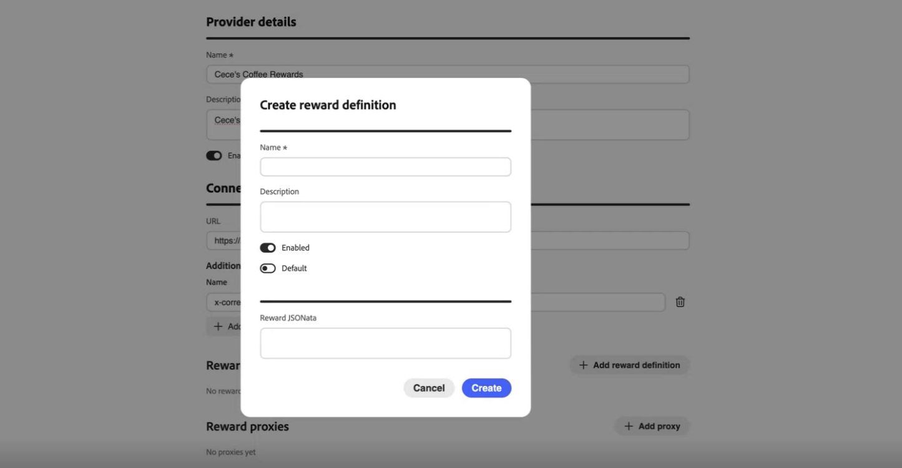
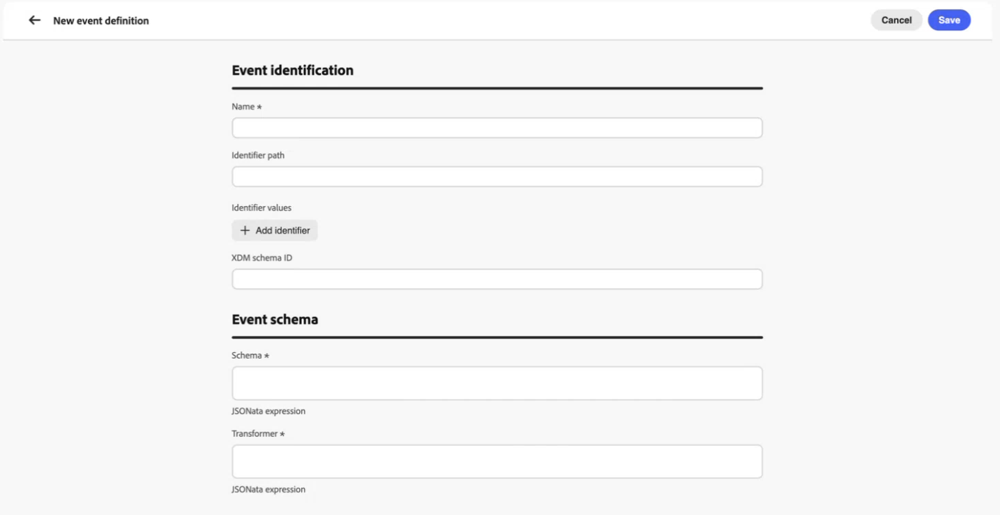

# Configurar desafios de fidelidade {#loyalty-admin}

<!-- Unpublished draft: Loyalty Admin UI documentation is not validated for Experience League. This page uses hide: true until review. -->

>[!BEGINSHADEBOX]

**Sumário**

[Introdução aos desafios de fidelidade](get-started.md)

<table style="table-layout:fixed">
<tr style="border: 0;">
<td style="vertical-align:top;">

**Criar e gerenciar desafios**

* [Acessar e gerenciar desafios e tarefas](access-loyalty-challenges.md)
* [Criar desafios](create-challenges.md)
* [Criar tarefas](create-tasks.md)
* [Monitorar o desempenho de desafio de fidelidade](loyalty-reporting.md)

</td>
<td style="vertical-align:top;">

**Configurar e integrar**

* **Configurar desafios de fidelidade** ◀︎ **Você está aqui**
* [Dados e conjuntos de dados de fidelidade](loyalty-data-and-datasets.md)
* [Referência da API de desafios de fidelidade](https://developer.adobe.com/journey-optimizer-apis/references/loyalty-challenges){target="_blank"}

</td>
</tr>
</table>

>[!ENDSHADEBOX]

>[!AVAILABILITY]
>
>Este recurso está atualmente em **beta privado**. Para obter detalhes completos sobre o ciclo de lançamento e as fases de disponibilidade em [!DNL Journey Optimizer], consulte [ciclo de lançamento](../rn/releases.md).

## Visão geral {#access-loyalty-admin}

A configuração de Desafios de Fidelidade conecta o [!DNL Journey Optimizer] aos seus sistemas de fidelidade externos, configurando o atendimento de recompensa, o mapeamento de eventos, o inventário de produtos e as exclusões antes dos desafios de criação dos profissionais de marketing.

>[!NOTE]
>
>A configuração de Desafios de Fidelidade exige acesso de administrador à sua instância [!DNL Journey Optimizer], além das permissões necessárias para Desafios de Fidelidade. Entre em contato com o administrador do Adobe para obter acesso.

Para abrir a interface de configuração, selecione o menu de navegação à esquerda **[!UICONTROL Administrador de fidelidade]**. A interface é organizada em guias:

* **Configurações globais** — Selecione o namespace de identidade da Experience Platform para o seu programa. [Saiba como definir configurações globais](#global-settings)
* **Provedores de recompensas** — conecte as APIs que atendem a recompensas quando os clientes fazem progresso ou concluem desafios. [Saiba como configurar provedores de premiação](#reward-providers)
* **Definições de eventos** — Mapeie os eventos de experiência recebidos para as atividades usadas nas tarefas **[!UICONTROL Evento personalizado]**. [Saiba como configurar definições de evento](#event-definitions)
* **Estoque de produtos** — carregue mapeamentos de item para grupo para usar nas regras de qualificação de tarefa. [Saiba como configurar o inventário de produtos](#product-inventory)
* **Exclusões** — Carregue exclusões de item e grupo em toda a organização para a configuração da tarefa. [Saiba como configurar exclusões](#exclusions)

## Configurações globais {#global-settings}

>[!CONTEXTUALHELP]
>id="ajo_loyalty_admin_global_settings"
>title="Configurações globais"
>abstract="As configurações globais definem a configuração no nível da organização para Desafios de fidelidade, incluindo o namespace de identidade usado para identificar membros em eventos e desafios."

Abra a guia **[!UICONTROL Configurações globais]** para definir as configurações globais para Desafios de Fidelidade.


* Na seção **[!UICONTROL Configuração da organização]**, selecione o [namespace de identidade](https://experienceleague.adobe.com/pt-br/docs/experience-platform/identity/features/namespaces) do Adobe Experience Platform para desafios de fidelidade. Este namespace deve corresponder à forma como os perfis de membros são identificados em seus dados.

  ➡️ [Saiba como trabalhar com namespaces de identidade](https://experienceleague.adobe.com/pt-br/docs/experience-platform/identity/features/namespaces){target="_blank"}

* Use a seção **[!UICONTROL Relatórios]** para definir a métrica de prioridade da sua organização para o painel do Loyalty Insights. Essa configuração determina quais insights recebem ênfase no feed, permitindo que você se concentre na métrica mais importante para a sua empresa.

  Selecione uma das seguintes opções de KPI:

   * **[!UICONTROL Receita]** — Priorizar insights relacionados a transações monetárias e desempenho de vendas
   * **[!UICONTROL Envolvimento]** — Priorize insights relacionados à atividade e participação do membro
   * **[!UICONTROL Resgate]** — Priorizar insights relacionados às taxas de resgate e à atividade de remuneração
   * **[!UICONTROL Conversões]** — Priorize insights relacionados às métricas de conversão e à conclusão de metas

  Ao selecionar um KPI, os insights relacionados a essa métrica recebem um aumento de pontuação, o que faz com que eles subam para a parte superior do feed. Isso significa que os insights mais relevantes para o KPI selecionado aparecem primeiro. Nenhum insight está oculto: seu feed completo do insight continua a ser exibido, classificado por significância com seu KPI selecionado priorizado acima de outras métricas. Essa configuração afeta apenas como os insights são classificados no feed e não modifica como o programa de fidelidade opera ou como os desafios são avaliados. Você pode alterar sua seleção de KPI a qualquer momento, e o feed do insight reprioriza no próximo ciclo de atualização para refletir sua nova prioridade.

  Para obter mais informações sobre insights de fidelidade e monitoramento de desempenho, consulte [Monitorar desempenho de desafio de fidelidade](loyalty-reporting.md).

## Provedores de recompensa {#reward-providers}

>[!CONTEXTUALHELP]
>id="ajo_loyalty_admin_reward_providers"
>title="Provedores de recompensa"
>abstract="Um provedor de recompensas define o sistema externo que [!DNL Journey Optimizer] chama para conceder recompensas quando os clientes concluem desafios. Configure o ponto de acesso do provedor, as definições de recompensa, as configurações de proxy e a autenticação para cada integração."

>[!CONTEXTUALHELP]
>id="ajo_loyalty_admin_reward_providers_connection"
>title="Conexão do provedor de recompensas"
>abstract="Configure como [!DNL Journey Optimizer] se conecta à sua API de recompensa: nome do provedor, descrição, URL do ponto de acesso e cabeçalhos HTTP necessários para chamadas de processamento."

>[!CONTEXTUALHELP]
>id="ajo_loyalty_admin_reward_providers_details"
>title="Definições de recompensa"
>abstract="As definições de recompensa especificam cada tipo de recompensa que esse provedor pode emitir (por exemplo, pontos ou estrelas) e o conteúdo que [!DNL Journey Optimizer] envia quando as recompensas são entregues."

>[!CONTEXTUALHELP]
>id="ajo_loyalty_admin_reward_providers_proxy"
>title="Proxy de recompensa"
>abstract="Como opção, roteie chamadas de processamento por meio de um servidor proxy em vez de enviá-las diretamente para o ponto de acesso da API de recompensa. Configure host, porta, credenciais e se o proxy está habilitado. O valor das credenciais normalmente se parece com: `{ "userName": "test", "password": "xxxx" }`"

Um **provedor de premiação** informa a [!DNL Journey Optimizer] para onde enviar chamadas de atendimento quando o progresso do desafio é registrado ou um desafio é concluído. Por exemplo, uma API que credita pontos de fidelidade ou estrelas a uma conta de membro.

Para criar um provedor de premiação, siga estas etapas:

1. Abra a guia **[!UICONTROL Provedores de recompensa]** e selecione **[!UICONTROL Criar provedor de recompensa]**.

   

1. Insira um **[!UICONTROL Nome]** e uma **[!UICONTROL Descrição]**.

1. No campo **[!UICONTROL URL]**, insira o ponto de extremidade da API que recebe solicitações de atendimento.

1. Adicione **[!UICONTROL Cabeçalhos]** conforme necessário para sua API (por exemplo, chaves de API ou tipos de conteúdo).

1. Configure os recursos associados ao seu provedor de premiação. Expanda cada seção abaixo para obter detalhes do campo:

   +++Definições de recompensa

   Adicione uma entrada por tipo de recompensa que seu provedor aceita (por exemplo, pontos de programa, estrelas ou crédito monetário). Para cada definição:

   * Insira um **[!UICONTROL Nome]** e uma **[!UICONTROL Descrição]**.
   * Especifique se a definição é **[!UICONTROL Habilitada]**.
   * Alterne **[!UICONTROL Padrão]** para marcar uma definição como padrão para este provedor.
   * Defina a **carga** enviada com chamadas de preenchimento.

   

   +++

   +++Proxy de recompensa

   Rotear chamadas de preenchimento por meio de um servidor intermediário, em vez de enviá-las diretamente para o endpoint. No provedor de premiação e nas telas **[!UICONTROL Criar proxy]**, use o campo **[!UICONTROL Credenciais]** para autenticação de proxy.

   * Insira um **[!UICONTROL Nome]** e uma **[!UICONTROL Descrição]**.
   * Insira **[!UICONTROL Host]** e **[!UICONTROL Porta]**.
   * Especifique se o proxy está **[!UICONTROL Habilitado]**.
   * Em **[!UICONTROL Credenciais]**, digite o nome de usuário e a senha do proxy como JSON. O valor das credenciais normalmente se parece com:

     ```json
     { "userName": "test", "password": "xxxx" }
     ```

   

   +++

   +++Gerador de token de autenticação

   Use quando sua API exigir um token de portador ou autenticação semelhante.

   * Insira um **[!UICONTROL Nome]** e uma **[!UICONTROL Descrição]**.
   * Em **[!UICONTROL Tipo de autenticação]**, insira o tipo de autenticação (por exemplo, Portador).
   * Selecione o método HTTP (por exemplo, POST).
   * Insira a URL do ponto de extremidade do token e a **[!UICONTROL Chave do token]** na resposta (por exemplo, `access_token`).
   * Especifique se o gerador de token de autenticação é **[!UICONTROL Habilitado]**.
   * Adicione todos os cabeçalhos exigidos pelo endpoint do token.

   O [!DNL Journey Optimizer] usa essa configuração para obter um token novo antes de cada chamada para a API de recompensa.

   

   +++

1. Selecione **[!UICONTROL Criar provedor de premiação]**. O provedor e todos os recursos configurados são salvos juntos.

Depois de salvar, o provedor é exibido na lista de provedores de premiação. Os profissionais de marketing podem selecioná-la ao configurar recompensas por desafio. [Saiba como configurar recompensas por desafio](create-challenges.md#rewards)

Para editar um provedor de premiação, abra a guia **[!UICONTROL Provedores de premiação]**, selecione o provedor e atualize os campos no local. As alterações nas definições de recompensa, proxies e geradores de token de autenticação são salvas automaticamente ao atualizá-las.

>[!NOTE]
>
>**[!UICONTROL Traga seus próprios dados]** Os desafios preenchem as recompensas por meio de sua própria integração de dados. Os provedores de recompensa configurados aqui não se aplicam a esses desafios. [Saiba como criar e trazer seus próprios desafios de dados](create-challenges.md#create-the-challenge)

## Definições de evento {#event-definitions}

>[!CONTEXTUALHELP]
>id="ajo_loyalty_admin_event_definitions"
>title="Definições de evento"
>abstract="As definições de evento mostram ao [!DNL Journey Optimizer] como identificar e interpretar os dados de evento recebidos de suas fontes externas. Cada definição mapeia um tipo de evento específico — como uma compra ou um check-in — para que o sistema possa acompanhar o progresso do cliente em direção a tarefas de desafio."

>[!CONTEXTUALHELP]
>id="ajo_loyalty_admin_event_schema"
>title="Esquema e transformador de evento"
>abstract="Quando sua organização enviar eventos em um formato JSON personalizado, use o **[!UICONTROL Esquema]** para validar o conteúdo e o **[!UICONTROL Transformador]** (por exemplo, uma expressão JSONata) para mapear campos no formato esperado pelos Desafios de fidelidade."

>[!CONTEXTUALHELP]
>id="ajo_loyalty_admin_event_identification"
>title="Identificação de evento"
>abstract="Especifique como [!DNL Journey Optimizer] reconhece o evento nos conteúdos de entrada usando um caminho de identificador, valores de identificador, uma ID de esquema XDM ou uma combinação desses campos."

**[!UICONTROL As definições de evento]** informam a [!DNL Journey Optimizer] quais eventos de entrada de experiência do Adobe Experience Platform processar. Por exemplo, uma compra ou um check-in de hotel. Os profissionais de marketing fazem referência a essas definições quando criam tarefas de **[!UICONTROL Evento personalizado]** no construtor de tarefas. Eventos que não correspondem a nenhuma definição são ignorados.

Quando sua organização envia eventos em seu próprio formato JSON, o **[!UICONTROL Esquema]** e o **[!UICONTROL Transformador]** ajudam o [!DNL Journey Optimizer] a validar a carga, analisá-la e decidir se deseja rastrear a atividade.

Para criar uma definição de evento, siga estas etapas:

1. Abra a guia **[!UICONTROL Definições de eventos]** e crie uma nova definição.

   

1. Digite um **[!UICONTROL Nome]** para o evento (por exemplo, `Coffee purchase`). Os profissionais de marketing veem esse nome ao configurar uma tarefa de **[!UICONTROL Evento personalizado]**.

1. Especifique como [!DNL Journey Optimizer] reconhece o evento nas cargas de entrada. Forneça um **[!UICONTROL Caminho do identificador]**, uma **[!UICONTROL ID do esquema XDM]** ou ambos:

   * **[!UICONTROL Caminho do identificador]** — Caminho para um campo na carga (por exemplo, `data.memberId`). Use isso ao corresponder eventos por valores na carga.
   * **[!UICONTROL Valores de identificador]** — Valores no caminho do identificador que devem estar presentes para que esta definição seja compatível.
   * **[!UICONTROL ID do esquema XDM]** — ID do esquema XDM do Experience Platform para este tipo de evento. Use esta opção quando os eventos forem capturados em um esquema conhecido.

1. Se necessário, cole as cadeias de caracteres no **[!UICONTROL Esquema]** e no **[!UICONTROL Transformador]**:

   * **[!UICONTROL Esquema]** — Cadeia de caracteres de validação para a carga de entrada.
   * **[!UICONTROL Transformador]** — Expressão de transformação (por exemplo, JSONata) que mapeia sua carga no formato esperado por Desafios de Fidelidade.

1. Salve a definição do evento. Ele aparece na lista **[!UICONTROL Definições de evento]** e está disponível quando os profissionais de marketing criam tarefas de **[!UICONTROL Evento personalizado]**. [Saiba como criar tarefas](create-tasks.md#choose-activity)

## Estoque de produto {#product-inventory}

>[!CONTEXTUALHELP]
>id="ajo_loyalty_admin_product_inventory"
>title="Estoque de produto"
>abstract="Faça upload de um arquivo CSV que mapeia identificadores de item para grupos de produtos. Os profissionais de marketing podem fazer referência a esses grupos ao configurar itens qualificados em tarefas de compras e gastos sem inserir cada ID de item."

A guia **[!UICONTROL Estoque de produto]** agrupa itens de catálogo para que os profissionais de marketing possam direcioná-los em tarefas sem inserir cada ID de item. Carregue um **arquivo CSV** que mapeie cada identificador de item a um ou mais **grupos de produtos** (o mesmo item pode pertencer a vários grupos). Os grupos importados estão disponíveis ao configurar a qualificação de tarefas. [Saiba como criar tarefas](create-tasks.md)

Para fazer upload de um arquivo de inventário de produtos, siga estas etapas:

1. Prepare um arquivo CSV que mapeie cada identificador de item para um ou mais grupos de produtos. Expanda a seção abaixo para ver um exemplo.

   +++Exemplo de CSV de inventário de produtos

   

   +++

1. Abra a guia **[!UICONTROL Inventário de produto]**.

1. Selecione **[!UICONTROL Carregar]** e escolha seu arquivo CSV.

   

1. Revise os dados importados na lista de inventário. A lista mostra uma linha por item. A coluna **[!UICONTROL Grupos incluídos em]** mostra cada grupo de produtos para esse item como um comprimido ou várias pílulas quando o item pertence a vários grupos.

   

1. Para ver todos os itens em um grupo de produtos, selecione o comprimido desse grupo na coluna **[!UICONTROL Grupos incluídos em]** em qualquer linha. A visualização de detalhes do grupo lista cada item no grupo.

   

1. Abra **[!UICONTROL Histórico de carregamento]** para exibir carregamentos CSV anteriores.

## Exclusões {#exclusions}

>[!CONTEXTUALHELP]
>id="ajo_loyalty_admin_exclusions"
>title="Exclusões"
>abstract="Faça upload de um arquivo CSV que defina os itens do catálogo e os grupos excluídos em todo o programa. Os grupos de exclusão importados são exibidos quando os profissionais de marketing configuram itens elegíveis e exclusões nas tarefas."

A guia **[!UICONTROL Exclusões]** define itens de catálogo e grupos que são excluídos em todo o programa, portanto, os profissionais de marketing não precisam listar as mesmas exclusões em cada tarefa. Carregue um **arquivo CSV** que mapeie cada identificador de item a um ou mais **grupos de exclusão** (o mesmo item pode pertencer a vários grupos).

Após a importação, os itens e grupos excluídos aparecem no construtor de tarefas quando os profissionais de marketing configuram **[!UICONTROL Itens qualificados e exclusões]**. [Saiba como definir itens qualificados e exclusões em tarefas](create-tasks.md#eligible-items-exclusions)

Para fazer upload das exclusões, siga estas etapas:

1. Prepare um arquivo CSV que mapeie cada identificador de item para um ou mais grupos de exclusão. Expanda a seção abaixo para ver um exemplo.

   +++Exemplo de CSV de exclusões

   

   +++

1. Abra a guia **[!UICONTROL Exclusões]**.

1. Selecione **[!UICONTROL Carregar]** e escolha seu arquivo CSV.

   

1. Revise os dados importados na lista de exclusões. A lista mostra uma linha por item. A coluna **[!UICONTROL Grupos incluídos em]** mostra todos os grupos de exclusão desse item como uma pílula ou várias pílulas quando o item pertence a vários grupos.

<!-- SCREENSHOT: Exclusions list after CSV upload -->

1. Para ver todos os itens em um grupo de exclusão, selecione o comprimido desse grupo na coluna **[!UICONTROL Grupos incluídos em]** em qualquer linha. A visualização de detalhes do grupo lista cada item no grupo.

<!-- SCREENSHOT: Exclusion group details -->

1. Abra **[!UICONTROL Histórico de carregamento]** para exibir carregamentos CSV anteriores.
