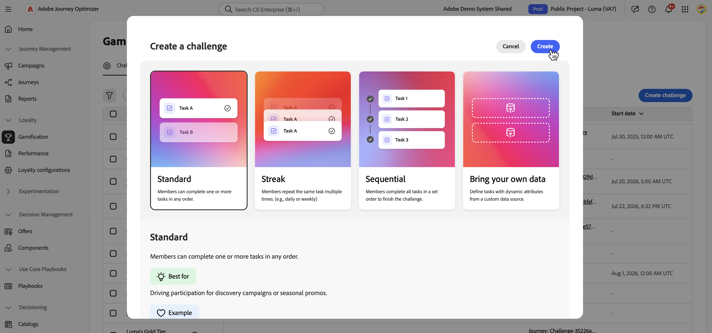

# Demonstração interativa {#loyalty-challenges-demo}

Veja os Desafios de Fidelidade em ação em uma demonstração autoguiada e clicável criada em torno da &quot;Luma&quot;, a marca fictícia de varejo de estilo de vida da Adobe.

A demonstração abrange três fluxos: a experiência de criação de desafios do profissional de marketing (incluindo um desafio &quot;Traga seus próprios dados&quot; e os painéis de desempenho e insights), a experiência do cliente final e o Gerenciamento de desafios de fidelidade no CX Coworker.

Clique no logotipo Luma ou no nome do produto na parte superior esquerda de qualquer tela para alternar entre fluxos.

➡️ [Explore a demonstração dos Desafios de Fidelidade](https://w.adobedemo.com/player?demoId=1893b9c6-a28b-4623-80f0-25e90b2a9193&screenId=5ccf5703-799c-4a8a-ba9c-e86afa1c0d16&showGuide=true&showGuidesToolbar=true&showHotspots=true&openGuidesToolbar=false&guidesToolbarPosition=bottomLeft){target="_blank"}

