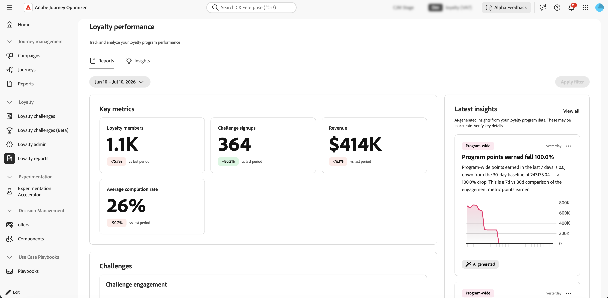
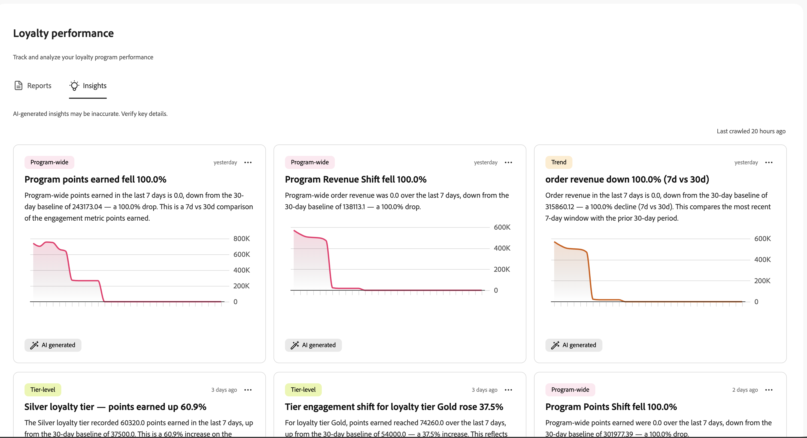

# Monitorar o desempenho de desafio de fidelidade {#loyalty-reporting}

>[!BEGINSHADEBOX]

**Sumário**

[Introdução aos desafios de fidelidade](get-started.md)

<table style="table-layout:fixed">
<tr style="border: 0;">
<td style="vertical-align:top;">

**Criar e gerenciar desafios**

* [Acessar e gerenciar desafios e tarefas](access-loyalty-challenges.md)
* [Criar desafios](create-challenges.md)
* [Criar tarefas](create-tasks.md)
* **Monitorar o desempenho do desafio de fidelidade** ◀︎ **Você está aqui**

</td>
<td style="vertical-align:top;">

**Configurar e integrar**

* [Configurar desafios de fidelidade](loyalty-admin.md)
* [Dados e conjuntos de dados de fidelidade](loyalty-data-and-datasets.md)
* [Referência da API de desafios de fidelidade](https://developer.adobe.com/journey-optimizer-apis/references/loyalty-challenges){target="_blank"}

</td>
</tr>
</table>

>[!ENDSHADEBOX]

>[!AVAILABILITY]
>
>Este recurso está atualmente em **beta privado**. Para obter detalhes completos sobre o ciclo de lançamento e as fases de disponibilidade, consulte o [ciclo de lançamento do Journey Optimizer](../rn/releases.md).

Use os relatórios de Desafios de fidelidade para ver o desempenho de seus desafios. Verifique quem está se inscrevendo, quem está concluindo os desafios e quanta receita seu programa está gerando — tudo em um só lugar. Os dados vêm do Adobe Customer Journey Analytics.

Para abrir os painéis de relatórios, vá para **[!UICONTROL Desafios de Fidelidade (Beta)]** no Journey Optimizer e selecione **[!UICONTROL Relatórios de fidelidade]** na navegação à esquerda.

A interface de relatórios tem duas guias:

* **[Relatórios](#reports-view)**: números e gráficos para seus desafios.
* **[Insights](#insights-cards)**: cartões que destacam o que merece sua atenção neste momento.

## Exibição de relatórios {#reports-view}

A guia **Relatórios** fornece uma visão geral de como seu programa está se saindo no período selecionado. Use o seletor de datas na parte superior da página e selecione o botão **[!UICONTROL Aplicar filtro]** para alterar o período do relatório e ver os números e gráficos atualizados.

A área **Métricas principais** mostra quatro números de imediato. Cada métrica também exibe uma alteração de porcentagem em comparação ao período anterior.

* **Membros de fidelidade**: quantos membros de fidelidade estavam ativos durante o período.
* **Inscrições no desafio**: quantas vezes os membros se inscreveram em um desafio.
* **Receita**: receita total vinculada à atividade de desafio.
* **Taxa média de conclusão**: a porcentagem de membros inscritos que concluíram pelo menos um desafio.

O painel **Últimos insights** à direita mostra os insights gerados pela IA mais recentes do seu programa. Selecione **[!UICONTROL Exibir todos]** para abrir a guia completa **Insights**.

Abaixo das métricas principais, a seção **Desafios** oferece duas visualizações da atividade de desafio.

* **Envolvimento do desafio**: uma linha do tempo mostrando quantos membros iniciaram, estão em andamento e concluíram desafios durante o período.
* **Relatórios de desafios**: uma tabela de todos os seus desafios com detalhes como tipo, tarefas, status e números de inscrição. Use a barra de pesquisa para encontrar um desafio específico. Selecione um desafio para ver seu relatório completo com tendências de envolvimento e detalhes de desempenho.

  +++Exemplo de relatório de desafio

  

  +++

## Guia Insights {#insights-cards}

A guia **Insights** exibe cartões gerados por IA que sinalizam anomalias, tendências e oportunidades em seu programa de fidelidade. Cada cartão representa uma única observação e é classificado de acordo com a sua importância em relação aos dados atuais do programa.

Um carimbo de data/hora **Último rastreo** na parte superior direita mostra quando o mecanismo do insight processou os dados do programa pela última vez.

### Ações do cartão {#insight-card-actions}

Cada cartão tem um menu  com duas ações:

* **Dispensar**: remove permanentemente o cartão da lista de insights.
* **Adiar**: oculta o cartão temporariamente. Escolha adiar por **1 dia**, **3 dias** ou **7 dias**. O cartão reaparece após o término do período de adiamento.

<!--
### Priority badges {#insight-badges}

Each card has a priority badge — **High**, **Medium**, or **Low** — based on how significant the underlying signal is relative to your current program data. These levels are relative: there are always a few **High** cards, even in a quiet week. **High** means "most relevant right now", not that a fixed threshold was crossed.
-->

### Tags de categoria {#insight-category-tags}

Cada cartão contém uma **marca de categoria** que identifica a qual parte do programa a insight está relacionada.

| Categoria | O que ele cobre |
| --- | --- |
| **Em todo o programa** | Integridade geral e desempenho do seu programa de fidelidade |
| **Nível** | Taxas de ganho, movimentação e distribuição entre níveis de membros |
| **Desafio** | Atividade, taxas de conclusão e anomalias para um desafio específico ou entre desafios |
| **Produto** | Desempenho do catálogo de produtos, incluindo exibições, resgates e tendências no nível do catálogo |
| **Ciclo de vida do membro** | Como os membros avançam nos estágios de inscrição, engajamento e churn |
| **Tendência** | Padrões com base no tempo, como ciclos semanais, picos sazonais ou reversões de tendência |
