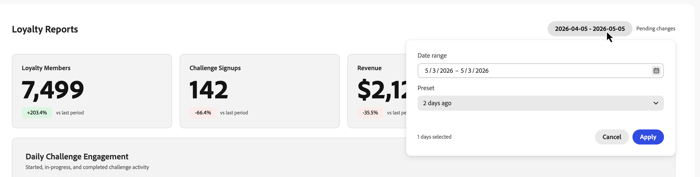

# Monitorar o desempenho de desafio de fidelidade {#loyalty-reporting}

>[!BEGINSHADEBOX]

**Documentação de desafios de fidelidade**

[Introdução aos desafios de fidelidade](get-started.md)

+++Criar e gerenciar desafios

* [Acessar e gerenciar desafios e tarefas](access-loyalty-challenges.md)
* [Criar desafios](create-challenges.md)
* [Criar tarefas](create-tasks.md)
* **Monitorar o desempenho do desafio de fidelidade** ◀︎ **Você está aqui**

+++

+++Configurar e integrar

<!-- * [Configure loyalty challenges](loyalty-admin.md) -->
* [Dados e conjuntos de dados de fidelidade](loyalty-data-and-datasets.md)
* [Referência da API de desafios de fidelidade](https://developer.adobe.com/journey-optimizer-apis/references/loyalty-challenges){target="_blank"}

+++

>[!ENDSHADEBOX]

>[!AVAILABILITY]
>
>Este recurso está atualmente em **beta privado**. Para obter detalhes completos sobre o ciclo de lançamento e as fases de disponibilidade, consulte o [ciclo de lançamento do Journey Optimizer](../rn/releases.md).

Os relatórios de Desafios de fidelidade fornecem painéis no nível do desafio para que você possa rastrear métricas principais, como desempenho do funnel de público-alvo, taxas de conclusão de tarefas, emissão de recompensa e impacto na receita. Todos os dados são obtidos do Adobe Customer Journey Analytics e apresentados em uma interface personalizada e criada para fins específicos.

<!--
A direct **Analyze in CJA** button will be added to the reporting interface before the feature reaches general availability.
-->

## Acessar relatórios de fidelidade {#access-reports}

Para abrir os painéis de relatórios de fidelidade, navegue até **[!UICONTROL Desafios de Fidelidade (Beta)]** no Journey Optimizer e selecione **[!UICONTROL Relatórios de fidelidade]** na navegação à esquerda.

A interface de relatórios fornece três exibições, cada uma oferecendo um nível diferente de detalhes. A **[Visão geral](#overview)** exibe um resumo de todos os seus desafios ativos. Abaixo dele, duas guias permitem alternar entre exibições mais granulares:

* **[Desafios](#challenges-view)**: um detalhamento por desafio com recurso de detalhamento,
* **[Tarefas](#tasks-view)**: uma exibição em nível de tarefa das métricas de receita e conclusão.

Você pode ajustar o intervalo de datas para todas as exibições usando o seletor de datas na parte superior da página. As predefinições de data padrão também estão disponíveis.

## Visão geral {#overview}

A página **Visão geral** mostra métricas agregadas em todos os desafios ativos para o período selecionado.

A parte superior da página exibe as seguintes métricas:

**Membros do programa de fidelidade** - Número de membros do programa de fidelidade que estavam ativos durante o período selecionado.
**Inscrições para desafios** - Número total de novas inscrições para desafios em todos os desafios.
**Receita** - Receita total vinculada à atividade de desafio durante o período.
**Taxa média de conclusão** - Porcentagem de clientes inscritos que concluíram pelo menos um desafio.

Abaixo dessas métricas, uma linha do tempo **Envolvimento Diário com Desafio** mostra como a participação em desafios evoluiu ao longo do período, plotando três séries:

* Clientes que **iniciaram** um desafio,
* Clientes que mudaram para o status **em andamento**,
* Clientes que **concluíram** um desafio.

## Visualização Desafios {#challenges-view}

A guia **Desafios** detalha o desempenho por desafio individual. Cada desafio é listado com colunas-chave como Tipo, Status, Inscrição, Conclusão e muito mais. A lista é classificada pela data da última modificação e exibe dez desafios de cada vez. Use o botão **Avançar** na parte inferior para prosseguir com a navegação.

Selecione qualquer desafio da lista para abrir sua visualização de detalhes. O relatório inclui vários blocos de métrica, como Receita total, Inscrição, Taxa de conclusão e gráficos de tendência, bem como um Detalhamento diário.

+++Exemplo de relatório de desafio

+++

## Exibição de tarefas {#tasks-view}

A guia **Tarefas** fornece uma exibição entre desafios do desempenho da tarefa. Você pode alternar entre tarefas superiores por receita e tarefas superiores por conclusões para se concentrar na métrica mais relevante para você.

A guia também destaca as 6 principais tarefas por receita, fornecendo uma visualização rápida de quais tarefas agregam mais valor.

Abaixo do gráfico de radar, uma lista de tarefas exibe cada tarefa com colunas-chave como Conclusões, Receita e os desafios aos quais cada tarefa pertence. A lista é classificada pela receita e mostra dez tarefas de cada vez. Use o botão **Avançar** para continuar a navegação.

