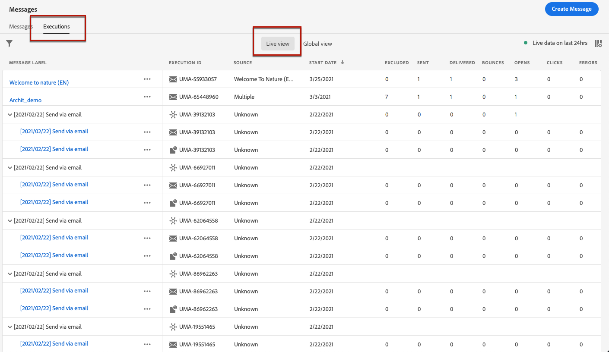

# Monitoramento de mensagens {#monitor-message-execution}

Para garantir que suas mensagens sejam executadas, enviadas e entregues com êxito, [!DNL Journey Optimizer] oferece recursos para monitorar as mensagens publicadas e acionadas no momento. Você pode ver o desempenho das mensagens no jornada <!--and APIs--> em tempo real na lista **[!UICONTROL Executions]**.

Para acessar essa lista, na página inicial **[!DNL Journey Optimizer]**, selecione **[!UICONTROL Messages]** e clique na guia **[!UICONTROL Executions]**.

Esta guia fornece duas exibições: **[!UICONTROL Live view]** e **[!UICONTROL Global view]**.

* A guia **[!UICONTROL Live view]** fornece uma **visão geral em tempo real de todas as mensagens executadas** acionadas por um ou mais [jornada](building-journeys/journey.md) **nas últimas 24 horas apenas**.

   

   Essa lista é atualizada automaticamente a cada sessenta segundos. Se nenhuma execução tiver ocorrido nas últimas 24 horas para uma mensagem específica, todas as colunas exibirão valores nulos (0) para essa mensagem.

* A guia **[!UICONTROL Global view]** fornece uma **visão geral de todas as mensagens executadas** acionadas por um ou mais [jornada](building-journeys/journey.md) **desde a data de início da mensagem**.

   

   Esta lista é atualizada automaticamente a cada noventa minutos. Os dados são agregados ao longo do tempo desde cada data de início da mensagem.

Se uma mensagem for publicada, mas ainda não for acionada por uma jornada, ela não estará listada em nenhuma das guias. Somente os seguintes elementos são listados:
* Mensagens que foram acionadas, mas que ainda não foram iniciadas (pendentes).
* Mensagens que foram acionadas e que estão em execução no momento (em andamento).

<!--For multichannel messages, one row per channel is displayed for each message. STILL VALID? looks like NOT-->

>[!NOTE]
>
>Se uma mensagem tiver sido usada em várias jornadas, uma linha por jornada será exibida para cada execução.

<!---->

<!--If a message has been used in several journeys, the **[!UICONTROL Source]** column displays **[!UICONTROL Multiple]**.-->

Por padrão, as mensagens são exibidas a partir da data de execução mais recente. Clique no ícone **[!UICONTROL Filters]** para pesquisar as mensagens de acordo com o canal, a data de início e/ou a data de término.

A <!--**[!UICONTROL Quick action]**-->segunda coluna permite abrir a [mensagem](create-message.md) correspondente e acessar o [Relatório ao Vivo](reports/live-report.md) se estiver no **[!UICONTROL Live view]**, ou o [Relatório Global](reports/global-report.md) se estiver no **[!UICONTROL Global view]**.

Para cada execução de mensagem, vários indicadores são exibidos:

* **[!UICONTROL Message label]**: Título da mensagem que você definiu ao  [criar a mensagem](create-message.md). A ID de execução, que é gerada automaticamente, é exibida entre parênteses.

   <!--**[!UICONTROL Execution ID]**: Automatically generated identifier.
  **[!UICONTROL Source]**: Name of the journey leveraging that message.-->

* **[!UICONTROL Journey - Version - Action]**: Nome da jornada que utiliza a mensagem, a versão da jornada e o rótulo da ação que utiliza a mensagem na jornada.

* **[!UICONTROL Status]**: Status de execução da mensagem.  <!--List all the possible statuses? For now only Live status? The user cannot stop or cancel the execution. TBC by Fred-->

* **[!UICONTROL Start date]**: Data e hora em que a mensagem foi executada a partir da jornada.

   <!--Targeted: Number of targeted profiles for each message execution. To come?-->

* **[!UICONTROL Excluded]**: Número de perfis que foram excluídos do público-alvo inicial devido às regras de exclusão.

* **[!UICONTROL Sent]**: Número de mensagens enviadas.

* **[!UICONTROL Delivered]**: Número de mensagens entregues com êxito na caixa de correio do recipient (email) ou no dispositivo (push) sem gerar uma devolução ou qualquer outro erro de delivery.

* **[!UICONTROL Bounces]**: Número de mensagens que não podem ser entregues devido a uma falha de delivery. [Saiba mais sobre devoluções](suppression-list.md).

* **[!UICONTROL Opens]**: Número de mensagens que foram abertas.

* **[!UICONTROL Clicks]**: Número de cliques nos links em um email.

   >[!NOTE]
   >
   >Os cliques não existem para notificações por push: quando um usuário clica em uma notificação por push, ele abre o aplicativo, que só pode ser considerado como uma abertura.

* **[!UICONTROL Errors]**: Número de mensagens que não podem ser enviadas devido a uma falha técnica.

* **[!UICONTROL Spam complaints]**: Número de mensagens que foram marcadas como spam por recipients. [Saiba mais sobre reclamações](https://experienceleague.adobe.com/docs/deliverability-learn/deliverability-best-practice-guide/metrics-for-deliverability/complaints.html#metrics-for-deliverability).

Clicar em cada hiperlink abrirá a exibição de resumo de mensagem correspondente. [Saiba mais sobre mensagens](create-message.md).
