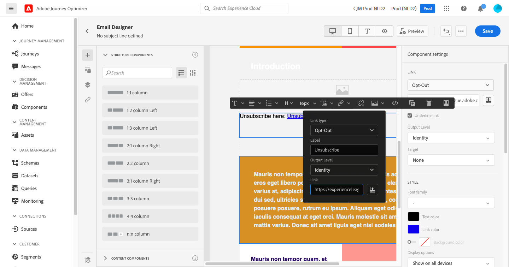

# Adicionar links e rastrear mensagens {#tracking}

Use [!DNL Journey Optimizer] para adicionar links ao seu conteúdo e rastrear as mensagens enviadas para monitorar o comportamento dos recipients.

## Habilitar rastreamento {#enable-tracking}

Você pode ativar o rastreamento no nível da mensagem de email marcando a variável **[!UICONTROL Open Tracking for email]** e/ou **[!UICONTROL Click Tracking for email]** opções ao [criação da mensagem](create-message.md).

>[!NOTE]
>
>Ambas as opções são ativadas por padrão.

Isso permitirá rastrear o comportamento dos recipients por meio de:

* **[!UICONTROL Open Tracking for email]**: Mensagens que foram abertas.
* **[!UICONTROL Click Tracking for email]**: Cliques em links em um email.

## Inserir links {#insert-links}

Ao criar uma mensagem, você pode adicionar links ao seu conteúdo.

>[!NOTE]
>
>When [o rastreamento está ativado](#enable-tracking), todos os links incluídos no conteúdo da mensagem são rastreados.

Para inserir links no seu conteúdo de email, siga as etapas abaixo:

1. Selecione um elemento e clique em **[!UICONTROL Insert link]** na barra de ferramentas contextual.

   

1. Escolha o tipo de link que deseja criar:

   * **[!UICONTROL External link]**: Insira um link para um URL externo.

   * **[!UICONTROL Unsubscription link]**: Insira um link para cancelar a assinatura do recebimento de comunicações da sua marca. Saiba mais sobre o gerenciamento de recusa [nesta seção](consent.md#opt-out-management).

   * **[!UICONTROL Mirror page]**: Insira um link para exibir o conteúdo do email em um navegador da Web. Saiba mais [nesta seção](#mirror-page).

   * **[!UICONTROL Opt-out]**: Insira um link para permitir que os usuários cancelem rapidamente a assinatura de suas comunicações, sem a necessidade de confirmar a recusa. Saiba mais [nesta seção](#one-click-opt-out-link).

   

1. Você pode personalizar seus links. Saiba mais sobre URLs personalizados em [esta seção](personalization/personalization-syntax.md#perso-urls).

1. Salve as alterações.

1. Depois que o link for criado, você ainda poderá modificá-lo da variável **[!UICONTROL Component settings]** painel à direita.

   * Clique no ícone de lápis para editar o link.
   * Você pode optar por sublinhar o link ou não, marcando a opção correspondente.

   

## Link para uma mirror page {#mirror-page}

A mirror page é uma página HTML acessível online através de um navegador da Web. Seu conteúdo é idêntico ao conteúdo do email.

Para adicionar um link a uma mirror page no seu email, [inserir um link](#insert-links) e selecione **[!UICONTROL Mirror page]** como o tipo de link.

A mirror page é criada automaticamente.

>[!NOTE]
>
>Não é possível editar o link gerado automaticamente.

Depois que o email for enviado, quando os recipients clicarem no link da mirror page, o conteúdo do email será exibido no navegador padrão.

>[!NOTE]
>
>No [prova](preview.md#send-proofs) enviado aos perfis de teste, o link para a mirror page não está ativo. Ela só é ativada nas mensagens finais.

O período de retenção de uma mirror page é de 60 dias. Após esse atraso, a mirror page não estará mais disponível.

## Link de não participação com um clique {#one-click-opt-out-link}

Para permitir que seus recipients cancelem rapidamente a assinatura do recebimento de comunicações da sua marca, você pode inserir um link para opção de não participação com um clique no seu conteúdo de email. Essa capacidade impede que os usuários sejam redirecionados para uma página de aterrissagem, onde precisam confirmar sua escolha, o que acelera o processo de cancelamento de assinatura.

Para adicionar um link para opção de não participação no seu email, siga as etapas abaixo.

1. [Inserir um link](#insert-links) e selecione **[!UICONTROL Opt-out]** como o tipo de link.

   

1. Selecione como deseja aplicar a opção de rejeição: no canal, identidade ou nível de assinatura.

   

   * **[!UICONTROL Channel]**: A recusa se aplica a mensagens futuras enviadas ao destino do perfil (ou seja, endereço de email) do canal atual. Se vários destinos estiverem associados a um perfil, a recusa se aplica a todos os destinos (ou seja, endereços de email) no perfil desse canal.
   * **[!UICONTROL Identity]**: A recusa se aplica a mensagens futuras enviadas ao target específico (ou seja, endereço de email) que está sendo usado para a mensagem atual.
   * **[!UICONTROL Subscription]**: A recusa se aplica a mensagens futuras associadas a uma lista de assinaturas específica. Essa opção só poderá ser selecionada se a mensagem atual estiver associada a uma lista de assinaturas.

1. Insira o URL da landing page onde o usuário será redirecionado depois de cancelado a assinatura. Esta página está aqui somente para confirmar que a opção de rejeição foi bem-sucedida.

   

   Você pode personalizar seus links. Saiba mais sobre URLs personalizados em [esta seção](personalization/personalization-syntax.md).

1. Salve as alterações.

Depois que a mensagem é enviada, se os recipients clicarem no link de recusa, eles serão imediatamente rejeitados.

## Gerenciar rastreamento {#manage-tracking}

O [Email Designer](create-email-content.md) permite gerenciar os URLs rastreados, como editar o tipo de rastreamento para cada link.

1. Clique no botão **[!UICONTROL Links]** ícone do painel esquerdo para exibir a lista de todos os URLs do seu conteúdo que serão rastreados.

   Essa lista permite que você tenha uma visualização centralizada e localize cada URL no conteúdo do email.

1. Para editar um link, clique no ícone de lápis correspondente.

   

1. Você pode modificar o **[!UICONTROL Tracking Type]** se necessário:

   

   Para cada URL rastreado, é possível definir o modo de rastreamento para um destes valores:

   * **[!UICONTROL Tracked]**: Ativa o rastreamento nesse URL.
   * **[!UICONTROL Opt out]**: Considera esse URL como recusa ou cancelamento de subscrição.
   * **[!UICONTROL Mirror page]**: Considera esse URL como sendo de mirror page.
   * **[!UICONTROL Never]**: Nunca ativa o rastreamento desse URL. <!--This information is saved: if the URL appears again in a future message, its tracking is automatically deactivated.-->

O número de mensagens que foram abertas e o número de links que foram clicados são listados na variável [Guia Executions](message-monitoring.md).

Os relatórios sobre aberturas e cliques estão disponíveis no [Relatório ao vivo por email](reports/email-live-report.md) e na [Relatório global de email](reports/email-global-report.md).
