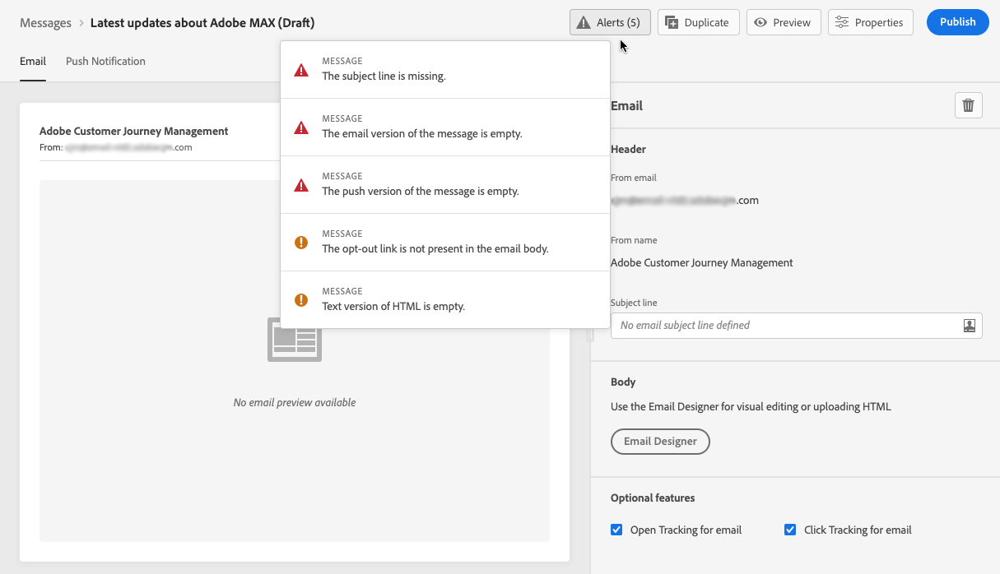

# Verificar alertas em suas mensagens {#publish-manage-messages}

## Controlos antes da publicação {#message-alerting}

Ao criar sua mensagem, os alertas avisam quando você precisa tomar ações importantes antes de publicar sua mensagem.

Os alertas são exibidos na parte superior direita da tela, conforme mostrado abaixo:

>[!NOTE]
>
>Se você não vir este botão, nenhum alerta foi detectado.

Dois tipos de alertas podem acontecer:

* **Avisos** consulte recomendações e práticas recomendadas. Por exemplo, uma mensagem será exibida se o link de recusa estiver ausente.

* **Erros** impedir a publicação da mensagem, desde que não sejam resolvidas. Por exemplo, uma mensagem avisará que a linha de assunto está ausente.

Todos os avisos e erros possíveis são detalhados [below](#alerts-and-warnings).

>[!CAUTION]
>
> Você precisa resolver tudo **erro** alertas antes da publicação.

## Lista de avisos e erros {#alerts-and-warnings}

As configurações e elementos verificados pelo sistema estão listados abaixo. Você também encontrará informações sobre como adaptar sua configuração para resolver os problemas correspondentes.

**Avisos**:

* **[!UICONTROL Opt out link not present in the email body]**: adicionar um link de unsubscription ao corpo do email é uma prática recomendada. Saiba como configurá-lo em [esta seção](consent.md).

* **[!UICONTROL Text version of html is empty]**: não se esqueça de definir uma versão de texto do corpo do email, pois ela será usada quando o conteúdo do HTML não puder ser exibido. Saiba como criar a versão de texto em [esta seção](create-email-content.md#generate-text-version).

* **[!UICONTROL Empty link is present in email body]**: verifique se todos os links no seu email estão corretos. Saiba como gerenciar conteúdo e links no [esta seção](create-email-content.md).

* **[!UICONTROL Email size has exceeded the limit of 100KB]**: para obter o delivery ideal, verifique se o tamanho do seu email não excede 100 KB. Saiba como editar conteúdo de email no [esta seção](create-email-content.md).

**Erros**:

* **[!UICONTROL Subject Line Not Present]**: a linha de assunto do email é obrigatória. Saiba como defini-lo e personalizá-lo em [esta seção](create-email.md).

   <!--HTML is empty when Amp HTML is present-->

* **[!UICONTROL Push Variant is empty]**: esse erro é exibido quando o corpo ou o título da notificação por push está ausente. Saiba como definir o conteúdo de notificação por push em [esta seção](create-push.md).

* **[!UICONTROL Email Variant is empty]**: esse erro é exibido quando o conteúdo do email não foi configurado. Saiba como criar conteúdo de email no [esta seção](design-emails.md).

* **[!UICONTROL Preset doesn’t exist]**: não é possível publicar sua mensagem se a predefinição selecionada for excluída após a criação da mensagem. Se este erro ocorrer, selecione outra predefinição na mensagem **[!UICONTROL Properties]**. Saiba mais sobre marcas em [esta seção](../configuration/about-subdomain-delegation.md).

* **[!UICONTROL Push iOS/Android payload has exceeded limit of 4KB]**: o tamanho da notificação por push não pode exceder 4 KB. Para respeitar esse limite, tente reduzir o uso de imagens ou emojis. Saiba como gerenciar o conteúdo de notificação por push no [esta seção](create-push.md).

>[!CAUTION]
>
> Para publicar sua mensagem, é necessário resolver todos os **erro** alertas.

<!--Other issues can stop publication such as:
* The push notification title is empty-->
