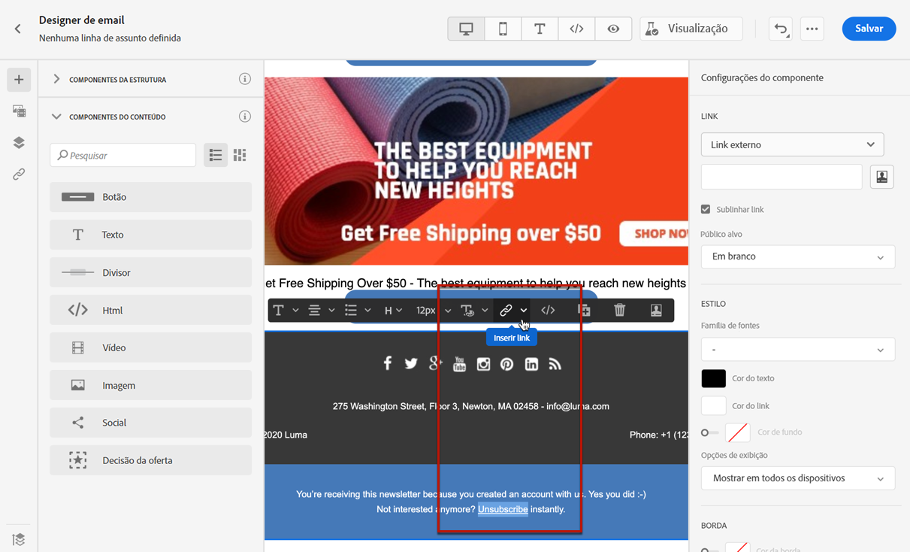
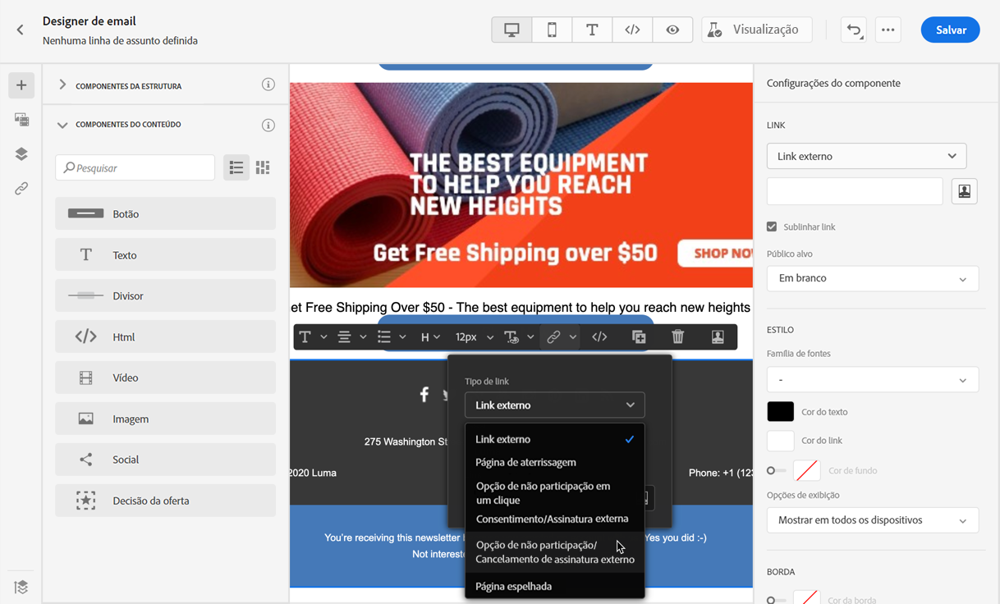
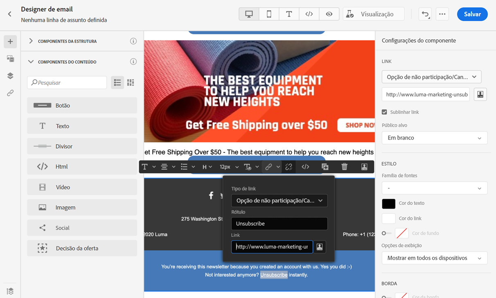
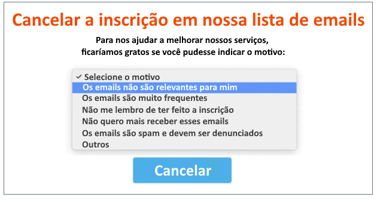
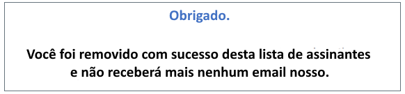
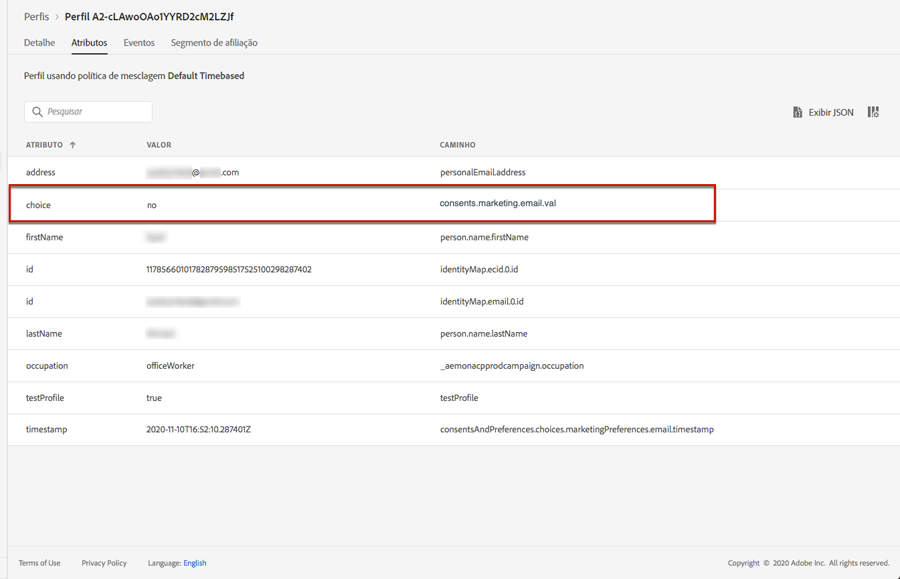
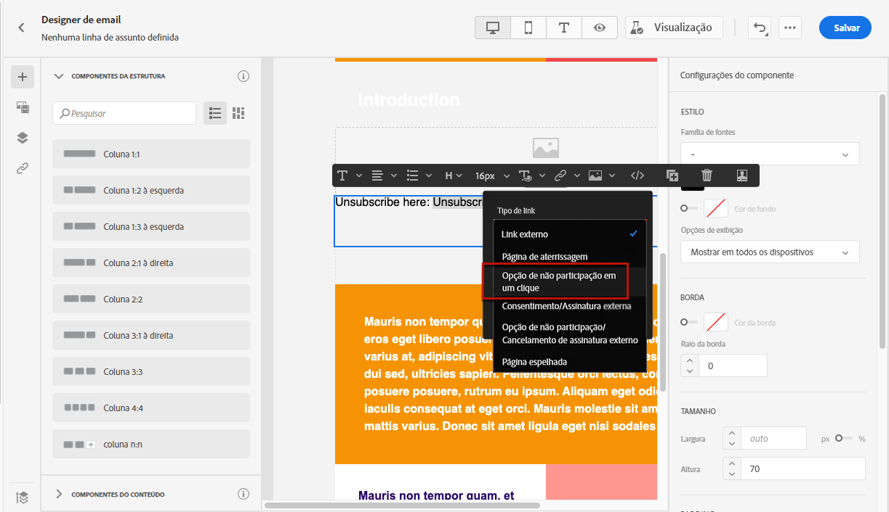
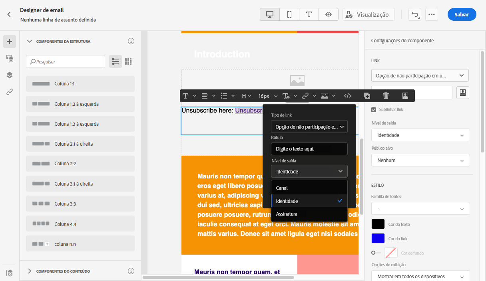
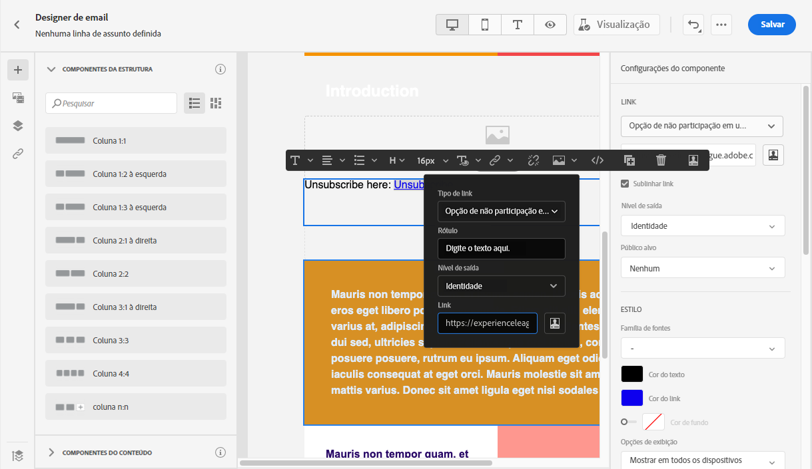
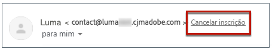

# Gerenciar consentimento {#consent}

Use o [!DNL Journey Optimizer] para rastrear o consentimento dos recipients para comunicação e entender como eles desejam se envolver com a marca gerenciando suas preferências e assinaturas.

Regulamentos como o GDPR afirmam que você deve estar em conformidade com requisitos específicos antes de poder usar informações de titulares de dados. Além disso, os titulares de dados devem poder modificar o consentimento a qualquer momento.

**Por que é importante?**

* O não cumprimento desses regulamentos traz riscos legais normativos para sua marca.
* Os regulamentos ajudam a evitar o envio de comunicações não solicitadas para seus recipients, o que pode fazer com que eles marquem suas mensagens como spam e prejudiquem sua reputação.

Saiba mais sobre como gerenciar a privacidade e os regulamentos aplicáveis na [documentação da Experience Platform](https://experienceleague.adobe.com/docs/experience-platform/privacy/home.html?lang=pt-BR){target=&quot;_blank&quot;}.

>[!NOTE]
>
>No [!DNL Journey Optimizer], o consentimento é gerido pelo [Esquema de consentimento](https://experienceleague.adobe.com/docs/experience-platform/xdm/field-groups/profile/consents.html?lang=pt-BR){target=&quot;_blank&quot;} da Experience Platform. Por padrão, o valor do campo de consentimento fica vazio e é tratado como consentimento para receber suas comunicações. Durante a integração, é possível modificar esse valor padrão para um dos valores possíveis listados [aqui](https://experienceleague.adobe.com/docs/experience-platform/xdm/data-types/consents.html?lang=pt-BR#choice-values){target=&quot;_blank&quot;}.

## Gerenciamento de opção de não participação de email {#opt-out-management}

Oferecer aos recipients a capacidade de cancelar a inscrição para receber comunicações de uma marca é um requisito legal. Saiba mais sobre a legislação aplicável na [documentação da Experience Platform](https://experienceleague.adobe.com/docs/experience-platform/privacy/regulations/overview.html?lang=pt-BR#regulations){target=&quot;_blank&quot;}.

Portanto, você sempre deve incluir um **link para cancelar a inscrição** em cada email enviado aos recipients:

* Ao clicar nesse link, os recipients serão direcionados a uma página de aterrissagem que inclui um botão para confirmar a recusa.
* Após confirmar a escolha, os dados dos perfis serão atualizados com essas informações.

>[!NOTE]
>
>As mensagens de email do tipo Marketing devem incluir um link para opção de não participação, que não é necessário para mensagens transacionais. A categoria da mensagem (**[!UICONTROL Marketing]** ou **[!UICONTROL Transactional]**) é definido na variável [superfície do canal](../configuration/channel-surfaces.md#email-type) (ou seja, predefinição de mensagem) e quando [criação da mensagem](get-started-content.md#create-new-message).

### Opção de não participação externa {#opt-out-external-lp}

Para fazer isso, você pode inserir um link para uma página de aterrissagem externa em um email para permitir que os usuários cancelem a inscrição do recebimento de comunicações da sua marca.

#### Adicionar um link para cancelar a inscrição {#add-unsubscribe-link}

Primeiro, é necessário adicionar um link de cancelamento de inscrição em uma mensagem. Para fazer isso, siga as etapas abaixo:

1. Crie sua página de aterrissagem de cancelamento de inscrição.

1. Hospede-o no sistema de terceiros de sua preferência.

1. [Criar uma mensagem](get-started-content.md) em uma jornada.

1. Selecione o texto no seu conteúdo e [insira um link](../design/message-tracking.md#insert-links) usando a barra de ferramentas contextual.

   

1. Selecione o **[!UICONTROL External Opt-out/Unsubscription]** na lista suspensa **[!UICONTROL Link type]**.

   

1. No campo **[!UICONTROL Link]**, cole o link para a sua página de aterrissagem de terceiros.

   

1. Clique em **[!UICONTROL Save]**.

#### Implementar uma chamada de API para opção de não participação {#opt-out-api}

Para efetivar a opção de não participação dos seus recipients ao enviarem suas escolhas a partir da página de aterrissagem, é preciso implementar uma **chamada de API de inscrição** por meio do [Adobe Developer](https://developer.adobe.com/){target=&quot;_blank&quot;} para atualizar as preferências dos perfis correspondentes.

Essa chamada POST é a seguinte:

Endpoint: platform.adobe.io/journey/imp/consent/preferences

Parâmetros de consulta:

* **params**: contém a carga criptografada
* **sig**: assinatura
* **pid**: ID de perfil criptografada

Esses três parâmetros serão incluídos no URL da página de aterrissagem de terceiros enviado ao seu recipient:


Requisitos do cabeçalho:

* x-api-key
* x-gw-ims-org-id
* x-sandbox-name
* autorização (token de usuário da conta técnica)

Corpo da solicitação:

```
{
   "marketing": [
       {
            "type": "email",           
            "choice": "no",          
            "scope": "channel"       
        }
    ],
 
}
```

O [!DNL Journey Optimizer] usará esses parâmetros para atualizar a escolha do perfil correspondente por meio da chamada de API do [Adobe Developer](https://developer.adobe.com){target=&quot;_blank&quot;}.

#### Enviar a mensagem com link de cancelamento de inscrição {#send-message-unsubscribe-link}

Depois de configurar o link de cancelamento de inscrição para a página de aterrissagem e implementar a chamada de API, sua mensagem estará pronta para ser enviada.

1. Enviar a mensagem incluindo o link por meio de uma [jornada](../building-journeys/journey.md).

1. Depois que a mensagem for recebida, se o recipient clicar no link de cancelamento de inscrição, a página de aterrissagem será exibida.

   

1. Se o recipient enviar o formulário (aqui, pressionando o botão **Cancelar inscrição** na página de aterrissagem), os dados do perfil serão atualizados por meio da [chamada de API](#opt-out-api).

1. O recipient que recusou a inscrição é então redirecionado para uma tela de mensagem de confirmação indicando que a recusa foi bem-sucedida.

   

   Como resultado, esse usuário não receberá a comunicação da sua marca, a menos que faça a assinatura novamente.

1. Para verificar se a escolha do perfil correspondente foi atualizada, acesse a Experience Platform e o perfil selecionando um namespace de identidade e um valor de identidade correspondente. Saiba mais na [documentação da Adobe Experience Platform](https://experienceleague.adobe.com/docs/experience-platform/profile/ui/user-guide.html?lang=pt-BR#getting-started){target=&quot;_blank&quot;}.

   

   Na guia **[!UICONTROL Attributes]**, é possível ver que o valor de **[!UICONTROL choice]** foi alterado para **[!UICONTROL no]**.

### Recusar com um clique {#one-click-opt-out}

À medida que muitos clientes buscam um processo mais fácil de cancelar inscrições, você também pode adicionar um link para opção de não participação com um clique no seu conteúdo de email. Esse link permitirá que seus recipients cancelem rapidamente a inscrição de suas comunicações, sem ser redirecionados para uma página de aterrissagem em que precisam confirmar o cancelamento, agilizando o processo de cancelamento de inscrição.

Para adicionar um link para opção de não participação no seu email, siga as etapas abaixo.

1. [Insira um link](../design/message-tracking.md#insert-links) e selecione **[!UICONTROL One click Opt-out]** como o tipo de link.

   

1. Selecione como deseja aplicar a opção de não participação: no nível de canal, identidade ou inscrição.

   

   * **[!UICONTROL Channel]**: a opção de não participação se aplica a mensagens futuras enviadas ao destino do perfil (ou seja, endereço de email) do canal atual. Se vários destinos estiverem associados a um perfil, a opção de não participação se aplica a todos os destinos (ou seja, endereços de email) no perfil desse canal.
   * **[!UICONTROL Identity]**: a opção de não participação se aplica a mensagens futuras enviadas ao destino específico (ou seja, endereço de email) que está sendo usado para a mensagem atual.
   * **[!UICONTROL Subscription]**: a opção de não participação se aplica a mensagens futuras associadas a uma lista de inscrição específica. Essa opção só poderá ser selecionada se a mensagem atual estiver associada a uma lista de inscrições.

1. Insira o URL da página de aterrissagem para onde o usuário será redirecionado após cancelar a inscrição. Esta página está aqui somente para confirmar a não participação.

   >[!NOTE]
   >
   >Se você ativou a variável **List-Unsubscribe** no nível da superfície do canal, esse URL também será usado quando os usuários clicarem no link de cancelamento de subscrição no cabeçalho do email. [Saiba mais](#unsubscribe-header)

   

   Você pode personalizar seus links. Saiba mais sobre URLs personalizados [nesta seção](../personalization/personalization-syntax.md).

1. Salve as alterações.

Depois que a mensagem for enviada por meio de uma [jornada](../building-journeys/journey.md), se um recipient clicar no link para opção de não participação, o perfil dele registrará imediatamente a opção de não participação.

### Cancelar assinatura do link no cabeçalho do email {#unsubscribe-header}

>[!CONTEXTUALHELP]
>id="ajo_admin_preset_unsubscribe"
>title="Adicionar link de cancelamento de inscrição ao cabeçalho do email"
>abstract="Ative o List-Unsubscribe para adicionar um link de cancelamento de inscrição ao cabeçalho do email. Para definir um URL de cancelamento de inscrição, insira um link de recusa de um clique no conteúdo do email."
>additional-url="https://experienceleague.adobe.com/docs/journey-optimizer/using/messages/consent.html?lang=pt-BR#one-click-opt-out" text="Recusar com um clique"

Se a variável [Opção List-Unsubscribe](../configuration/channel-surfaces.md#list-unsubscribe) estiver ativado no nível da superfície do canal, os emails correspondentes enviados com [!DNL Journey Optimizer] incluirá um link de cancelamento de subscrição no cabeçalho do email.

Por exemplo, o link de cancelamento de inscrição será exibido assim no Gmail:



>[!NOTE]
>
>Para exibir o link de cancelamento de inscrição no cabeçalho do email, o cliente de email dos destinatários deve ser compatível com esse recurso.

O endereço de cancelamento de subscrição é o padrão **[!UICONTROL Mailto (unsubscribe)]** endereço exibido na superfície do canal correspondente. [Saiba mais](../configuration/channel-surfaces.md#list-unsubscribe).

Para definir um URL de cancelamento de inscrição personalizado, insira um link de recusa de um clique no conteúdo da mensagem de email e insira o URL de sua escolha. [Saiba mais](#one-click-opt-out)

Dependendo do cliente de email, clicar no link de cancelamento de inscrição no cabeçalho terá um dos seguintes resultados:

* A solicitação de cancelamento de inscrição é enviada para o endereço de cancelamento de inscrição padrão.

* O destinatário é direcionado para o URL da página de aterrissagem que você especificou ao adicionar o link de opção de não participação à mensagem.

   >[!NOTE]
   >
   >Se você não adicionar um link de recusa de um clique no conteúdo da mensagem, nenhuma página de aterrissagem será exibida.

* O perfil correspondente é cancelado imediatamente e essa escolha é atualizada na Experience Platform. Saiba mais na [documentação da Experience Platform](https://experienceleague.adobe.com/docs/experience-platform/profile/ui/user-guide.html#getting-started){target=&quot;_blank&quot;}.

## Encaminhar o gerenciamento de recusa {#push-opt-out-management}

Os recipients de push podem cancelar a inscrição por meio de seus próprios dispositivos.

Por exemplo, ao baixar ou ao usar seu aplicativo, eles podem optar por parar as notificações. Da mesma forma, é possível alterar as configurações de notificação por meio do sistema operacional móvel.

## Gerenciamento de recusa de SMS {#sms-opt-out-management}

De acordo com os padrões e regulamentos do setor, os destinatários de SMS podem responder com palavras-chave de aceitação e recusa.
O Adobe Journey Optimizer processa automaticamente as seguintes palavras-chave nas mensagens recebidas: INICIAR, INTERROMPER e REINICIAR. Essas palavras-chave acionam respostas padrão automáticas do provedor de SMS.

Para obter mais informações sobre recusa de SMS, consulte esta [página](../messages/create-sms.md#opt-in-and-opt-out).