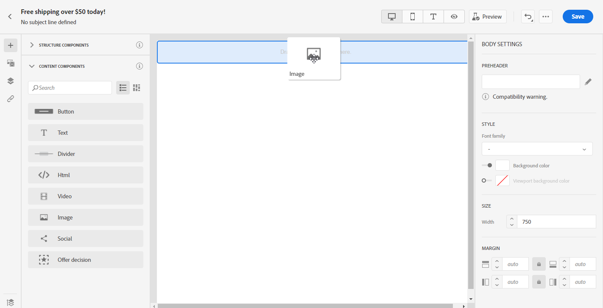

# Usar os componentes de conteúdo do Designer de email {#content-components}

>[!CONTEXTUALHELP]
>id="ac_content_components"
>title="Sobre componentes de conteúdo"
>abstract="Os componentes do conteúdo são espaços reservados para o conteúdo vazio que podem ser usados para criar o layout de um email."

Ao criar seu conteúdo de email do zero, **[!UICONTROL Content components]** O permite personalizar ainda mais seu email com componentes brutos e vazios que podem ser usados depois de colocados no email.
Você pode adicionar quantos **[!UICONTROL Content components]** conforme necessário dentro de um **[!UICONTROL Structure component]** que define o layout do email.

## Botão {#buttons}

Use o **[!UICONTROL Button]** para inserir vários botões no email e redirecionar o público de email para outra página.

1. De **[!UICONTROL Content components]**, arrastar e soltar **[!UICONTROL Button]** em **[!UICONTROL Structure component]**.

   

1. Clique no botão recém-adicionado para personalizar o texto e ter acesso ao **[!UICONTROL Components Settings]** no painel direito do designer de email.

   

1. No **[!UICONTROL Link]** do **[!UICONTROL Components Settings]**, adicione o URL para o qual você deseja que o público-alvo seja redirecionado ao clicar no botão .

1. Escolha como seu público será redirecionado com o **[!UICONTROL Target]** lista suspensa:

   * **[!UICONTROL None]**: abre o link no mesmo quadro em que foi clicado (padrão).
   * **[!UICONTROL Blank]**: abre o link em uma nova janela ou guia.
   * **[!UICONTROL Self]**: abre o link no mesmo quadro em que foi clicado.
   * **[!UICONTROL Parent]**: abre o link no quadro principal.
   * **[!UICONTROL Top]**: abre o link no corpo completo da janela.

   

1. Agora você pode personalizar ainda mais seu botão, alterando o **[!UICONTROL Style]**, **[!UICONTROL Margin]** e **[!UICONTROL Border]** por exemplo.

## Texto {#text}

Use o **[!UICONTROL Text]** componente para inserir texto no email. É possível ajustar a cor, o estilo e o tamanho do texto em **[!UICONTROL Component Settings]**.

1. Em **[!UICONTROL Content Components]**, arrastar e soltar **[!UICONTROL Text]** em **[!UICONTROL Structure component]**.

   

1. Clique no componente recém-adicionado para personalizar o texto e ter acesso ao **[!UICONTROL Components Settings]** no painel direito do designer de email.

1. Altere o texto com as seguintes opções disponíveis na barra de ferramentas:

   

   * **[!UICONTROL Change text style]**: aplique negrito, itálico, sublinhado ou riscado ao seu texto.
   * **Alterar alinhamento**: escolha entre alinhamento esquerdo, direito, central ou justificado para o texto.
   * **[!UICONTROL Create list]**: adicione marcadores ou listas de números ao texto.
   * **[!UICONTROL Set heading]**: adicione até seis níveis de cabeçalho ao texto.
   * **Tamanho da fonte**: selecione o tamanho da fonte do texto em pixels.
   * **[!UICONTROL Edit image]**: adicione uma imagem ou um ativo ao seu componente de texto. [Saiba mais sobre o gerenciamento de ativos](assets-essentials.md).
   * **[!UICONTROL Show the source code]**: exibir o código-fonte do texto. Ele não pode ser modificado.
   * **[!UICONTROL Duplicate]**: adicione uma cópia do seu componente de texto.
   * **[!UICONTROL Delete]**: exclua o componente de texto selecionado do seu email.
   * **[!UICONTROL Add personalization]**: adicione campos de personalização para personalizar o conteúdo dos dados de seus perfis. [Saiba mais sobre a personalização de conteúdo](../personalization/personalize.md).

1. Para obter uma melhor experiência do usuário, você pode adicionar campos de personalização para direcionar seu público-alvo. Para obter mais informações, consulte esta [seção](../personalization/personalize.md).

1. Ajuste o **[!UICONTROL Text color]**, **[!UICONTROL Font family]** e **[!UICONTROL Size]** no **[!UICONTROL Components Settings]**.

   

## Divisor {#divider}

Use o **[!UICONTROL Divider]** para inserir uma linha divisória para organizar o layout e o conteúdo do seu email.
Você pode selecionar a cor, o estilo e o tamanho da linha de quebra em **[!UICONTROL Component Settings]**.

## HTML {#HTML}

Use o **[!UICONTROL HTML]** para copiar e colar as diferentes partes do HTML existente. Isso permite criar componentes HTML modulares gratuitos.

Para simplesmente tornar um conteúdo externo compatível com o Designer de email, o Adobe recomenda criar uma mensagem do zero e copiar o conteúdo do email existente para componentes.

1. Em **[!UICONTROL Content Components]**, arrastar e soltar **[!UICONTROL HTML]** em **[!UICONTROL Structure component]**.

   

1. Clique no componente recém-adicionado e **[!UICONTROL Show the source code]** para adicionar o HTML.

   

1. Copie e cole o código do HTML que deseja adicionar ao seu email e clique em **[!UICONTROL Save]**.

1. Agora você pode personalizar ainda mais seu HTML alterando o **[!UICONTROL Style]**, **[!UICONTROL Margin]** e **[!UICONTROL Border]** por exemplo, ou adicionar um link para redirecionar seu público para outro conteúdo.

## Imagem {#image}

Use o **[!UICONTROL Image]** componente para inserir um arquivo de imagem de seu computador no email.

1. Em **[!UICONTROL Content Components]**, arrastar e soltar **[!UICONTROL Image]** em **[!UICONTROL Structure component]**.

   

1. Clique em **[!UICONTROL Browse]** para escolher um arquivo de imagem de seus ativos.

   Para saber mais sobre [!DNL Assets Essentials], consulte [Documentação do Adobe Experience Manager Assets Essentials](https://experienceleague.adobe.com/docs/experience-manager-assets-essentials/help/introduction.html){target=&quot;_blank&quot;}.

1. Clique no componente recém-adicionado para começar a configurar **[!UICONTROL Content Components]** e ter acesso ao **[!UICONTROL Components Settings]** no painel direito do designer de email.

1. Configure suas propriedades da imagem:

   * **[!UICONTROL Image Title]** permite definir um título para a imagem.
   * **[!UICONTROL Alt text]** permite definir a legenda vinculada à imagem. Isso corresponde ao atributo HTML alt.

   

1. Agora você pode personalizar ainda mais sua imagem, alterando o **[!UICONTROL Style]**, **[!UICONTROL Margin]** e **[!UICONTROL Border]** por exemplo, ou adicionar um link para redirecionar seu público para outro conteúdo.

## Vídeo {#Video}

>[!CONTEXTUALHELP]
>id="ac_edition_video"
>title="Configurações de vídeo"
>abstract="Use esse componente para inserir um vídeo no seu email. Observe que os vídeos não funcionam em todos os clientes de email. Recomendamos definir uma imagem de fallback."
>additional-url="https://www.emailonacid.com/blog/article/email-development/a_how_to_guide_to_embedding_html5_video_in_email/" text="Informações adicionais"

Use o **[!UICONTROL Video]** para inserir um vídeo no seu email por meio de um link de URL.

1. Em **[!UICONTROL Content Components]**, arrastar e soltar **[!UICONTROL Video]** em **[!UICONTROL Structure component]**.

   

1. Clique no componente recém-adicionado para começar a configurar **[!UICONTROL Content Components]** e ter acesso ao **[!UICONTROL Components Settings]** no painel direito do designer de email.

1. No **[!UICONTROL Video link]** do **[!UICONTROL Components Settings]**, adicione o URL do vídeo.

   

1. Você pode adicionar uma **[!UICONTROL Poster image]** ao vídeo para especificar uma imagem a ser exibida até o público clicar no botão Reproduzir.

1. Agora você pode personalizar ainda mais sua imagem, alterando o **[!UICONTROL Style]**, **[!UICONTROL Margin]** e **[!UICONTROL Border]** por exemplo.

## Social {#social}

Use o **[!UICONTROL Social]** para inserir links às páginas de mídia social no seu email.

1. Em **[!UICONTROL Content Components]**, arrastar e soltar **[!UICONTROL Social]** em **[!UICONTROL Structure component]**.

   

1. Clique no componente recém-adicionado para começar a configurar **[!UICONTROL Content Components]** e ter acesso ao **[!UICONTROL Components Settings]** no painel direito do designer de email.

1. No **[!UICONTROL Social]** do **[!UICONTROL Components Settings]**, escolha que mídia social deseja adicionar ou remover.

   

1. Escolha o tamanho dos ícones no **[!UICONTROL Size of images]** campo.

1. Clique em cada um dos ícones de redes sociais para configurar o **[!UICONTROL URL]** para o qual o público-alvo será redirecionado.

   

1. Você também pode alterar os ícones de cada uma das redes sociais, se necessário, na variável **[!UICONTROL Image]** campo.

1. Agora você pode personalizar ainda mais seus ícones de redes sociais alterando o **[!UICONTROL Style]**, **[!UICONTROL Margin]** e **[!UICONTROL Border]**.

## Decisão da oferta {#offer-decision}

Use o **[!UICONTROL Offer decision]** componente para inserir decisões (anteriormente conhecido como atividades de oferta) em suas mensagens. As decisões aproveitarão o Gerenciamento de decisões para escolher a melhor oferta a ser entregue aos clientes.

Tópicos relacionados:

* [Introdução ao Gerenciamento de decisão](../offers/get-started/starting-offer-decisioning.md).
* [Adicionar ofertas personalizadas em mensagens](deliver-personalized-offers.md).
