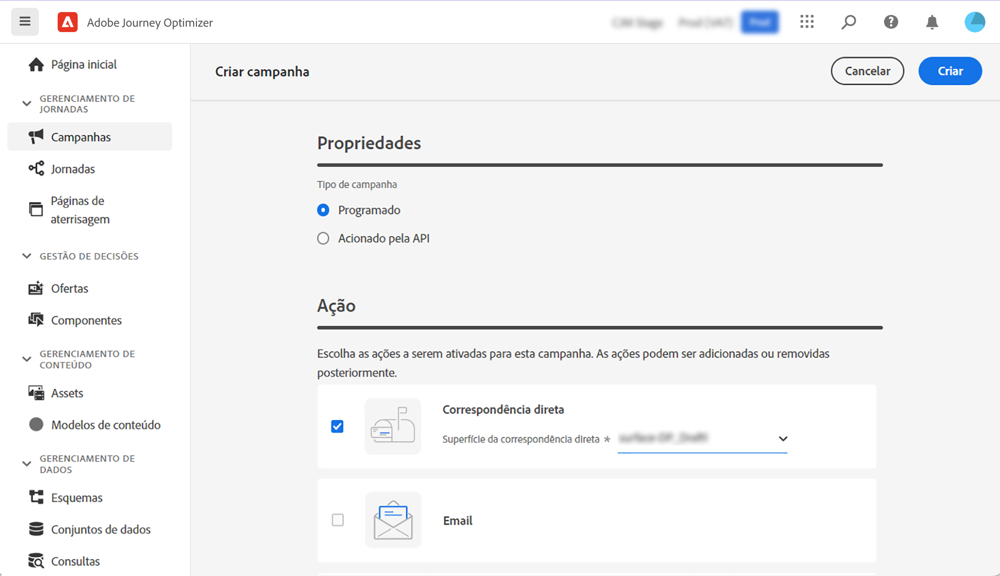
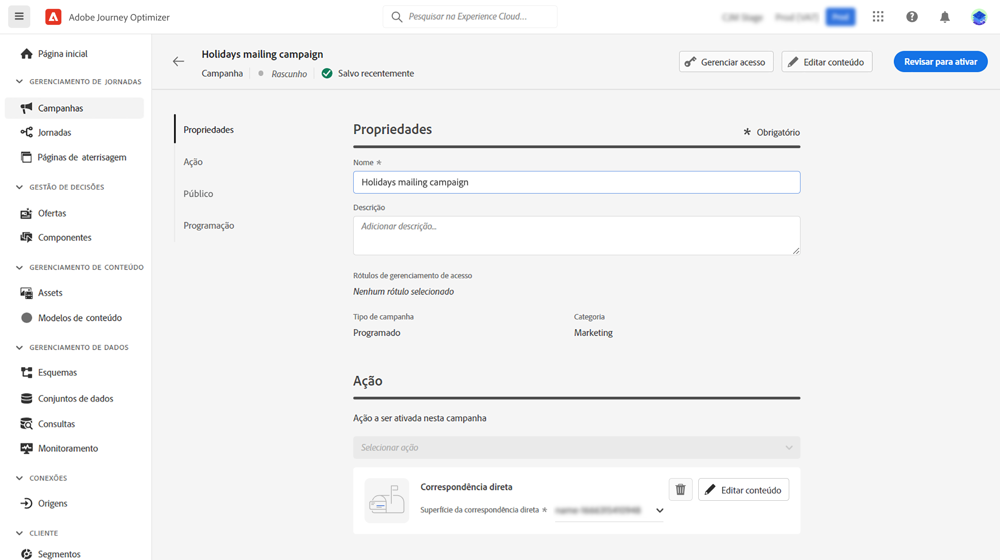
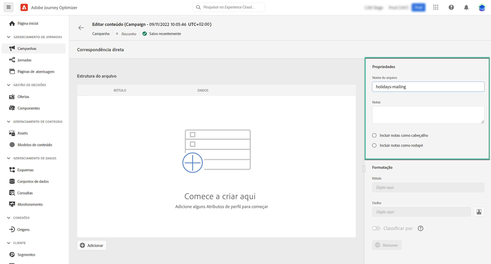
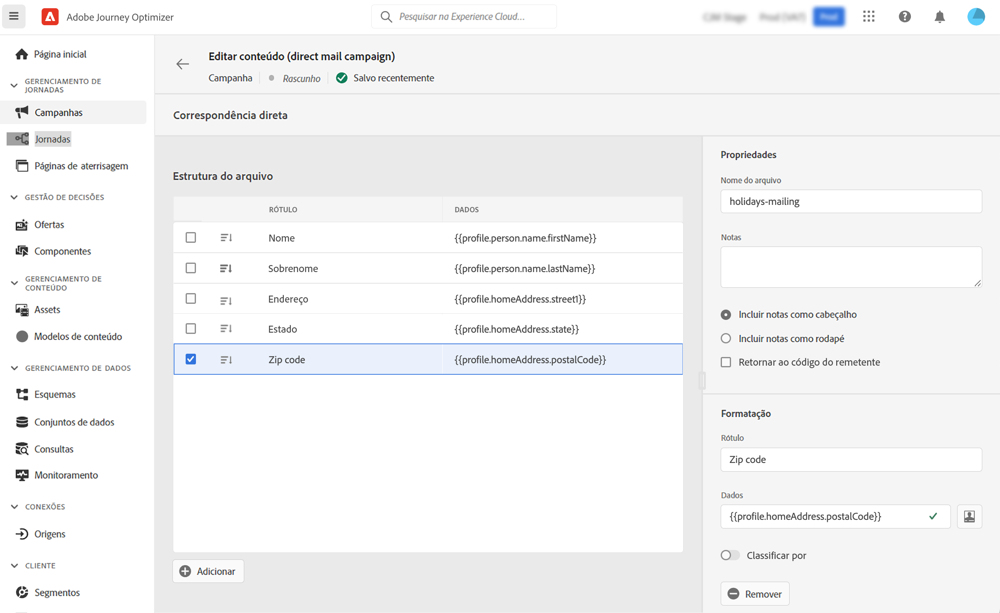

# Criar uma mensagem de correspondência direta {#create-direct}

>[!CONTEXTUALHELP]
>id="ajo_direct_mail"
>title="Criação de correspondência direta"
>abstract="Crie mensagens de mala direta em campanhas programadas e crie os arquivos de extração exigidos pelos provedores de mala direta para enviar mala para seus clientes."

A mala direta é um canal offline que permite personalizar e gerar os arquivos de extração exigidos por provedores de mala direta para enviar mala para seus clientes.

Ao criar uma correspondência direta, o Journey Optimizer gera um arquivo incluindo todos os perfis segmentados e os dados escolhidos (endereço postal, atributos de perfil, por exemplo). Você poderá enviar esse arquivo para seu provedor de correspondência direta que irá cuidar realmente do envio.

As mensagens de correspondência direta só podem ser criadas no contexto de campanhas programadas. Eles não estão disponíveis para uso em campanhas acionadas por API ou em jornadas.

>[!IMPORTANT]
>
>Antes de enviar uma mensagem de mala direta, verifique se você configurou:
>* A [configuração de roteamento de arquivos](../configuration/direct-mail-configuration.md#file-routing-configuration) que especifica o servidor onde o arquivo de extração deve ser carregado e armazenado,
>* A [superfície da mensagem de correspondência direta](../configuration/direct-mail-configuration.md#direct-mail-surface) que referenciará a configuração de roteamento de arquivos.

## Criar a mensagem de mala direta {#create}

As etapas para criar e enviar uma mensagem de correspondência direta são as seguintes:

1. Crie uma nova campanha agendada, selecione **[!UICONTROL Correspondência direta]** como sua ação e escolha a superfície da mensagem a ser usada.

   

1. Clique em **[!UICONTROL Criar]** em seguida, defina as informações básicas sobre sua campanha (nome, descrição). [Saiba como configurar uma campanha](../campaigns/create-campaign.md)

   

1. Clique no botão **[!UICONTROL Editar conteúdo]** para configurar o arquivo de extração a ser enviado ao seu provedor de correspondência direta.

1. Defina o nome do arquivo de extração no **[!UICONTROL Nome do arquivo]** campo.

   Às vezes, pode ser necessário adicionar informações ao início ou final do arquivo de extração. Para fazer isso, use o **[!UICONTROL Notas]** em seguida, especifique se deseja incluir a nota como cabeçalho ou rodapé.

   <!--Click on the button to the right of the Output file field and enter the desired label. You can use personalization fields, content blocks and dynamic text (see Defining content). For example, you can complete the label with the delivery ID or the extraction date.-->

   

1. Use a área à esquerda para definir as informações a serem exibidas como colunas no arquivo de extração:

   1. Clique no botão **[!UICONTROL Adicionar]** para adicionar uma nova coluna e, em seguida, selecione-a na lista.

   1. No **[!UICONTROL Formatação]** , especifique um rótulo para a coluna e defina os atributos de perfil a serem exibidos usando o [Editor de expressão](../personalization/personalization-build-expressions.md).

      

   1. Para classificar o arquivo de extração usando a coluna selecionada, alterne a **[!UICONTROL Classificar por]** ativada. O **[!UICONTROL Ordenar por]** será exibido ao lado do rótulo da coluna na estrutura do arquivo.

1. Repita essas etapas para adicionar quantas colunas forem necessárias para criar seu arquivo de extração. Observe que é possível adicionar até 50 colunas.

   

   É possível excluir uma coluna a qualquer momento selecionando-a e clicando no botão **[!UICONTROL Remover]** do botão **[!UICONTROL Formatação]** seção.

1. Após definir o conteúdo da correspondência direta, conclua a configuração da campanha.

   Quando a campanha for iniciada, o arquivo de extração será gerado e carregado automaticamente no servidor especificado em [configuração de roteamento de arquivos](../configuration/direct-mail-configuration.md).
