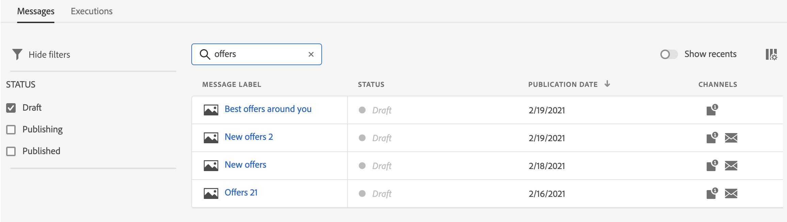
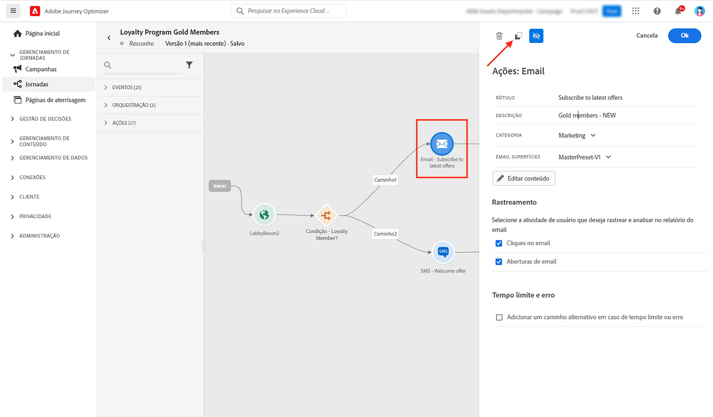

# Introdução a mensagens {#get-started-contents-messages}

Use o [!DNL Journey Optimizer] para aproveitar vários recursos, como ativos e conteúdo em um único local, e criar e publicar notificações por push e mensagens de email personalizadas.

* Aproveite os recursos de design de email do [!DNL Journey Optimizer] **** para criar ou importar emails responsivos.

* Aproveite o **Adobe Experience Manager Assets Essentials** para criar seu próprio banco de dados de ativos e enriquecer seus emails.

* Melhore a experiência dos clientes criando **mensagens de push e email personalizadas** com base em seus atributos de perfil.

* **Crie mensagens de push e email** com base nesses conteúdos e, em seguida, publique-as.

## Acessar mensagens {#access-messages}

As mensagens estão disponíveis por meio do atalho **[!UICONTROL Messages]** no painel de navegação esquerdo. Todas as mensagens são listadas e classificadas por data de publicação (para mensagens publicadas) ou data de criação (para mensagens de rascunho).

>[!NOTE]
>
>Os usuários podem acessar, criar, editar e/ou publicar mensagens dependendo de seu perfil de produto. Saiba mais sobre permissões de usuário [nesta seção](../administration/permissions.md).

* Use o botão **[!UICONTROL Show recents]** para adicionar links diretos às mensagens acessadas nos últimos 5 dias.

   

* Use o ícone de filtro para exibir somente mensagens de rascunho, publicadas ou que estejam sendo publicadas. Também é possível pesquisar pelo rótulo da mensagem, conforme abaixo:

   

* Você pode arquivar as mensagens não utilizadas para limpar a lista de mensagens usando o ícone dedicado no menu de ações rápidas.

   

   Use o ícone de filtro para exibir todas as mensagens arquivadas e clique no ícone **[!UICONTROL Unarchive]** para remover um item da lista de mensagens arquivadas.

   >[!NOTE]
   >
   >Não é possível abrir uma mensagem arquivada. Você deve desarquivá-la primeiro.

## Criar uma nova mensagem {#create-new-message}

Para criar uma nova mensagem, siga as etapas abaixo:

1. Acesse a lista de mensagens e clique em **[!UICONTROL Create Message]**.

1. Defina as propriedades da mensagem.

   

   * Insira um **[!UICONTROL Title]** (obrigatório) e uma **[!UICONTROL Description]**.

   * Selecione a **[!UICONTROL Message category]**: marketing ou transacional.

   * Selecione os canais que deseja usar para essa mensagem: notificação por email e/ou notificação por push. Você deve selecionar pelo menos um canal para criar a mensagem.

   * Selecione a **[!UICONTROL Preset]** para usar na mensagem.

      As predefinições incluem todos os parâmetros necessários para que uma notificação por email e/ou por push seja enviada de acordo com sua marca. [Saiba mais sobre predefinições](../configuration/message-presets.md).
   >[!CAUTION]
   >
   >Você deve escolher uma predefinição de mensagem válida para a categoria e os canais selecionados.

   Observe que é possível acessar e modificar o título, a descrição e a predefinição da mensagem a qualquer momento usando o botão **[!UICONTROL Properties]** na interface da mensagem.

1. Clique em **[!UICONTROL Create]** para confirmar a criação da mensagem. Sua mensagem é adicionada à lista de mensagens, no status **[!UICONTROL Draft]**.

   Uma guia está disponível para cada canal selecionado. Use essas guias para configurar o conteúdo de cada canal. Você pode remover uma guia selecionando-a e clicando no botão **[!UICONTROL Delete channel]** à direita.

   

   Agora você pode criar o conteúdo da mensagem e adaptar as configurações. Informações detalhadas sobre as configurações de email e notificação por push estão disponíveis nas seguintes seções:

   * [Criar um email](create-email.md)
   * [Criar uma notificação por push](create-push.md)

   >[!NOTE]
   >   
   >Você pode personalizar suas mensagens usando os dados dos perfis por meio do editor de expressão. Para saber mais sobre personalizações, consulte [esta seção](../personalization/personalize.md).

1. Controle a renderização das mensagens e verifique as configurações de personalização com perfis de teste, usando a seção de visualização no lado esquerdo. Para obter mais informações, consulte [esta seção](../design/preview.md).

   

1. Verifique os alertas na seção superior do editor.  Alguns deles são avisos simples, mas outros podem impedir que você publique a mensagem. Saiba mais [nesta seção](alerts.md).

1. Agora você pode publicar sua mensagem clicando no botão **[!UICONTROL Publish]**, ou mantenha-a como rascunho e publique-a posteriormente. Para obter mais informações sobre como publicar mensagens, consulte [esta seção](publish-manage-message.md).

## Duplicar uma mensagem {#duplicate-message}

Para criar uma mensagem a partir de uma existente, siga as etapas abaixo.

1. Abra a mensagem que deseja copiar.

1. Use o botão **[!UICONTROL Duplicate]** na interface da mensagem.

   

   Todas as definições e configurações serão copiadas para a nova mensagem.

1. É possível renomear a mensagem antes de confirmar a duplicação.

   

1. Uma mensagem de confirmação é exibida na parte inferior da janela assim que a nova mensagem é criada.

Também é possível duplicar uma mensagem da lista de mensagens, usando o ícone dedicado do menu de ações rápidas.

O mesmo processo de confirmação se aplica.

