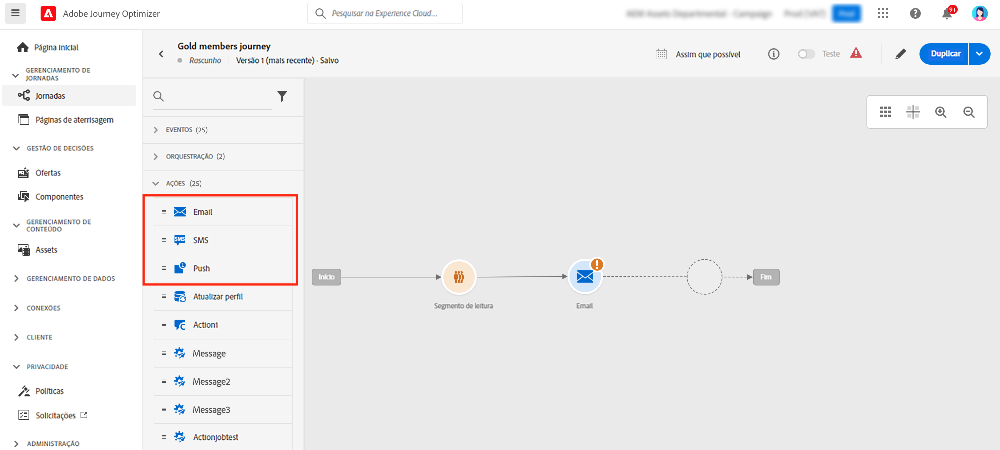
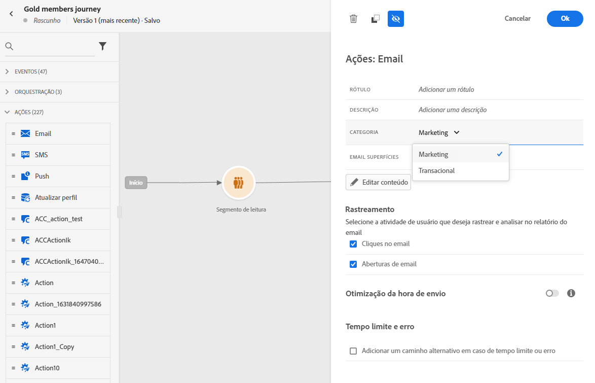
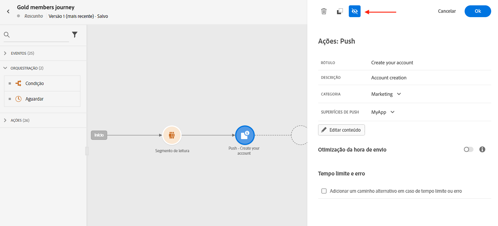
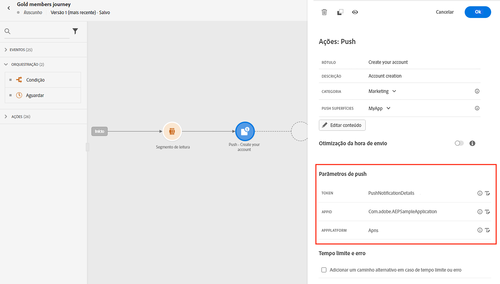
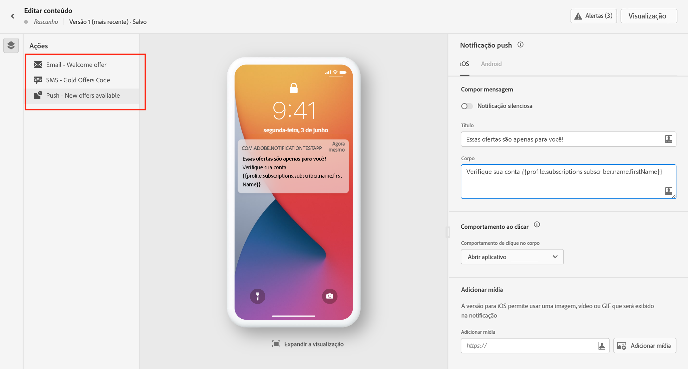
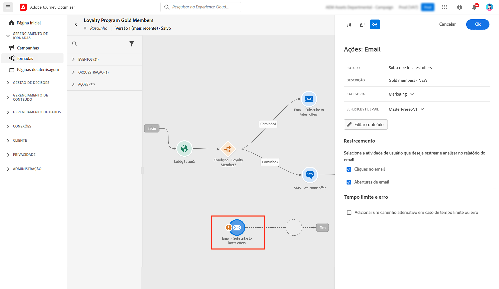
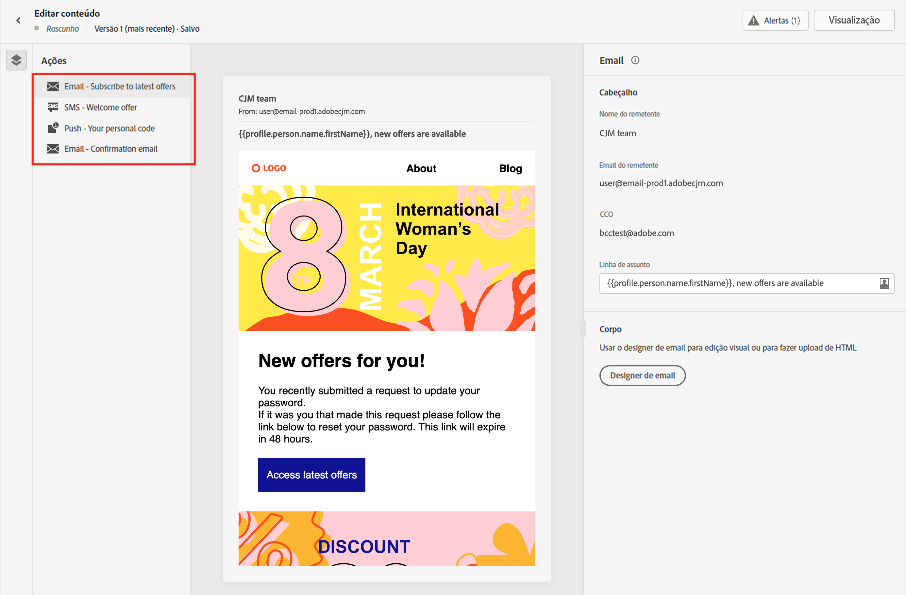
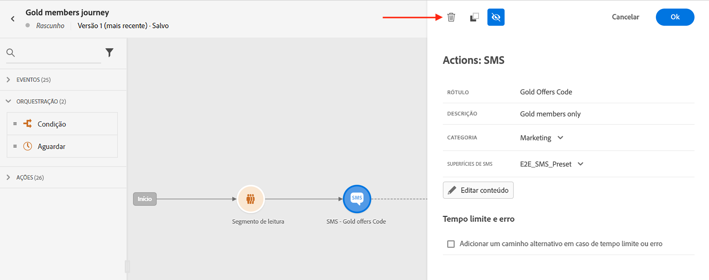

# Adicionar mensagens no jornada{#messages-in-journeys}

>[!CONTEXTUALHELP]
>id="ajo_message_category"
>title="Categoria da mensagem"
>abstract="Escolha Marketing para mensagens comerciais ou Transacional para mensagens não comerciais, como confirmação de pedidos, notificações de redefinição de senha ou informações de entrega"

>[!CONTEXTUALHELP]
>id="ajo_message_surface"
>title="Superfície de canal"
>abstract="Uma superfície de canal é uma instância desse canal que tem todas as configurações para fornecer uma ação com sucesso por meio de uma campanha ou jornada. É definida por um administrador do sistema."

Em suas jornadas, use as ações do canal para projetar e personalizar a mensagem que deseja enviar para o seu público-alvo. Ao adicionar um email, um SMS ou uma ação de push às telas do jornada, você está criando um envio acionado. Quando os contatos atingem essa ação de canal, o Adobe Journey Optimizer envia a mensagem automaticamente.

>[!NOTE]
>Você também pode criar campanhas para enviar mensagens programadas. Saiba mais [nesta seção](../campaigns/get-started-with-campaigns.md).

Para adicionar mensagens em uma jornada, adicione uma atividade de push, SMS ou email nas telas de jornada.

1. Inicie a jornada com uma atividade de [Evento](../building-journeys/general-events.md) ou [Segmento de leitura](../building-journeys/read-segment.md).

1. Na seção **Ações** da paleta, arraste e solte na tela uma atividade de **email**, **SMS** ou **push**.

   

1. Insira um rótulo e uma descrição.

1. Selecione a **[!UICONTROL Category]** da mensagem: escolha **Marketing** para mensagens comerciais ou **Transacional** para mensagens não comerciais, como confirmações de pedidos, notificações de redefinição de senha ou informações de entrega.

   >[!CAUTION]
   >
   >Se você definiu [regras de frequência](../configuration/frequency-rules.md) para um canal e categoria específicos, elas são aplicadas automaticamente à mensagem ao selecionar esse canal e categoria. Atualmente, somente a categoria **[!UICONTROL Marketing]** está disponível para regras de frequência.

   

   >[!CAUTION]
   >
   >As mensagens do tipo Marketing devem incluir um [link para opção de não participação](../messages/consent.md#opt-out-management). Isso não é necessário para mensagens transacionais, pois essas mensagens podem ser enviadas a perfis que cancelaram a assinatura de comunicações de marketing.

1. Selecione a **[!UICONTROL Surface]** de canal (ou seja, predefinição de mensagem) a ser usada para enviar a mensagem.

   Uma superfície é uma configuração que foi definida por um [Administrador do sistema](../start/path/administrator.md). Ela contém todos os parâmetros técnicos para enviar a mensagem, como parâmetros de cabeçalho, subdomínio, aplicativos móveis etc. [Saiba mais](../configuration/channel-surfaces.md).

   >[!CAUTION]
   >
   >Você deve escolher uma superfície de canal válida para a categoria e o canal de mensagens selecionados.

   É possível acessar e modificar o rótulo, a descrição e a superfície da mensagem a qualquer momento usando o botão **[!UICONTROL Properties]** na interface da mensagem.

1. Criar o conteúdo da mensagem.

   Saiba mais sobre as etapas detalhadas para criar o conteúdo da mensagem na página a seguir:

   * [Criar um email](create-email.md)
   * [Criar uma notificação por push](create-push.md)
   * [Criar uma mensagem de SMS.](create-sms.md)

## Habilitar otimização de tempo de envio{#sto-in-journeys}

Para notificações por email e por push, é possível habilitar a **[!UICONTROL Send-time optimization]**.

Use a **[!UICONTROL Send-time optimization]** para agendar tempos de envio personalizados para cada usuário a fim de aumentar as taxas de abertura e de clique de suas mensagens. [Saiba mais](../messages/send-time-optimization.md).

## Parâmetros avançados{#adv-settings}

Parâmetros avançados são somente leitura e ocultos por padrão.

Para acessar os parâmetros avançados, clique no ícone **[!UICONTROL Show read-only fields]** na parte superior do painel de mensagens.

Parâmetros avançados são exibidos na parte inferior do painel de mensagens. Esses parâmetros são definidos pelo [administrador do sistema](../start/path/administrator.md) na [superfície de canal](../configuration/channel-surfaces.md) (ou seja, predefinição de mensagem) associada à mensagem.

Para notificações por push, é possível exibir os seguintes parâmetros: Token, AppID, AppPlatform.

Para emails, é possível exibir o endereço de email principal.

Para uso específico, é possível substituir esses valores em contextos específicos. Para forçar um valor, clique no ícone **Habilitar substituição de parâmetro** à direita do campo. Essa opção pode ser útil, por exemplo, para:

* Testar um email; você pode adicionar seu endereço de email. Após publicar a jornada, o email será enviado para você.
* Consultar o endereço de email dos assinantes de uma lista. Saiba mais [neste caso de uso](../building-journeys/message-to-subscribers-uc.md).

Clique no mesmo ícone para ocultar configurações avançadas.

## Procurar mensagens{#browse-message}

Quando várias mensagens são usadas em uma jornada, é possível alternar de uma para outra a partir da tela **Editar conteúdo**.

Você pode então [verificar alertas](alerts.md) e [simular](../design/preview.md) cada conteúdo em uma única visualização.

## Duplicar uma mensagem {#duplicate-message}

Você pode copiar uma mensagem existente da tela de jornada.

Para fazer isso, siga as etapas abaixo:

1. Selecione a mensagem que deseja copiar.

1. Use o botão **[!UICONTROL Copy]** no painel **[!UICONTROL Action]**.

   

1. Pressione **Crtl+V** para colar a mensagem.

   A mensagem será adicionada às telas de jornada. Todas as definições e configurações serão copiadas para a nova mensagem.

   

1. Renomeie a mensagem para poder diferenciar a mensagem inicial da cópia, por exemplo, ao editar mensagens, conforme abaixo:

   

>[!NOTE]
>
>Para emails, você também pode transformar uma mensagem existente em um modelo. [Saiba mais](../design/email-templates.md).

## Excluir uma mensagem{#delete-message}

Para excluir uma mensagem, use o ícone de lixeira na parte superior do painel de atividade do canal.

Use o botão **[!UICONTROL Confirm]** para validar.
