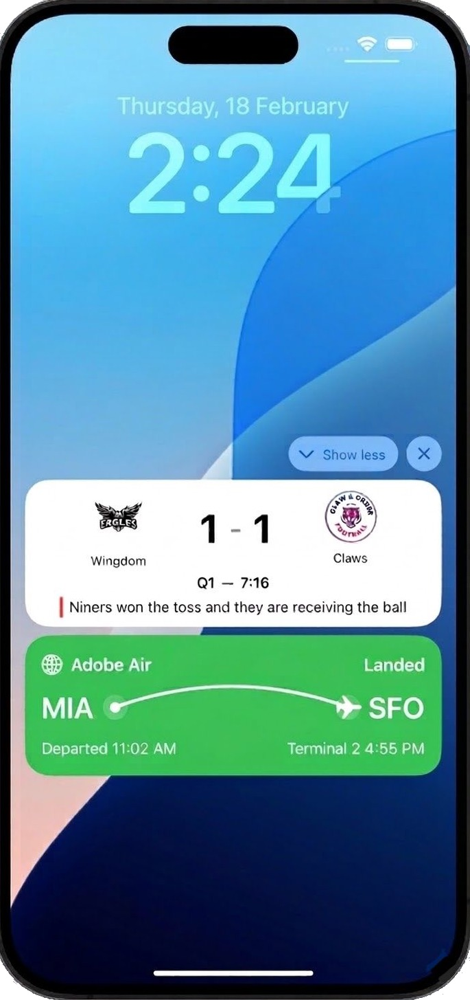

# Introdução às Atividades em tempo real {#get-started-mobile-live}

>[!BEGINSHADEBOX]

**Nesta página:** descubra como as atividades ao vivo fornecem atualizações persistentes e em tempo real na Tela de bloqueio do iPhone e no Dynamic Island para que você possa manter os usuários engajados durante eventos em andamento e planejar a configuração e as campanhas acionadas por API necessárias para enviá-las com o Adobe Journey Optimizer.

>[!ENDSHADEBOX]

As atividades em tempo real são elementos de interface persistentes e visíveis exibidos na tela de bloqueio do dispositivo. Elas permitem que seu aplicativo apresente informações atualizadas em tempo real, mantendo os usuários informados durante um evento contínuo, sem exigir que eles abram o aplicativo ou recebam notificações por push repetidas.

>[!AVAILABILITY]
>
>A Atividade em tempo real no Adobe Journey Optimizer é compatível somente com o Apple iOS.

Diferentemente das notificações por push tradicionais, as atividades em tempo real representam o **engajamento baseado em estado**: em vez de fornecer alertas únicos, elas mantêm uma presença contínua e contextual, atualizada dinamicamente à medida que os eventos evoluem.

<table style="table-layout:fixed"><tr style="border: 0;">
<td>

</td>
<td>

<strong>Principais benefícios</strong>

As atividades em tempo real alteram o engajamento móvel de baseado em notificação para baseado em estado, permitindo que as marcas:

<ul>
<li>Mantenham uma <strong>presença contínua</strong> na Tela de bloqueio durante eventos de alto valor</li>
<li><strong>Atualizem informações dinamicamente</strong> sem sobrecarregar os usuários com notificações repetidas</li>
<li>Entreguem <strong>momentos em dispositivos móveis mais relevantes e contextuais</strong> vinculados a eventos reais</li>
<li><strong>Aumentem o engajamento e a retenção</strong> durante transações ativas ou experiências em tempo real</li>
</ul>
</td>
</tr>
</table>

Com o Adobe Journey Optimizer, você pode **iniciar**, **atualizar** e **encerrar** atividades em tempo real de forma remota e programática por meio de campanhas acionadas por API, oferecendo suporte a casos de uso individuais e baseados em público-alvo em grande escala.

As atividades em tempo real podem ser iniciadas **apenas** por meio de campanhas **acionadas por API**, permitindo que você forneça conteúdos personalizados e realize toda a personalização por meio de seu próprio conteúdo.
O tipo de campanha **acionada por API** apropriado deve ser selecionado com base no caso de uso pretendido para a atividade em tempo real:

* Selecione **Marketing acionado por API** para casos de uso de transmissão: atualizações baseadas em público-alvo enviadas em grande escala:

  * Pontuações esportivas e contagem regressiva de eventos ao vivo
  * Atualizações sobre o status do voo para todos os passageiros em uma rota
  * Experiências compartilhadas em um segmento de usuário

* Selecione **Transacional acionado por API** para casos de uso individuais — atualizações em tempo real 1:1 por usuário:

  * Rastreamento de pedido e progresso de entrega
  * Atualizações de status de viagem ou serviço
  * Confirmações de reservas e agendamentos em tempo real

## Guia de início rápido

Conclua as etapas abaixo para configurar e implementar Atividades em tempo real no aplicativo:

1. **[Configure o Adobe Journey Optimizer](mobile-live-configuration.md)**

   Defina o ambiente criando uma configuração de dispositivos móveis.

1. **[Integre o SDK para dispositivos móveis da Adobe Experience Platform](mobile-live-configuration-sdk.md)**

   Integre o SDK para dispositivos móveis da Adobe Experience Platform para habilitar atualizações dinâmicas e em tempo real na tela de bloqueio e na Dynamic Island.

1. **[Criar atividade em tempo real no Journey Optimizer](create-mobile-live.md)**

   Use campanhas acionadas por API no Journey Optimizer para iniciar uma atividade em tempo real.

1. **[Monitorar suas campanhas](../reports/campaign-global-report-cja-activity.md)**

   Comece medindo o impacto da atividade em tempo real com relatórios integrados.

## Vídeo tutorial

Descubra como configurar as atividades em tempo real do iOS com o Adobe Journey Optimizer para fornecer atualizações avançadas em tempo real na Tela de bloqueio do iPhone e no Dynamic Island.

>[!VIDEO](https://video.tv.adobe.com/v/3479864/?learn=on)
