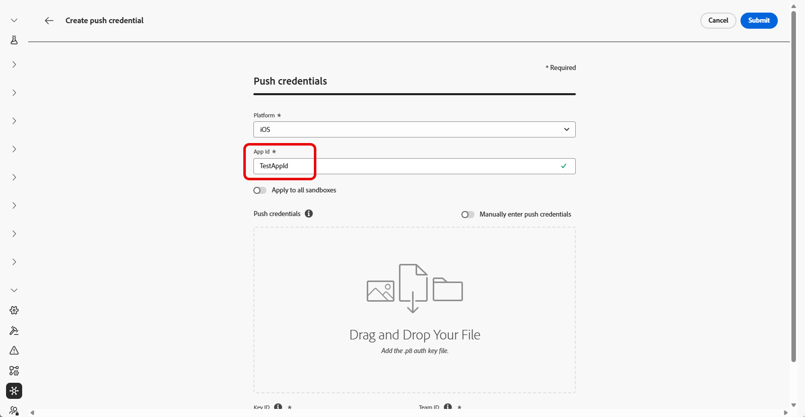
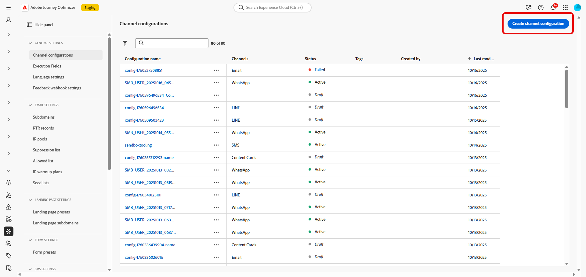

# Introdução à configuração da atividade Live {#mobile-live-config}

Antes de enviar atividades Live, você deve configurar o ambiente do Adobe Journey Optimizer. Para fazer isso:

## Etapa 1: adicionar suas credenciais de push do aplicativo no Journey Optimizer (opcional){#push-credentials-launch}

O registro da credencial de push do aplicativo móvel é necessário para autorizar o Adobe a enviar notificações por push em seu nome.

A etapa 1 é opcional se suas credenciais de push já tiverem sido configuradas, pois elas podem ser reutilizadas para a configuração do canal de atividade Live. Se nenhuma credencial for definida, você deverá criar novas credenciais de push para o aplicativo. Consulte as etapas detalhadas abaixo:

1. Acesse o menu **[!UICONTROL Canais]** > **[!UICONTROL Configurações de push]** > **[!UICONTROL Credenciais de push]**.

1. Clique em **[!UICONTROL Criar credencial de push]**.

   

1. No menu suspenso **[!UICONTROL Plataforma]**, selecione o sistema operacional:

1. Insira o aplicativo móvel **[!UICONTROL ID do aplicativo]**.

   

1. Habilite a opção **[!UICONTROL Aplicar a todas as sandboxes]** para disponibilizar essas credenciais de push em todas as sandboxes. Se uma sandbox específica tiver suas próprias credenciais para o mesmo par de IDs da plataforma e do aplicativo, essas credenciais específicas da sandbox terão prioridade.

1. Ativado o botão **[!UICONTROL Inserir manualmente as credenciais de push]** para adicionar suas credenciais.

1. Arraste e solte seu arquivo .p8 Apple Push Notification Authentication Key. Esta chave pode ser adquirida nas páginas **Certificados**, **Identificadores** e **Perfis**.

1. Forneça a **Key ID**. Esta é uma sequência de 10 caracteres atribuída durante a criação da chave de autenticação p8. Ele pode ser encontrado na guia **Chaves** da página **Certificados**, **Identificadores** e **Perfis**.

1. Forneça a **ID da Equipe**. Este é um valor de string que pode ser encontrado na guia Membros.

1. Clique em **[!UICONTROL Enviar]** para criar a configuração do aplicativo.

## Etapa 2: criar sua configuração de atividade ativa {#config-live-activity}

1. No painel à esquerda, vá para **[!UICONTROL Administração]** > **[!UICONTROL Canais]** e selecione **[!UICONTROL Configurações gerais]** > **[!UICONTROL Configurações de canal]**. Clique no botão **[!UICONTROL Criar configuração de canal]**.

   

1. Insira um nome e uma descrição (opcional) para a configuração e selecione o canal de atividade Live.

   >[!NOTE]
   >
   > Os nomes devem começar com uma letra (A-Z). Ele só pode conter caracteres alfanuméricos. Também é possível usar os caracteres de sublinhado `_`, ponto `.` e hífen `-`.

1. Selecione **[!DNL Live activity]** como seu canal.

   

1. Selecione **[!UICONTROL Ação(ões) de marketing]** para associar políticas de consentimento às mensagens que usam essa configuração. Todas as políticas de consentimento associadas à ação de marketing são utilizadas para respeitar as preferências dos clientes. Saiba mais

1. Escolha o iOS como sua **[!UICONTROL Plataforma]**.

1. Selecione no menu suspenso a mesma **[!UICONTROL ID do aplicativo]** da sua [credencial de push](#push-credentials-launch) configurada acima ou escolha uma existente.

   

1. Depois que todos os parâmetros tiverem sido configurados, clique em **[!UICONTROL Enviar]** para confirmar. Você também pode salvar a configuração do canal como rascunho e retomar a configuração posteriormente.

1. Depois que a configuração do canal é criada, ela é exibida na lista com o status **[!UICONTROL Processando]**.

   >[!NOTE]
   >
   >Se as verificações não forem bem-sucedidas, saiba mais sobre os possíveis motivos de falha em [esta seção](../configuration/channel-surfaces.md).

1. Depois que as verificações forem bem-sucedidas, a configuração do canal obterá o status **[!UICONTROL Ativo]**. Ele está pronto para ser usado para enviar mensagens.

Agora você pode iniciar a integração com o Adobe Experience Platform Mobile SDK para habilitar atualizações dinâmicas e em tempo real na Tela de bloqueio e na Dynamic Island.

➡️ [Saiba mais sobre a integração do Adobe Experience Platform Mobile SDK](mobile-live-configuration-sdk.md)

>[!TIP]
>
>Se você encontrar problemas com a configuração ou entrega de atividades do Live, consulte [Solucionar problemas de atividades do Live](troubleshoot-mobile-live.md) para obter as etapas de depuração.