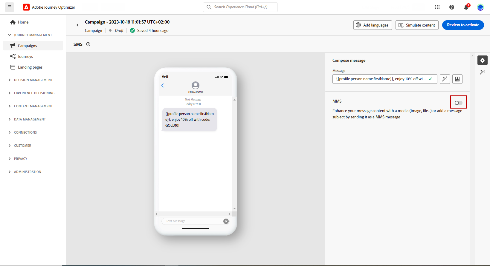

# Criar uma mensagem para dispositivo móvel {#design-mobile}

Você pode criar e enviar mensagens de texto (SMS), comunicação avançada (RCS) e multimídia (MMS) com o Adobe Journey Optimizer. Primeiro, é necessário adicionar uma ação de Mensagem móvel em uma jornada ou campanha e, em seguida, definir o conteúdo da Mensagem móvel, conforme detalhado abaixo. O Adobe Journey Optimizer também oferece recursos para testar suas mensagens móveis antes do envio, para que você possa verificar a renderização, os atributos de personalização e todas as outras configurações.

De acordo com os padrões e regulamentos do setor, todas as mensagens de marketing SMS/RCS/MMS devem conter uma maneira de os perfis cancelarem facilmente a inscrição. Para fazer isso, os perfis SMS podem responder com palavras-chave de aceitação e recusa. [Saiba como gerenciar a opção de não participação](../privacy/opt-out.md#opt-out-decision-management)

## Definir o conteúdo RCS{#rcs-content}

O RCS permite enviar mensagens visualmente ricas com imagens, vídeos, carrosséis e botões interativos, entregues por meio do aplicativo de mensagens nativo em dispositivos compatíveis. As mensagens são enviadas de um remetente marcado e verificado. Quando o dispositivo ou a operadora de um perfil não é compatível com o RCS, o Journey Optimizer retorna automaticamente para um SMS padrão.

Toda mensagem RCS requer um **[!UICONTROL Texto de fallback padrão]**: uma versão de SMS de texto sem formatação entregue a perfis cujo dispositivo ou operadora não oferece suporte a RCS. Uma campanha não pode ser ativada sem ela.

Lembre-se do seguinte ao gravar texto de fallback:

* **Mantenha-o conciso.** As mensagens SMS são limitadas a 160 caracteres por segmento; as mensagens mais longas são divididas em várias partes e podem estar sujeitas a encargos adicionais.
* **Incluir URLs de chave.** Se a mensagem do RCS vincular a um URL por meio de botões de ação, adicione um URL mais curto ao texto de fallback para que os perfis de SMS ainda possam chegar ao destino.
* **Evitar referências somente RCS.** Não mencione visuais, carrosséis ou recursos interativos que não estão disponíveis em SMS simples.
* **Há suporte para o Personalization.** Você pode usar tokens de personalização em texto de fallback para manter a mensagem consistente em ambas as versões.

Para definir o conteúdo da mensagem RCS, siga as etapas abaixo.

1. No painel de criação, escolha seu **[!UICONTROL Tipo de conteúdo]**:

   +++ Texto

   Um corpo de texto simples com botões interativos opcionais. Melhor para notificações, alertas, lembretes e fluxos conversacionais em que as imagens não são necessárias.

   +++

   +++ Mídia

   Uma imagem ou vídeo independente com texto opcional e botões interativos. Use-a quando um único visual (uma imagem do produto, banner ou clipe de vídeo) for o ponto focal da mensagem.

   1. No menu Cabeçalho, digite uma **[!UICONTROL URL de mídia]** apontando para a imagem ou vídeo a ser exibido.

   1. Se a mídia for um arquivo de vídeo, insira opcionalmente uma **[!UICONTROL URL de miniatura]**.

   +++

   +++ Cartão

   Um cartão estruturado que combina uma imagem ou vídeo, título, corpo de texto e botões de ação. Use-o para apresentar um produto, oferta ou item de conteúdo em um formato de marca.

   1. Insira um **[!UICONTROL Título]** e uma **[!UICONTROL Descrição]**.

   1. Digite uma **[!UICONTROL URL de mídia]** apontando para a imagem ou vídeo a ser exibido.

   1. Se a mídia for um arquivo de vídeo, insira opcionalmente uma **[!UICONTROL URL de miniatura]**.

   +++

   +++ Carrossel

   Uma série de cartões avançados roláveis horizontalmente em uma única mensagem, cada um com sua própria imagem, título, descrição e botões. Ideal para catálogos de produtos ou promoções. São necessárias no mínimo 2 placas.

   1. Selecione uma **[!UICONTROL Largura do cartão]** para controlar a largura de exibição de cada cartão.
   1. Para cada cartão, insira um **[!UICONTROL Título]** e **[!UICONTROL Descrição]**.

   1. Digite uma **[!UICONTROL URL de mídia]** apontando para a imagem ou vídeo dessa placa.

   1. Opcionalmente, selecione uma **[!UICONTROL Altura da mídia]** e adicione os botões de ação sugeridos.

   +++

   +++ Localização

   Envia um pino de mapa para um conjunto de coordenadas, exibido como uma visualização de mapa em linha no thread de mensagens do perfil. Use-o para compartilhar um endereço de loja, local do evento ou área de serviço.

   1. Digite a **[!UICONTROL Latitude]** e a **[!UICONTROL Longitude]** decimais do local.

   1. Opcionalmente, insira um **[!UICONTROL Nome do local]** para exibir como rótulo no pino do mapa.

   +++

1. No campo **[!UICONTROL Texto da mensagem]**, digite o conteúdo da mensagem. Você pode usar a personalização para adaptar o texto a cada perfil. Observe que os limites de caracteres variam de acordo com o tipo de mensagem: 3.072 caracteres para mídia avançada (único) e 160 para RCS básico.

1. Use o **[!UICONTROL editor do Personalization]** para definir conteúdo, adicionar personalização e conteúdo dinâmico. Você pode usar qualquer atributo, como o nome do perfil ou a cidade, por exemplo. Você também pode definir regras condicionais.

1. Opcionalmente, adicione **[!UICONTROL Ações sugeridas]**, botões interativos que permitem que os perfis atuem com um único toque.

1. Insira um **[!UICONTROL Rótulo]** para sua **[!UICONTROL Ação]**.

1. Escolha seu **[!UICONTROL Tipo de ação]**:

   * **[!UICONTROL Responder]**: envia uma resposta de texto predefinida de volta ao agente RCS em nome do perfil. Use-a para capturar a intenção, direcionar fluxos de conversação ou acionar eventos de jornada downstream. Nenhum campo adicional é necessário. O texto de resposta corresponde ao rótulo do botão.

   * **[!UICONTROL Abrir URL]**: redireciona o perfil para uma página da Web, um deep link ou um destino no aplicativo. Oferece suporte a tokens de personalização e parâmetros de rastreamento UTM, por exemplo, `https://www.example.com/offers?id={{profile.userId}}`.

   * **[!UICONTROL Discar número de telefone]**: abre o discador do dispositivo com um número de telefone especificado pré-preenchido, pronto para o perfil chamar.

   * **[!UICONTROL Exibir local]**: abre o aplicativo de mapas padrão do dispositivo em um local especificado. Forneça a **[!UICONTROL Latitude]** e a **[!UICONTROL Longitude]** decimais do local a ser exibido.

1. No campo **[!UICONTROL Texto de fallback padrão]**, digite a versão de SMS de texto sem formatação da mensagem. Isso é necessário e é entregue aos perfis cujo dispositivo ou operadora não oferece suporte ao RCS.

1. No menu suspenso **[!UICONTROL Webview]**, escolha o tamanho do **[!UICONTROL Webview]** ao enviar uma ação **[!UICONTROL Abrir URL]**.

1. Clique em **[!UICONTROL Salvar]** e verifique sua mensagem na visualização. Agora você pode testar e verificar o conteúdo da sua mensagem conforme detalhado em [esta seção](send-mobile-message.md).

## Definição do conteúdo do SMS{#sms-content}

>[!CONTEXTUALHELP]
>id="ajo_message_sms_content"
>title="Definição do conteúdo do SMS"
>abstract="Personalize mensagens para dispositivos móveis usando o editor de personalização para definir o conteúdo e incorporar elementos dinâmicos."

Para configurar o conteúdo da mensagem, siga as etapas abaixo. As configurações para MMS estão detalhadas em [esta seção](#mms-content).

1. Na tela de configuração da jornada ou campanha, clique no botão **[!UICONTROL Editar conteúdo]** para configurar o conteúdo da mensagem móvel.

1. Clique no campo **[!UICONTROL Mensagem]** para abrir o editor de personalização.

   

1. Gere mensagens móveis envolventes personalizadas para seu público usando o [Assistente de IA para geração de texto](../content-management/generative-text.md).

1. Use o editor de personalização para definir o conteúdo, adicionar personalização e conteúdo dinâmico. Você pode usar qualquer atributo, como o nome do perfil ou a cidade, por exemplo. Você também pode definir regras condicionais. Navegue até as seguintes páginas para saber mais sobre [personalização](../personalization/personalize.md) e [conteúdo dinâmico](../personalization/get-started-dynamic-content.md) no editor de personalização.

1. Depois de definir o conteúdo, você pode adicionar URLs rastreados à mensagem. Para fazer isso, acesse o menu **[!UICONTROL Funções auxiliares]** e selecione **[!UICONTROL Auxiliares]**.

   

1. Selecione a **[!UICONTROL Url]** e clique em **[!UICONTROL Adicionar URL]**. Saiba mais sobre a função auxiliar `Url` em [esta seção](../personalization/functions/helpers.md#url).

   

1. Para encurtar a URL, cole-a no campo `originalUrl` e clique em **[!UICONTROL Salvar]**.

   >[!CAUTION]
   >
   >Para usar a função de redução de URL, primeiro configure um subdomínio que será vinculado à sua configuração. [Saiba mais](mobile-subdomains.md)
   >
   > A duração de URLs curtos é definida como 30 dias. Após esse período, essas URLs curtas não estarão mais acessíveis e exibirão a mensagem: `404 short-code not found`.

1. Para adicionar um deep link que abra uma tela específica no aplicativo móvel, use a função auxiliar `Url` com o tipo `DEEPLINK`, como no exemplo abaixo. [Saiba mais sobre deep links](../email/deeplinks.md)

   ```
   {{url originalUrl='<<deeplink_url>>' type='DEEPLINK' action='CLICK'}}
   ```

   >[!CAUTION]
   >
   >Antes de usar deep linking, verifique se você concluiu as [etapas de configuração](../email/deeplinks.md#configuration) correspondentes no Journey Optimizer e implementou o [tratamento de deep link](../email/deeplinks.md#mobile-implementation) no aplicativo móvel. Caso ainda não o tenha feito, o deep link não direcionará os usuários para o conteúdo no aplicativo desejado.
   >
   >Além disso, verifique se o rastreamento de link está habilitado na seção **[!UICONTROL Ações]** da sua jornada ou campanha para que a URL seja regravada pelos sistemas Adobe.

1. No menu **[!UICONTROL Decisão]**, você pode personalizar e otimizar o conteúdo de suas mensagens móveis com a **Decisão**. Esse recurso permite usar Pontuações de prioridade, Fórmulas ou Modelos de IA para selecionar e exibir dinamicamente o melhor conteúdo para seus clientes.

   Para obter mais informações sobre como criar e usar políticas de decisão em mensagens móveis, consulte [esta seção](../experience-decisioning/create-decision.md).

1. Clique em **[!UICONTROL Salvar]** e verifique sua mensagem na visualização. Agora você pode testar e verificar o conteúdo da sua mensagem conforme detalhado em [esta seção](send-mobile-message.md).

## Definir o conteúdo MMS{#mms-content}

Você pode aprimorar sua comunicação enviando mensagens do Serviço de Mensagens Multimídia (MMS), permitindo o compartilhamento de mídias como vídeos, imagens, clipes de áudio e GIFs e muito mais. Além disso, o MMS permite até 1600 caracteres de texto em sua mensagem.

>[!NOTE]
>
> O canal MMS contém algumas limitações listadas em [esta página](../start/guardrails.md#sms-guardrails).

Para criar conteúdo MMS, siga estas etapas:

1. Crie uma mensagem do Mobile conforme descrito em [esta seção](#create-sms-journey-campaign).

1. Edite seu conteúdo de SMS conforme detalhado em [esta seção](#sms-content).

1. Ative a opção MMS para adicionar mídia ao conteúdo de SMS.

   

1. Adicione um **[!UICONTROL Título]** à sua mídia.

1. Insira a URL da mídia no campo **[!UICONTROL Mídia]**.

   

1. Clique em **[!UICONTROL Salvar]** e verifique sua mensagem na visualização. Agora você pode testar e verificar o conteúdo da mensagem conforme detalhado abaixo.

Depois de executar os testes e validar o conteúdo, você pode enviar a mensagem móvel para o público-alvo. Estas etapas estão detalhadas em [esta página](send-mobile-message.md)

