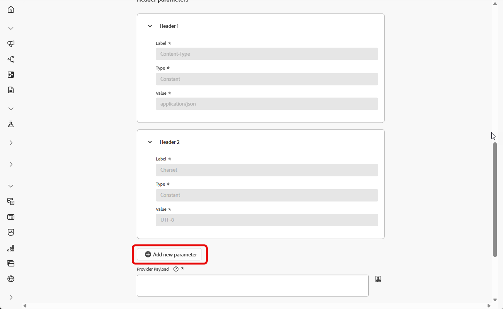
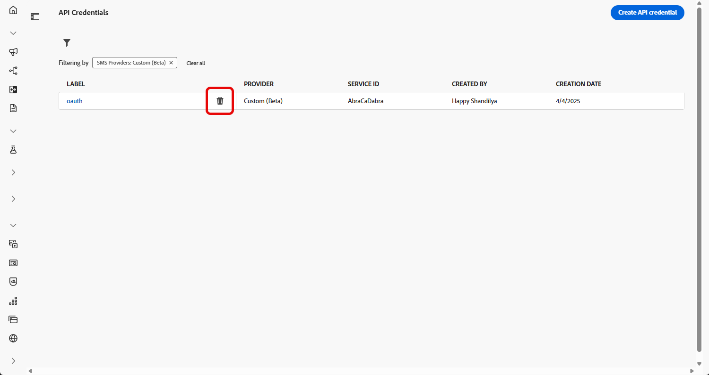
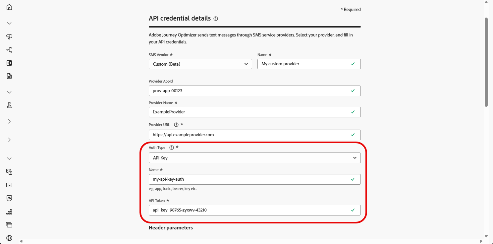
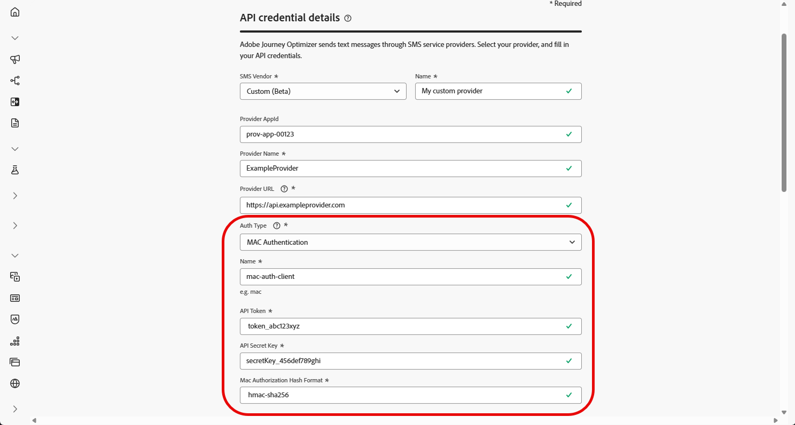

# Configurar um provedor personalizado {#sms-configuration-custom}

>[!CONTEXTUALHELP]
>id="ajo_admin_sms_api_byop_provider_url"
>title="URL do provedor"
>abstract="Especifique o URL da API externa à qual você planeja se conectar. Esse URL serve como ponto de acesso para acessar os recursos e funcionalidades da API."

>[!CONTEXTUALHELP]
>id="ajo_admin_sms_api_byop_header_parameters"
>title="Parâmetros de cabeçalho"
>abstract="Especifique o rótulo, o tipo e o valor dos cabeçalhos adicionais para habilitar a autenticação adequada, a formatação de conteúdo e a comunicação eficaz da API. "

>[!CONTEXTUALHELP]
>id="ajo_admin_sms_api_byop_provider_payload"
>title="Conteúdo do provedor"
>abstract="Forneça o conteúdo da solicitação para garantir que os dados corretos sejam enviados para processamento e geração de resposta."

Esse recurso permite integrar e configurar seus próprios provedores de mensagens, oferecendo flexibilidade além das opções padrão (Sinch, Twilio e Infobip). Isso permite a criação, entrega, relatórios e gerenciamento de consentimento perfeitos para mensagens móveis.

Com a configuração personalizada do provedor, você pode conectar serviços de mensagens de terceiros diretamente no Journey Optimizer, personalizar cargas de mensagem para conteúdo dinâmico e gerenciar preferências de aceitação/recusa para garantir a conformidade entre os canais SMS e RCS.

Para configurar seu provedor personalizado, siga as etapas abaixo:

1. [Criar credencial de API](#api-credential)
1. [Criar webhook](mobile-webhook.md)
1. [Criar configuração de canal](mobile-configuration-surface.md)
1. [Criar Jornada ou Campanha com ação de canal SMS](create-mobile-message.md)

## Criar a credencial da API {#api-credential}

Para enviar uma mensagem móvel no Journey Optimizer usando um provedor personalizado não disponível imediatamente pela Adobe (por exemplo, Sinch, Infobip, Twilio), siga estas etapas:

1. No painel à esquerda, navegue até **[!UICONTROL Administração]** `>` **[!UICONTROL Canais]**, selecione o menu **[!UICONTROL Credenciais da API]** em **[!UICONTROL Configurações de SMS]** e clique no botão **[!UICONTROL Criar novas credenciais de API]**.

   

1. Configure suas credenciais da API de SMS, conforme detalhado abaixo:

   * **[!UICONTROL Fornecedor de SMS]**: personalizado.

   * **[!UICONTROL Nome]**: digite um nome para a credencial da API.

   * **[!UICONTROL AppId do Provedor]**: insira a ID do aplicativo fornecida pelo seu provedor de SMS.

   * **[!UICONTROL Nome do Provedor]**: insira o nome do seu provedor de SMS.

   * **[!UICONTROL URL do Provedor]**: Insira a URL do seu provedor de SMS.

   * **[!UICONTROL Tipo de Autenticação&#x200B;]**: selecione seu tipo de autorização e [preencha os campos correspondentes](#auth-options) com base no método de autenticação escolhido.

     

1. Habilite a opção de suporte **[!UICONTROL mTLS]**, que garante que o cliente e o servidor se autentiquem antes de estabelecer uma conexão segura.

   Para usar somente mTLS, selecione **[!UICONTROL Sem Autenticação]** no menu suspenso **[!UICONTROL Tipo de Autenticação]** e habilite o **[!UICONTROL suporte para mTLS]**.

1. Na seção **[!UICONTROL Cabeçalhos]**, clique em **[!UICONTROL Adicionar novo parâmetro]** para especificar os cabeçalhos HTTP para a mensagem de solicitação que será enviada para o serviço externo.

   Os campos de cabeçalho **Content-Type** e **Charset** estão definidos por padrão e não podem ser excluídos.

   

1. Adicione a **[!UICONTROL Carga do provedor]** para validar e personalizar as cargas da solicitação.

   Para mensagens RCS, essa carga é usada posteriormente durante [design de conteúdo](create-mobile-message.md#sms-content).

   >[!NOTE]
   >
   >Ao configurar um provedor de SMS personalizado com autenticação Básica ou de Portador, você deve incluir o parâmetro `authOption` na carga JSON. Além disso, a **Carga do Provedor** deve fazer referência às variáveis de modelo `{{fromNumber}}`, `{{toNumber}}` e `{{message}}`.

1. Selecione **[!UICONTROL Usar conjunto de dados personalizado para entrada]** para rotear o SMS de entrada desta credencial para um conjunto de dados pré-criado que você escolher na lista suspensa. [Saiba mais sobre como usar um conjunto de dados personalizado para palavras-chave de entrada](custom-dataset-inbound-keywords.md)

   >[!NOTE]
   >
   >O esquema do conjunto de dados deve ser **[!UICONTROL XDM ExperienceEvent]** e incluir pelo menos estes grupos de campos:
   >* Adobe CJM ExperienceEvent - Detalhes de interação da mensagem
   >* Adobe CJM ExperienceEvent - Detalhes da execução da mensagem
   >* Adobe CJM ExperienceEvent - Detalhes do perfil da mensagem
   >
   >O esquema e o conjunto de dados devem ser habilitados para o Perfil.

1. Clique em **[!UICONTROL Enviar]** quando terminar de configurar suas credenciais de API.

1. No menu **[!UICONTROL Credenciais da API]**, clique no  para excluir suas credenciais da API.

   

1. Para modificar as credenciais existentes, localize as credenciais de API desejadas e clique na opção **[!UICONTROL Editar]** para fazer as alterações necessárias.

   

1. Clique em **[!UICONTROL Verificar conexão de SMS]**, a partir de suas credenciais de API existentes, para testar e verificar suas credenciais de API de SMS enviando uma mensagem de exemplo para um dispositivo designado.

1. Preencha os campos **Número** e **Mensagem** e clique em **[!UICONTROL Verificar conexão]**.

   >[!IMPORTANT]
   >
   >A mensagem deve ser estruturada para se alinhar ao formato de carga do provedor.

   

Depois de criar e configurar sua credencial de API, agora é necessário definir [as configurações de entrada para o Webhook](#webhook) para mensagens SMS.

### Opções de autenticação para Provedores de SMS personalizados {#auth-options}

>[!CONTEXTUALHELP]
>id="ajo_admin_sms_api_byop_auth_type"
>title="Tipo de autenticação"
>abstract="Especifique o método de autenticação necessário para acessar a API, garantindo uma comunicação segura e autorizada com o serviço externo."

>[!BEGINTABS]

>[!TAB Chave de API]

Depois que a credencial da API for criada, preencha os campos necessários para autenticação da chave de API:

* **[!UICONTROL Nome]**&#x200B;: digite um nome para a configuração da chave de API.
* **[!UICONTROL Token de API]**&#x200B;: insira o Token de API fornecido pelo seu provedor de SMS.

>[!TAB Autenticação do MAC]

Depois que a credencial da API for criada, preencha os campos necessários para autenticação da MAC:

* **[!UICONTROL Nome]**&#x200B;: digite um nome para a configuração de autenticação do MAC.
* **[!UICONTROL Token de API]**&#x200B;: insira o Token de API fornecido pelo seu provedor de SMS.
* **[!UICONTROL Chave secreta de API]**: insira a Chave secreta de API fornecida pelo seu provedor de SMS. Essa chave é usada para gerar o MAC (Message Authentication Code) para comunicação segura.
* **[!UICONTROL Formato de hash de autorização do Mac]**: escolha o formato de hash para a autenticação do MAC.

>[!TAB Autenticação OAuth]

Depois que a credencial da API for criada, preencha os campos necessários para autenticação OAuth:

* **[!UICONTROL Nome]**&#x200B;: insira um nome para a configuração de autenticação do OAuth.

* **[!UICONTROL Token de API]**&#x200B;: insira o Token de API fornecido pelo seu provedor de SMS.

* **[!UICONTROL URL do OAuth]**&#x200B;: insira a URL para obter o token do OAuth.

* **[!UICONTROL Corpo de OAuth]**&#x200B;: forneça o corpo da solicitação de OAuth no formato JSON, incluindo parâmetros como `grant_type`, `client_id` e `client_secret`.

>[!TAB Autenticação JWT]

Depois que a credencial da API for criada, preencha os campos necessários para autenticação JWT:

* **[!UICONTROL Nome]**&#x200B;: insira um nome para a configuração de autenticação JWT.

* **[!UICONTROL Token de API]**&#x200B;: insira o Token de API fornecido pelo seu provedor de SMS.

* **[!UICONTROL Carga JWT]**&#x200B;: insira a carga JSON que contém as declarações necessárias para o JWT, como emissor, assunto, público-alvo e expiração.

>[!ENDTABS]

## Vídeo tutorial {#video}

>[!VIDEO](https://video.tv.adobe.com/v/3431625)

