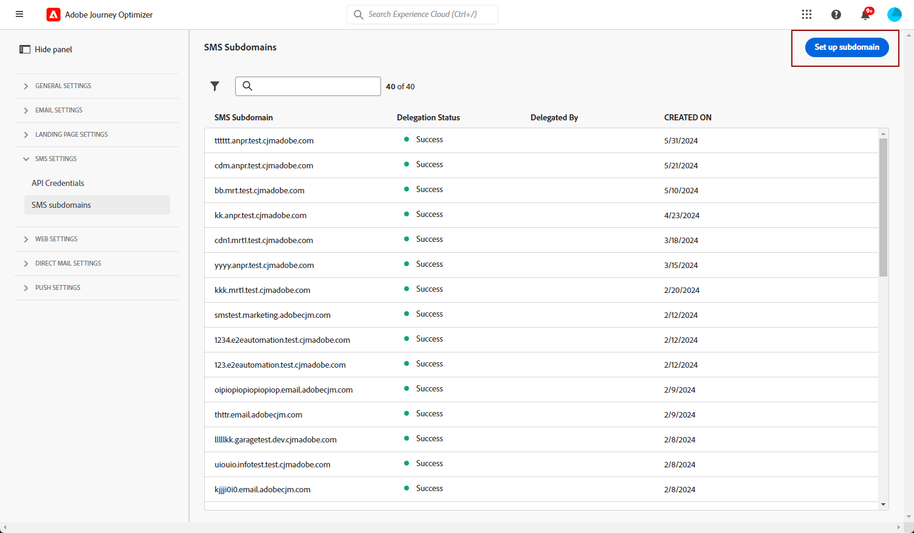
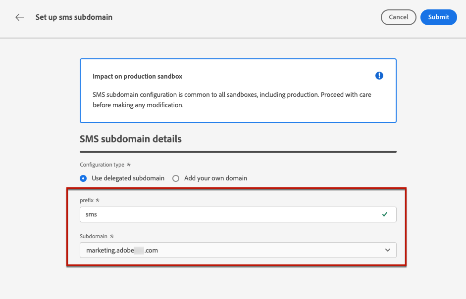
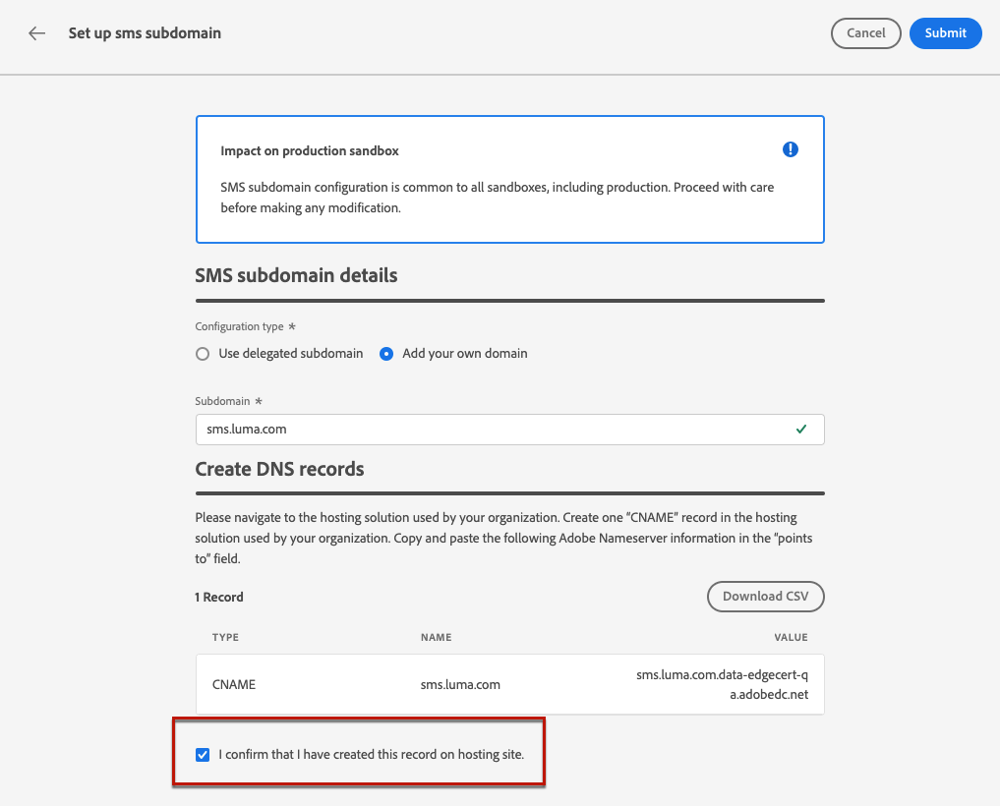

# Configuração de subdomínios de SMS {#sms-mms-subdomains}

>[!CONTEXTUALHELP]
>id="ajo_admin_subdomain_sms_header"
>title="Delegar um subdomínio de mensagem móvel"
>abstract="Configure seu subdomínio para mensagens móveis. Você pode usar um subdomínio já delegado à Adobe ou configurar um novo subdomínio."

>[!CONTEXTUALHELP]
>id="ajo_admin_subdomain_sms"
>title="Delegar um subdomínio de mensagem móvel"
>abstract="Você deve configurar um subdomínio para usar nas mensagens móveis, pois esse subdomínio é necessário para criar uma configuração de SMS. Você pode usar um subdomínio já delegado à Adobe ou configurar um novo subdomínio."
>additional-url="https://experienceleague.adobe.com/pt-br/docs/journey-optimizer/using/channels/sms/configure-sms/sms-configuration-surface" text="Criar uma configuração de SMS"

>[!CONTEXTUALHELP]
>id="ajo_admin_config_sms_subdomain"
>title="Selecionar um subdomínio de mensagem móvel"
>abstract="Para criar uma configuração de SMS, verifique se você configurou anteriormente pelo menos um subdomínio de SMS que possa ser selecionado na lista Nome de subdomínio."
>additional-url="https://experienceleague.adobe.com/pt-br/docs/journey-optimizer/using/channels/sms/configure-sms/sms-configuration-surface" text="Criar uma configuração de SMS"

## Introdução a subdomínios SMS {#gs-sms-mms-subdomains}

Para encurtar URLs adicionadas às suas mensagens SMS/MMS, você deve configurar o subdomínio que selecionará ao [criar uma configuração de SMS](mobile-configuration.md#sms-prerequisites).

Você pode usar um subdomínio que já foi delegado à Adobe ou configurar outro subdomínio. Saiba mais sobre como delegar subdomínios à Adobe em [esta seção](../configuration/delegate-subdomain.md).

A configuração do subdomínio SMS é **compartilhada entre todos os ambientes**. Portanto, qualquer modificação em um subdomínio SMS também afeta outras sandboxes de produção.

>[!NOTE]
>
>Para acessar e editar subdomínios SMS, você deve ter a permissão **[!UICONTROL Gerenciar subdomínios SMS]** na sandbox de produção. Saiba mais sobre permissões [nesta seção](../administration/high-low-permissions.md).

## Usar um subdomínio existente {#sms-use-existing-subdomain}

Para usar um subdomínio que já está delegado à Adobe, siga as etapas abaixo.

1. Navegue até o menu **[!UICONTROL Administração]** > **[!UICONTROL Canais]** e selecione **[!UICONTROL Configurações de SMS]** > **[!UICONTROL Subdomínios de SMS]**.

1. Clique em **[!UICONTROL Configurar subdomínio]**.

   

1. Selecione **[!UICONTROL Usar subdomínio delegado]** na seção **[!UICONTROL Tipo de configuração]**.

   

1. Insira o prefixo que será exibido no URL do SMS.

   Somente caracteres alfanuméricos e hifens são permitidos.

   >[!CAUTION]
   >
   >Não use os prefixos `cdn` ou `data`, pois eles são reservados para uso interno. Outros prefixos restritos ou reservados, como `dmarc` ou `spf`, também devem ser evitados.

1. Selecione um subdomínio delegado na lista.

   Não é possível selecionar um subdomínio que já esteja sendo usado como subdomínio de SMS.

   <!--Capital letters are not allowed in subdomains. TBC by PM-->

   

   <!--Note that you cannot use multiple delegated subdomains of the same parent domain. For example, if 'marketing1.yourcompany.com' is already delegated to Adobe for your SMS messages, you will not be able to use 'marketing2.yourcompany.com'. However, multi-level subdomains being supported for SMS, you may proceed using a subdomain of 'marketing1.yourcompany.com' (such as 'email.marketing1.yourcompany.com'), or a different parent domain.-->

   >[!CAUTION]
   >
   >Se você selecionar um domínio que foi delegado à Adobe usando o [método CNAME](../configuration/delegate-subdomain.md#cname-subdomain-setup), deverá criar o registro DNS na sua plataforma de hospedagem. Para gerar o registro DNS, o processo é o mesmo de quando você configura um novo subdomínio SMS. Saiba mais em [esta seção](#sms-configure-new-subdomain).

1. Clique em **[!UICONTROL Enviar]**.

1. Depois de enviado, o subdomínio é exibido na lista com o status **[!UICONTROL Processando]**. Para obter mais informações sobre os status dos subdomínios, consulte [esta seção](../configuration/delegate-subdomain.md#access-delegated-subdomains).<!--Same statuses?-->

   Antes de poder usar esse subdomínio para enviar mensagens, você deve aguardar até que o Adobe execute as verificações necessárias, que podem levar **até 4 horas**.<!--Learn more in [this section](../configuration/delegate-subdomain.md#subdomain-validation).-->

1. Depois que as verificações forem bem-sucedidas, o subdomínio obterá o status **[!UICONTROL Success]**. Ele está pronto para ser usado para criar configurações de canal SMS.

## Configurar um novo subdomínio {#sms-configure-new-subdomain}

>[!CONTEXTUALHELP]
>id="ajo_admin_sms_subdomain_dns"
>title="Gerar o registro DNS correspondente"
>abstract="Para configurar um novo subdomínio de SMS, é necessário copiar as informações do servidor de nomes da Adobe exibidas na interface do Journey Optimizer e colá-las em sua solução de hospedagem de domínio para gerar o registro DNS correspondente. Depois que as verificações forem bem-sucedidas, o subdomínio estará pronto para criar configurações de SMS."

Para configurar um novo subdomínio, siga as etapas abaixo.

1. Navegue até o menu **[!UICONTROL Administração]** > **[!UICONTROL Canais]** e selecione **[!UICONTROL Configurações de SMS]** > **[!UICONTROL Subdomínios de SMS]**.

1. Clique em **[!UICONTROL Configurar subdomínio]**.

   

1. Selecione **[!UICONTROL Adicionar seu próprio domínio]** na seção **[!UICONTROL Tipo de configuração]**.

   

1. Especifique o subdomínio que será delegado.

   >[!CAUTION]
   >
   >* Não é possível usar um subdomínio SMS existente.
   >
   >* Letras maiúsculas não são permitidas em subdomínios.

   Não é permitido delegar um subdomínio inválido à Adobe. Insira um subdomínio válido de propriedade de sua organização, como marketing.yourcompany.com.

   Subdomínios de vários níveis (do mesmo domínio pai) são suportados. Por exemplo, você pode usar &quot;sms.marketing.yourcompany.com&quot;.

1. O registro a ser colocado em seus servidores DNS é exibido. Copie esse registro ou baixe um arquivo CSV e navegue até a solução de hospedagem de domínio para gerar o registro DNS correspondente.

1. Verifique se o registro DNS foi gerado na solução de hospedagem de domínio. Se tudo estiver configurado corretamente, marque a caixa &quot;Eu confirmo...&quot; e clique em **[!UICONTROL Enviar]**.

   

   Ao configurar um novo subdomínio SMS, ele sempre aponta para um registro CNAME.

1. Depois que a delegação de subdomínio for enviada, o subdomínio será exibido na lista com o status **[!UICONTROL Processando]**. Para obter mais informações sobre os status dos subdomínios, consulte [esta seção](../configuration/delegate-subdomain.md#access-delegated-subdomains).<!--Same statuses?-->

Antes de usar um subdomínio para enviar mensagens SMS, você deve aguardar até que o Adobe execute as verificações necessárias, que podem levar até 4 horas.<!--Learn more in [this section](#subdomain-validation).--> Depois que as verificações forem bem-sucedidas, o subdomínio obterá o status **[!UICONTROL Success]**. Ele está pronto para ser usado para criar configurações de canal SMS.

Observe que o subdomínio será marcado como **[!UICONTROL Falha]** se você não criar o registro de validação na solução de hospedagem.

## Medidas de proteção {#guardrails}

Atualmente, a interface do usuário [!DNL Journey Optimizer] não oferece suporte à exclusão ou desdelegação de subdomínios SMS depois de configurados.

No entanto, ao testar recursos em [!DNL Journey Optimizer], talvez seja necessário criar um subdomínio SMS. Após a conclusão do teste, isso pode levar a ambientes desorganizados com configurações desnecessárias, pois a interface do usuário não permite remover ou desdelegar subdomínios SMS.

Estas são algumas etapas e considerações recomendadas:

<!--As an alternative action, create a new SMS subdomain for future use cases and avoid using the existing one if it is no longer needed.-->

* Como prática recomendada, mantenha um ambiente organizado criando apenas os componentes e as configurações necessários.
* Em situações em que há um impacto nos negócios, entre em contato com o representante da Adobe, que pode ajudar na remoção/desdelegação do subdomínio SMS. [Saiba mais](#undelegate-subdomain)
* Se for necessária mais assistência, entre em contato com a Adobe para obter orientação sobre como gerenciar sua instância de maneira eficaz.

## Cancelar delegação de um subdomínio {#undelegate-subdomain}

Se quiser cancelar a delegação de um subdomínio SMS, entre em contato com o representante da Adobe com o subdomínio que deseja cancelar a delegação.

Se o subdomínio SMS apontar para um registro CNAME, você poderá excluir o registro DNS CNAME que criou para o subdomínio SMS da solução de hospedagem (mas não exclua o subdomínio de email original, se houver).

>[!NOTE]
>
>Um subdomínio SMS pode apontar para um registro CNAME porque era um [subdomínio existente](#sms-use-existing-subdomain) delegado à Adobe usando o [método CNAME](../configuration/delegate-subdomain.md#cname-subdomain-setup) ou um [novo subdomínio SMS](#sms-configure-new-subdomain) que você configurou.

Depois que sua solicitação é tratada pela Adobe, o domínio não delegado não é mais exibido na página de inventário de subdomínio.
