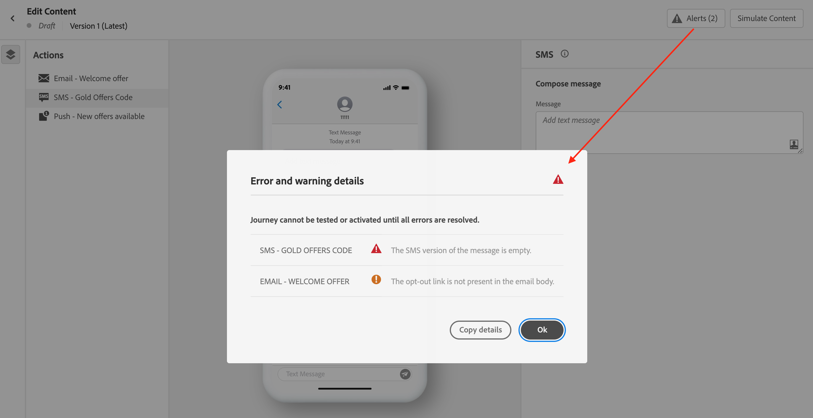

# Marque e envie sua mensagem para dispositivo móvel {#send-sms}

## Pré-visualizar sua mensagem para dispositivos móveis {#preview-sms}

Depois que o conteúdo da mensagem for definido, você poderá usar perfis de teste ou dados de entrada de amostra (carregados de um arquivo CSV/JSON ou adicionados manualmente) para visualizar seu conteúdo. Se você inseriu conteúdo personalizado, é possível verificar como esse conteúdo é exibido na mensagem.

Para fazer isso, clique em **[!UICONTROL Simular conteúdo]** e verifique sua mensagem usando os dados do perfil de teste.

Informações detalhadas sobre como visualizar e testar o conteúdo estão disponíveis na seção [Gerenciamento de conteúdo](../content-management/preview-test.md).

### Codificação e limites de caracteres {#sms-character-limits}

Uma contagem de caracteres é exibida ao acessar o menu **[!UICONTROL Simular conteúdo]** para auxiliar no planejamento e no gerenciamento de mensagens móveis.

O Journey Optimizer usa a codificação UTF-8 em seu editor de SMS, permitindo digitar ou colar caracteres de byte duplo ou Unicode. Esses caracteres são então transmitidos ao provedor de serviços para entrega. A maioria dos provedores de SMS usa codificação GSM de 7 bits para mensagens padrão com um limite de 160 caracteres e muda para UTF-16 (UCS-2) quando caracteres não GSM são detectados com um limite de 70 caracteres.

Observe que a contagem de caracteres não reflete variações introduzidas pela personalização dinâmica ou caracteres especiais de 7 bits não GSM.

>[!IMPORTANT]
>
>Os relatórios de delivery de SMS do Journey Optimizer não levam em conta as mensagens concatenadas e a personalização dinâmica, portanto, podem não refletir o número real de mensagens enviadas pelo provedor. Para obter informações detalhadas de uso e cobrança, entre em contato com o representante da Adobe.
>
>Para saber mais sobre as práticas recomendadas para minimizar excedentes de cobrança de SMS, consulte [Práticas recomendadas de SMS para otimização de caracteres](mobile-cost-optimization.md).

## Validar seu conteúdo {#sms-validate}

>[!NOTE]
>
> Para melhorar sua capacidade de delivery, use os números de telefone nos formatos compatíveis com o provedor. Por exemplo, o Twilio e o Sinch suportam apenas números de telefone no formato E.164.

Você deve verificar os alertas na seção superior do editor. Alguns deles são avisos simples, mas outros podem impedir que você envie a mensagem. Dois tipos de alertas podem ocorrer: avisos e erros.

* **Os avisos** referem-se às recomendações e práticas recomendadas. Por exemplo, uma mensagem de aviso será exibida se a mensagem móvel estiver vazia ou se os limites de caracteres puderem ser excedidos com o conteúdo dinâmico.

  **Limites de caracteres:** 160 caracteres por segmento (GSM 7 bits), 70 para Unicode/emojis, até 1500 caracteres no total.

* **Erros** impedem que você teste ou ative a jornada, ou publique a campanha, desde que não sejam resolvidos. Por exemplo, uma mensagem de erro avisa quando a linha de assunto está ausente.

O alerta **&quot;O limite de caracteres de texto SMS foi excedido&quot;** pode aparecer mesmo quando a mensagem simulada for menor porque a validação calcula o **tamanho máximo possível** avaliando por mais tempo todas as ramificações condicionais, campos de personalização e conteúdo dinâmico.

A validação calcula o comprimento máximo para todos os dados de perfil possíveis, enquanto a simulação mostra a saída real para um perfil de teste.

## Envie suas mensagens móveis {#sms-send}

>[!IMPORTANT]
>
> Se sua campanha estiver sujeita a uma política de aprovação, será necessário solicitar aprovação para enviar suas mensagens de celular. [Saiba mais](../test-approve/gs-approval.md)

Quando a sua mensagem do Mobile estiver pronta, conclua a configuração da sua [jornada](../building-journeys/journey-gs.md) ou da sua [campanha](../campaigns/create-campaign.md) para enviá-la.

**Tópicos relacionados**

* [Configuração de canal de SMS](mobile-configuration.md)
* [Relatórios de SMS/RCS/MMS](../reports/journey-global-report-cja-sms.md)
* [Criar uma mensagem para dispositivo móvel](create-mobile-message.md)
* [Adicionar uma mensagem em uma jornada](../building-journeys/journey-action.md)
