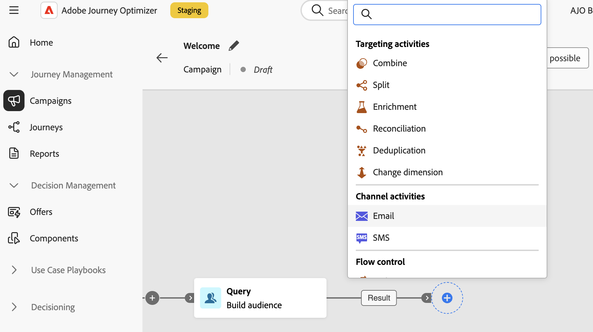

# Sobre atividades de campanha orquestradas {#ms-campaign-activities}

As atividades de campanha orquestradas são agrupadas em três categorias. Dependendo do contexto, as atividades disponíveis podem ser diferentes.

Todas as atividades estão detalhadas nas seções abaixo:

* [Atividades de direcionamento e gestão de dados](#targeting)
* [Atividades do canal](#channel)
* [Atividades de controle de fluxo](#flow-control)

## Atividades de direcionamento {#targeting}

Essas atividades são específicas para direcionamento. Elas permitem criar uma ou mais direções definindo um público-alvo e dividindo ou combinando esses públicos-alvo usando operações de interseção, união ou exclusão.

* [Criar público-alvo](build-audience.md): defina sua população de destino. Você pode selecionar um público existente ou usar o modelador de consultas para definir sua própria consulta.
* [Alterar dimensão](change-dimension.md): altere a targeting dimension enquanto você estiver criando sua campanha orquestrada.
* [Combinar](combine.md): executar segmentação na população de entrada. Você pode usar uma união, uma interseção ou uma exclusão.
* [Desduplicação](deduplication.md): excluir duplicados no(s) resultado(s) das atividades de entrada.
* [Enriquecimento](enrichment.md): defina dados adicionais para processar em sua campanha orquestrada. Com essa atividade, você pode aproveitar a transição de entrada e configurar a atividade para concluir a transição de saída com dados adicionais.
* [Reconciliação](reconciliation.md): defina o vínculo entre os dados nos dados do Journey Optimizer e os dados em uma tabela de trabalho, por exemplo, dados carregados de um arquivo externo.
* [Salvar público-alvo](save-audience.md): atualize um público-alvo existente ou crie um novo público-alvo a partir da população computada upstream em uma campanha orquestrada.
* [Split](split.md): segmente a população de entrada em vários subconjuntos.

## Atividades de gerenciamento de dados {#data}

Essas atividades são específicas para manipular e enriquecer dados de população.

* [Carregar arquivo](load-file.md): trabalhar com perfis e dados armazenados em um arquivo externo.
* [Atualizar dados](update-data.md): execute atualizações em massa nos campos do banco de dados. Várias opções permitem personalizar a atualização de dados.

## Atividades do canal {#channel}

O Adobe Journey Optimizer permite automatizar e executar campanhas de marketing em vários canais. Você pode combinar atividades de canal na tela para criar uma campanha orquestrada entre canais que pode acionar ações com base no comportamento do cliente. As seguintes atividades do **Canal** estão disponíveis: notificações por push de email, SMS, Android e iOS. [Saiba como configurar uma entrega no contexto de uma campanha orquestrada](channels.md).

## Atividades de controle de fluxo {#flow-control}

>[!CONTEXTUALHELP]
>id="ajo_orchestration_end"
>title="Terminar atividade"
>abstract="A atividade **End** permite marcar graficamente o fim de uma campanha orquestrada. Essa atividade não tem impacto funcional e, portanto, é opcional."

As atividades a seguir são específicas para organizar e executar campanhas orquestradas. Sua principal tarefa é coordenar as outras atividades:

* [And-join](and-join.md): sincroniza várias ramificações de execução de uma campanha orquestrada.
* **Fim**: marca graficamente o fim de uma campanha orquestrada. Esta atividade não tem impacto funcional e, portanto, é opcional
* [Bifurcação](fork.md): crie transições de saída para iniciar várias atividades ao mesmo tempo.
* [Test](test.md): habilitar transições com base em condições especificadas.
* [Aguardar](wait.md): pausar momentaneamente a execução de uma parte de uma campanha orquestrada.
