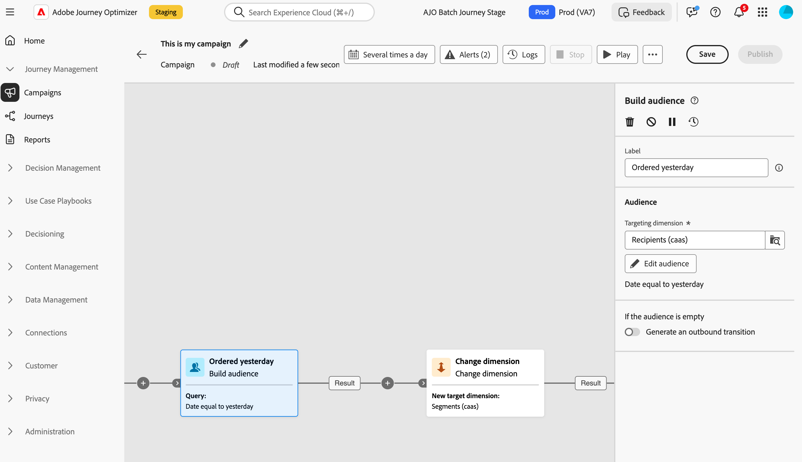

# Criar público-alvo {#build-audience}

>[!CONTEXTUALHELP]
>id="ajo_orchestration_build_audience"
>title="Atividade Criar público-alvo"
>abstract="A atividade **Criar público-alvo** permite definir o público-alvo que entrará na campanha orquestrada. Ao enviar mensagens no contexto de uma campanha orquestrada, o público-alvo da mensagem não é definido na atividade de canal e sim na atividade **Criar público-alvo**."

Como profissional de marketing, você pode criar consultas complexas facilmente usando uma interface amigável, permitindo que segmente seu público com base em uma grande variedade de critérios e comportamentos para adaptar suas campanhas com mais eficiência.

Para fazer isso, use a atividade de direcionamento **Criar público**. Essa atividade permite definir o público-alvo que entrará na campanha orquestrada. Ao enviar mensagens no contexto de uma campanha orquestrada, o público-alvo da mensagem não é definido na atividade de canal e sim na atividade **Criar público-alvo**.

Para definir o público-alvo, você pode:

* Selecione um público existente.
* Selecione um filtro predefinido.
* Crie um novo público-alvo com o modelador de consultas definindo e combinando critérios de filtragem.

>[!NOTE]
>
>Os públicos carregados de um arquivo não podem ser direcionados usando uma atividade Criar público. Para fazer isso, você precisa usar uma atividade **Carregar arquivo** seguida por uma atividade **Reconciliação**.

## Configurar a atividade Criar público-alvo {#build-audience-configuration}

>[!CONTEXTUALHELP]
>id="ajo_orchestration_build_audience_audienceselector"
>title="Público-alvo"
>abstract="Selecione o público-alvo assim como faz ao criar uma nova entrega. "

Siga estas etapas para configurar a atividade **Criar público-alvo**:

1. Adicione uma atividade **Criar público-alvo**.
1. Defina um rótulo.
1. Defina o tipo de público-alvo: **Crie o seu próprio** ou **Ler público-alvo**.
1. Configure seu público seguindo as etapas detalhadas nas guias abaixo.

Para criar sua própria query, siga estas etapas:

1. Selecione **Crie sua própria (consulta)**.
1. Escolha a **Dimensão de direcionamento**. O targeting dimension permite definir a população-alvo da operação: destinatários, beneficiários(as) de contrato, operadores(as), assinantes, etc. Por padrão, o público-alvo é selecionado entre os destinatários.
1. Clique em **Continuar**.
1. Use o modelador de consultas para definir sua consulta. [Saiba mais sobre o modelador de consultas nesta seção](../ms-query-modeler.md)

## Exemplos{#build-audience-examples}

Este é um exemplo de uma campanha orquestrada com duas atividades **Build audience**. A primeira é direcionada ao público-alvo dos jogadores de pôquer, seguida de uma entrega por email. A segunda é direcionada ao público-alvo de clientes VIP, seguida de uma entrega de SMS.

