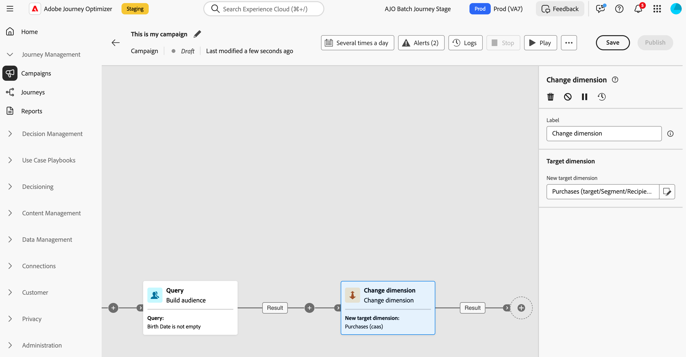

# Mudar dimensão {#change-dimension}

>[!CONTEXTUALHELP]
>id="ajo_orchestration_dimension_complement"
>title="Gerar um complemento"
>abstract="É possível gerar uma transição de saída adicional com a população restante, que foi excluída como uma duplicata. Para fazer isso, ative a opção **Gerar complemento**"

>[!CONTEXTUALHELP]
>id="ajo_orchestration_change_dimension"
>title="Atividade Mudar dimensão"
>abstract="Essa atividade permite alterar o targeting dimension à medida que você constrói um público-alvo. Ela desloca o eixo dependendo do modelo de dados e da dimensão de entrada. Por exemplo, você pode mudar da dimensão “contratos” para a dimensão “clientes”."

Como profissional de marketing, você pode alternar o targeting dimension de uma entidade para outra entidade vinculada em uma campanha orquestrada e refinar seu direcionamento de público-alvo com base em diferentes conjuntos de dados, como a mudança de perfis de usuários para direcionamento de ações ou reservas específicas.

Para fazer isso, use a atividade de direcionamento **Change dimension**. Essa atividade permite alterar o targeting dimension à medida que você constrói sua campanha orquestrada. Ele desloca o eixo dependendo do template de dados e da dimensão de entrada.

Por exemplo, você pode alternar o targeting dimension de uma campanha orquestrada de &quot;Perfil&quot; para &quot;Contratos&quot; para enviar mensagens ao proprietário do contrato direcionado.

<!--
>[!IMPORTANT]
>
>Please note that the **[!UICONTROL Change Dimension]** and **[!UICONTROL Change Data source]** activities should not be added in one row. If you need to use both activities consecutively, make sure you include an **[!UICONTROL Enrichement]** activity in between them. This ensures proper execution and prevents potential conflicts or errors.-->

## Configurar a atividade Change dimension {#configure}

Siga estas etapas para configurar a atividade **Alterar dimensão**:

1. Adicione uma atividade **Change dimension** à sua campanha orquestrada.

   

1. Defina a **Nova dimensão de destino**. Durante a alteração de dimensão, todos os registros são mantidos.

1. Execute a campanha orquestrada para ver o resultado. Compare os dados nas tabelas antes e depois da atividade de alteração de dimensão e compare a estrutura das tabelas de campanha orquestradas.

## Exemplo {#example}

Neste exemplo, queremos enviar um delivery de SMS para todos os perfis que fizeram uma compra. Para fazer isso, primeiro usamos uma atividade **[!UICONTROL Build audience]** vinculada a uma dimensão de direcionamento &quot;Purchase&quot; personalizada para direcionar todas as compras que ocorreram.

Em seguida, usamos uma atividade **[!UICONTROL Change dimension]** para alternar a targeting dimension de campanha orquestrada para &quot;Recipients&quot;. Isso nos permite direcionar os recipients que correspondem ao query.

