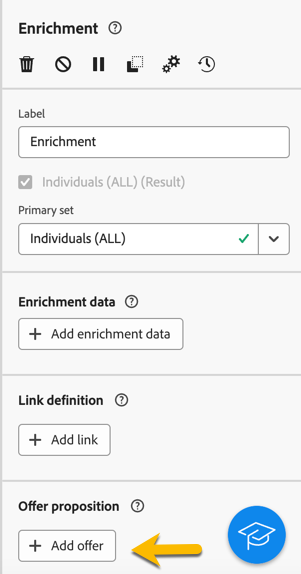
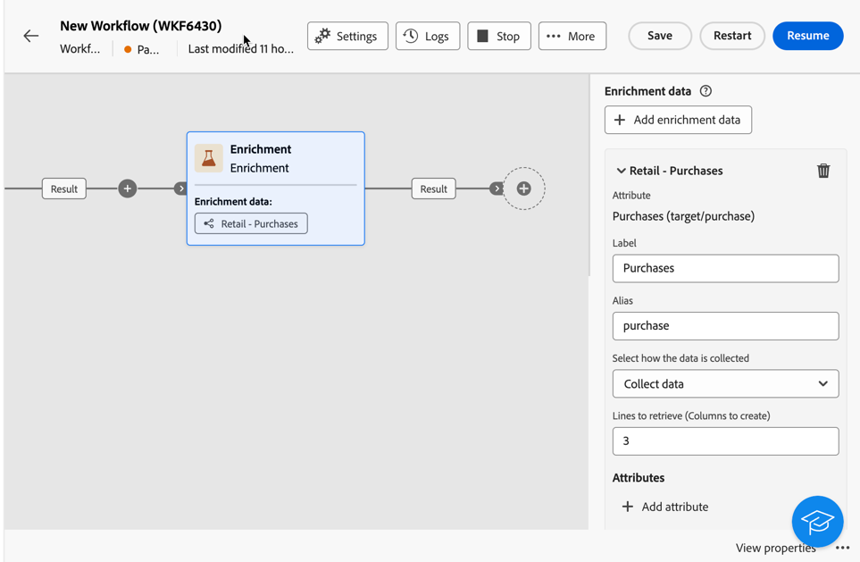

# Enriquecimento {#enrichment}

>[!CONTEXTUALHELP]
>id="ajo_orchestration_enrichment"
>title="Atividade Enriquecimento"
>abstract="A atividade **Enriquecimento** permite aprimorar os dados direcionados com informações adicionais do banco de dados. Normalmente, ela é usada em um fluxo de trabalho após atividades de segmentação."

A atividade **Enriquecimento** é uma atividade de **Direcionamento**. Ela permite aprimorar os dados direcionados com informações adicionais do banco de dados. Normalmente, ela é usada em um fluxo de trabalho após atividades de segmentação.

Os dados de Enriquecimento podem vir:

* **Da mesma tabela de trabalho** que a direcionada para a sua campanha orquestrada:

  *Direcione um grupo de clientes e adicione o campo &quot;Data de nascimento&quot; à tabela de trabalho atual*.

* **De outra tabela de trabalho**:

  *Direcione um grupo de clientes e adicione os campos &quot;Quantidade&quot; e &quot;Tipo de produto&quot; da tabela &quot;Compra&quot;*.

Após adicionar os dados de enriquecimento à campanha orquestrada, eles poderão ser usados nas atividades adicionadas após a atividade de **Enriquecimento** para segmentar os clientes em grupos distintos com base em seus comportamentos, preferências e necessidades, ou para criar mensagens e campanhas de marketing personalizadas com maior probabilidade de repercutir no público-alvo.

Por exemplo, você pode adicionar à tabela de trabalho da campanha orquestrada informações relacionadas às compras dos clientes e usar esses dados para personalizar emails com a compra mais recente ou o valor gasto nessas compras.

## Adicionar uma atividade Enrichment {#enrichment-configuration}

Siga estas etapas para configurar a atividade **Enriquecimento**:

1. Adicione atividades como **Criar público-alvo** e **Combinar**.
1. Adicione uma atividade **Enriquecimento**
1. Se várias transições tiverem sido configuradas na sua campanha orquestrada, você poderá usar o campo **[!UICONTROL Conjunto principal]** para definir qual transição deve ser usada como conjunto principal para enriquecer com dados.

## Adicionar dados de enriquecimento {#enrichment-add}

>[!CONTEXTUALHELP]
>id="ajo_targetdata_personalization_enrichmentdata"
>title="Dados de enriquecimento"
>abstract="Selecione os dados a serem usados para enriquecer sua campanha orquestrada. É possível selecionar dois tipos de dados de enriquecimento: um único atributo de enriquecimento da dimensão do público-alvo ou um link de coleção, que é um link com uma cardinalidade 1-N entre tabelas."

>[!CONTEXTUALHELP]
>id="ajo_orchestration_enrichment_data"
>title="Atividade Enriquecimento"
>abstract="Após adicionar os dados de enriquecimento à campanha orquestrada, eles poderão ser usados nas atividades adicionadas após a atividade de enriquecimento para segmentar os clientes em grupos distintos com base em seus comportamentos, preferências e necessidades, ou para criar mensagens e campanhas de marketing personalizadas que tenham mais probabilidade de repercutir com seu público-alvo."

1. Clique em **Adicionar dados de enriquecimento** e selecione o atributo a ser usado para enriquecer os dados.

   Você pode selecionar dois tipos de dados de enriquecimento: um único atributo de enriquecimento da target dimension ou um link de coleção. Cada um desses tipos é detalhado nos exemplos abaixo:
   * [Atributo único de enriquecimento](#single-attribute)
   * [Link da coleção](#collection-link)

   >[!NOTE]
   >
   >O **botão Editar expressão** na tela de seleção de atributo permite criar expressões avançadas para selecionar o atributo.

   

## Criar links entre tabelas {#create-links}

>[!CONTEXTUALHELP]
>id="ajo_orchestration_enrichment_simplejoin"
>title="Definição de link"
>abstract="Crie um link entre os dados da tabela de trabalho e o Adobe Journey Optimizer. Por exemplo, ao carregar dados de um arquivo que contenha o número da conta, o país e o email dos destinatários, você precisa criar um link para a tabela do país para atualizar essas informações em seus perfis."

A seção **[!UICONTROL Definição de link]** permite criar um link entre os dados da tabela de trabalho e o Adobe Journey Optimizer. Por exemplo, ao carregar dados de um arquivo que contenha o número da conta, o país e o email dos destinatários, você precisa criar um link para a tabela do país para atualizar essas informações em seus perfis.

Há vários tipos de links disponíveis:

* Link simples de cardinalidade **[!UICONTROL 1]**: cada registro do conjunto principal pode ser associado a um e a somente um registro dos dados vinculados.
* Link simples de cardinalidade **[!UICONTROL 0 ou 1]**: cada registro do conjunto principal pode ser associado a 0 ou 1 registro dos dados vinculados, mas não a mais de um.
* **[!UICONTROL N link de coleção de cardinalidade]**: cada registro do conjunto principal pode ser associado a 0, 1 ou mais registros (N) dos dados vinculados.

Para criar um link, siga estas etapas:

1. Na seção **[!UICONTROL Definição de link]**, clique no botão **[!UICONTROL Adicionar link]**.

   

1. Na lista suspensa **Tipo de relação**, escolha o tipo de link que deseja criar.

1. Identifique o target ao qual deseja vincular o conjunto principal:

   * Para vincular uma tabela existente no banco de dados, escolha **[!UICONTROL Esquema de banco de dados]** e selecione a tabela desejada no campo **[!UICONTROL Esquema de destino]**.
   * Para vincular com dados da transição de entrada, escolha **Esquema temporário** e selecione a transição cujos dados você deseja usar.

1. Defina os critérios de reconciliação para corresponder os dados do conjunto principal com o esquema vinculado. Há dois tipos de associações disponíveis:

   * **Junção simples**: selecione um atributo específico para corresponder aos dados dos dois esquemas. Clique em **Adicionar junção** e selecione os atributos **Source** e **Destino** para usar como critérios de reconciliação.
   * **Junção avançada**: crie uma junção usando condições avançadas. Clique em **Adicionar junção** e clique no botão **Criar condição** para abrir o modelador de consulta.

Um exemplo de fluxo de trabalho usando links está disponível na seção [Exemplos](#link-example).

## Reconciliação de dados {#reconciliation}

>[!CONTEXTUALHELP]
>id="ajo_orchestration_enrichment_reconciliation"
>title="Reconciliação"
>abstract="A atividade **Enrichment** pode ser usada para reconciliar dados do esquema do Journey Optimizer com dados de outro esquema ou com dados provenientes de um esquema temporário, como dados carregados por meio de uma atividade Load file. Este tipo de link define uma reconciliação em direção a um registro exclusivo. O Journey Optimizer cria um link para uma tabela de target adicionando uma chave estrangeira nela para armazenar uma referência ao registro exclusivo."

A atividade **Enriquecimento** pode ser usada para reconciliar dados do esquema de banco de dados do Campaign com dados de outro esquema ou com dados provenientes de um esquema temporário, como os carregados por meio de uma atividade Carregar arquivo. Este tipo de link define uma reconciliação em direção a um registro exclusivo. O Journey Optimizer cria um link para uma tabela de target adicionando uma chave estrangeira nela para armazenar uma referência ao registro exclusivo.

Por exemplo, é possível usar essa opção para reconciliar o país de um perfil, que é especificado em um arquivo carregado, com um dos países disponíveis na tabela dedicada do banco de dados do Campaign.

Siga as etapas para configurar uma atividade **Enriquecimento** com um link de reconciliação:

1. Clique no botão **Adicionar link** na seção **Reconciliação**.
1. Identifique os dados com os quais deseja criar um link de reconciliação.

   * Para criar um link de reconciliação com dados do banco de dados do Campaign, selecione **Esquema de banco de dados** e escolha o esquema onde o destino está armazenado.
   * Para criar um link de reconciliação com dados provenientes da transição de entrada, selecione **Esquema temporário** e escolha a transição de campanha orquestrada onde os dados de destino são armazenados.

1. Os campos **Rótulo** e **Nome** são preenchidos automaticamente com base no esquema de destino selecionado. Você pode alterar os valores deles, se necessário.

1. Na seção **Critérios de reconciliação**, especifique como deseja reconciliar dados das tabelas de origem e de destino:

   * **Junção simples**: reconcilie um campo específico da tabela de origem com outro campo na tabela de destino. Para fazer isso, clique no botão **Adicionar junção** e especifique os campos **Source** e **Destino** a serem usados para a reconciliação.

     >[!NOTE]
     >
     >Você pode usar um ou mais critérios de **associação simples**, caso em que todos eles devem ser verificados para que os dados possam ser vinculados.

   * **Junção avançada**: use o modelador de consultas para configurar os critérios de reconciliação. Para fazer isso, clique no botão **Criar condição** e defina seus critérios de reconciliação criando sua própria regra usando as operações AND e OR.

O exemplo abaixo mostra uma campanha orquestrada configurada para criar um link entre a tabela de perfis do Journey Optimizer e uma tabela temporária gerada por uma atividade **Carregar arquivo**. Neste exemplo, a atividade **Enrichment** reconcilia ambas as tabelas usando o endereço de email como critério de reconciliação.

## Adicionar ofertas {#add-offers}

>[!CONTEXTUALHELP]
>id="ajo_orchestration_enrichment_offer_proposition"
>title="Apresentação da oferta"
>abstract="A atividade Enriquecimento permite adicionar ofertas para cada perfil."

A atividade **[!UICONTROL Enrichment]** permite adicionar ofertas para cada perfil.

Para fazer isso, siga as etapas para configurar uma atividade de **[!UICONTROL Enriquecimento]** com uma oferta:

1. Na atividade **[!UICONTROL Enriquecimento]**, na seção **[!UICONTROL Apresentação da oferta]**, clique no botão **[!UICONTROL Adicionar oferta]**

   

1. Você tem duas opções para a seleção da oferta:

   * **[!UICONTROL Procure a melhor oferta na categoria]**: marque esta opção e especifique os parâmetros de chamada do mecanismo de oferta (espaço de oferta, categoria ou tema(s), data de contato, número de ofertas a serem mantidas). O mecanismo calculará as melhores ofertas para adicionar de acordo com esses parâmetros. Recomendamos completar o campo Category ou o campo Theme, em vez de ambos ao mesmo tempo.

     

   * **[!UICONTROL A predefined offer]**: marque esta opção e especifique um espaço de ofertas, uma oferta específica e uma data de contato para configurar diretamente a oferta que deseja adicionar, sem chamar o mecanismo de oferta.

     

1. Depois de selecionar sua oferta, clique no botão **[!UICONTROL Confirmar]**.

Agora você pode usar a oferta na atividade de delivery.

### Uso das ofertas da atividade Enrichment

Em uma campanha orquestrada, se quiser usar as ofertas obtidas de uma atividade de enriquecimento no seu delivery, siga as etapas abaixo:

1. Abra a atividade de delivery e acesse a edição de conteúdo. Clique no botão **[!UICONTROL Configurações de ofertas]** e selecione na lista suspensa o **[!UICONTROL Espaço de ofertas]** correspondente à sua oferta.
Se quiser exibir somente as ofertas da atividade de enriquecimento, defina o número de **[!UICONTROL Propositions]** como 0 e salve as modificações.

   

1. No designer de email, ao adicionar uma personalização com ofertas, clique no ícone **[!UICONTROL Propositions]** para exibir a(s) oferta(s) obtida(s) da atividade **[!UICONTROL Enrichment]**. Abra a oferta que deseja escolher clicando nela.

   

   Acesse **[!UICONTROL Funções de renderização]** e escolha **[!UICONTROL Renderização do HTML]** ou **[!UICONTROL Renderização do texto]** de acordo com suas necessidades.

   

>[!NOTE]
>
>Se você optar por ter mais de uma oferta na atividade **[!UICONTROL Enriquecimento]** na opção **[!UICONTROL Número de ofertas a serem mantidas]**, todas as ofertas serão exibidas ao clicar no ícone **[!UICONTROL Propositions]**.

## Exemplos {#example}

### Atributo único de enriquecimento {#single-attribute}

Nesse caso, estamos apenas adicionando um atributo único de enriquecimento, por exemplo, a data de nascimento. Siga estas etapas:

1. Clique no campo **Atributo**.
1. Selecione um campo simples da dimensão de direcionamento (data de nascimento, em nosso exemplo).
1. Clique em **Confirmar**.

### Link de coleção {#collection-link}

Neste caso de uso mais complexo, selecionaremos um link de coleção, que é um link com uma cardinalidade 1-N entre tabelas. Vamos recuperar as três compras mais recentes que custam menos de US$ 100. Para isso, é necessário definir:

* um atributo de enriquecimento: o campo **Price**
* o número de linhas a serem recuperadas: 3
* um filtro: filtrar itens que custam mais de US$ 100
* uma classificação: classificação decrescente no campo **Data do pedido**.

#### Adicionar o atributo {#add-attribute}

É aqui que você seleciona o link de coleção para usar como dados de enriquecimento.

1. Clique no campo **Atributo**.
1. Clique em **Exibir atributos avançados**.
1. Selecione o campo **Preço** da tabela **Compras**.

<!--  -->

#### Definir as configurações de coleção{#collection-settings}

Em seguida, defina como os dados são coletados e o número de registros a serem recuperados.

1. Selecione **Coletar dados** no menu suspenso **Selecione como os dados são coletados**.
1. Digite &quot;3&quot; no campo **Linhas a serem recuperadas (Colunas a serem criadas)**.

Se quiser, por exemplo, obter o valor médio das compras de um cliente, selecione **Dados agregados** em vez disso, e depois selecione **Média** no menu suspenso **Função de agregação**.

Use os campos **Rótulo** e **Alias** do seu atributo para torná-lo mais compreensível, como mostrado abaixo.

#### Definir os filtros{#collection-filters}

Aqui, definimos o valor máximo do atributo de enriquecimento. Filtramos itens que custam mais de US$ 100.
1. Clique em **Criar filtros**.
1. Adicione os dois filtros a seguir: **Preço** existe E **Preço** é menor que 100. O primeiro filtra os valores NULL, pois seriam exibidos como o maior valor.
1. Clique em **Confirmar**.

#### Definir a classificação{#collection-sorting}

Agora precisamos aplicar a classificação para recuperar as três compras **mais recentes**.

1. Ative a opção **Habilitar classificação**.
1. Clique no campo **Atributo**.
1. Selecione o campo **Data do pedido**.
1. Clique em **Confirmar**.
1. Selecione **Decrescente** no menu suspenso **Classificar**.

### Enriquecimento com dados vinculados {#link-example}

O exemplo abaixo mostra uma campanha orquestrada configurada para criar um link entre duas transições. A primeira transição é direcionada aos dados do perfil usando uma atividade **Query**, enquanto a segunda transição inclui dados de compra armazenados em um arquivo carregado por meio de uma atividade Load file.

* A primeira atividade **Enrichment** vincula o conjunto principal (dados da atividade **Query**) ao esquema da atividade **Load file**. Isso nos permite corresponder cada perfil direcionado pelo query com os dados de compra correspondentes.

  

* Uma segunda atividade **Enrichment** é adicionada para enriquecer dados da tabela de campanha orquestrada com os dados de compra provenientes da atividade **Load file**. Isso nos permite usar esses dados em outras atividades do, por exemplo, para personalizar mensagens enviadas aos clientes com informações sobre suas compras.

  
