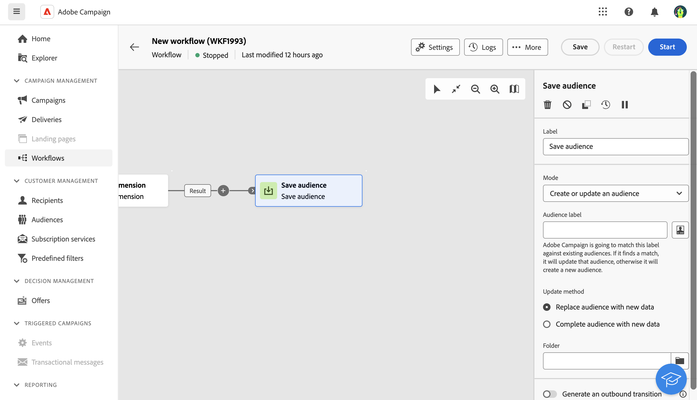

# Salvar público-alvo {#save-audience}

>[!CONTEXTUALHELP]
>id="ajo_orchestration_save_audience"
>title="Salvar um público-alvo"
>abstract="Use esta atividade para atualizar um público-alvo ou criar um novo público-alvo a partir da população computada upstream na campanha orquestrada. Os públicos-alvo criados são adicionados à lista de públicos-alvo e disponibilizados no menu **Públicos-alvo**."

>[!CONTEXTUALHELP]
>id="ajo_orchestration_saveaudience_outbound"
>title="Gerar transição de saída"
>abstract="Use essa opção se quiser adicionar uma transição após a atividade **Salvar público-alvo**."

A atividade **Salvar público-alvo** é uma atividade **de Direcionamento**. Essa atividade permite atualizar um público-alvo ou criar um novo público-alvo a partir da população computada upstream em uma campanha orquestrada. Os públicos-alvo criados são adicionados à lista de públicos-alvo do aplicativo e disponibilizados pelo menu **Públicos-alvo**.

Essa atividade é usada essencialmente para manter os grupos de populações computados na mesma campanha orquestrada, convertendo-os em públicos-alvo reutilizáveis. Conecte-a a outras atividades de direcionamento, como uma atividade **Criar público** ou **Combinar**.

## Configurar a atividade Save audience{#save-audience-configuration}

Siga estas etapas para configurar a atividade **Salvar público-alvo**:

1. Adicione uma atividade **Save audience** à sua campanha orquestrada.

1. No menu suspenso **Modo**, selecione a ação que deseja executar:

   * **Criar ou atualizar um público existente**: defina um **Rótulo de público-alvo**. Se o público-alvo já existir, ele será atualizado, caso contrário, um novo público-alvo será criado.

   * **Atualizar um público-alvo**: escolha o **Público-alvo** que deseja atualizar na lista de públicos-alvo existentes.

1. Selecione o **Modo de atualização** que será aplicado aos públicos existentes:

   * **Substituir conteúdo do público-alvo por novos dados**: todo o conteúdo do público-alvo é substituído. Os dados antigos são perdidos. Somente os dados da transição de entrada da atividade Save audience são mantidos. Essa opção apaga o tipo de público-alvo e o targeting dimension do público-alvo atualizado.

   * **Concluir público-alvo com novos dados**: o conteúdo antigo do público-alvo é mantido e os dados da transição de entrada da atividade Salvar público-alvo são adicionados a ele.

1. Marque a opção **Generate an outbound transition** se desejar adicionar uma transição após a atividade **Save audience**.

O conteúdo do público-alvo salvo ficará disponível na exibição detalhada do público-alvo, que pode ser acessada no menu **Públicos-alvo**. As colunas disponíveis nesta exibição correspondem às da transição de entrada da atividade **Salvar público-alvo** da campanha orquestrada.

## Exemplo{#save-audience-example}

O exemplo a seguir ilustra uma simples atualização de público-alvo do direcionamento. Um scheduler é adicionado para executar a campanha orquestrada uma vez por mês. Um query recupera todos os perfis que fizeram assinatura nos diferentes aplicativos disponíveis. A atividade **Salvar público-alvo** atualiza o público-alvo excluindo os perfis que cancelaram a assinatura do serviço desde a última execução orquestrada da campanha e adicionando os perfis que fizeram assinatura recentemente.
