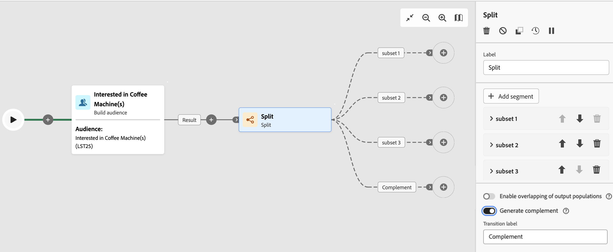

# Orquestrar atividades de campanha orquestradas {#orchestrate}

Depois que você [criar uma campanha orquestrada](gs-campaign-creation.md), seja do menu de campanha orquestrada ou de uma campanha, você poderá começar a orquestrar as diferentes tarefas que ela executará. Para fazer isso, uma tela visual é fornecida, permitindo que você construa um diagrama de campanha orquestrado. Neste diagrama, é possível adicionar várias atividades e conectá-las em ordem sequencial.

## Adicionar atividades {#add}

Nessa etapa da configuração, o diagrama é exibido com um ícone de início, representando o início da campanha orquestrada. Para adicionar sua primeira atividade, clique no botão **+** conectado ao ícone de início.

Uma lista de atividades que podem ser adicionadas ao diagrama é exibida. As atividades disponíveis dependem da sua posição no diagrama de campanha orquestrada. Por exemplo, ao adicionar sua primeira atividade, é possível iniciar a campanha orquestrada direcionando um público, dividindo o caminho da campanha orquestrada ou definindo uma atividade **Wait** para atrasar a execução da campanha orquestrada. Por outro lado, depois de uma atividade **Criar público-alvo**, você pode refinar seu público-alvo com atividades de direcionamento, enviar uma entrega para seu público com atividades de canal ou organizar o processo de campanha orquestrada com atividades de controle de fluxo.

{zoomable="yes"}

Depois que uma atividade é adicionada ao diagrama, um painel direito é exibido, permitindo configurar a atividade recém-adicionada com configurações específicas. Informações detalhadas sobre como configurar cada atividade estão disponíveis em [esta seção](activities/about-activities.md).

{zoomable="yes"}

Repita esse processo para adicionar quantas atividades desejar, dependendo das tarefas que deseja que sua campanha orquestrada execute. Observe que você também pode inserir uma nova atividade entre duas atividades. Para fazer isso, clique no botão **+** na transição entre as atividades, selecione a atividade desejada e a configure no painel direito.

Para remover uma atividade, selecione-a na tela e clique no ícone **Excluir** nas propriedades da atividade.

>[!TIP]
>
>Você tem a opção de personalizar o nome das transições entre cada atividade. Para fazer isso, selecione a transição e altere seu rótulo no painel direito.

## A barra de ferramentas {#toolbar}

A barra de ferramentas localizada no canto superior direito da tela fornece opções para manipular facilmente as atividades e navegar na tela:

* **Modo de seleção múltipla**: selecione várias atividades para excluí-las todas de uma vez ou copie-as e cole-as. Consulte [esta seção](#copy).
* **Girar**: Alternar a tela verticalmente.
* **Ajustar à tela**: adapte o nível de zoom da tela à sua tela.
* **Menos zoom** / **Menos zoom**: Menos zoom ou mais zoom na tela.
* **Exibir mapa**: abre um instantâneo da tela mostrando que você está localizado.

{zoomable="yes"}{width="50%"}

## Gerenciar atividades {#manage}

Ao adicionar atividades, os botões de ação ficam disponíveis no painel de propriedades, permitindo que você execute várias operações.

{zoomable="yes"}

É possível:

* **Excluir** a atividade da tela.
* **Desabilitar/Habilitar** a atividade. Quando a campanha orquestrada é executada, as atividades desabilitadas e as atividades a seguir no mesmo caminho não são executadas e a campanha orquestrada é interrompida.
* **Pausar/Retomar** a atividade. Quando a campanha orquestrada é executada, ela é pausada na atividade pausada. A tarefa correspondente, bem como todas as que a seguem no mesmo caminho, não são executadas.
* **Copiar** a atividade. Consulte [esta seção](#copy).
* **Mover** uma atividade e todos os seus nós filhos para outra transição. Consulte [esta seção](#move)
* Acesse as **Opções de execução** da atividade.
* Acesse os **Logs e tarefas** da atividade.

Várias atividades de **Direcionamento**, como **Combinar** ou **Desduplicação**, permitem processar a população restante e incluí-la em uma transição de saída adicional. Por exemplo, se você estiver usando uma atividade **Split**, o complemento consiste na população que não corresponde a nenhum dos subconjuntos definidos anteriormente. Para usar este recurso, ative a opção **Gerar complemento**.

## Mover ou copiar atividades {#move-copy}

### Atividades de copiar e colar {#copy}

Você pode copiar atividades de campanha orquestradas e colá-las em qualquer fluxo de trabalho. A campanha orquestrada de destino pode estar em uma guia do navegador diferente.

Para copiar atividades, você tem duas opções:

* copie uma atividade usando o botão de ação.

  {zoomable="yes"}{width="70%"}

* copie várias atividades usando o botão da barra de ferramentas.

  {zoomable="yes"}{width="70%"}

Para colar as atividades copiadas, clique no botão **+** em uma transição e selecione &quot;Colar atividade X&quot;.

{zoomable="yes"}{width="50%"}

### Mover atividades e seus nós filhos {#move}

O Journey Optimizer permite mover uma atividade, juntamente com todo o conteúdo dos nós secundários (incluindo todas as transições e atividades dentro dela) para o final de outra transição na mesma campanha orquestrada.

Esse processo desconecta a atividade e tudo o que está em sua transição de saída do local inicial, movendo-a para a nova transição de destino.

Para mover uma atividade:

1. Selecione a atividade que deseja mover.
1. No painel de propriedades da atividade, clique no botão **Mover**.
1. Selecione a transição em que deseja colocar a atividade e sua transição de saída e, em seguida, confirme.

## Opções de execução {#execution}

Todas as atividades permitem gerenciar as opções de execução. Selecione uma atividade e clique no botão **Opções de execução**. Isso permite definir o modo de execução e o comportamento da atividade em caso de erros.

{zoomable="yes"}{width="70%"}

### Propriedades

O campo **Execution** permite que você defina a ação a ser executada quando a tarefa for iniciada.

O campo **Duração máxima da execução** permite especificar uma duração como &quot;30s&quot; ou &quot;1h&quot;. Se a atividade não for concluída após o término da duração especificada, um alerta será acionado. Isso não afeta o funcionamento da campanha orquestrada.

O campo **Fuso horário** permite selecionar o fuso horário da atividade. O Adobe Journey Optimizer permite gerenciar as diferenças de tempo entre vários países na mesma instância. A configuração aplicada é definida quando a instância é criada.

**O campo Afinidade** permite forçar a execução de uma campanha orquestrada ou de uma atividade de campanha orquestrada em uma máquina específica. Para fazer isso, é necessário especificar uma ou várias afinidades para a campanha orquestrada ou atividade em questão.

O campo **Behavior** permite definir o procedimento a ser seguido se tarefas assíncronas forem usadas.

### Gerenciamento de erros

O campo **Em caso de erro** permite que você especifique a ação a ser executada caso a atividade encontre um erro.

### Script de inicialização

O **script de Inicialização** permite inicializar variáveis ou modificar propriedades da atividade. Clique no botão **Editar código** e digite o trecho de código a ser executado. O script é chamado quando a atividade é executada.

## Exemplo {#example}

Este é um exemplo de campanha orquestrada projetado para enviar um email a todos os clientes (exceto clientes do VIP) com um email que estejam interessados em máquinas de café.

{zoomable="yes"}{zoomable="yes"}

Para isso, as atividades abaixo foram adicionadas:

* Uma atividade **[!UICONTROL Fork]** que divide a campanha orquestrada em três caminhos (um para cada conjunto de clientes),
* **[!UICONTROL Crie atividades de público-alvo]** para direcionar os três conjuntos de clientes:

   * Clientes com um email,
   * Clientes pertencentes ao público-alvo pré-existente &quot;Interessado em máquina(s) de café&quot;,
   * Clientes pertencentes ao público-alvo pré-existente &quot;VIP ou recompensa&quot;.

* Uma atividade **[!UICONTROL Combine]** que agrupa clientes com um email e aqueles interessados em máquinas de café,
* Uma atividade **[!UICONTROL Combine]** que exclui clientes do VIP,
* Uma atividade de **[!UICONTROL Entrega de email]** que envia um email para os clientes resultantes.

Depois de concluir a campanha orquestrada, adicione uma atividade en **[!UICONTROL End]** ao final do diagrama. Essa atividade permite marcar visualmente o final de um fluxo de trabalho e não tem impacto funcional.

Depois de criar com sucesso o diagrama de campanha orquestrada, você pode executar a campanha orquestrada e acompanhar o progresso de suas várias tarefas. [Saiba como iniciar uma campanha orquestrada e monitorar sua execução](start-monitor-campaigns.md)
