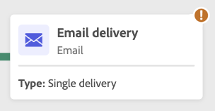

# Agendar e iniciar suas campanhas orquestradas {#start-monitor}

>[!CONTEXTUALHELP]
>id="ajo_campaign_publication"
>title="Publicar campanha orquestrada"
>abstract="Para iniciar a campanha, você deve publicá-la. Certifique-se de que todos os avisos foram resolvidos antes da publicação."

Depois de criar as tarefas orquestradas e projetadas para execução na tela, é possível publicá-las e monitorar como elas estão sendo executadas.

## Opções de agendamento

>[!CONTEXTUALHELP]
>id="ajo_orchestration_scheduler"
>title="Atividade Scheduler"
>abstract="O **Scheduler** da campanha permite agendar quando a campanha orquestrada será iniciada. Esta atividade deve ser considerada como um início agendado. Ela só pode ser usada como a primeira atividade da campanha orquestrada."

Como gerente de campanha, você pode agendar campanhas para serem iniciadas automaticamente em horários específicos, permitindo um tempo preciso e dados de direcionamento precisos para comunicações de marketing.

### Práticas recomendadas {#scheduler-best-practices}

* Não programe uma campanha orquestrada para execução por mais de 15 minutos, pois isso pode atrapalhar o desempenho geral do sistema e criar bloqueios no banco de dados.
* Se quiser enviar uma mensagem instantânea na sua campanha orquestrada, você pode configurá-la para ser executada **Uma vez**.
* Para enviar uma mensagem recorrente em sua campanha orquestrada, use as opções de **Agendamento** e defina a frequência de execução. A atividade recorrente de delivery não permite definir um agendamento.

### Configurar o agendamento da campanha {#scheduler-configuration}

>[!CONTEXTUALHELP]
>id="ajo_orchestration_schedule_validity"
>title="Validade do Scheduler"
>abstract="É possível definir um período de validade para o Scheduler. Pode ser permanente (padrão) ou pode ser válido até uma data específica."

>[!CONTEXTUALHELP]
>id="ajo_orchestration_schedule_options"
>title="Opções do Scheduler"
>abstract="Defina a frequência do scheduler. Pode ser executado em um momento específico, uma ou várias vezes por dia, semana ou mês."

Siga estas etapas para configurar o **agendamento de campanha orquestrada**:

1. Selecione o botão **Assim que possível** na parte superior da tela de campanha orquestrada.

1. Configure a **Frequência de execução**:

   * **Uma vez**: a campanha orquestrada é executada uma única vez.

   * **Diariamente**: a campanha orquestrada é executada em um horário específico, uma vez por dia.

   * **Várias vezes ao dia:** a campanha orquestrada é executada regularmente várias vezes ao dia. Você pode configurar as execuções em horários específicos ou periodicamente.

   * **Semanalmente**: a campanha orquestrada é executada em um momento especificado, uma ou várias vezes por semana.

   * **Monthly**: a campanha orquestrada é executada em um momento especificado, uma ou várias vezes por mês. Você pode selecionar meses quando precisar que a campanha orquestrada seja executada. Você também pode configurar as execuções em dias da semana especificados do mês, como a segunda terça-feira do mês.

     {width="50%" align="left"}

1. Defina os detalhes da execução de acordo com a frequência selecionada. Os campos de detalhes variam dependendo da frequência usada (tempo, frequência de repetição, dias especificados etc.).

1. Clique em **Visualizar horas de inicialização** para verificar a programação das próximas dez execuções da sua campanha orquestrada.

1. Defina o período de validade do scheduler:

   * **Permanente (nunca expira)**: a campanha orquestrada é executada, de acordo com a frequência especificada, sem limites para o intervalo de tempo ou o número de iterações.

   * **Período de validade**: a campanha orquestrada é executada de acordo com a frequência especificada, até uma data específica. É necessário especificar datas de início e término.

1. Selecione **Confirmar** para salvar suas configurações. A frequência de execução é exibida acima da tela de campanha orquestrada.

>[!TIP]
>
>Se quiser iniciar a campanha orquestrada imediatamente, mantenha o valor padrão **Assim que possível**.

## Exemplo {#scheduler-example}

No exemplo a seguir, a atividade é configurada para que a campanha orquestrada seja executada duas vezes por dia, às 9h e às 12h, todos os dias da semana de 1º de outubro de 2025 a 1º de janeiro de 2026.

{width="50%" align="left"}

## Iniciar uma campanha orquestrada {#start}

Para iniciar uma campanha orquestrada, navegue até a guia **[!UICONTROL Orquestração]** do menu **[!UICONTROL Campanhas]** e selecione a campanha a ser iniciada e clique no botão **[!UICONTROL Reproduzir]**, no canto superior direito da tela.

Quando a campanha orquestrada estiver em execução, cada atividade na tela será executada em ordem sequencial, até que o final da campanha orquestrada seja atingido.

Você pode acompanhar o progresso de perfis direcionados em tempo real usando um fluxo visual. Isso permite identificar rapidamente o status de cada atividade e o número de perfis em transição entre elas.

{zoomable="yes"}

## Transições de campanha orquestradas {#transitions}

Em campanhas orquestradas, os dados transportados de uma atividade para outra por meio de transições são armazenados em uma tabela de trabalho temporária. Esses dados podem ser exibidos para cada transição. Para fazer isso, selecione uma transição para abrir as propriedades no lado direito da tela.

* Clique em **[!UICONTROL Visualizar esquema]** para exibir o esquema da tabela de trabalho.
* Clique em **[!UICONTROL Visualizar resultados]** para visualizar os dados transportados na transição selecionada.

{zoomable="yes"}

## Monitorar execução da atividade {#activities}

Os indicadores visuais no canto superior direito de cada caixa de atividade permitem verificar a execução:

| Indicador visual | Descrição |
|-----|------------|
| {zoomable="yes"}{width="70%"} | A atividade está sendo executada no momento. |
| {zoomable="yes"}{width="70%"} | A atividade requer sua atenção. Isso pode envolver a confirmação do envio de um delivery ou a tomada de uma ação necessária. |
| {zoomable="yes"}{width="70%"} | A atividade encontrou um erro. Para resolver o problema, abra os logs de campanha orquestradas para obter mais informações. |
| {zoomable="yes"}{width="70%"} | A atividade foi executada com sucesso. |

## Monitorar logs e tarefas {#logs-tasks}

>[!CONTEXTUALHELP]
>id="ajo_campaign_logs"
>title="Logs e tarefas"
>abstract="A tela **Logs and tasks** fornece um histórico da execução de campanha orquestrada, registrando todas as ações de usuário e encontrando erros."

O monitoramento de logs e tarefas é uma etapa essencial para analisar campanhas orquestradas e garantir que elas estejam sendo executadas corretamente. Eles podem ser acessados pelo ícone **[!UICONTROL Logs]**, que está disponível na barra de ferramentas de ações e no painel de propriedades de cada atividade.

O menu **[!UICONTROL Logs and tasks]** fornece um histórico da execução de campanha orquestrada, registrando todas as ações de usuário e encontrando erros.

{zoomable="yes"}

Dois tipos de informações estão disponíveis:

* A guia **[!UICONTROL Log]** contém o histórico de execução de todas as atividades de campanha orquestradas. Ele indexa as operações realizadas e os erros de execução por ordem cronológica.
* A guia **[!UICONTROL Tasks]** detalha a sequência de execução das atividades.

Em ambas as guias, você pode escolher as colunas exibidas e sua ordem, aplicar filtros e usar o campo de pesquisa para localizar rapidamente as informações desejadas.

## Comandos de execução de campanha orquestrados {#execution-commands}

A barra de ação no canto superior direito fornece comandos que permitem gerenciar a execução orquestrada da campanha. É possível:

* **[!UICONTROL Iniciar]** / **[!UICONTROL Retomar]** a execução do   campanha orquestrada, que então assume o status In progress. Se a campanha orquestrada tiver sido pausada, ela será retomada, caso contrário, ela será iniciada e as atividades iniciais serão ativadas.

* **[!UICONTROL Pausar]** a execução da campanha orquestrada, que então assume o status Pausado. Nenhuma nova atividade será ativada até que seja retomada, mas as operações em andamento não são suspensas.

* **[!UICONTROL Parar]** uma campanha orquestrada que está sendo executada, que assumirá o status Concluído. Se possível, as operações em andamento são interrompidas. Não é possível retomar da campanha orquestrada do mesmo local em que ela foi interrompida.
