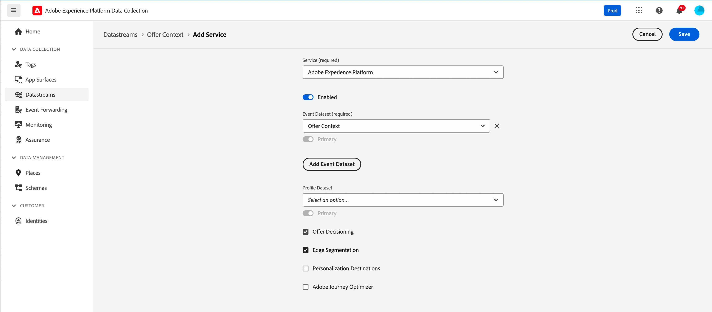
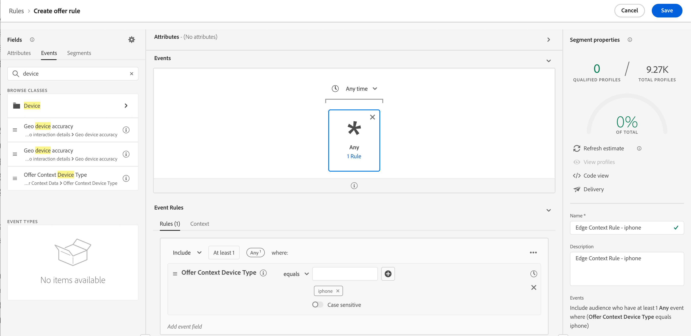

# Dados de contexto e solicitações de decisão de borda {#edge}

Esta seção orienta você sobre como transmitir dados de contexto nas solicitações do Edge Decisioning e usá-los nas regras de elegibilidade. Exploraremos um caso de uso completo que demonstra como fornecer ofertas personalizadas com base no tipo de dispositivo que os clientes estão usando.

Este caso de uso envolve várias etapas principais:

1. [Configurar pré-requisitos](#prerequisites): verifique se todas as etapas necessárias foram concluídas para transmitir dados de contexto em suas solicitações.
1. [Usar dados de contexto em regras de qualificação](#rules): crie regras que determinam quais ofertas devem ser mostradas com base no tipo de dispositivo do usuário.
1. [Criar ofertas específicas de dispositivo](#offers): crie ofertas personalizadas para cada tipo de dispositivo e vincule-as às regras correspondentes.
1. [Criar uma coleção de ofertas](#collection): agrupe todas as ofertas em uma coleção estática.
1. [Configurar uma decisão](#decision): crie uma nova decisão que aproveite o Mecanismo do Offer Decisioning para escolher a melhor oferta a ser apresentada aos usuários com base em seu tipo de dispositivo.
1. [Enviar dados de contexto na solicitação do Edge Decisioning](#request): transmitir dados de contexto por meio da solicitação da API para recuperar e apresentar as ofertas apropriadas aos usuários.

>[!BEGINSHADEBOX]

Para ir além, você também pode aproveitar os dados de contexto em **fórmulas de classificação** ou **personalizar suas representações de oferta** dinamicamente. Por exemplo, você pode criar uma única oferta e usar campos de personalização para adaptar sua representação com base nos dados de contexto. Por exemplo, exibir uma determinada imagem se o usuário tiver um iphone e outra para usuários do ipad. Para obter mais informações, consulte estas seções:

* [Fórmulas de classificação - Aumentar ofertas com base nos dados de contexto](../offers/ranking/create-ranking-formulas.md#context-data)
* [Personalizar representações com base nos dados de contexto](../offers/offer-library/add-representations.md#context-data)

>[!ENDSHADEBOX]

## Pré-requisitos para transmitir dados de contexto em solicitações do Edge Decisioning {#prerequisites}

Em vez de transmitir o contexto em um formato bastante livre usando a API de decisão, a carga de contexto do Edge Decisioning precisa ser compatível com o Evento de experiência XDM. Para fazer isso, o contexto precisa ser definido como parte do &quot;Evento de experiência XDM&quot; usado para a coleta de dados.

1. Defina um esquema de evento de experiência. Para o propósito deste caso de uso, um esquema &quot;Contexto de oferta&quot; é criado e os campos de contexto de oferta fazem parte de um grupo de campos &quot;Contexto de oferta&quot;. Na realidade, o fieldgroup seria adicionado ao schema do evento de experiência usado para a coleção de dados associada à sequência de dados &quot;Rede de coleção da Edge&quot;.

   >[!NOTE]
   >
   >O esquema de evento de experiência de contexto de oferta precisa fazer parte do perfil, com um campo &quot;CUSTOMER_ID&quot; usado como a identidade principal.

   Neste exemplo, o grupo de campos &quot;Contexto da oferta&quot; tem duas propriedades: language e deviceType. Essas propriedades serão usadas na classificação de ofertas e nas regras de qualificação.

   {width="60%" align="center" zoomable="yes"}

   Saiba como trabalhar com esquemas no [guia do Experience Data Model (XDM) do Adobe Experience Platform](https://experienceleague.adobe.com/pt-br/docs/experience-platform/xdm/home){target="_blank"}

1. Crie um conjunto de dados (aqui, &quot;Contexto da oferta&quot;) e verifique se ele está ativado para o perfil.

1. Crie uma nova sequência de dados a partir do menu **[!UICONTROL Coleção de Dados]** > **[!UICONTROL Sequências de Dados]**. Saiba como criar e configurar a sequência de dados no [guia de sequências de dados](https://experienceleague.adobe.com/pt-br/docs/experience-platform/datastreams/configure){target="_blank"} do Adobe Experience Platform

   Aqui, criamos uma sequência de dados de &quot;Contexto de oferta&quot;, com o esquema de evento &quot;Conteúdo de oferta&quot; selecionado.

   

1. Edite o fluxo de dados recém-criado e selecione &quot;Adobe Experience Platform&quot; como o serviço e &quot;Contexto de oferta&quot; como o conjunto de dados do evento.

   

1. Salve o fluxo de dados e copie a ID dele. Essa ID será usada no endpoint da solicitação de API. [Saiba como criar a chamada de API](#request)

   

## Usar dados de contexto em regras de elegibilidade {#rules}

Crie regras de qualificação que determinam quais ofertas devem ser mostradas com base no tipo de dispositivo do usuário:



* regra do dispositivo iphone:

   * Nome da regra: &quot;Regra de contexto do Edge - iphone&quot;
   * Configuração: deviceType = &#39;iphone&#39;
   * Sintaxe do PQL:

     ```
     select _Any1 from xEvent where _Any1._experienceplatform.offerContextData.deviceType.equals("iphone", false)
     ```

* regra do dispositivo ipad:

   * Nome da regra: &quot;Regra de contexto do Edge - ipad&quot;
   * Configuração: deviceType = &#39;ipad&#39;
   * Sintaxe do PQL

     ```
     select _Any1 from xEvent where _Any1._experienceplatform.offerContextData.deviceType.equals("ipad", false)
     ```

## Criar ofertas {#offers}

Crie uma oferta para cada tipo de dispositivo e vincule-a à regra de elegibilidade correspondente criada anteriormente:

* Oferta para usuários do iphone:

   * Nome da oferta : &quot;Edge Context - iPhone Offer Content&quot;
   * Regra associada: &quot;Regra de contexto do Edge - iphone&quot;

* Oferta para usuários do ipad:

   * Nome da oferta: Edge Context - Conteúdo da oferta iPad :
   * Regra associada: &quot;Regra de contexto do Edge - ipad&quot;

Além disso, crie uma oferta substituta (aqui, &quot;Conteúdo de fallback de contexto&quot;) para ser exibida se nenhum critério específico de dispositivo for atendido.

## Adicionar ofertas em uma coleção {#collection}

Adicione as ofertas criadas anteriormente a uma coleção estática chamada aqui de &quot;Contexto do dispositivo Edge&quot;. Essa coleção será onde a decisão de oferta escolherá ofertas qualificadas para apresentar aos clientes.


## Criar decisão de oferta {#decision}

Crie uma nova decisão que aproveite o Mecanismo do Offer Decisioning para escolher a melhor oferta a ser apresentada aos usuários com base no tipo de dispositivo com a oferta &quot;Fallback de contexto&quot; selecionada como a oferta substituta.


>[!NOTE]
>
>Para ir além, você pode aproveitar os dados de contexto em fórmulas de classificação e atribuí-las à sua decisão. ADICIONAR INFORMAÇÕES

## Transmitir dados de contexto na solicitação do Edge Decisioning {#request}

### Endpoint

No ponto de extremidade, use a ID da [sequência de dados](#prerequisites) criada anteriormente.

`https://edge.adobedc.net/ee/irl1/v1/interact?configId=f3c47f2a-c484-4908-87a5-a82b55039e22`

### Conteúdo

Este é um exemplo de uma solicitação que transmite dados de contexto.

* As informações sobre o tipo de dispositivo são passadas no nó `xdm:ContextData`.
* No nó `decisionScopes`, copie e cole o escopo de decisão da [decisão de oferta](#decision) configurada anteriormente.

  +++Onde recuperar o escopo de decisão

  

  +++

```
{
    "events": [{
        "xdm": {
            "identityMap": {
                "customerId": [{
                    "id": "0000158216",
                    "authenticatedState": "authenticated",
                    "primary": true
                }]
            },
            "_experienceplatform": {
                "identity": {
                    "core": {
                        "customerId": "0000158216"
                    }
                },
                "offerContextData" : {
                    "language" : "NL",
                    "deviceType" : "iphone"
                }
            }
        }
    }],
    "query": {
        "personalization": {
            "decisionScopes": ["eyJ4ZG06YWN0aXZpdHlJZCI6Inhjb3JlOm9mZmVyLWFjdGl2aXR5OjE3M2I1MGM5Mjg0ZGQ4NzkiLCJ4ZG06cGxhY2VtZW50SWQiOiJ4Y29yZTpvZmZlci1wbGFjZW1lbnQ6MTZhMzQxZWQ4ZDYyMzc2MSJ9"]
        }
    }
}
```

### Resposta

Este é um exemplo de resposta:

```
{
    "requestId": "14a2d3f5-a6fa-494e-b42c-cc65a845284a",
    "handle": [
        {
            "payload": [
                {
                    "id": "1eafc831-4819-4800-8e25-c9e9f0838e09",
                    "scope": "eyJ4ZG06YWN0aXZpdHlJZCI6Inhjb3JlOm9mZmVyLWFjdGl2aXR5OjE3M2I1MGM5Mjg0ZGQ4NzkiLCJ4ZG06cGxhY2VtZW50SWQiOiJ4Y29yZTpvZmZlci1wbGFjZW1lbnQ6MTZhMzQxZWQ4ZDYyMzc2MSJ9",
                    "activity": {
                        "id": "xcore:offer-activity:173b50c9284dd879",
                        "etag": "1",
                        "name": "Edge Device Context"
                    },
                    "placement": {
                        "id": "xcore:offer-placement:16a341ed8d623761",
                        "etag": "1",
                        "name": "HIB",
                        "channel": "https://ns.adobe.com/xdm/channel-types/mobile",
                        "componentType": "https://ns.adobe.com/experience/offer-management/content-component-json"
                    },
                    "items": [
                        {
                            "id": "xcore:personalized-offer:173b4e05676d87f5",
                            "etag": "3",
                            "name": "Edge Context - iPhone Offer",
                            "priority": 0,
                            "schema": "https://ns.adobe.com/experience/offer-management/content-component-json",
                            "data": {
                                "id": "xcore:personalized-offer:173b4e05676d87f5",
                                "format": "application/json",
                                "language": [
                                    "en-gb"
                                ],
                                "content": "{\n    \"name\" : \"iphone offer\"\n}"
                            }
                        }
                    ]
                }
            ],
            "type": "personalization:decisions",
            "eventIndex": 0
        },
        {
            "payload": [],
            "type": "activation:pull",
            "eventIndex": 0
        },
        {
            "payload": [],
            "type": "personalization:decisions",
            "eventIndex": 0
        },
        {
            "payload": [
                {
                    "scope": "Target",
                    "hint": "37",
                    "ttlSeconds": 1800
                },
                {
                    "scope": "AAM",
                    "hint": "6",
                    "ttlSeconds": 1800
                },
                {
                    "scope": "EdgeNetwork",
                    "hint": "irl1",
                    "ttlSeconds": 1800
                }
            ],
            "type": "locationHint:result"
        },
        {
            "payload": [
                {
                    "key": "kndctr_907075E95BF479EC0A495C73_AdobeOrg_identity",
                    "value": "CiY0MDAwMDgyMjMzNTEzNzU1OTcwMjQ0NDcyNjU1MTAyMDEwNDQ3MVIRCNnE4Y6QMRABGAEqBElSTDHwAdnE4Y6QMQ==",
                    "maxAge": 34128000
                },
                {
                    "key": "kndctr_907075E95BF479EC0A495C73_AdobeOrg_cluster",
                    "value": "irl1",
                    "maxAge": 1800
                }
            ],
            "type": "state:store"
        }
    ]
}
```
