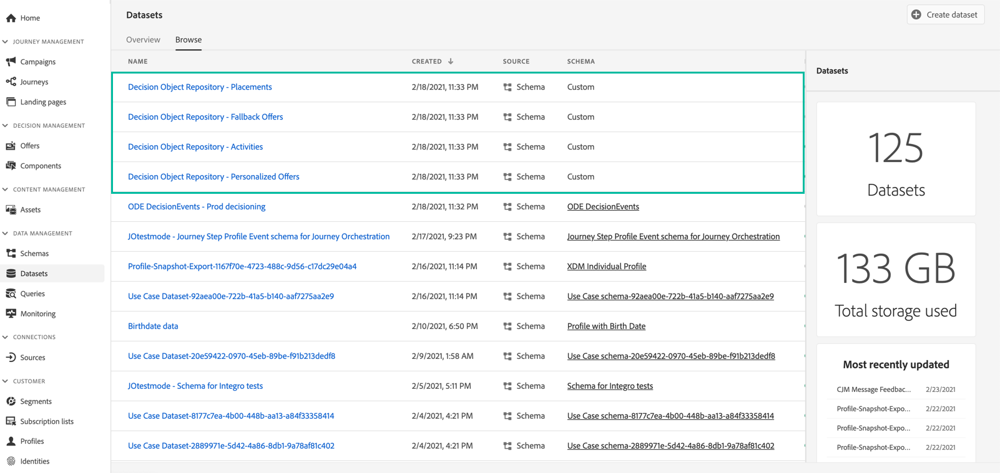

# Acessar o catálogo de ofertas exportado {#access-exported-catalog}

O catálogo de ofertas exportado está acessível no Adobe Experience Platform **[!UICONTROL Datasets]** menu. Um conjunto de dados é criado para cada objeto da Biblioteca de ofertas.

Clique em um conjunto de dados para acessar seus detalhes.

O **[!UICONTROL Preview dataset]** permite exibir o lote bem-sucedido mais recente no conjunto de dados. O painel esquerdo fornece informações sobre os tipos de dados que foram exportados.

Para obter mais informações sobre como navegar e usar conjuntos de dados, consulte [esta página](../../start/get-started-datasets.md).
