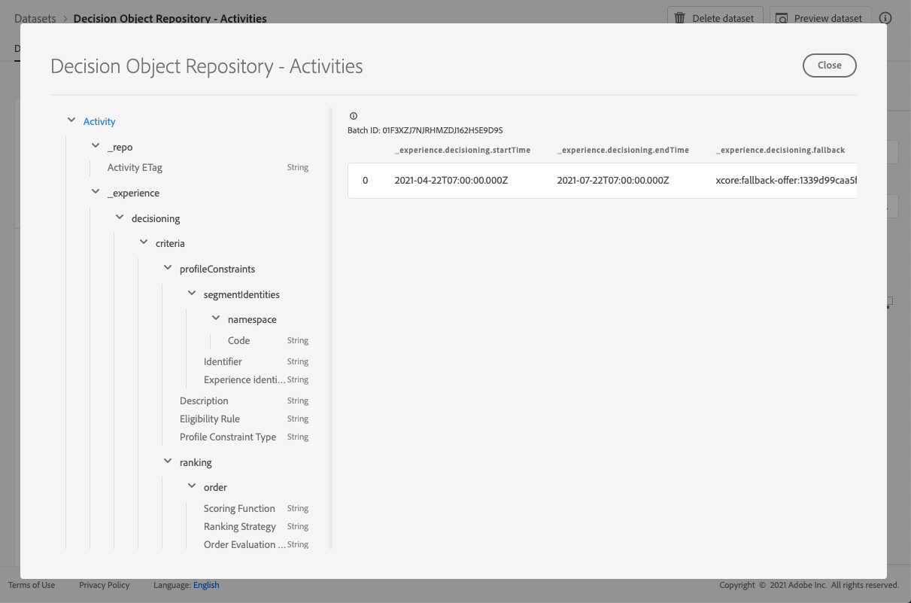

# Conjunto de dados de decisões {#decisions-dataset}

Cada vez que uma oferta é modificada, o conjunto de dados gerado automaticamente para decisões (anteriormente conhecido como atividades) é atualizado.

O lote bem-sucedido mais recente no conjunto de dados é exibido à direita. A exibição hierárquica do esquema do conjunto de dados é exibida no painel esquerdo.

>[!NOTE]
>
>Saiba como acessar os conjuntos de dados exportados para cada objeto da Biblioteca de ofertas em [esta seção](../export-catalog/access-dataset.md).

Esta é a lista de todos os campos que podem ser usados no **[!UICONTROL Decision Object Repository - Decisions]** conjunto de dados (anteriormente conhecido como Repositório de objetos de decisão - Atividades).

<!--A decision (formerly known as offer decision) is used to control the decisioning process. It specifies the filter applied to the total inventory to narrow down offers by topic/category, the placement to narrow down the inventory to those offers that technically fit into the reserved space for the offer and specifies a fallback option should the combined constraints disqualify all available personalization offers.-->

## Identificador

**Campo:** _id
**Título:** Identificador
**Descrição:** Um identificador exclusivo para o registro.
**Tipo:** sequência de caracteres

## _experiência

**Campo:** _experiência
**Tipo:** objeto

### _experience > decisão

**Campo:** decisão
**Tipo:** objeto

#### _experience > decisioning > critérios

**Campo:** critérios
**Título:** Critérios
**Descrição:** Define um conjunto de critérios de decisão, onde cada um contém um conjunto de restrições.
**Tipo:** array

**_experience > decisioning > critérios > descrição**

**Campo:** descrição
**Título:** Descrição
**Descrição:** Descrição do critério. É utilizado para transmitir intenções legíveis ao ser humano sobre a forma como este critério foi construído e como está a afetar a decisão.
**Tipo:** sequência de caracteres

**_experience > decisioning > critérios > optionSelection**

**Campo:** optionSelection
**Título:** Seleção de opção
**Descrição:** A seleção de opção define a validade/aplicabilidade das opções neste contexto.
**Tipo:** objeto

* **Descrição**

   **Campo:** descrição
   **Título:** Descrição
   **Descrição:** Descrição da seleção da opção. Ele é usado para transmitir intenções legíveis humanas sobre como ou por que essa seleção de opção foi construída e/ou qual opção corresponderá.
   **Tipo:** sequência de caracteres

* **Filtro de opções**

   **Campo:** filter
   **Título:** Filtro de opções
   **Descrição:** A referência a um filtro baseado em tag que corresponde às opções de um inventário usando suas tags anexadas. O valor é o URI (@id) da regra de decisão referenciada. Consulte esquema https://ns.adobe.com/experience/decisioning/filter.
   **Tipo:** sequência de caracteres

* **Tipo de restrição do perfil**

   **Campo:** optionSelectionType
   **Título:** Tipo de restrição do perfil
   **Descrição:** Determina se alguma restrição está definida no momento e como as restrições são expressas. Pode ser por meio de uma consulta de filtro ou por meio de uma ou mais associações de segmento.
   **Tipo:** sequência de caracteres
   **Valores possíveis:** &quot;none&quot; (padrão), &quot;directList&quot;, &quot;filter&quot;

* **Lista de opções**

   **Campo:** opções
   **Título:** Lista de opções
   **Descrição:** Uma lista que especifica diretamente as opções sem avaliar uma consulta de filtro. É possível especificar uma lista de opções ou uma regra de filtro de opções.
   **Tipo:** array

   <!--Missing title under Option List? Desc = An identifier of an decision option entity. The value value refers to an `@id` property of a decision option. Type: string-->

**_experience > decisioning > critérios > disposições**

**Campo:** disposições
**Título:** Restrições de disposição
**Descrição:** A restrição de posicionamento declara que esse critério só é aplicável para as disposições listadas. Somente quando o posicionamento direcionado estiver na variável `xdm:placements` lista é a seleção de opção considerada. Caso contrário, todos os critérios de decisão serão ignorados. Quando a lista &quot;xdm:disposições&quot; é omitida ou está vazia, o critério é considerado para qualquer disposição direcionada. As disposições listadas aqui impõem critérios implícitos para a seleção da opção. Uma opção a ser considerada deve ter uma representação para a disposição direcionada.
**Tipo:** array

* **Identificador de disposição**

   **Título:** Identificador de disposição
   **Descrição:** Uma referência a uma entidade de disposição. O valor é o URI (@id) da disposição referenciada. Consulte esquema https://ns.adobe.com/experience/decisioning/placement.
   **Tipo:** sequência de caracteres

**_experience > decisioning > critérios > profileConstraints**

**Campo:** profileConstraints
**Título:** Restrição de perfil
**Descrição:** A restrição de perfil decide se uma seleção de opção está qualificada para essa identidade de perfil no momento, neste contexto. Se a restrição de perfil não precisar considerar valores de cada opção, ou seja, se for invariável das opções da seleção de opção, a restrição de perfil que resulta em &quot;falso&quot; cancelará toda a seleção de opção. Por outro lado, uma regra de restrição de perfil que utiliza uma opção como parâmetro é avaliada para cada opção de qualificação da seleção de opção.
**Tipo:** objeto

* **_experience > decisioning > critérios > profileConstraints > Descrição**

   **Campo:** descrição
   **Título:** Descrição
   **Descrição:** Descrição de restrição de perfil. É usado para transmitir intenções legíveis humanas sobre como ou por que essa restrição de perfil foi construída e/ou qual opção será incluída ou excluída por ela.
   **Tipo:** sequência de caracteres

* **_experience > decisioning > critérios > profileConstraints > Regra de elegibilidade**

   **Campo:** ibilityRule
   **Título:** Regra de elegibilidade
   **Descrição:** Uma referência a uma regra de decisão que avalia como true ou false para um determinado perfil e/ou outros objetos XDM contextuais específicos. A regra é usada para decidir se a opção se qualifica para um determinado perfil. O valor é o URI (@id) da regra de decisão referenciada. Consulte esquema https://ns.adobe.com/experience/decisioning/rule.
   **Tipo:** sequência de caracteres

* **_experience > decisioning > critérios > profileConstraints > Tipo de restrição de perfil**

   **Campo:** profileConstraintType
   **Título:** Tipo de restrição do perfil
   **Descrição:** Determina se alguma restrição está definida no momento e como as restrições são expressas. Pode ser por meio de uma regra ou por meio de uma ou mais associações de segmento.
   **Tipo:** sequência de caracteres
   **Valores possíveis:**
   * &quot;none&quot; (padrão)
   * &quot;eligentRule&quot;: &quot;A restrição de perfil é expressa como uma única regra que deve ser avaliada como true antes que a ação restrita seja permitida.&quot;
   * &quot;anySegments&quot;: &quot;A restrição de perfil é expressa como um ou mais segmentos e o perfil deve ser um membro de pelo menos um deles antes que a ação restrita seja permitida.&quot;
   * &quot;allSegments&quot;: &quot;A restrição de perfil é expressa como um ou mais segmentos e o perfil deve ser um membro de todos eles antes que a ação restrita seja permitida.&quot;
   * &quot;rules&quot;: &quot;A restrição de perfil é expressa como um número de regras diferentes, por exemplo, qualificação, aplicabilidade, adequação, que devem ser avaliadas como true antes que a ação restrita seja permitida.&quot;

* **_experience > decisioning > critérios > profileConstraints > segmentIdentities**

   **Campo:** segmentIdentities
   **Título:** Identificadores de segmento
   **Descrição:** Identificadores dos segmentos.
   **Tipo:** array

   * **Identificador**

      **Campo:** _id
      **Título:** Identificador
      **Descrição:** Identidade do segmento no namespace relacionado.
      **Tipo:** sequência de caracteres

   * **namespace**

      **Campo:** namespace
      **Título:** Namespace
      **Descrição:** O namespace associado à variável `xid` atributo.
      **Tipo:** objeto
      **Obrigatório:** &quot;code&quot;

      * **Código**

         **Campo:** código
         **Título:** Código
         **Descrição:** O código é um identificador legível para o namespace e pode ser usado para solicitar a id de namespace técnico, que é usada para o processamento de gráficos de identidade.
         **Tipo:** sequência de caracteres
   * **Identificador da experiência**

      **Campo:** xid
      **Título:** Identificador da experiência
      **Descrição:** Quando presente, esse valor representa um identificador de namespace cruzado que é exclusivo em todos os identificadores de escopo de namespace em todos os namespaces.
      **Tipo:** sequência de caracteres

**_experience > decisão > critérios > classificação**

**Campo:** classificação
**Título:** Detalhes da classificação
**Descrição:** Classificação (prioridade). Define como o \&quot;melhor opção\&quot; é determinado no contexto do critério de decisão. Entre todas as opções selecionadas que atendem às restrições de perfil, a classificação decidirá as opções principais (ou N principais) a serem propostas.
**Tipo:** objeto

* **_experience > decisão > critérios > classificação > ordem**

   **Campo:** pedido
   **Título:** Avaliação de pedidos
   **Descrição:** Avaliação de uma ordem relativa de uma ou mais opções de decisão. Opções com valores ordinais mais altos são selecionadas em qualquer opção com valores ordinais mais baixos. Os valores determinados por este método podem ser ordenados, mas as distâncias entre eles não podem ser medidas, nem os montantes nem os produtos podem ser calculados. A mediana e o modo são as únicas medidas de tendência central que podem ser usadas para dados ordinais.
   **Tipo:** objeto

   * **Função de pontuação**

      **Campo:** função
      **Título:** Função de pontuação
      **Descrição:** Uma referência a uma função que calcula uma pontuação numérica para essa opção de decisão. As opções de decisão serão ordenadas (classificadas) de acordo com essa pontuação. O valor dessa propriedade é o URI (@id) da função a ser chamada com a opção on de cada vez. Consulte esquema https://ns.adobe.com/experience/decisioning/function.
      **Tipo:** sequência de caracteres

   * **Tipo de Avaliação de Pedido**

      **Campo:** orderEvaluationType
      **Título:** Tipo de Avaliação de Pedido
      **Descrição:** Especifica qual mecanismo de avaliação de ordem é usado, prioridade estática das opções de decisão, uma função de pontuação que calcula um valor numérico para cada opção ou uma estratégia de classificação que recebe uma lista para solicitá-la.
      **Tipo:** sequência de caracteres
      **Valores possíveis:** &quot;static&quot;, &quot;scoringFunction&quot;, &quot;rankingStrategy&quot;

   * **Estratégia de classificação**

      **Campo:** rankingStrategy
      **Título:** Estratégia de classificação
      **Descrição:** Uma referência a uma estratégia que classifica uma lista de opções de decisão. As opções de decisão serão retornadas em uma lista ordenada. O valor dessa propriedade é o URI (@id) da função a ser chamada com a opção on de cada vez. Consulte esquema https://ns.adobe.com/experience/decisioning/rankingStrategy.
      **Tipo:** sequência de caracteres

* **_experience > decisioning > critérios > classificação > Prioridade**

   **Campo:** priority
   **Título:** Prioridade
   **Descrição:** A prioridade de uma única opção de decisão em relação a todas as outras opções. As opções para as quais nenhuma função de pedido é fornecida são priorizadas usando essa propriedade. As opções com valores de prioridade mais alta são selecionadas antes de qualquer opção de prioridade mais baixa. Se duas ou mais opções qualificadas compartilharem o valor de prioridade mais alto, uma é escolhida aleatoriamente e usada para a proposta de decisão.
   **Tipo:** integer
   **Valor mínimo:** 0
   **Valor padrão:** 0

#### _experience > decisioning > Data e hora de término da atividade

**Campo:** endTime
**Título:** Data e hora de término da atividade
**Descrição:** Data e hora de término da decisão (anteriormente conhecida como atividade). A propriedade tem a semântica da propriedade &#39;endTime&#39; de schema.org definida em http://schema.org/Action.
**Tipo:** sequência de caracteres

#### _experience > decisioning > Opção de fallback

**Campo:** fallback
**Título:** Opção de fallback
**Descrição:** A referência a uma opção de fallback que é usada ao tomar decisões no contexto desta decisão não qualifica nenhuma das opções regulares (isso normalmente acontece quando as restrições rígidas são aplicadas). O valor é o URI (@id) da opção de fallback referenciada.
**Tipo:** sequência de caracteres

#### _experience > decisioning > Nome da atividade

**Campo:** name
**Título:** Nome da atividade
**Descrição:** Nome da decisão (anteriormente conhecido como atividade) que é exibido em várias interfaces do usuário.
**Tipo:** sequência de caracteres

#### _experience > decisioning > Data e hora de início da atividade

**Campo:** startTime
**Título:** Data e hora de início da atividade
**Descrição:** Data e hora de início e término da decisão (anteriormente conhecida como atividade). A propriedade tem a semântica da propriedade &#39;startTime&#39; de schema.org definida em http://schema.org/Action.
**Tipo:** sequência de caracteres

## _repo

**Campo:** _repo
**Tipo:** objeto

### _repo > ETag da atividade

**Campo:** tag
**Título:** ETag da atividade
**Descrição:** A revisão de que o objeto da decisão (anteriormente conhecido como atividade) estava no momento em que o instantâneo foi tirado.
**Tipo:** sequência de caracteres
