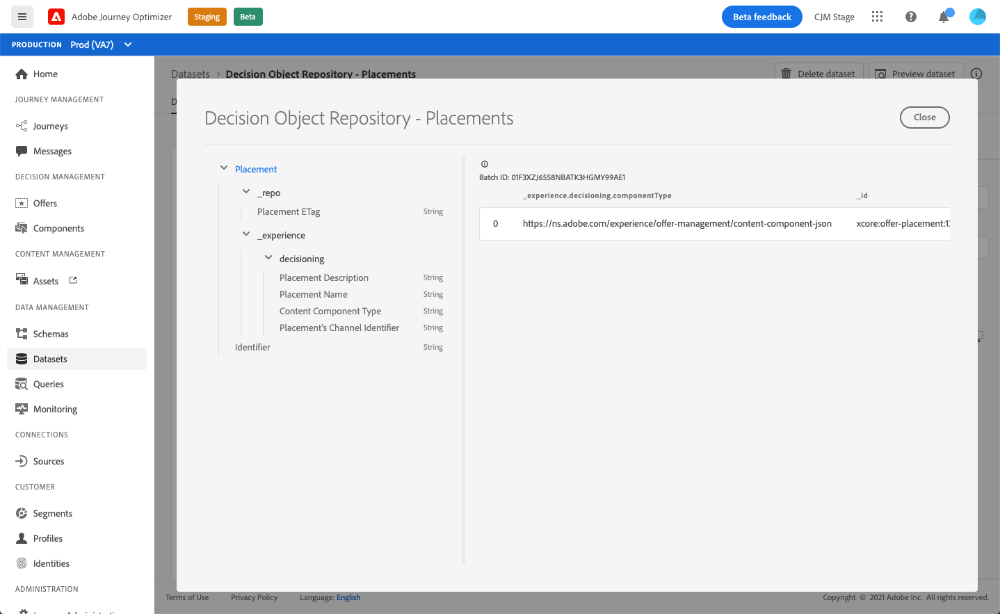

# Conjunto de dados de inserções {#placements-dataset}

>[!TIP]
>
>O serviço de Decisão, o novo recurso de tomada de decisão do [!DNL Adobe Journey Optimizer], agora está disponível por meio da experiência baseada em código e dos canais de email. [Saiba mais](../../experience-decisioning/gs-experience-decisioning.md)

Cada vez que uma oferta é modificada, o conjunto de dados gerado automaticamente para inserções é atualizado.

O lote bem-sucedido mais recente no conjunto de dados é exibido à direita. A visualização hierárquica do esquema do conjunto de dados é exibida no painel esquerdo.

>[!NOTE]
>
>Saiba como acessar os conjuntos de dados exportados para cada objeto da Biblioteca de ofertas em [esta seção](../export-catalog/access-dataset.md).

Esta é a lista de todos os campos que podem ser usados no conjunto de dados **[!UICONTROL Repositório de Objetos de Decisão - Disposições]**.

<!--A placement describes a location or place in a personalized message. It is used to set technical constraints for content that the personalization decision supplies. The placement also represents a request to produce certain types of metrics when an experience event is produced where this placement is involved. For instance, the placement facilitates a personalized clickable image inside an email shown to an end-user. The placement may for instance request from the assembled experience that the click on its image gets reported in an experience event with a metric https://ns.adobe.com/xdm/data/metrics/web/linkclicks and a reference to this placement.-->

+++ Identificador

**Campo:** _id
**Título:** Identificador
**Descrição:** Um identificador exclusivo para o registro.
**Tipo:** cadeia de caracteres

+++

+++ _experience

**Campo:** _experiência
**Tipo:** objeto

+++

+++ _experience > decisioning

**Campo:** decisão
**Tipo:** objeto

+++

+++ _experience > decisão > Identificador de canal do Placement

**Campo:** channelID
**Título:** Identificador de Canal do Posicionamento
**Descrição:** O canal no qual a apresentação foi feita. O valor é um URI de canal válido. Consulte https://ns.adobe.com/xdm/channels/channel.
**Tipo:** cadeia de caracteres

+++

+++ _experience > decisão > Tipo de componente de Conteúdo

**Campo:** componentType
**Título:** Tipo de Componente de Conteúdo
**Descrição:** Um conjunto enumerado de URIs em que cada valor mapeia para um tipo fornecido ao componente de conteúdo. Alguns consumidores das representações de conteúdo esperam que o valor @type seja uma referência ao schema que descreve propriedades adicionais do componente de conteúdo.
**Tipo:** cadeia de caracteres

+++

+++ _experience > decisão > contentTypes

**Campo:** contentTypes
**Tipo:** matriz

+++

+++_experience > decisão > contentTypes > Tipo de mídia MIME

**Título:** Tipo de Mídia MIME
**Descrição:** Uma restrição para o tipo de mídia dos componentes esperada nesse posicionamento. Pode haver mais de um tipo de mídia possível para um componente, como formatos de imagem diferentes.
**Tipo:** cadeia de caracteres

+++

+++ _experience > decisioning > Placement Description

**Campo:** descrição
**Título:** Descrição do posicionamento
**Descrição:** Ele é usado para transmitir intenções legíveis sobre como o conteúdo dinâmico é usado na entrega de mensagens geral. Que um determinado espaço é um \&quot;Banner\&quot; em uma página da Web geralmente é transmitido por meio da descrição e não por um método formal.
**Tipo:** cadeia de caracteres

+++

+++ _experience > decisão > Nome do posicionamento

**Campo:** nome
**Título:** Nome do Posicionamento
**Descrição:** Um nome atribuído ao posicionamento para fazer referência a ele em interações humanas.
**Tipo:** cadeia de caracteres

+++

+++ _repo

**Campo:** _repo
**Tipo:** objeto

+++

+++ _repo > ETag Placement

**Campo:** etag
**Título:** ETag de posicionamento
**Descrição:** A revisão na qual o objeto de opção de decisão estava quando o instantâneo foi tirado.
**Tipo:** cadeia de caracteres

+++
