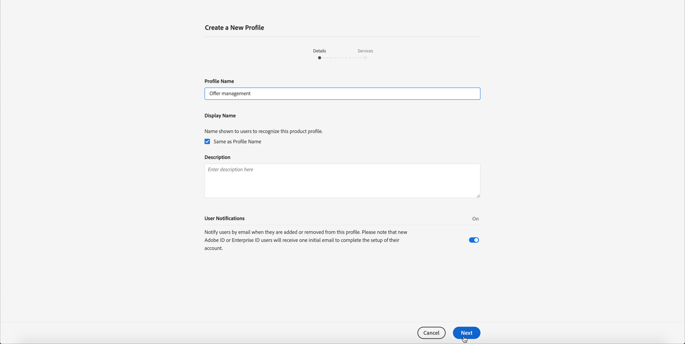
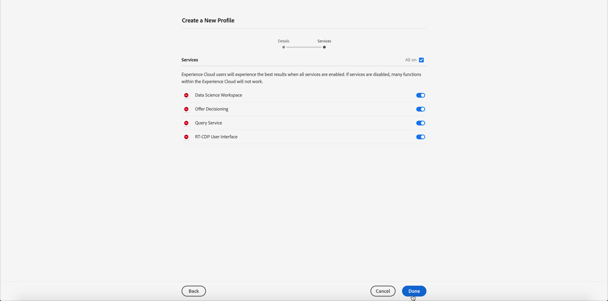

# Conceder acesso ao gerenciamento de decisões {#granting-acess-to-decision-management}

As permissões para acessar e usar os recursos do offer decisioning são gerenciadas usando o [Adobe Admin Console](https://helpx.adobe.com/br/enterprise/managing/user-guide.html){target=&quot;_blank&quot;}.

Para conceder acesso à funcionalidade de Gerenciamento de decisões, é necessário criar um **[!UICONTROL Product profile]** e atribuir as permissões correspondentes aos usuários. Saiba mais sobre como gerenciar [!DNL Journey Optimizer] usuários e permissões em [esta seção](../../administration/permissions.md).

As permissões específicas do Gerenciamento de decisões são listadas [nesta seção](../../administration/high-low-permissions.md#manage-decisioning).

<!--If you are a [!DNL Journey Optimizer] user leveraging the **Decision Management** functionality, you need to have the [Decision management permissions](../../administration/high-low-permissions.md#decisions-permissions) enabled to acces all related capabilities. Learn more on managing [!DNL Journey Optimizer] users and permissions in [this section](../../administration/permissions.md).

If you are an [Adobe Experience Platform](https://experienceleague.adobe.com/docs/experience-platform/landing/home.html){target="_blank"} user leveraging the **Offer Decisioning** application service, follow the steps [below](#granting-acess-to-offer-decisioning) to grant access to [!DNL Offer Decisioning].

Grant access to Offer Decisioning

The steps below only apply to **Experience Platform users** leveraging the [!DNL Offer Decisioning] service.-->

1. Abra o [Admin Console](https://helpx.adobe.com/enterprise/managing/user-guide.html) e selecione **[!UICONTROL Adobe Experience Platform]**.

   <!---->

1. Os perfis de produto do serviço são exibidos. Para criar um novo perfil de produto, clique no botão **[!UICONTROL New Profile]**.

   

   >[!NOTE]
   >
   >Você pode ter quantos perfis de produto desejar, correspondendo às várias funções que deseja configurar para sua organização.

1. Especifique o nome e a descrição do perfil de produto e clique em **[!UICONTROL Next]**.

   

   <!--To access the product profile’s permissions, select the **[!UICONTROL Permissions]** line.-->

1. Selecione os serviços a serem habilitados para o perfil do produto. Por padrão, todos os serviços são selecionados, o que é recomendável para garantir que todas as funcionalidades do Experience Platform estejam disponíveis.

   

1. Na seção **[!UICONTROL Decision Management]**, clique no botão **+** para atribuir permissões ao perfil do produto e, em seguida, clique em **[!UICONTROL Save]**.

   

   As permissões disponíveis são:

   **[!UICONTROL Manage Decisioning Activities]**

   * Ler, escrever, excluir ofertas
   * Ler, gravar e excluir decisões (anteriormente conhecidas como atividades de oferta)
   * Ler, gravar, excluir disposições

   **[!UICONTROL Execute Decisioning Activities]**:

   * Ler ofertas
   * Ler decisões
   * Ler disposições

   **[!UICONTROL Manage Decisioning Options]**:

   * Ler, escrever, excluir ofertas
   * Ler decisões
   * Ler, gravar, excluir disposições

1. Um resumo das permissões do perfil do produto é exibido. Agora é possível atribuir usuários ao perfil do produto para que eles acessem essas permissões.

   

>[!NOTE]
>
>Para obter mais detalhes sobre como gerenciar permissões de usuários, consulte a [documentação do Admin Console](https://helpx.adobe.com/enterprise/managing/user-guide.html){target=&quot;_blank&quot;}.

