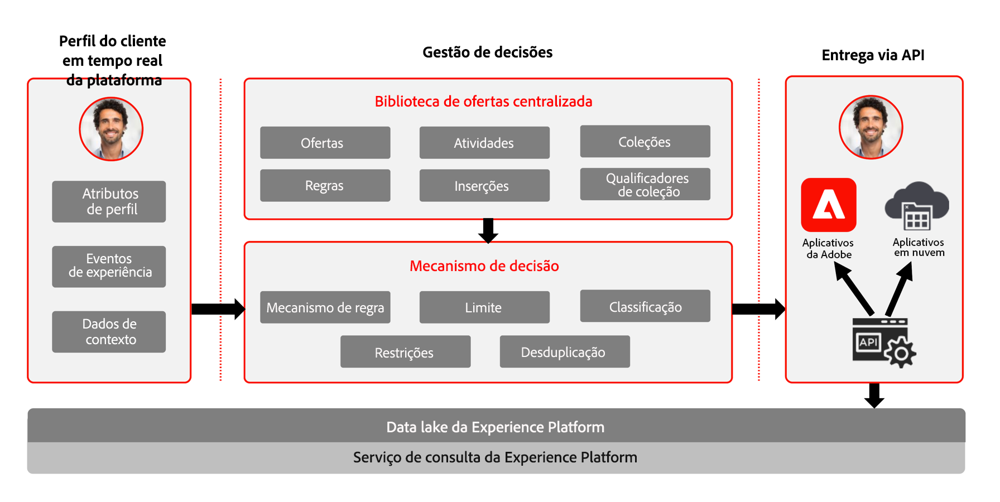
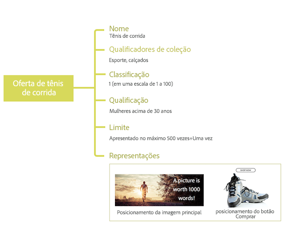

# Sobre o Gerenciamento de decisão {#about-decision-management}

Use o [!DNL Journey Optimizer] para fornecer a melhor oferta e experiência aos seus clientes em todos os pontos de contato na hora certa. Depois de projetado, direcione os públicos com ofertas personalizadas.

>[!NOTE]
>
>Se você for um usuário da [Adobe Experience Platform](https://experienceleague.adobe.com/docs/experience-platform/landing/home.html?lang=pt-BR){target=&quot;_blank&quot;} aproveitando o serviço de aplicativos **Offer Decisioning**, todos os recursos de Gestão de decisões descritos nesta seção também se aplicam a você.

A capacidade de gerenciamento de decisão consiste em dois componentes principais:

* A **Biblioteca de ofertas centralizada**, que é a interface na qual você cria e gerencia os diferentes elementos que compõem suas ofertas e define suas regras e restrições.
* O **mecanismo do Offer Decision**, que aproveita os dados da Adobe Experience Platform e perfis de clientes em tempo real, junto com a biblioteca de ofertas, para selecionar o momento, os clientes e os canais certos aos quais as ofertas serão entregues.

Os benefícios incluem:

* Melhor desempenho da campanha fornecendo ofertas personalizadas em vários canais,
* Workflows aprimorados: em vez de criar vários deliveries ou campanhas, as equipes de marketing podem aprimorar os workflows criando um único delivery e variar as ofertas em diferentes partes do modelo,
* Controle a quantidade de vezes que uma oferta é exibida em campanhas e clientes.

➡️ [Assista a estes tutoriais em vídeo](#tutorial-videos) para saber mais sobre a Gestão de decisões.

## Sobre ofertas e decisões {#about-offers-and-decisions}

Uma **Oferta** é composta de conteúdo, regras de elegibilidade e restrições que definem as condições em que é apresentada aos clientes.

Ela é criada usando a **Biblioteca de ofertas**, que fornece um catálogo de ofertas central, em que você pode associar regras e restrições de elegibilidade a vários conteúdos para criar e publicar ofertas (consulte [Interface de usuário da Biblioteca de ofertas](../get-started/user-interface.md)).

Depois que a Biblioteca de ofertas foi enriquecida com ofertas, você pode integrar suas ofertas em **decisões** (antes conhecidas como &quot;atividades de oferta&quot;).

As decisões são containers para suas ofertas que aproveitarão o Mecanismo do Offer Decisioning para escolher a melhor oferta a ser entregue, dependendo do target da entrega.

## Casos de uso comuns {#common-use-cases}

Os recursos e a integração do Gerenciamento de decisão com a Adobe Experience Platform permitem reunir vários casos de uso para ajudar você a aumentar o envolvimento e a conversão dos clientes.

* Exiba em seu site as ofertas da página inicial que corresponderão ao ponto de interesse do cliente visitante, com base nos dados da Adobe Experience Platform.

   

* Se os clientes se aproximarem de uma de suas lojas, envie a eles notificações por push lembrando as ofertas disponíveis de acordo com seus atributos (nível de fidelidade, sexo, compras anteriores...).

   

* O Gerenciamento de decisão também ajuda você a aprimorar a experiência dos clientes ao entrar em contato com a equipe de suporte. As APIS do Gerenciamento de decisão permitem exibir no portal de agentes da central de atendimento informações sobre as melhores ofertas resgatadas do cliente e as próximas melhores ofertas.

   

## Conceder acesso à Gestão de decisões {#granting-acess-to-decision-management}

As permissões para acessar e usar os recursos do Offer Decisioning são gerenciadas usando o [Adobe Admin Console](https://helpx.adobe.com/br/enterprise/managing/user-guide.html){target=&quot;_blank&quot;}.

Para conceder acesso à funcionalidade Gestão de decisões, é necessário criar um **[!UICONTROL Product profile]** e atribuir as permissões correspondentes aos usuários. Saiba mais sobre como gerenciar usuários e permissões do [!DNL Journey Optimizer] [nesta seção](../../administration/permissions.md).

As permissões específicas de Gestão de decisões estão listadas [nesta seção](../../administration/high-low-permissions.md#decisions-permissions).

## Glossário {#glossary}

Você pode encontrar abaixo a lista dos principais conceitos com os quais trabalhará ao usar o Gerenciamento de decisões.

* **Limite** ou **Limite de frequência**: o limite é usado como uma restrição para definir quantas vezes uma oferta é apresentada. Há dois tipos de limites, quantas vezes uma oferta pode ser proposta através do público-alvo combinado, também conhecido como &quot;Limites totais&quot;, e quantas vezes uma oferta pode ser proposta ao mesmo usuário final, também conhecido como &quot;Limite de perfil&quot;.

* **Coleções**: coleções são subconjuntos de ofertas com base em condições predefinidas por um profissional de marketing, como a categoria da oferta.

* **Decisão**: uma decisão contém a lógica que informa a seleção de uma oferta.

* **Regra de decisão**: as regras de decisão são restrições adicionadas a uma oferta personalizada e aplicadas a um perfil para determinar a elegibilidade.

* **Oferta elegível**: uma oferta elegível atende às restrições definidas upstream que podem ser oferecidas de forma consistente a um perfil.

* **Gerenciamento de decisão**: permite criar e fornecer experiências de oferta personalizada de usuários finais em canais e aplicativos usando lógica de negócios e regras de decisão.

* **Ofertas substitutas**: uma oferta substituta é a oferta padrão exibida quando um usuário final não está qualificado para nenhuma oferta personalizada na coleção.

* **Oferta**: uma oferta é uma mensagem de marketing que pode ter regras associadas que especificam quem está qualificado para ver a oferta.

* **Biblioteca de ofertas**: a biblioteca de ofertas é uma biblioteca central usada para gerenciar ofertas personalizadas e substitutas, regras de decisão e decisões.

* **Ofertas personalizadas**: uma oferta personalizada é uma mensagem de marketing personalizável baseada em regras de elegibilidade e restrições.

* **Posicionamentos**: um posicionamento é o local e/ou contexto em que uma oferta é exibida para um usuário final.

* **Prioridade**: a prioridade é usada para classificar ofertas que atendem a todas as restrições, como elegibilidade, calendário e limite.

* **Representações**: uma representação é a informação usada por um canal, como localização ou idioma para exibir uma oferta.

## Tutoriais em vídeo {#tutorial-videos}

>[!NOTE]
>
>Esses vídeos se aplicam ao serviço de aplicativos Offer Decisioning criado na Adobe Experience Platform e não são específicos do [!DNL Adobe Journey Optimizer]. No entanto, eles oferecem orientação genérica para usar a Gestão de decisões no contexto do [!DNL Journey Optimizer].

### O que é o Gerenciamento de decisão? {#what-is-offer-decisioning}

O vídeo abaixo fornece uma introdução aos principais recursos, arquitetura e casos de uso do Gerenciamento de decisão:

>[!VIDEO](https://video.tv.adobe.com/v/326961?quality=12&learn=on)

### Definir e gerenciar ofertas {#use-offer-decisioning}

O vídeo abaixo mostra como usar o Gerenciamento de decisão para definir e gerenciar suas ofertas e aproveitar os dados do cliente em tempo real.

>[!VIDEO](https://video.tv.adobe.com/v/326841?quality=12&learn=on)
