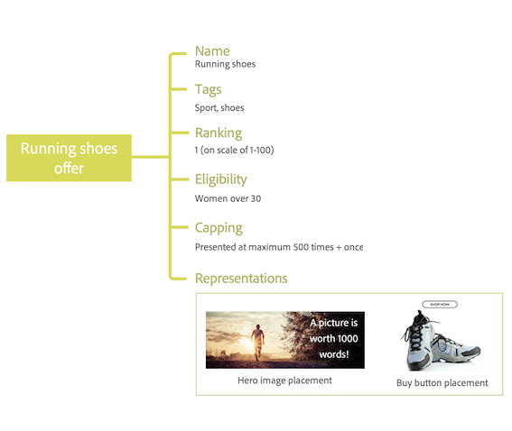

# Sobre o Gerenciamento de decisões {#about-offer-decision}

Use o [!DNL Journey Optimizer] para fornecer a melhor oferta e experiência aos seus clientes em todos os pontos de contato na hora certa. Depois de projetado, direcione seus públicos-alvo com ofertas personalizadas.

A capacidade de gerenciamento de decisões consiste em dois componentes principais:

* A **Biblioteca de ofertas centralizada**, que é a interface onde você cria e gerencia os diferentes elementos que compõem suas ofertas, e define suas regras e restrições.
* O **Offer Decision Engine** que aproveita os dados do Adobe Experience Platform e os perfis do cliente em tempo real, juntamente com a Biblioteca de ofertas, para selecionar o momento certo, os clientes e os canais para os quais as ofertas serão entregues.

Os benefícios incluem:

* Melhor desempenho da campanha fornecendo ofertas personalizadas em vários canais,
* Workflows aprimorados: em vez de criar vários deliveries ou campanhas, as equipes de marketing podem aprimorar os workflows criando um único delivery e variar as ofertas em diferentes partes do modelo,
* Controle a quantidade de vezes que uma oferta é exibida em campanhas e clientes.

 [Assista a estes ](#tutorial-videos) vídeos tutoriais para obter mais informações sobre o Gerenciamento de decisões.

## Sobre ofertas e decisões {#offers-offer-activities}

Uma **Oferta** é composta de conteúdo, regras de elegibilidade e restrições que definem as condições em que é apresentada aos clientes.

Ela é criada usando a **Biblioteca de ofertas**, que fornece um catálogo de ofertas central, em que você pode associar regras e restrições de elegibilidade a vários conteúdos para criar e publicar ofertas (consulte [Interface de usuário da Biblioteca de ofertas](../get-started/user-interface.md)).

Depois que a Biblioteca de ofertas tiver sido enriquecida com ofertas, você poderá integrar suas ofertas em **decisions** (anteriormente conhecido como &quot;atividades de oferta&quot;).

As decisões são contêineres para suas ofertas que aproveitarão o Mecanismo de decisão da oferta para escolher a melhor oferta a ser entregue, dependendo do target do delivery.

## Casos de uso comuns

Os recursos de Gerenciamento de decisões e a integração com o Adobe Experience Platform permitem cobrir vários casos de uso para ajudá-lo a aumentar a participação e a conversão dos clientes.

* Exiba em seu site as ofertas da página inicial que corresponderão ao ponto de interesse do cliente visitante, com base nos dados da Adobe Experience Platform.

   

* Se os clientes se aproximarem de uma de suas lojas, envie a eles notificações por push lembrando as ofertas disponíveis de acordo com seus atributos (nível de fidelidade, sexo, compras anteriores...).

   

* O Gerenciamento de decisões também ajuda você a aprimorar a experiência dos clientes ao entrar em contato com a equipe de suporte. As APIs de gerenciamento de decisão permitem exibir no portal de agentes da central de atendimento informações sobre as melhores ofertas resgatadas e as melhores ofertas do cliente.

   

## Tutoriais em vídeo {#tutorial-videos}

>[!NOTE]
>
>Esses vídeos se aplicam ao serviço de aplicativo do Offer Decisioning criado no Adobe Experience Platform e não são específicos de [!DNL Adobe Journey Optimizer]. No entanto, fornece orientação genérica para usar o Gerenciamento de decisões no contexto de [!DNL Journey Optimizer].

### O que é o Gerenciamento de decisões? {#what-is-offer-decisioning}

O vídeo abaixo apresenta os principais recursos, arquitetura e casos de uso do Gerenciamento de decisão:

>[!VIDEO](https://video.tv.adobe.com/v/326961?quality=12&learn=on)

### Definir e gerenciar ofertas {#use-offer-decisioning}

O vídeo abaixo mostra como usar o Gerenciamento de decisões para definir e gerenciar suas ofertas e aproveitar os dados do cliente em tempo real.

>[!VIDEO](https://video.tv.adobe.com/v/326841?quality=12&learn=on)
